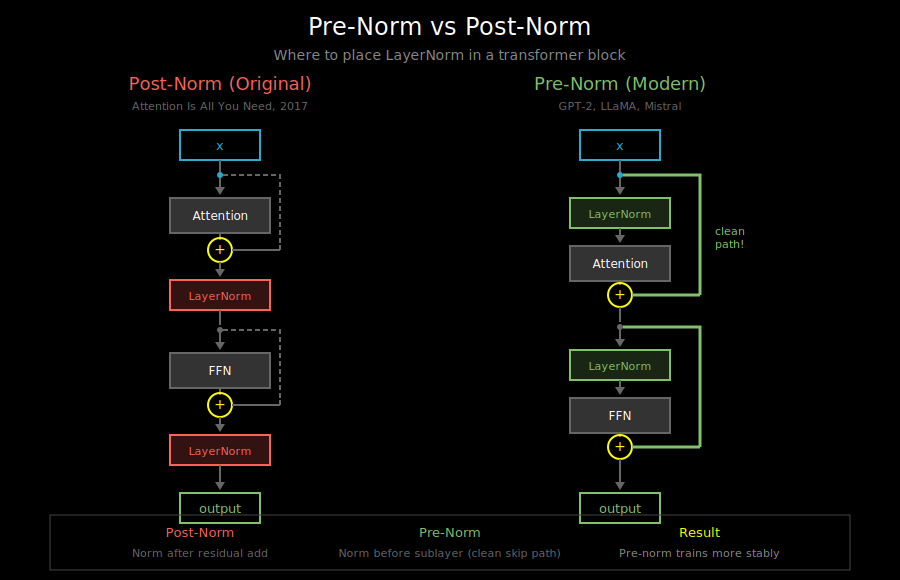
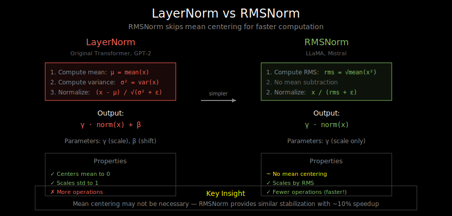

# Residual Connections & Layer Normalization

## Visualizations

This document includes the following diagrams in `vis/`:
- [`residual_connection.svg`](vis/residual_connection.svg) - How residual connections enable gradient flow
- [`pre_norm_vs_post_norm.svg`](vis/pre_norm_vs_post_norm.svg) - Comparing normalization placement strategies
- [`layernorm_vs_rmsnorm.svg`](vis/layernorm_vs_rmsnorm.svg) - LayerNorm vs RMSNorm comparison

## Why Training Deep Networks is Hard

As networks get deeper, two problems emerge:

1. **Vanishing gradients**: Gradients shrink as they backpropagate, making early layers learn slowly
2. **Degradation problem**: Deeper networks can perform *worse* than shallow ones, even on training data

Transformers are deep (12-96+ layers). Without careful architecture choices, they wouldn't train at all.

## Residual Connections: The Skip Highway


Residual connections (ResNets, 2015) add the input directly to the output:

```
output = layer(x) + x
```

Visually:
```
    x ──────────────────────┐
    │                       │
    ↓                       │
  [Layer]                   │ (skip connection)
    │                       │
    ↓                       │
    + ←─────────────────────┘
    │
    ↓
  output
```

### Why Residuals Help

**Gradient flow**: During backpropagation, gradients can flow directly through the skip connection:
```
∂L/∂x = ∂L/∂output × (∂layer(x)/∂x + 1)
                                    ↑
                            Always has this +1
```

Even if `∂layer(x)/∂x` is tiny, the gradient is at least `∂L/∂output × 1`.

**Identity mapping**: A residual layer can learn to be a no-op by setting layer weights to zero:
```
output = 0 + x = x  (identity)
```

This means adding layers can't hurt - worst case, they learn to do nothing.

### Residuals in Transformers

Each transformer sub-layer has a residual connection:

```
# After attention
x = attention(x) + x

# After feed-forward
x = ffn(x) + x
```

A complete transformer block:
```
x → [Norm] → [Attention] → + → [Norm] → [FFN] → + → output
     │                      ↑    │                ↑
     └──────────────────────┘    └────────────────┘
         residual                    residual
```

## Layer Normalization: Stabilizing Activations

### The Problem: Internal Covariate Shift

During training, each layer's inputs change as previous layers update. This makes training unstable and slow.

**Normalization** stabilizes activations by ensuring they have consistent mean and variance:
```
normalized = (x - mean) / std
```

### Batch Norm vs Layer Norm

**Batch Normalization** (common in CNNs):
- Normalize across the batch dimension
- For each feature, compute mean/var over all examples in the batch
- Problem: Doesn't work well for variable-length sequences

**Layer Normalization** (used in transformers):
- Normalize across the feature dimension
- For each example, compute mean/var over all features
- Works independently for each token

```
# Shape: (batch_size, seq_len, d_model)

# Batch norm: normalize over batch for each feature
# (problematic: different sequences have different lengths)

# Layer norm: normalize over features for each position
for b in range(batch_size):
    for s in range(seq_len):
        x[b, s, :] = normalize(x[b, s, :])  # normalize d_model dimension
```

### Layer Norm Formula

```python
def layer_norm(x, gamma, beta, eps=1e-5):
    """
    x: (*, d_model) - last dimension is normalized
    gamma: (d_model,) - learnable scale
    beta: (d_model,) - learnable shift
    """
    mean = x.mean(dim=-1, keepdim=True)
    var = x.var(dim=-1, keepdim=True, unbiased=False)

    # Normalize
    x_norm = (x - mean) / sqrt(var + eps)

    # Scale and shift (learnable)
    return gamma * x_norm + beta
```

**Key points**:
- `eps` prevents division by zero
- `gamma` and `beta` are learnable parameters that allow the network to undo normalization if needed
- Initialized to gamma=1, beta=0 (identity at start)

### Why Learnable Parameters?

Without gamma and beta, layer norm forces all features to have mean=0, var=1. This might be too restrictive.

With learnable parameters:
- If gamma=1, beta=0 → standard normalization
- If gamma=σ, beta=μ → network can restore original statistics
- Network learns the optimal scale/shift for each feature

## Pre-Norm vs Post-Norm



The original transformer used **post-norm** (normalize after):
```
# Post-norm (original paper)
x = x + attention(x)
x = layer_norm(x)
x = x + ffn(x)
x = layer_norm(x)
```

Modern transformers use **pre-norm** (normalize before):
```
# Pre-norm (GPT-2, LLaMA, most modern models)
x = x + attention(layer_norm(x))
x = x + ffn(layer_norm(x))
```

### Why Pre-Norm is Preferred

**Gradient flow**: In pre-norm, the residual path is completely unobstructed:
```
Pre-norm:  x → + → x'
               ↑
           sublayer(norm(x))

Gradient:  ∂L/∂x = ∂L/∂x' × 1 + ...  (direct path)
```

**Training stability**: Pre-norm models are easier to train:
- Can use larger learning rates
- Less sensitive to initialization
- Often don't need learning rate warmup

**Empirical results**: Pre-norm consistently trains more stably, especially for very deep models.

### The Trade-off

Post-norm can achieve slightly better final performance with careful tuning, but pre-norm is more robust. For most purposes, pre-norm is recommended.

## RMSNorm: A Simplified Alternative



RMSNorm (Root Mean Square Normalization) skips the mean centering:

```python
def rms_norm(x, gamma, eps=1e-5):
    """
    x: (*, d_model)
    gamma: (d_model,)
    """
    rms = sqrt(mean(x ** 2) + eps)
    return gamma * (x / rms)
```

**Differences from LayerNorm**:
- No mean subtraction
- No beta parameter (only gamma)
- Slightly faster (fewer operations)

**Used in**: LLaMA, Mistral, and many modern models.

**Why it works**: The mean centering in LayerNorm may not be necessary. RMSNorm provides similar stabilization with less computation.

## Putting It Together

A typical transformer block with pre-norm:

```python
class TransformerBlock:
    def __init__(self, d_model, num_heads, d_ff):
        self.norm1 = LayerNorm(d_model)
        self.attn = MultiHeadAttention(d_model, num_heads)
        self.norm2 = LayerNorm(d_model)
        self.ffn = FeedForward(d_model, d_ff)

    def forward(self, x):
        # Pre-norm attention with residual
        x = x + self.attn(self.norm1(x))

        # Pre-norm FFN with residual
        x = x + self.ffn(self.norm2(x))

        return x
```

## What's Next

You now understand how residuals and normalization stabilize transformer training. Next, we'll look at **positional encodings** - how transformers understand word order without recurrence.

See `02_positional_encoding.md`.
