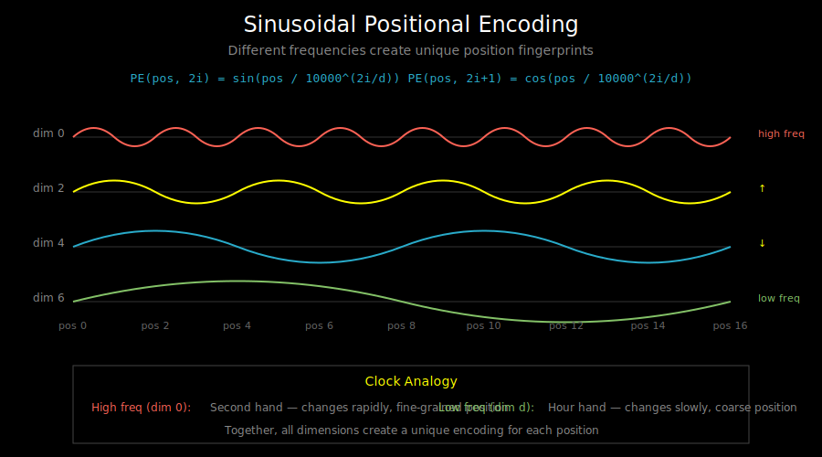
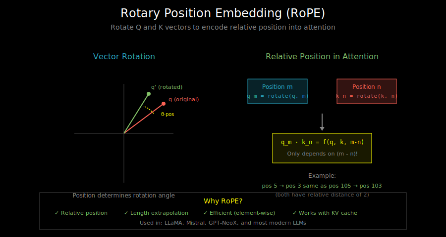

# Positional Encoding: Teaching Transformers About Order

## Visualizations

This document includes the following diagrams in `vis/`:
- [`sinusoidal_encoding.svg`](vis/sinusoidal_encoding.svg) - How different frequencies create unique position fingerprints
- [`rope_rotation.svg`](vis/rope_rotation.svg) - How RoPE encodes relative position through rotation

## The Position Problem

Unlike RNNs, transformers process all tokens in parallel. This is great for speed, but creates a problem: **transformers have no inherent notion of position**.

Consider two sentences:
```
"The cat sat on the mat"
"mat the on sat cat The"
```

Without positional information, a transformer sees these as identical - same tokens, same attention patterns!

For language, order is everything. We need to inject position information somehow.

## The Solution: Add Position to Embeddings

The basic idea: add a position-dependent signal to each token embedding.

```
final_embedding[i] = token_embedding[i] + position_embedding[i]
```

The model learns to use these positional signals to understand order.

## Approach 1: Sinusoidal Positional Encoding



The original transformer (2017) used fixed sinusoidal functions:

```python
def sinusoidal_position_encoding(seq_len, d_model):
    """
    Returns: (seq_len, d_model) position encodings
    """
    position = np.arange(seq_len)[:, np.newaxis]  # (seq_len, 1)
    dim = np.arange(d_model)[np.newaxis, :]       # (1, d_model)

    # Different frequency for each dimension
    freq = 1 / (10000 ** (2 * (dim // 2) / d_model))

    # Alternate sin and cos
    encodings = np.zeros((seq_len, d_model))
    encodings[:, 0::2] = np.sin(position * freq[:, 0::2])  # even dims
    encodings[:, 1::2] = np.cos(position * freq[:, 0::2])  # odd dims

    return encodings
```

### The Formula

For position `pos` and dimension `i`:
```
PE(pos, 2i)   = sin(pos / 10000^(2i/d_model))
PE(pos, 2i+1) = cos(pos / 10000^(2i/d_model))
```

### Why Sinusoids?

1. **Unique encoding**: Each position gets a unique vector
2. **Bounded values**: sin/cos stay in [-1, 1]
3. **Relative position**: PE(pos+k) can be represented as a linear function of PE(pos)
4. **Generalization**: Can extrapolate to longer sequences than seen in training

### The Frequency Intuition

Think of it like a clock with multiple hands:
- Low-frequency dimensions (small i): Slow-moving, capture long-range position
- High-frequency dimensions (large i): Fast-moving, capture fine-grained position

```
Position:     0    1    2    3    4    5    6    7
Dim 0 (fast): 0   0.84 0.91 0.14 -0.76 -0.96 -0.28 0.66
Dim 6 (slow): 0   0.01 0.02 0.03  0.04  0.05  0.06 0.07
```

Together, they create a unique "fingerprint" for each position.

## Approach 2: Learned Positional Embeddings

GPT and BERT use learned position embeddings:

```python
class LearnedPositionalEmbedding(nn.Module):
    def __init__(self, max_seq_len, d_model):
        super().__init__()
        # Learnable embedding table, one vector per position
        self.embedding = nn.Embedding(max_seq_len, d_model)

    def forward(self, seq_len):
        positions = torch.arange(seq_len)
        return self.embedding(positions)  # (seq_len, d_model)
```

**Pros**:
- Model can learn optimal position representations
- Simple implementation

**Cons**:
- Fixed maximum sequence length
- Can't extrapolate to unseen positions
- More parameters

In practice, learned embeddings work about as well as sinusoidal for typical sequence lengths.

## Approach 3: Rotary Position Embedding (RoPE)



RoPE (2021) is the dominant approach in modern LLMs (LLaMA, Mistral, GPT-NeoX).

### The Key Insight

Instead of adding position to embeddings, RoPE **rotates** the query and key vectors based on position. This encodes *relative* position directly into the attention computation.

### How RoPE Works

For a query/key vector, group dimensions into pairs and rotate each pair:

```python
def rotate_half(x):
    """Rotate pairs of dimensions"""
    x1, x2 = x[..., :x.shape[-1]//2], x[..., x.shape[-1]//2:]
    return torch.cat([-x2, x1], dim=-1)

def apply_rope(x, cos, sin):
    """Apply rotary position embedding"""
    return (x * cos) + (rotate_half(x) * sin)
```

For position `m`, rotate the i-th pair by angle `m * θ_i`:
```
θ_i = 10000^(-2i/d)

cos_m = [cos(m*θ_0), cos(m*θ_0), cos(m*θ_1), cos(m*θ_1), ...]
sin_m = [sin(m*θ_0), sin(m*θ_0), sin(m*θ_1), sin(m*θ_1), ...]
```

### Why Rotation?

When computing attention between positions m and n:
```
q_m · k_n = rotate(q, m) · rotate(k, n)
          = f(q, k, m-n)  # Only depends on relative position!
```

The dot product only depends on `m-n`, the relative distance. This means:
- Token at position 5 attending to position 3 computes the same as
- Token at position 105 attending to position 103

### RoPE Advantages

1. **Relative position**: Attention naturally uses relative distances
2. **No length limit**: Can extrapolate to longer sequences
3. **Efficient**: Rotation is cheap (element-wise multiply)
4. **Works with KV cache**: Position can be computed incrementally

### Full RoPE Implementation

```python
class RotaryEmbedding(nn.Module):
    def __init__(self, dim, max_seq_len=2048, base=10000):
        super().__init__()
        # Compute rotation frequencies
        inv_freq = 1.0 / (base ** (torch.arange(0, dim, 2).float() / dim))
        self.register_buffer("inv_freq", inv_freq)

        # Precompute cos/sin for all positions
        t = torch.arange(max_seq_len)
        freqs = torch.outer(t, inv_freq)  # (seq_len, dim/2)
        emb = torch.cat([freqs, freqs], dim=-1)  # (seq_len, dim)

        self.register_buffer("cos_cached", emb.cos())
        self.register_buffer("sin_cached", emb.sin())

    def forward(self, x, seq_len):
        return (
            self.cos_cached[:seq_len],
            self.sin_cached[:seq_len]
        )
```

## Comparison Summary

| Method | Relative Position | Length Extrapolation | Simplicity |
|--------|------------------|---------------------|------------|
| Sinusoidal | Implicit (linear) | Good | Simple |
| Learned | No | No (fixed max) | Simplest |
| RoPE | Yes (built-in) | Good | Moderate |

**Modern recommendation**: Use RoPE for new models. It's the standard for LLaMA, Mistral, and most current architectures.

## Position in Attention: Where It Applies

RoPE is applied to Q and K only, not V:

```python
def attention_with_rope(Q, K, V, rope):
    cos, sin = rope(Q, seq_len)

    # Apply rotation to queries and keys
    Q = apply_rope(Q, cos, sin)
    K = apply_rope(K, cos, sin)

    # Standard attention from here
    scores = Q @ K.transpose(-2, -1) / sqrt(d_k)
    weights = softmax(scores)
    output = weights @ V  # V is NOT rotated

    return output
```

Why not rotate V? The value vectors carry content, not position. We want to retrieve content based on position-aware matching, but the content itself shouldn't be position-modified.

## Extending Context: Position Interpolation

What if you want to use a model on sequences longer than it was trained on?

**Position Interpolation** (2023): Instead of extrapolating positions, interpolate them:
```python
# Original: positions 0, 1, 2, ..., 2048
# Extended to 4096: positions 0, 0.5, 1, 1.5, ..., 2048
scale = original_max_len / new_max_len
positions = positions * scale
```

This works because the model has seen all the rotation angles during training - we're just applying them to more positions.

## What's Next

Now you understand how transformers know about position. Next, we'll look at the **feed-forward network** - the "MLP" part of each transformer block that processes each token independently.

See `03_feed_forward_network.md`.
