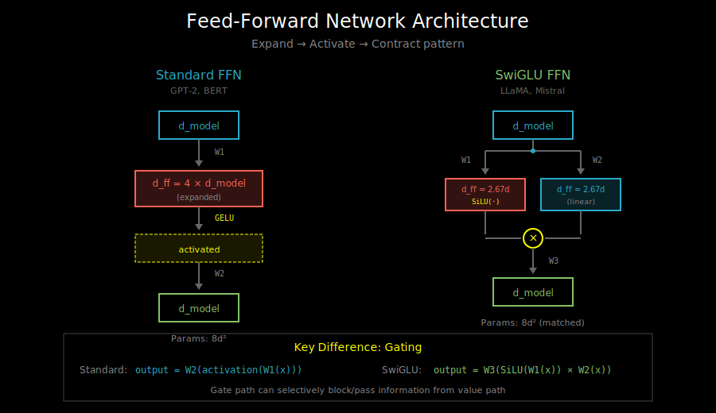
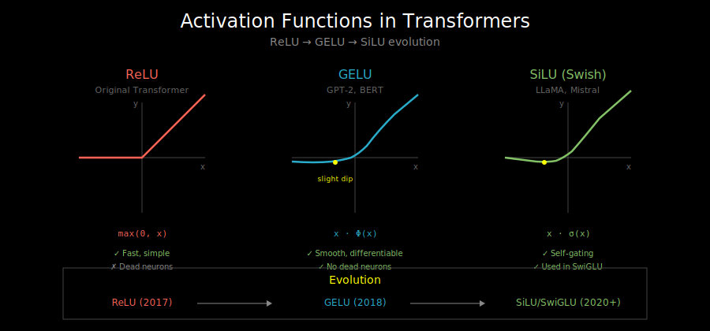

# Feed-Forward Network: The MLP in Transformers

## Visualizations

This document includes the following diagrams in `vis/`:
- [`ffn_architecture.svg`](vis/ffn_architecture.svg) - Standard FFN vs SwiGLU architecture comparison
- [`activation_functions.svg`](vis/activation_functions.svg) - ReLU, GELU, and SiLU activation functions

## What is the Feed-Forward Network?

Each transformer block has two main components:
1. Multi-head attention (information mixing across positions)
2. **Feed-forward network** (processing each position independently)

The FFN is a simple two-layer MLP applied to each token:

```python
def feed_forward(x, W1, b1, W2, b2):
    """
    x: (seq_len, d_model)
    """
    hidden = activation(x @ W1 + b1)  # (seq_len, d_ff)
    output = hidden @ W2 + b2         # (seq_len, d_model)
    return output
```

## The Expand-Contract Pattern



The FFN follows a characteristic shape:
```
d_model → d_ff → d_model
  512   → 2048 →   512   (typical 4x expansion)
```

Visually:
```
Input:   [d_model]
             |
             ↓
         (expand)
             |
Hidden:  [d_ff = 4 × d_model]
             |
         (activate)
             |
         (contract)
             |
Output:  [d_model]
```

### Why Expand Then Contract?

1. **Increased capacity**: The expanded hidden layer can represent more complex functions
2. **Non-linearity**: The activation function adds non-linear transformations
3. **Information bottleneck**: Contracting back forces the network to extract useful features

Think of it as: expand to compute, compress to communicate.

## Position Independence

Unlike attention, the FFN processes each position **independently**:

```python
# Same FFN applied to every position
for pos in range(seq_len):
    output[pos] = ffn(input[pos])

# In practice: batched matrix multiply handles this efficiently
output = ffn(input)  # input: (batch, seq_len, d_model)
```

**Why independence?** The attention layer already handled cross-position information. The FFN's job is to process that information at each position.

## Activation Functions: The Evolution



### ReLU (Original Transformer)

```python
def relu(x):
    return max(0, x)
```

Simple and fast, but "dead neurons" can occur (output stuck at 0).

### GELU (GPT, BERT)

```python
def gelu(x):
    # Gaussian Error Linear Unit
    return x * Phi(x)  # Phi is the Gaussian CDF

# Approximation commonly used:
def gelu_approx(x):
    return 0.5 * x * (1 + tanh(sqrt(2/pi) * (x + 0.044715 * x**3)))
```

GELU is a smooth approximation to ReLU that allows small negative values. It became the default for many language models.

```
ReLU:  ___/
         0

GELU:  __/~ (smooth curve near 0)
```

### SwiGLU (LLaMA, Modern LLMs)

SwiGLU adds a **gating mechanism**:

```python
def swiglu(x, W1, W2, W3):
    """
    x: (seq_len, d_model)
    """
    gate = silu(x @ W1)      # (seq_len, d_ff)
    value = x @ W2           # (seq_len, d_ff)
    hidden = gate * value    # Element-wise gating
    output = hidden @ W3     # (seq_len, d_model)
    return output

def silu(x):  # Also called Swish
    return x * sigmoid(x)
```

**Key differences**:
- Three weight matrices instead of two
- Gating: one path controls how much of the other passes through
- `d_ff` is typically `(2/3) * 4 * d_model` to match parameter count

### Why Gating Works

Gating lets the network learn to selectively activate features:

```
gate:  [0.9, 0.1, 0.8, 0.0]
value: [1.0, 2.0, 0.5, 3.0]
output:[0.9, 0.2, 0.4, 0.0]  ← value[3] is completely blocked
```

The gate can "shut off" dimensions that aren't relevant for a particular input. This provides a form of conditional computation.

## Implementation: Standard FFN

```python
class FeedForward(nn.Module):
    def __init__(self, d_model, d_ff, activation='gelu'):
        super().__init__()
        self.linear1 = nn.Linear(d_model, d_ff)
        self.linear2 = nn.Linear(d_ff, d_model)
        self.activation = nn.GELU() if activation == 'gelu' else nn.ReLU()

    def forward(self, x):
        return self.linear2(self.activation(self.linear1(x)))
```

## Implementation: SwiGLU FFN

```python
class SwiGLUFeedForward(nn.Module):
    def __init__(self, d_model, d_ff=None):
        super().__init__()
        # Default: match parameter count with standard FFN
        if d_ff is None:
            d_ff = int(2 * (4 * d_model) / 3)
            # Round to multiple of 256 for efficiency
            d_ff = 256 * ((d_ff + 255) // 256)

        self.w1 = nn.Linear(d_model, d_ff, bias=False)  # Gate
        self.w2 = nn.Linear(d_model, d_ff, bias=False)  # Value
        self.w3 = nn.Linear(d_ff, d_model, bias=False)  # Output

    def forward(self, x):
        return self.w3(F.silu(self.w1(x)) * self.w2(x))
```

## Parameter Count

For a model with d_model and d_ff = 4 * d_model:

**Standard FFN**:
```
W1: d_model × d_ff = d × 4d = 4d²
W2: d_ff × d_model = 4d × d = 4d²
Total: 8d² parameters (per layer)
```

**SwiGLU FFN** (with d_ff = 2.67d):
```
W1: d × 2.67d = 2.67d²
W2: d × 2.67d = 2.67d²
W3: 2.67d × d = 2.67d²
Total: 8d² parameters (matched)
```

SwiGLU uses three matrices but smaller hidden dimension to match parameter count.

## Bias or No Bias?

Modern models (LLaMA, Mistral) typically use **no bias** in the FFN:

```python
self.linear1 = nn.Linear(d_model, d_ff, bias=False)
```

**Why no bias?**
1. Slightly fewer parameters
2. Layer norm already centers activations
3. Empirically works just as well
4. Saves memory in large models

## The FFN as Memory

An interesting perspective: the FFN can be viewed as **associative memory**.

The first layer creates "keys" and the second layer stores "values":
```
W1^T @ W2 ≈ Σ_i key_i ⊗ value_i
```

When input `x` is similar to `key_i`, the FFN outputs something close to `value_i`.

This is why scaling up FFN dimension often improves factual recall - more "memory slots" for storing knowledge.

## Computational Cost

In each transformer block:
- **Attention**: O(n² × d) for sequence length n
- **FFN**: O(n × d × d_ff) = O(n × d²) with d_ff = 4d

For typical models, FFN accounts for about **2/3 of the FLOPs** per layer!

```
Attention: 2 × n² × d (QK^T and attn @ V)
FFN:       2 × n × d × 4d = 8 × n × d²

For n = 2048, d = 4096:
Attention: ~34B FLOPs
FFN:       ~134B FLOPs
```

This is why optimizing FFN (e.g., with MoE in Chapter 7) matters for efficiency.

## What's Next

You now understand all the components of a transformer block:
- Multi-head attention (Chapter 1)
- Residual connections & normalization (this chapter)
- Positional encodings (this chapter)
- Feed-forward network (this section)

Let's put it all together in `04_transformer_block.md`.
