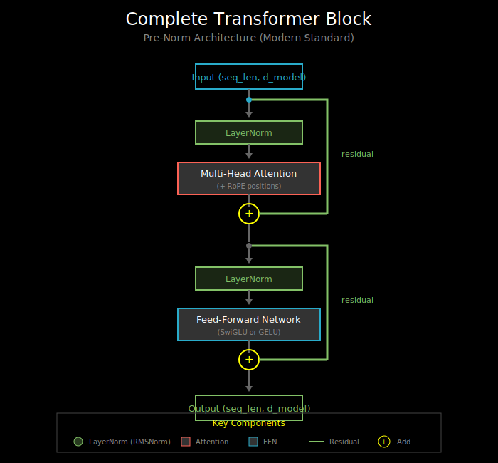

# The Complete Transformer Block

## Visualizations

This document includes the following diagram in `vis/`:
- [`transformer_block.svg`](vis/transformer_block.svg) - Complete pre-norm transformer block architecture

## Putting It All Together

A transformer block combines everything we've learned:
1. Multi-head attention (information mixing)
2. Feed-forward network (position-wise processing)
3. Residual connections (gradient flow)
4. Layer normalization (training stability)

This is the fundamental unit that gets stacked to build transformers.

## The Architecture



### Pre-Norm Transformer Block (Modern Standard)

```
    Input (seq_len, d_model)
        │
        ├──────────────────────────────┐
        ↓                              │
    LayerNorm                          │
        │                              │
        ↓                              │
    Multi-Head Attention               │  Residual
        │                              │
        ↓                              │
        + ←────────────────────────────┘
        │
        ├──────────────────────────────┐
        ↓                              │
    LayerNorm                          │
        │                              │
        ↓                              │
    Feed-Forward Network               │  Residual
        │                              │
        ↓                              │
        + ←────────────────────────────┘
        │
        ↓
    Output (seq_len, d_model)
```

### Post-Norm (Original Transformer)

```
    Input
        │
        ├──────────────────────────────┐
        ↓                              │
    Multi-Head Attention               │
        │                              │
        ↓                              │
        + ←────────────────────────────┘
        │
        ↓
    LayerNorm    ← Norm AFTER residual
        │
        ├──────────────────────────────┐
        ↓                              │
    Feed-Forward Network               │
        │                              │
        ↓                              │
        + ←────────────────────────────┘
        │
        ↓
    LayerNorm    ← Norm AFTER residual
        │
        ↓
    Output
```

## Implementation: Pre-Norm Block

```python
class TransformerBlock(nn.Module):
    def __init__(self, d_model, num_heads, d_ff, dropout=0.1):
        super().__init__()

        # Attention sub-layer
        self.norm1 = nn.LayerNorm(d_model)
        self.attn = MultiHeadAttention(d_model, num_heads)
        self.dropout1 = nn.Dropout(dropout)

        # FFN sub-layer
        self.norm2 = nn.LayerNorm(d_model)
        self.ffn = FeedForward(d_model, d_ff)
        self.dropout2 = nn.Dropout(dropout)

    def forward(self, x, mask=None):
        # Pre-norm attention with residual
        attn_out = self.attn(self.norm1(x), mask=mask)
        x = x + self.dropout1(attn_out)

        # Pre-norm FFN with residual
        ffn_out = self.ffn(self.norm2(x))
        x = x + self.dropout2(ffn_out)

        return x
```

## Implementation: LLaMA-Style Block

Modern models like LLaMA use:
- RMSNorm instead of LayerNorm
- SwiGLU instead of GELU FFN
- RoPE for positions (applied inside attention)
- No bias terms

```python
class LLaMABlock(nn.Module):
    def __init__(self, d_model, num_heads, d_ff=None):
        super().__init__()

        self.norm1 = RMSNorm(d_model)
        self.attn = MultiHeadAttention(
            d_model, num_heads,
            use_rope=True,
            bias=False
        )

        self.norm2 = RMSNorm(d_model)
        self.ffn = SwiGLUFeedForward(d_model, d_ff)

    def forward(self, x, mask=None, freqs_cis=None):
        # RoPE frequencies passed to attention
        x = x + self.attn(self.norm1(x), mask=mask, freqs_cis=freqs_cis)
        x = x + self.ffn(self.norm2(x))
        return x
```

## Matching GPT-2

For Lab 04, you'll verify your implementation against HuggingFace GPT-2. Here are GPT-2's specifics:

```python
# GPT-2 uses post-norm (unusual for modern models)
class GPT2Block(nn.Module):
    def __init__(self, d_model=768, num_heads=12, d_ff=3072):
        super().__init__()

        # GPT-2 specific: post-norm, GELU, learned positions
        self.ln1 = nn.LayerNorm(d_model)
        self.attn = CausalSelfAttention(d_model, num_heads)

        self.ln2 = nn.LayerNorm(d_model)
        self.ffn = nn.Sequential(
            nn.Linear(d_model, d_ff),
            nn.GELU(),
            nn.Linear(d_ff, d_model)
        )

    def forward(self, x):
        # Post-norm style (norm after residual)
        x = x + self.attn(x)  # Note: x is NOT normalized before attention
        x = self.ln1(x)       # Norm AFTER attention+residual

        x = x + self.ffn(x)   # Note: x is NOT normalized before FFN
        x = self.ln2(x)       # Norm AFTER FFN+residual

        return x
```

**Important**: GPT-2 actually uses a hybrid - it normalizes the input inside the attention/FFN, not in the block itself. Check the HuggingFace implementation carefully!

## Hyperparameters Across Models

| Model | d_model | num_heads | d_ff | Norm | FFN | Pos |
|-------|---------|-----------|------|------|-----|-----|
| Transformer (original) | 512 | 8 | 2048 | Post-LN | ReLU | Sinusoidal |
| GPT-2 Small | 768 | 12 | 3072 | Post-LN | GELU | Learned |
| GPT-2 XL | 1600 | 25 | 6400 | Post-LN | GELU | Learned |
| LLaMA 7B | 4096 | 32 | 11008 | Pre-RMSNorm | SwiGLU | RoPE |
| LLaMA 70B | 8192 | 64 | 28672 | Pre-RMSNorm | SwiGLU | RoPE |
| Mistral 7B | 4096 | 32 | 14336 | Pre-RMSNorm | SwiGLU | RoPE |

**Patterns**:
- d_ff ≈ 4 × d_model (or 2.67x with SwiGLU)
- d_k = d_model / num_heads (usually 64-128)
- Modern models: Pre-norm + RMSNorm + SwiGLU + RoPE

## The Data Flow

Let's trace a forward pass step by step:

```python
# Input: tokens "The cat sat"
# Shape: (batch=1, seq_len=3, d_model=512)

x = token_embeddings + position_embeddings
# x: (1, 3, 512)

# === Block 1 ===

# Pre-norm
x_norm = layer_norm(x)  # (1, 3, 512), mean=0, var=1

# Attention: each position attends to all positions
# Q, K, V projections, attention scores, weighted sum
attn_out = attention(x_norm)  # (1, 3, 512)

# Residual
x = x + attn_out  # (1, 3, 512)

# Pre-norm for FFN
x_norm = layer_norm(x)  # (1, 3, 512)

# FFN: each position processed independently
# expand: 512 → 2048, activate, contract: 2048 → 512
ffn_out = ffn(x_norm)  # (1, 3, 512)

# Residual
x = x + ffn_out  # (1, 3, 512)

# === Repeat for blocks 2, 3, ..., N ===
```

## Dropout: Where and Why

Dropout is applied at specific points:
1. **After attention output projection**: Before adding residual
2. **After FFN output**: Before adding residual
3. **On attention weights** (optional): After softmax

```python
# Typical dropout placement
x = x + dropout(attn(norm(x)))  # dropout on attention output
x = x + dropout(ffn(norm(x)))   # dropout on FFN output
```

**Why these locations?**
- Dropout before residual ensures the skip connection remains clean
- The skip connection provides a "safe" gradient path even when dropout zeros things out

**Modern trend**: Many large models use very low or zero dropout, relying on other regularization (data augmentation, weight decay).

## Stacking Blocks

A full transformer is just N blocks stacked:

```python
class Transformer(nn.Module):
    def __init__(self, num_layers, d_model, num_heads, d_ff):
        super().__init__()
        self.layers = nn.ModuleList([
            TransformerBlock(d_model, num_heads, d_ff)
            for _ in range(num_layers)
        ])
        self.final_norm = nn.LayerNorm(d_model)  # Final norm (pre-norm style)

    def forward(self, x, mask=None):
        for layer in self.layers:
            x = layer(x, mask=mask)
        return self.final_norm(x)  # Normalize after all blocks
```

**The final LayerNorm**: In pre-norm architectures, a final normalization is applied after the last block. This ensures the output is well-conditioned for the head (LM head, classification head, etc.).

## What's Next

You now understand the complete transformer block! Time to implement it in the labs:

1. **Lab 01**: Implement LayerNorm from scratch
2. **Lab 02**: Implement positional encodings (sinusoidal + RoPE)
3. **Lab 03**: Implement FFN with GELU and SwiGLU
4. **Lab 04**: Assemble the complete block and match GPT-2

For references and further reading, see `05_references.md`.
