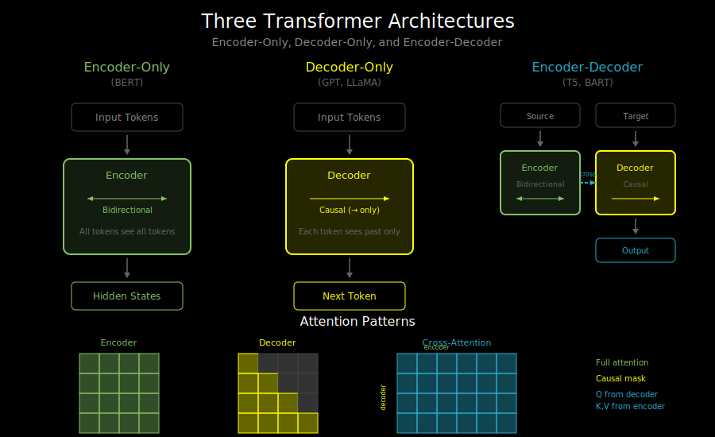

# Encoder-Decoder Architectures: When to Use Which

## The Three Transformer Variants

Transformers come in three main flavors, each suited to different tasks:



```
1. Encoder-Only     2. Decoder-Only     3. Encoder-Decoder
   (BERT)              (GPT)              (T5, BART)

   [Input]            [Input]            [Input]    [Output]
      ↓                  ↓                  ↓           ↓
   [Encoder]          [Decoder]         [Encoder]  [Decoder]
      ↓                  ↓                  ↓           ↓
   [Output]           [Output]         [Context] → [Output]
```

## Encoder-Only: Understanding Context (BERT-style)

**Architecture**: Stacks of transformer blocks with **bidirectional** attention.

```
Input:  "The [MASK] sat on the mat"
                ↓
         [Bidirectional Attention]
         Every token sees every other token
                ↓
Output: Hidden states for each position
        → Predict [MASK] = "cat"
```

**Key property**: Each token attends to ALL tokens (past AND future).

**Used for**:
- Text classification (sentiment, topic)
- Named entity recognition
- Question answering (extractive)
- Sentence similarity/embeddings

**Examples**: BERT, RoBERTa, DistilBERT, ALBERT

**Why bidirectional?** For understanding tasks, you want full context. When classifying "The movie was not bad", you need to see "not" to understand "bad".

## Decoder-Only: Generating Text (GPT-style)

**Architecture**: Stacks of transformer blocks with **causal** (unidirectional) attention.

```
Input:  "The cat sat"
              ↓
        [Causal Attention]
        Each token only sees previous tokens
              ↓
Output: "The cat sat on" → "on" → "the" → "mat" → ...
```

**Key property**: Each token only attends to PREVIOUS tokens (including itself). This is enforced by a causal mask.

**Used for**:
- Text generation
- Code completion
- Conversational AI
- Few-shot learning (GPT-3 style)

**Examples**: GPT-2, GPT-3/4, LLaMA, Claude, Mistral

**Why causal?** For generation, you can't see the future - you're predicting it! If token 5 could see token 6, it would just copy the answer.

## Encoder-Decoder: Sequence-to-Sequence (T5-style)

**Architecture**: Separate encoder (bidirectional) and decoder (causal), connected by cross-attention.

```
Encoder Input:  "Translate to French: Hello world"
                            ↓
                    [Bidirectional Encoder]
                            ↓
                    Encoder hidden states
                            ↓ (cross-attention)
Decoder Input:  "<start>"  →  "Bonjour"  →  "monde"
                    ↓            ↓            ↓
               [Causal Decoder with Cross-Attention]
                    ↓            ↓            ↓
Decoder Output: "Bonjour"     "monde"      "<end>"
```

**Key properties**:
- Encoder sees full input bidirectionally
- Decoder generates autoregressively
- Decoder attends to encoder states via cross-attention

**Used for**:
- Translation
- Summarization
- Question answering (generative)
- Any task with distinct input/output sequences

**Examples**: T5, BART, mT5, FLAN-T5

## Cross-Attention: Connecting Encoder and Decoder

In encoder-decoder models, the decoder has two types of attention per layer:

```
Decoder Layer:
    ┌─────────────────────────────────────┐
    │  Self-Attention (causal)            │  ← Decoder attends to itself
    │  Q, K, V all from decoder states    │
    └─────────────────────────────────────┘
                     ↓
    ┌─────────────────────────────────────┐
    │  Cross-Attention                    │  ← Decoder attends to encoder
    │  Q from decoder, K/V from encoder   │
    └─────────────────────────────────────┘
                     ↓
    ┌─────────────────────────────────────┐
    │  Feed-Forward Network               │
    └─────────────────────────────────────┘
```

**Cross-attention formula**:
```
Q = decoder_hidden @ W_Q    # What the decoder is looking for
K = encoder_output @ W_K    # What the encoder contains
V = encoder_output @ W_V    # What to retrieve from encoder

cross_attn_output = Attention(Q, K, V)
```

This lets each decoder position "look at" the most relevant parts of the input.

## Comparison Table

| Aspect | Encoder-Only | Decoder-Only | Encoder-Decoder |
|--------|--------------|--------------|-----------------|
| Attention | Bidirectional | Causal | Encoder: bi, Decoder: causal + cross |
| Output | Hidden states | Next token | Next token |
| Input/Output | Same length | Variable | Different lengths |
| Training | MLM, classification | Next-token prediction | Seq2seq |
| Best for | Understanding | Generation | Translation/transformation |

## The Modern Trend: Decoder-Only Dominance

Recent years have seen decoder-only models dominate:

**Why decoder-only is winning**:
1. **Simpler architecture**: One type of block, easier to scale
2. **Unified training**: Everything is next-token prediction
3. **Emergent abilities**: Scale unlocks few-shot learning
4. **Flexibility**: Can do most tasks with prompting

**The surprising result**: Decoder-only models can do "encoder" tasks too!

```
# Classification with GPT
Input: "Review: This movie was terrible. Sentiment:"
Output: "Negative"

# Translation with GPT
Input: "Translate to French: Hello world"
Output: "Bonjour monde"
```

By framing everything as text completion, decoder-only models handle diverse tasks.

## Architectural Details

### Encoder-Only (BERT)
```python
class EncoderBlock:
    def forward(self, x, attention_mask):
        # Bidirectional self-attention
        attn_out = self_attention(x, x, x, mask=attention_mask)
        x = layer_norm(x + attn_out)

        ffn_out = feed_forward(x)
        x = layer_norm(x + ffn_out)
        return x
```

### Decoder-Only (GPT)
```python
class DecoderBlock:
    def forward(self, x, causal_mask):
        # Causal self-attention (masked)
        attn_out = self_attention(x, x, x, mask=causal_mask)
        x = layer_norm(x + attn_out)

        ffn_out = feed_forward(x)
        x = layer_norm(x + ffn_out)
        return x
```

### Encoder-Decoder (T5)
```python
class EncoderDecoderBlock:
    def forward(self, decoder_x, encoder_output, causal_mask):
        # Causal self-attention
        self_attn_out = self_attention(decoder_x, decoder_x, decoder_x, mask=causal_mask)
        x = layer_norm(decoder_x + self_attn_out)

        # Cross-attention to encoder
        cross_attn_out = cross_attention(Q=x, K=encoder_output, V=encoder_output)
        x = layer_norm(x + cross_attn_out)

        ffn_out = feed_forward(x)
        x = layer_norm(x + ffn_out)
        return x
```

## What's Next

Understanding these architectures sets you up for the labs where you'll build a decoder-only transformer. But first, let's understand the key mechanism that makes decoders work: causal masking. See `02_causal_masking.md`.
