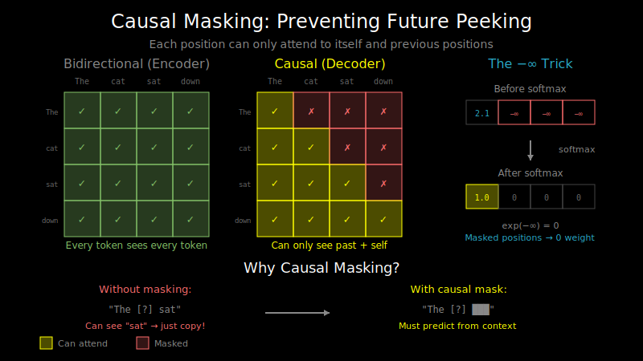

# Causal Masking: Preventing Future Peeking



## The Problem: Autoregressive Generation

When generating text, we predict one token at a time:

```
Step 1: "The"       → predict "cat"
Step 2: "The cat"   → predict "sat"
Step 3: "The cat sat" → predict "on"
...
```

But during training, we process the entire sequence at once for efficiency:

```
Input:  "The cat sat on the"
Target: "cat sat on the mat"
```

**The problem**: If position 1 ("cat") can attend to position 2 ("sat"), it can just copy the answer instead of learning to predict it!

## The Solution: Causal Masking

We mask the attention so each position can only see itself and previous positions:

```
Positions:    0      1      2      3      4
Tokens:     "The"  "cat"  "sat"  "on"  "the"

Attention allowed:
Position 0: [✓,    ✗,     ✗,     ✗,     ✗]   "The" sees only "The"
Position 1: [✓,    ✓,     ✗,     ✗,     ✗]   "cat" sees "The", "cat"
Position 2: [✓,    ✓,     ✓,     ✗,     ✗]   "sat" sees "The", "cat", "sat"
Position 3: [✓,    ✓,     ✓,     ✓,     ✗]   "on" sees all up to "on"
Position 4: [✓,    ✓,     ✓,     ✓,     ✓]   "the" sees everything
```

This lower triangular pattern is the **causal mask**.

## Implementing the Mask

### The Triangle Mask

```python
import torch

def create_causal_mask(seq_len):
    """Create a causal (lower triangular) mask."""
    # True where attention is ALLOWED
    mask = torch.tril(torch.ones(seq_len, seq_len))
    return mask

# Example: seq_len = 4
# tensor([[1., 0., 0., 0.],
#         [1., 1., 0., 0.],
#         [1., 1., 1., 0.],
#         [1., 1., 1., 1.]])
```

### Applying the Mask: The -inf Trick

The mask is applied **before** softmax. We use `-inf` for blocked positions:

```python
def masked_attention(Q, K, V, mask):
    d_k = Q.shape[-1]

    # Compute attention scores
    scores = (Q @ K.transpose(-2, -1)) / math.sqrt(d_k)

    # Apply mask: set blocked positions to -inf
    # Where mask is 0, we set scores to -inf
    scores = scores.masked_fill(mask == 0, float('-inf'))

    # Softmax: exp(-inf) = 0, so masked positions get 0 weight
    attention_weights = torch.softmax(scores, dim=-1)

    # Weighted sum of values
    output = attention_weights @ V
    return output, attention_weights
```

**Why `-inf` works**:
```
softmax([2.0, 1.0, -inf]) = softmax([2.0, 1.0]) for practical purposes
                          = [exp(2.0), exp(1.0), exp(-inf)] / sum
                          = [exp(2.0), exp(1.0), 0] / sum
                          ≈ [0.73, 0.27, 0.00]
```

The `-inf` positions become exactly 0 after softmax, contributing nothing to the output.

## Visualizing Causal vs. Bidirectional

### Bidirectional Attention (Encoder)
```
"The" "cat" "sat" "on"
  ↕     ↕     ↕     ↕
  ↔     ↔     ↔     ↔     Every token attends to every token

Attention matrix:
[1, 1, 1, 1]
[1, 1, 1, 1]
[1, 1, 1, 1]
[1, 1, 1, 1]
```

### Causal Attention (Decoder)
```
"The" → "cat" → "sat" → "on"
  ↓       ↓       ↓       ↓
  │       │       │       │
  └───────┴───────┴───────┘    Each token attends only to past

Attention matrix:
[1, 0, 0, 0]
[1, 1, 0, 0]
[1, 1, 1, 0]
[1, 1, 1, 1]
```

## Why Causal Masking Enables Parallel Training

Without causal masking, we'd need to train sequentially:

```
Sequential (slow):
Step 1: Feed "The", predict "cat"
Step 2: Feed "The cat", predict "sat"
Step 3: Feed "The cat sat", predict "on"
...
```

With causal masking, we can do it all at once:

```
Parallel (fast):
Feed entire sequence + mask
→ Position 0 predicts based on position 0 only
→ Position 1 predicts based on positions 0-1
→ Position 2 predicts based on positions 0-2
→ All predictions computed simultaneously!
```

This is why transformers train so much faster than RNNs.

## The Full Attention with Masking

```python
import torch
import torch.nn.functional as F
import math

def scaled_dot_product_attention(Q, K, V, attn_mask=None, is_causal=False):
    """
    Q: (batch, num_heads, seq_len, d_k)
    K: (batch, num_heads, seq_len, d_k)
    V: (batch, num_heads, seq_len, d_v)
    attn_mask: optional mask (seq_len, seq_len) or (batch, 1, seq_len, seq_len)
    is_causal: if True, apply causal mask automatically
    """
    d_k = Q.shape[-1]
    seq_len = Q.shape[-2]

    # Compute scores
    scores = (Q @ K.transpose(-2, -1)) / math.sqrt(d_k)

    # Apply causal mask if requested
    if is_causal:
        causal_mask = torch.triu(torch.ones(seq_len, seq_len), diagonal=1).bool()
        scores = scores.masked_fill(causal_mask, float('-inf'))

    # Apply additional mask if provided
    if attn_mask is not None:
        scores = scores.masked_fill(attn_mask == 0, float('-inf'))

    # Softmax and weighted sum
    attention_weights = F.softmax(scores, dim=-1)
    output = attention_weights @ V

    return output, attention_weights
```

## Handling Variable-Length Sequences: Padding Masks

Real batches have sequences of different lengths:

```
Batch:
  Sequence 1: "The cat sat" (3 tokens)
  Sequence 2: "Hello world" (2 tokens)

Padded batch:
  Sequence 1: "The cat sat [PAD]"
  Sequence 2: "Hello world [PAD] [PAD]"
```

We need to mask out padding tokens too:

```python
def create_padding_mask(seq_lengths, max_len):
    """
    seq_lengths: (batch,) - actual length of each sequence
    Returns: (batch, 1, 1, max_len) mask for attention
    """
    batch_size = len(seq_lengths)
    mask = torch.zeros(batch_size, max_len)
    for i, length in enumerate(seq_lengths):
        mask[i, :length] = 1
    return mask.unsqueeze(1).unsqueeze(2)  # (batch, 1, 1, max_len)
```

### Combining Causal and Padding Masks

```python
def create_combined_mask(seq_lengths, max_len):
    """Create mask that combines causal and padding constraints."""
    batch_size = len(seq_lengths)

    # Causal mask: (1, 1, max_len, max_len)
    causal_mask = torch.tril(torch.ones(max_len, max_len)).unsqueeze(0).unsqueeze(0)

    # Padding mask: (batch, 1, 1, max_len)
    padding_mask = create_padding_mask(seq_lengths, max_len)

    # Combined: causal AND not padding
    combined = causal_mask * padding_mask  # (batch, 1, max_len, max_len)

    return combined
```

## Common Pitfalls

### 1. Wrong Mask Dimension

```python
# Wrong: mask is (seq_len, seq_len), but scores are (batch, heads, seq_len, seq_len)
scores.masked_fill(mask == 0, float('-inf'))  # Broadcasting error!

# Right: expand mask dimensions
mask = mask.unsqueeze(0).unsqueeze(0)  # (1, 1, seq_len, seq_len)
scores.masked_fill(mask == 0, float('-inf'))  # Broadcasts correctly
```

### 2. Using 0 Instead of -inf

```python
# Wrong: blocked positions still contribute
scores = scores * mask  # Positions become 0, but softmax(0) ≠ 0!

# Right: use -inf so softmax gives exactly 0
scores = scores.masked_fill(mask == 0, float('-inf'))
```

### 3. NaN from All-Masked Rows

If an entire row is masked, softmax produces NaN:

```python
softmax([-inf, -inf, -inf]) = [0/0, 0/0, 0/0] = [NaN, NaN, NaN]
```

Solution: Ensure at least one position is unmasked per row, or handle NaN:

```python
# Replace NaN with 0 after softmax
attention_weights = attention_weights.nan_to_num(0.0)
```

## What's Next

Now you understand how decoders prevent "cheating" during training. The next step is understanding how text becomes numbers in the first place: tokenization and embeddings. See `03_embeddings_and_vocabulary.md`.
