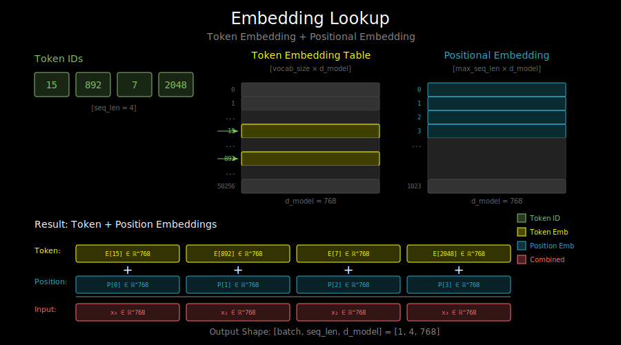

# Embeddings and Vocabulary: From Text to Numbers



## The Fundamental Problem

Neural networks work with numbers, not text. We need to convert:

```
"The cat sat" → [0.12, -0.45, 0.78, ...], [0.33, 0.21, -0.15, ...], ...
```

This happens in two steps:
1. **Tokenization**: Split text into discrete units (tokens)
2. **Embedding**: Map each token to a dense vector

## Step 1: Tokenization

### Why Not Characters?

Character-level seems simple:
```
"cat" → ["c", "a", "t"] → [3, 1, 20]  # Just ASCII codes!
```

Problems:
- Sequences become very long ("transformer" = 11 characters)
- Model must learn that "c-a-t" means a furry animal
- Computationally expensive for long texts

### Why Not Words?

Word-level seems natural:
```
"The cat sat" → ["The", "cat", "sat"] → [1, 42, 156]
```

Problems:
- Huge vocabulary (English has 170,000+ words)
- Can't handle new words ("COVID-19", "ChatGPT")
- Can't handle typos ("cta" → unknown!)
- Wastes capacity on rare words

### The Solution: Subword Tokenization

Split words into common pieces:

```
"unhappiness" → ["un", "happiness"]  or  ["un", "happ", "iness"]
"ChatGPT"     → ["Chat", "G", "PT"]
"transformers" → ["transform", "ers"]
```

**Benefits**:
- Vocabulary of ~30,000-50,000 tokens covers most text
- Can represent ANY text (falls back to characters if needed)
- Shares information between related words ("happy", "happiness", "unhappy")

### Common Tokenization Algorithms

**BPE (Byte Pair Encoding)** - Used by GPT-2, GPT-3
```
Start with characters, repeatedly merge most frequent pairs:
"l o w"  "l o w e r"  "n e w e s t"
    ↓
"lo w"  "lo w e r"  "n e w e s t"     (merged "l"+"o")
    ↓
"low"  "low e r"  "n e w e st"        (merged "lo"+"w", "s"+"t")
    ↓
"low"  "lower"  "n e west"            (continue until vocab size reached)
```

**WordPiece** - Used by BERT
- Similar to BPE, but uses likelihood instead of frequency
- Prefixes subwords with `##` (e.g., "playing" → ["play", "##ing"])

**SentencePiece** - Used by LLaMA, T5
- Language-agnostic (works on raw text, no pre-tokenization)
- Treats space as a regular character (uses `▁` for word boundaries)

### Tokenization in Practice

```python
from transformers import AutoTokenizer

tokenizer = AutoTokenizer.from_pretrained("gpt2")

text = "Hello, transformers!"
tokens = tokenizer.tokenize(text)
# ['Hello', ',', 'Ġtrans', 'formers', '!']

ids = tokenizer.encode(text)
# [15496, 11, 1007, 42383, 0]

# Decode back
tokenizer.decode(ids)
# "Hello, transformers!"
```

Note: `Ġ` in GPT-2 represents a space before the token.

## Step 2: Token Embeddings

Once we have token IDs, we look them up in an **embedding table**:

```
Vocabulary size: V = 50,000
Embedding dimension: d = 768

Embedding table: (V, d) matrix
                 ┌─────────────────────────────┐
Token 0     →    │ 0.12, -0.45, 0.78, ..., 0.33│  (768 values)
Token 1     →    │-0.21,  0.56, 0.11, ..., 0.87│
Token 2     →    │ 0.45,  0.23,-0.67, ..., 0.12│
   ...           │           ...               │
Token 49999 →    │ 0.78, -0.12, 0.34, ..., 0.56│
                 └─────────────────────────────┘
```

### Embedding Lookup

```python
import torch
import torch.nn as nn

class TokenEmbedding(nn.Module):
    def __init__(self, vocab_size, d_model):
        super().__init__()
        self.embedding = nn.Embedding(vocab_size, d_model)

    def forward(self, token_ids):
        # token_ids: (batch, seq_len) of integers
        # output: (batch, seq_len, d_model) of floats
        return self.embedding(token_ids)

# Example
embed = TokenEmbedding(vocab_size=50000, d_model=768)
ids = torch.tensor([[100, 200, 300]])  # batch=1, seq_len=3
vectors = embed(ids)  # shape: (1, 3, 768)
```

### What Do Embeddings Capture?

Embeddings learn semantic relationships:

```
embedding("king") - embedding("man") + embedding("woman") ≈ embedding("queen")
```

Similar words have similar embeddings:
- "cat" and "dog" are close (both animals)
- "cat" and "democracy" are far apart

This emerges from training - the model learns useful representations.

## Positional Information

Embeddings alone don't encode position! The model sees:

```
"cat sat" → [embed("cat"), embed("sat")]
"sat cat" → [embed("sat"), embed("cat")]  # Same vectors, different order!
```

We add **positional encodings** (covered in Chapter 2) to the token embeddings:

```python
class TransformerEmbedding(nn.Module):
    def __init__(self, vocab_size, d_model, max_seq_len):
        super().__init__()
        self.token_embedding = nn.Embedding(vocab_size, d_model)
        self.position_embedding = nn.Embedding(max_seq_len, d_model)

    def forward(self, token_ids):
        seq_len = token_ids.shape[1]
        positions = torch.arange(seq_len, device=token_ids.device)

        token_embed = self.token_embedding(token_ids)
        pos_embed = self.position_embedding(positions)

        return token_embed + pos_embed  # Add position information
```

## The Output Layer: LM Head

For language modeling, we need to predict the next token. The output layer maps from hidden states back to vocabulary:

```
Hidden state: (batch, seq_len, d_model)
                    ↓
            Linear layer (d_model → vocab_size)
                    ↓
Logits: (batch, seq_len, vocab_size)
                    ↓
              Softmax
                    ↓
Probabilities: P(next_token | context)
```

```python
class LMHead(nn.Module):
    def __init__(self, d_model, vocab_size):
        super().__init__()
        self.linear = nn.Linear(d_model, vocab_size)

    def forward(self, hidden_states):
        # hidden_states: (batch, seq_len, d_model)
        # logits: (batch, seq_len, vocab_size)
        return self.linear(hidden_states)
```

## Tied Embeddings: A Common Optimization

Notice that both the input embedding and output projection deal with the same vocabulary:

```
Input:  token_id → embedding vector (V × d matrix)
Output: hidden state → logits (d × V matrix)
```

These matrices are often **tied** (shared):

```python
class GPTModel(nn.Module):
    def __init__(self, vocab_size, d_model):
        super().__init__()
        self.embedding = nn.Embedding(vocab_size, d_model)
        self.transformer_blocks = ...
        # No separate lm_head - we reuse embedding weights

    def forward(self, token_ids):
        x = self.embedding(token_ids)
        x = self.transformer_blocks(x)

        # Tied weights: use embedding matrix transposed
        logits = x @ self.embedding.weight.T  # (batch, seq, d) @ (d, V) → (batch, seq, V)
        return logits
```

**Why tie embeddings?**
1. Fewer parameters (significant for large vocabularies)
2. Consistent token representations
3. Often improves performance

## Special Tokens

Tokenizers include special tokens for structure:

| Token | Purpose | Example |
|-------|---------|---------|
| `[PAD]` | Padding for batching | Fill short sequences |
| `[BOS]` / `<s>` | Beginning of sequence | Start generation |
| `[EOS]` / `</s>` | End of sequence | Know when to stop |
| `[UNK]` | Unknown token | Rare fallback |
| `[SEP]` | Separator | Between segments |
| `[MASK]` | Masked token | BERT-style training |

```python
tokenizer = AutoTokenizer.from_pretrained("gpt2")
print(tokenizer.bos_token)  # <|endoftext|> (GPT-2 uses same for BOS/EOS)
print(tokenizer.eos_token)  # <|endoftext|>
print(tokenizer.pad_token)  # None (GPT-2 doesn't have one by default)
```

## Putting It All Together

```python
class GPTEmbeddings(nn.Module):
    def __init__(self, vocab_size, d_model, max_seq_len, dropout=0.1):
        super().__init__()
        self.token_embedding = nn.Embedding(vocab_size, d_model)
        self.position_embedding = nn.Embedding(max_seq_len, d_model)
        self.dropout = nn.Dropout(dropout)

    def forward(self, token_ids):
        batch_size, seq_len = token_ids.shape

        # Token embeddings
        token_embed = self.token_embedding(token_ids)

        # Position embeddings
        positions = torch.arange(seq_len, device=token_ids.device)
        pos_embed = self.position_embedding(positions)

        # Combine and apply dropout
        embeddings = self.dropout(token_embed + pos_embed)

        return embeddings


class GPTOutput(nn.Module):
    def __init__(self, d_model, vocab_size, tie_weights=None):
        super().__init__()
        if tie_weights is not None:
            self.weight = tie_weights  # Reuse embedding weights
        else:
            self.linear = nn.Linear(d_model, vocab_size)

    def forward(self, hidden_states):
        if hasattr(self, 'weight'):
            return hidden_states @ self.weight.T
        return self.linear(hidden_states)
```

## What's Next

Now you understand how text becomes vectors and how the model outputs predictions. The next step is learning how to use pretrained models - loading weights that someone else trained on massive datasets. See `04_pretrained_models.md`.
