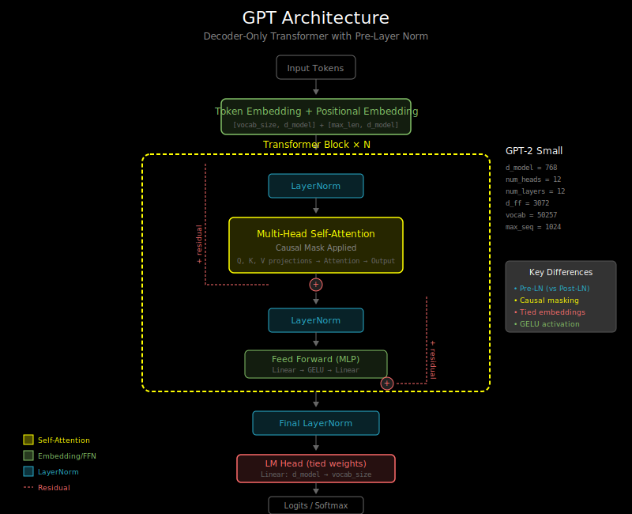

# Pretrained Models: Loading Weights and the HuggingFace Ecosystem



## Why Pretrained Models Matter

Training a language model from scratch requires:
- **Data**: Trillions of tokens (GPT-3 trained on 300B tokens)
- **Compute**: Thousands of GPU-hours (millions of dollars)
- **Expertise**: Careful hyperparameter tuning

Pretrained models let you skip this:

```
From scratch:     [Random init] → [Train on massive data] → [Use]
                                   ↑ Expensive!

Pretrained:       [Download weights] → [Use or fine-tune]
                   ↑ Free!
```

## The HuggingFace Ecosystem

HuggingFace provides:
1. **Hub**: Repository of 100,000+ pretrained models
2. **Transformers library**: Unified API for all models
3. **Tokenizers**: Fast tokenization implementations
4. **Datasets**: Easy access to training data

### Quick Start

```python
from transformers import AutoModelForCausalLM, AutoTokenizer

# Download model and tokenizer
model_name = "gpt2"
tokenizer = AutoTokenizer.from_pretrained(model_name)
model = AutoModelForCausalLM.from_pretrained(model_name)

# Generate text
input_text = "The future of AI is"
inputs = tokenizer(input_text, return_tensors="pt")
outputs = model.generate(**inputs, max_length=50)
print(tokenizer.decode(outputs[0]))
```

## Understanding Model Weights

### What's in a Pretrained Model?

A model checkpoint contains:
1. **Weights**: The learned parameters (billions of floats)
2. **Config**: Architecture details (layers, dimensions, etc.)
3. **Tokenizer**: Vocabulary and tokenization rules

```python
from transformers import GPT2Config, GPT2LMHeadModel

# View the configuration
config = GPT2Config.from_pretrained("gpt2")
print(f"Layers: {config.n_layer}")        # 12
print(f"Hidden size: {config.n_embd}")    # 768
print(f"Attention heads: {config.n_head}") # 12
print(f"Vocab size: {config.vocab_size}") # 50257
```

### Weight Shapes in GPT-2

```python
model = GPT2LMHeadModel.from_pretrained("gpt2")

for name, param in model.named_parameters():
    print(f"{name}: {param.shape}")

# Output (abbreviated):
# transformer.wte.weight: torch.Size([50257, 768])    # Token embeddings
# transformer.wpe.weight: torch.Size([1024, 768])     # Position embeddings
# transformer.h.0.ln_1.weight: torch.Size([768])      # Layer norm
# transformer.h.0.attn.c_attn.weight: torch.Size([768, 2304])  # Q,K,V projection
# transformer.h.0.attn.c_proj.weight: torch.Size([768, 768])   # Output projection
# transformer.h.0.mlp.c_fc.weight: torch.Size([768, 3072])     # FFN expand
# transformer.h.0.mlp.c_proj.weight: torch.Size([3072, 768])   # FFN contract
# ...
# lm_head.weight: torch.Size([50257, 768])            # Output projection (tied)
```

## Loading Weights into Custom Code

### Step 1: Match the Architecture

Your model must have the same structure as the pretrained weights:

```python
import torch
import torch.nn as nn

class MyGPT2Block(nn.Module):
    def __init__(self, d_model=768, n_heads=12):
        super().__init__()
        self.ln_1 = nn.LayerNorm(d_model)
        self.attn = MyAttention(d_model, n_heads)
        self.ln_2 = nn.LayerNorm(d_model)
        self.mlp = MyMLP(d_model)

class MyGPT2(nn.Module):
    def __init__(self, vocab_size=50257, d_model=768, n_layers=12, n_heads=12):
        super().__init__()
        self.wte = nn.Embedding(vocab_size, d_model)  # Token embedding
        self.wpe = nn.Embedding(1024, d_model)        # Position embedding
        self.blocks = nn.ModuleList([MyGPT2Block() for _ in range(n_layers)])
        self.ln_f = nn.LayerNorm(d_model)
        # LM head (tied with wte)
```

### Step 2: Map Weight Names

HuggingFace and your code may use different names:

```python
def load_gpt2_weights(my_model, hf_model):
    """Load HuggingFace GPT-2 weights into custom model."""
    hf_state_dict = hf_model.state_dict()
    my_state_dict = my_model.state_dict()

    # Mapping from HF names to our names
    mapping = {
        'transformer.wte.weight': 'wte.weight',
        'transformer.wpe.weight': 'wpe.weight',
        'transformer.ln_f.weight': 'ln_f.weight',
        'transformer.ln_f.bias': 'ln_f.bias',
    }

    # Map block weights
    for i in range(12):
        mapping.update({
            f'transformer.h.{i}.ln_1.weight': f'blocks.{i}.ln_1.weight',
            f'transformer.h.{i}.ln_1.bias': f'blocks.{i}.ln_1.bias',
            # ... more mappings
        })

    # Copy weights
    for hf_name, my_name in mapping.items():
        my_state_dict[my_name] = hf_state_dict[hf_name]

    my_model.load_state_dict(my_state_dict)
```

### Step 3: Handle Shape Differences

Some weights need reshaping. GPT-2's attention uses a combined QKV projection:

```python
# HuggingFace GPT-2: single c_attn for Q, K, V combined
# Shape: (d_model, 3 * d_model) = (768, 2304)

hf_qkv = hf_state_dict['transformer.h.0.attn.c_attn.weight']  # (768, 2304)

# Split into Q, K, V
q_weight, k_weight, v_weight = hf_qkv.split(768, dim=1)  # Each (768, 768)

# If your model has separate projections:
my_state_dict['blocks.0.attn.W_q.weight'] = q_weight.T  # May need transpose
my_state_dict['blocks.0.attn.W_k.weight'] = k_weight.T
my_state_dict['blocks.0.attn.W_v.weight'] = v_weight.T
```

## Verifying Your Implementation

The key test: **do you get the same outputs?**

```python
import torch

def verify_implementation(my_model, hf_model, tokenizer, test_text="Hello world"):
    # Tokenize
    inputs = tokenizer(test_text, return_tensors="pt")
    input_ids = inputs["input_ids"]

    # Get HuggingFace output
    with torch.no_grad():
        hf_output = hf_model(input_ids)
        hf_logits = hf_output.logits

    # Get your output
    with torch.no_grad():
        my_logits = my_model(input_ids)

    # Compare
    diff = (hf_logits - my_logits).abs().max().item()
    print(f"Max absolute difference: {diff}")

    if diff < 1e-5:
        print("✓ Outputs match!")
    else:
        print("✗ Outputs differ - check your implementation")

    return diff
```

## Common Model Variants

### GPT-2 Family
| Model | Parameters | Layers | Hidden | Heads |
|-------|------------|--------|--------|-------|
| gpt2 | 124M | 12 | 768 | 12 |
| gpt2-medium | 355M | 24 | 1024 | 16 |
| gpt2-large | 774M | 36 | 1280 | 20 |
| gpt2-xl | 1.5B | 48 | 1600 | 25 |

### Modern Open Models
| Model | Parameters | Notes |
|-------|------------|-------|
| LLaMA 2 | 7B-70B | Meta's open weights |
| Mistral | 7B | Efficient, sliding window attention |
| Phi-2 | 2.7B | Microsoft, strong for size |
| Gemma | 2B-7B | Google's open weights |

## Working with Different Formats

### PyTorch (.bin, .pt)
```python
# Load raw PyTorch checkpoint
state_dict = torch.load("model.bin")
model.load_state_dict(state_dict)
```

### SafeTensors (.safetensors)
```python
# Safer, faster format (recommended)
from safetensors.torch import load_file
state_dict = load_file("model.safetensors")
```

### GGUF (llama.cpp)
```python
# For CPU inference with llama.cpp
# Different format, requires conversion
# See Chapter 9 for details
```

## Best Practices

### 1. Use `torch.no_grad()` for Inference
```python
model.eval()  # Set to evaluation mode
with torch.no_grad():  # Disable gradient computation
    outputs = model(inputs)
```

### 2. Move to GPU When Available
```python
device = "cuda" if torch.cuda.is_available() else "cpu"
model = model.to(device)
inputs = inputs.to(device)
```

### 3. Use Half Precision for Large Models
```python
# FP16 uses half the memory
model = model.half()  # or model.to(torch.float16)

# BF16 if available (better numerical stability)
model = model.to(torch.bfloat16)
```

### 4. Cache Tokenizer and Model
```python
# Models are cached in ~/.cache/huggingface/
# Set custom cache location:
import os
os.environ["HF_HOME"] = "/path/to/cache"
```

## What's Next

Now you have all the pieces:
- Encoder/decoder architectures
- Causal masking
- Embeddings and tokenization
- Loading pretrained weights

Time to put it together in the labs! You'll:
1. Implement causal masking from scratch
2. Build a complete embedding layer
3. Stack blocks into a full GPT-style decoder
4. Load GPT-2 weights and verify your implementation matches

See `05_references.md` for additional reading and resources.
