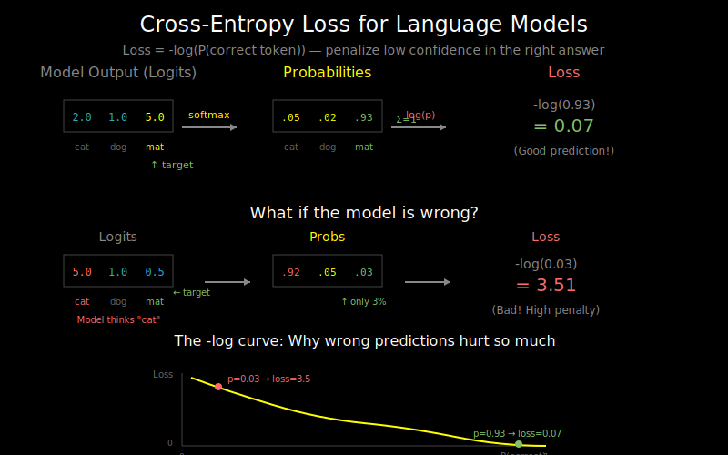

# Loss and Perplexity: What Are We Optimizing?



## The Language Modeling Objective

Language models learn to predict the next token. Given a sequence of tokens, the model outputs a probability distribution over the vocabulary for what comes next.

```
Input:  "The cat sat on the"
Output: probability distribution over vocabulary
        P("mat") = 0.15
        P("floor") = 0.12
        P("dog") = 0.001
        ...
```

The training objective: maximize the probability assigned to the *actual* next token.

## Cross-Entropy Loss

Cross-entropy measures how well the predicted distribution matches the actual distribution (which is one-hot: 1 for the correct token, 0 for everything else).

**The formula**:
```
L = -log(P(correct_token))
```

**Why negative log?**
- If P(correct) = 1.0 → L = -log(1) = 0 (perfect)
- If P(correct) = 0.5 → L = -log(0.5) = 0.69
- If P(correct) = 0.01 → L = -log(0.01) = 4.6 (very bad)

The loss is 0 when we're perfectly confident in the right answer, and increases as we assign less probability to the correct token.

## From Logits to Loss

In practice, models output raw "logits" (unnormalized scores), and we convert them to probabilities with softmax:

```python
def cross_entropy_loss(logits, target):
    """
    logits: (batch_size, seq_len, vocab_size) - raw model outputs
    target: (batch_size, seq_len) - correct token indices
    """
    # Convert logits to log-probabilities
    log_probs = log_softmax(logits, dim=-1)

    # Gather the log-prob of the correct token at each position
    # target shape: (batch_size, seq_len)
    loss = -log_probs.gather(dim=-1, index=target.unsqueeze(-1))

    return loss.mean()
```

**Why log_softmax instead of softmax + log?**
- Numerical stability: `log(softmax(x))` can underflow for large negative logits
- `log_softmax` computes this in a numerically stable way

## Sequence-Level Loss

For language modeling, we compute loss at every position in the sequence:

```
Sequence:  [The] [cat] [sat] [on] [the] [mat]
Targets:   [cat] [sat] [on] [the] [mat] [<eos>]

Loss_0 = -log P("cat" | "The")
Loss_1 = -log P("sat" | "The cat")
Loss_2 = -log P("on" | "The cat sat")
...

Total Loss = mean(Loss_0, Loss_1, ..., Loss_n)
```

This is also called the **negative log-likelihood (NLL)**.

## Perplexity: An Interpretable Metric

While loss is useful for optimization, **perplexity** is more interpretable:

```
Perplexity = exp(Loss)
```

**Interpretation**: Perplexity is the "effective vocabulary size" the model is choosing from.

- Perplexity = 1: Model is perfectly certain (always assigns P=1 to correct token)
- Perplexity = 100: On average, model is as uncertain as choosing uniformly from 100 tokens
- Perplexity = 50,000: No better than random guessing (typical vocab size)

**Example**:
```
Loss = 3.5 → Perplexity = exp(3.5) ≈ 33

The model is, on average, as uncertain as if it were choosing
uniformly between 33 equally likely tokens.
```

## Why Perplexity Matters

1. **Comparable across models**: Loss depends on vocabulary size; perplexity is normalized
2. **Intuitive**: "Choosing from 20 options" is easier to understand than "loss of 3.0"
3. **Standard benchmark**: Papers report perplexity on test sets (lower is better)

## Common Perplexity Values

| Model | Dataset | Perplexity |
|-------|---------|------------|
| Random guessing | Any | ~vocab_size (50k) |
| Simple n-gram | PTB | ~150 |
| LSTM | PTB | ~60-80 |
| GPT-2 (small) | WikiText-103 | ~30 |
| GPT-3 | Various | ~15-25 |

## Token-Level vs Byte-Level Perplexity

**Important caveat**: Perplexity depends on tokenization!

```
Sentence: "Hello world"

Word tokens: ["Hello", "world"]      → 2 predictions
BPE tokens:  ["Hel", "lo", "wor", "ld"] → 4 predictions
Byte-level:  [72, 101, 108, ...]     → 11 predictions
```

A model with more tokens per word will have lower perplexity (easier predictions).

**Solution**: Report bits-per-byte (BPB) for fair comparison:
```
BPB = Loss / ln(2) × (tokens / bytes)
```

## Label Smoothing

Sometimes we soften the target distribution instead of using hard one-hot:

```
Hard target:   [0, 0, 1, 0, 0]  (all probability on correct class)
Soft target:   [0.02, 0.02, 0.92, 0.02, 0.02]  (small probability elsewhere)
```

**Why?**
- Prevents overconfidence
- Acts as regularization
- Helps generalization

**PyTorch implementation**:
```python
loss = F.cross_entropy(logits, targets, label_smoothing=0.1)
```

## Putting It Together

```python
import torch
import torch.nn.functional as F

def compute_loss_and_perplexity(logits, targets, ignore_index=-100):
    """
    logits: (batch, seq_len, vocab_size)
    targets: (batch, seq_len) - token indices, -100 for positions to ignore

    Returns: loss (scalar), perplexity (scalar)
    """
    # Reshape for cross_entropy: (batch * seq_len, vocab_size)
    logits_flat = logits.view(-1, logits.size(-1))
    targets_flat = targets.view(-1)

    # Cross-entropy loss (ignores positions with target = -100)
    loss = F.cross_entropy(
        logits_flat,
        targets_flat,
        ignore_index=ignore_index
    )

    # Perplexity
    perplexity = torch.exp(loss)

    return loss, perplexity
```

## The ignore_index Parameter

In practice, we often want to ignore certain positions:
- **Padding tokens**: Don't penalize predictions on padding
- **Prompt tokens**: In fine-tuning, only compute loss on completions

```python
# Example: Only compute loss on completion tokens
targets = [PAD, PAD, "The", "cat", "sat", PAD, PAD]
# Set PAD positions to -100
targets_masked = [-100, -100, "The", "cat", "sat", -100, -100]
```

## What's Next

Now you understand what we're optimizing. But how do gradients flow through the transformer to actually update the weights? See `02_gradient_flow.md`.
