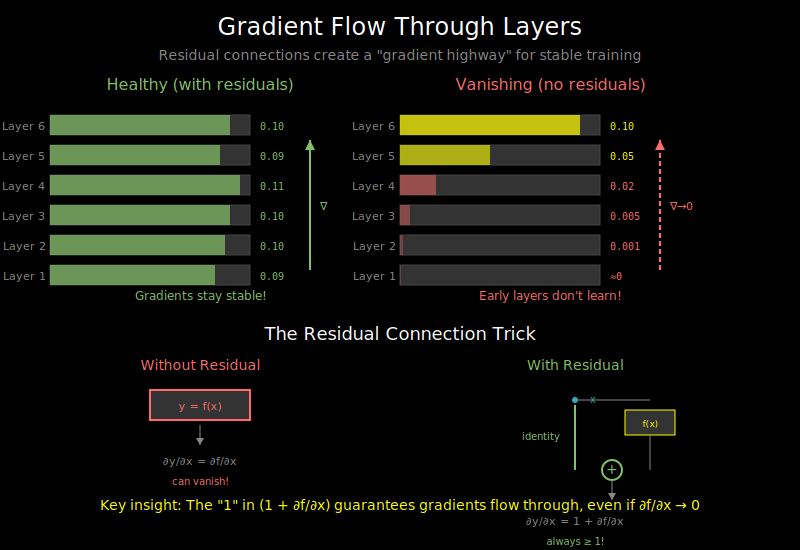

# Gradient Flow: How Gradients Move Through Attention



## The Challenge of Deep Networks

Training neural networks requires propagating gradients from the loss back through every layer. In deep networks, this creates problems:

```
Loss
  ↓ gradient
Layer N
  ↓ gradient (multiplied by local derivative)
Layer N-1
  ↓ gradient (multiplied again)
...
Layer 1
  ↓ gradient (multiplied N times!)
```

If local derivatives are consistently < 1: **vanishing gradients** (gradients → 0)
If local derivatives are consistently > 1: **exploding gradients** (gradients → ∞)

## Why RNNs Struggled

In RNNs, gradients flow through time steps sequentially:

```
h_t = f(W_h * h_{t-1} + W_x * x_t)

∂L/∂h_0 = ∂L/∂h_T × ∂h_T/∂h_{T-1} × ... × ∂h_1/∂h_0
        = ∂L/∂h_T × (W_h)^T  (approximately)
```

For long sequences (T = 1000):
- If ||W_h|| < 1: (W_h)^1000 → 0 (vanishing)
- If ||W_h|| > 1: (W_h)^1000 → ∞ (exploding)

This made RNNs notoriously hard to train on long sequences.

## Transformers: Direct Connections

Transformers solve this with **residual connections** and **attention**:

```
         Input
           |
    ┌──────┴──────┐
    |             |
    |    Attention
    |             |
    └──────┬──────┘
           + (residual)
           |
    ┌──────┴──────┐
    |             |
    |      FFN
    |             |
    └──────┬──────┘
           + (residual)
           |
         Output
```

**Key insight**: The residual connection creates a "gradient highway" - gradients can flow directly from output to input without being transformed.

## Residual Connection Gradients

For a residual block `y = x + f(x)`:

```
∂L/∂x = ∂L/∂y × ∂y/∂x
      = ∂L/∂y × (1 + ∂f/∂x)
      = ∂L/∂y + ∂L/∂y × ∂f/∂x
```

The gradient has two paths:
1. **Direct path**: ∂L/∂y (gradient flows unchanged)
2. **Transform path**: ∂L/∂y × ∂f/∂x (gradient through the layer)

Even if ∂f/∂x is small (vanishing), gradients still flow through the direct path!

## Gradient Flow Through Attention

Let's trace gradients through scaled dot-product attention:

```python
# Forward pass
scores = Q @ K.T / sqrt(d_k)
weights = softmax(scores)
output = weights @ V
```

**Backward through V multiplication**:
```
∂L/∂weights = ∂L/∂output @ V.T
∂L/∂V = weights.T @ ∂L/∂output
```

**Backward through softmax**:
```
∂L/∂scores_i = weights_i × (∂L/∂weights_i - sum_j(weights_j × ∂L/∂weights_j))
```

The softmax Jacobian depends on the attention weights themselves. When attention is very peaked (one weight ≈ 1, others ≈ 0), gradients only flow to the attended position.

**Backward through QK^T**:
```
∂L/∂Q = ∂L/∂scores @ K / sqrt(d_k)
∂L/∂K = ∂L/∂scores.T @ Q / sqrt(d_k)
```

## Visualizing Gradient Magnitudes

A healthy network shows stable gradient magnitudes across layers:

```
Layer:      1    2    3    4    5    6    7    8
           ───────────────────────────────────────
Healthy:   0.1  0.1  0.1  0.1  0.1  0.1  0.1  0.1
Vanishing: 0.1  0.05 0.02 0.01 0.001 ...  ...  ...
Exploding: 0.1  0.2  0.5  1.0  2.0  10.0 100.0 ...
```

## Pre-Norm vs Post-Norm

The placement of LayerNorm affects gradient flow:

**Post-Norm** (original transformer):
```python
x = x + attention(LayerNorm(x))  # No! This was the original
x = LayerNorm(x + attention(x))  # Actually this
```

**Pre-Norm** (modern default):
```python
x = x + attention(LayerNorm(x))
```

Pre-norm is preferred because:
1. The residual path is cleaner (no normalization in the gradient highway)
2. Training is more stable, especially for deep models
3. Gradients to early layers are better preserved

## The Scaling Factor's Role

Remember `scores / sqrt(d_k)`? This also helps gradients:

```
Without scaling:
- Large scores → softmax saturates → gradients vanish
- Example: softmax([10, 0, 0]) = [0.9999, 0.00005, 0.00005]
- Gradient through softmax ≈ 0

With scaling:
- Scores stay moderate → softmax gives smoother distribution
- Example: softmax([2, 0, 0]) = [0.84, 0.08, 0.08]
- Gradients flow to multiple positions
```

## Monitoring Gradients During Training

Healthy training shows specific patterns:

```python
def log_gradient_stats(model):
    for name, param in model.named_parameters():
        if param.grad is not None:
            grad = param.grad
            print(f"{name}:")
            print(f"  mean: {grad.mean():.6f}")
            print(f"  std:  {grad.std():.6f}")
            print(f"  max:  {grad.abs().max():.6f}")
```

**Warning signs**:
- Gradients all zeros → vanishing
- Gradients very large (> 100) → exploding
- NaN gradients → numerical instability
- Gradients same across layers → good!

## Gradient Clipping

A practical solution for exploding gradients:

```python
# Clip by global norm
torch.nn.utils.clip_grad_norm_(model.parameters(), max_norm=1.0)

# How it works:
# 1. Compute total gradient norm: sqrt(sum of squared gradients)
# 2. If norm > max_norm, scale all gradients by max_norm/norm
```

**Why global norm?**
- Preserves gradient direction (all parameters scaled equally)
- Only kicks in when gradients are abnormally large

## The Role of Initialization

Proper weight initialization prevents gradient issues at the start:

**Xavier/Glorot initialization**:
```python
# For linear layers with tanh/sigmoid
std = sqrt(2 / (fan_in + fan_out))
```

**He initialization**:
```python
# For layers with ReLU
std = sqrt(2 / fan_in)
```

**Transformer-specific**:
```python
# Scale output projections by 1/sqrt(num_layers)
# This keeps variance stable across depth
```

GPT-2 uses this pattern:
```python
# In the residual blocks:
self.c_proj.weight.data.normal_(mean=0.0, std=0.02 / sqrt(2 * num_layers))
```

## Debugging Gradient Issues

**Symptom**: Loss stays flat, doesn't decrease
- Check: Are gradients flowing? Print gradient norms
- Check: Are any layers getting zero gradients?
- Check: Learning rate too low?

**Symptom**: Loss explodes to NaN
- Check: Gradient explosion? Add gradient clipping
- Check: Learning rate too high?
- Check: Numerical issues in softmax? (very large inputs)

**Symptom**: Loss decreases then plateaus early
- Check: Vanishing gradients in deep layers?
- Check: Learning rate schedule?
- Check: Need warmup?

## What's Next

Understanding gradient flow is crucial, but we also need to choose the right optimizer to use those gradients effectively. See `03_optimizers.md`.
