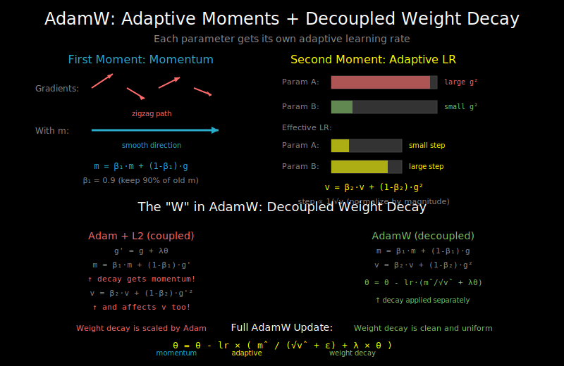

# Optimizers: Adam, AdamW, and Why Weight Decay Matters



## The Goal of Optimization

We have a loss function L(θ) and want to find parameters θ that minimize it. The basic approach:

```
θ_new = θ_old - learning_rate × gradient
```

But vanilla gradient descent has problems:
1. Same learning rate for all parameters
2. Noisy gradients cause oscillation
3. Can get stuck in flat regions

## SGD with Momentum

**Problem**: Gradients are noisy, causing zigzag paths.

**Solution**: Accumulate a "velocity" that smooths out the noise:

```python
# Momentum update
v = momentum * v + gradient
θ = θ - learning_rate * v
```

Momentum acts like a ball rolling downhill - it builds up speed in consistent directions and dampens oscillations.

```
Without momentum:     With momentum:
    ↗                     →
   ↙                      →
    ↗                     →
   ↙                      →
 (zigzag)            (smooth)
```

## Adam: Adaptive Moment Estimation

Adam combines two ideas:
1. **Momentum** (first moment): Moving average of gradients
2. **RMSprop** (second moment): Moving average of squared gradients

```python
# Adam update (simplified)
m = β1 * m + (1 - β1) * gradient          # First moment (momentum)
v = β2 * v + (1 - β2) * gradient²         # Second moment (variance)

# Bias correction (important early in training)
m_hat = m / (1 - β1^t)
v_hat = v / (1 - β2^t)

# Parameter update
θ = θ - learning_rate * m_hat / (sqrt(v_hat) + ε)
```

**Why divide by sqrt(v)?**
- Parameters with large gradients get scaled down
- Parameters with small gradients get scaled up
- Each parameter effectively gets its own learning rate

**Typical hyperparameters**:
- β1 = 0.9 (momentum decay)
- β2 = 0.999 (variance decay)
- ε = 1e-8 (numerical stability)

## The Weight Decay Problem

**L2 regularization** penalizes large weights to prevent overfitting:

```python
# L2 regularization: add penalty to loss
loss = original_loss + (λ/2) * sum(θ²)

# Gradient becomes:
gradient = original_gradient + λ * θ

# SGD update with L2:
θ = θ - lr * (original_gradient + λ * θ)
θ = θ - lr * original_gradient - lr * λ * θ
θ = (1 - lr * λ) * θ - lr * original_gradient  # Weight decay!
```

For SGD, L2 regularization = weight decay. They're equivalent.

**But not for Adam!**

```python
# Adam with L2 regularization (wrong way)
gradient = original_gradient + λ * θ
m = β1 * m + (1 - β1) * gradient  # Regularization term gets momentum!
v = β2 * v + (1 - β2) * gradient² # And affects variance estimate!

# The weight decay effect is scaled by adaptive learning rates
# This is NOT the intended behavior
```

The adaptive scaling in Adam interferes with the regularization effect.

## AdamW: Weight Decay Done Right

AdamW "decouples" weight decay from the gradient:

```python
# AdamW update
m = β1 * m + (1 - β1) * gradient          # Only original gradient
v = β2 * v + (1 - β2) * gradient²

m_hat = m / (1 - β1^t)
v_hat = v / (1 - β2^t)

# Weight decay applied separately, NOT through gradient
θ = θ - learning_rate * (m_hat / (sqrt(v_hat) + ε) + λ * θ)
```

**The difference**:
- **Adam + L2**: Weight decay is scaled by adaptive learning rate
- **AdamW**: Weight decay is applied uniformly, independent of adaptive scaling

## Why AdamW Matters for Transformers

Empirically, AdamW leads to:
1. Better generalization
2. More stable training
3. Less sensitivity to hyperparameters

Most transformer training uses AdamW with:
- learning_rate: 1e-4 to 1e-3
- weight_decay: 0.01 to 0.1
- β1: 0.9
- β2: 0.95-0.999

## Which Parameters to Decay

**Important**: Not all parameters should have weight decay!

```python
# Parameters to decay: weights of linear layers
# Parameters NOT to decay: biases, LayerNorm parameters

decay_params = []
no_decay_params = []

for name, param in model.named_parameters():
    if 'bias' in name or 'LayerNorm' in name or 'ln' in name:
        no_decay_params.append(param)
    else:
        decay_params.append(param)

optimizer = AdamW([
    {'params': decay_params, 'weight_decay': 0.01},
    {'params': no_decay_params, 'weight_decay': 0.0}
], lr=1e-4)
```

**Why not decay biases and norms?**
- Biases have few parameters, regularizing them provides little benefit
- LayerNorm parameters control the scale/shift of normalized values
- Decaying them can destabilize training

## 8-bit Adam (Memory Optimization)

For large models, optimizer state is a major memory cost:
- Adam stores m and v for each parameter
- A 7B parameter model needs 28GB just for optimizer states (float32)

**8-bit Adam** quantizes optimizer states:
```python
# Instead of float32 states
m: float32[num_params]  # 4 bytes per param
v: float32[num_params]  # 4 bytes per param

# Use 8-bit with dynamic exponent
m: int8[num_params] + block_exponents  # ~1 byte per param
v: int8[num_params] + block_exponents  # ~1 byte per param
```

Memory savings: ~75% reduction in optimizer state memory.

Popular library: `bitsandbytes`
```python
import bitsandbytes as bnb
optimizer = bnb.optim.Adam8bit(model.parameters(), lr=1e-4)
```

## Common Optimizer Configurations

**GPT-3 style (large scale)**:
```python
optimizer = AdamW(
    params,
    lr=6e-4,
    betas=(0.9, 0.95),
    weight_decay=0.1
)
```

**BERT style**:
```python
optimizer = AdamW(
    params,
    lr=5e-5,
    betas=(0.9, 0.999),
    weight_decay=0.01
)
```

**Fine-tuning**:
```python
optimizer = AdamW(
    params,
    lr=2e-5,  # Much smaller than pretraining
    betas=(0.9, 0.999),
    weight_decay=0.01
)
```

## Debugging Optimizer Issues

**Loss not decreasing**:
- Learning rate too low? Try 10x higher
- Learning rate too high? Try 10x lower
- Gradient issues? Check gradient norms

**Loss oscillating wildly**:
- Learning rate too high
- Try adding warmup (see next doc)

**Loss decreases then diverges**:
- Numerical instability
- Check for NaN in parameters/gradients
- Try gradient clipping

**Training slower than expected**:
- β2 too high? Try 0.95 instead of 0.999
- Needs more warmup steps?

## What's Next

Choosing the right learning rate is critical, but a single learning rate often doesn't work throughout training. See `04_lr_schedules.md` for learning rate scheduling strategies.
