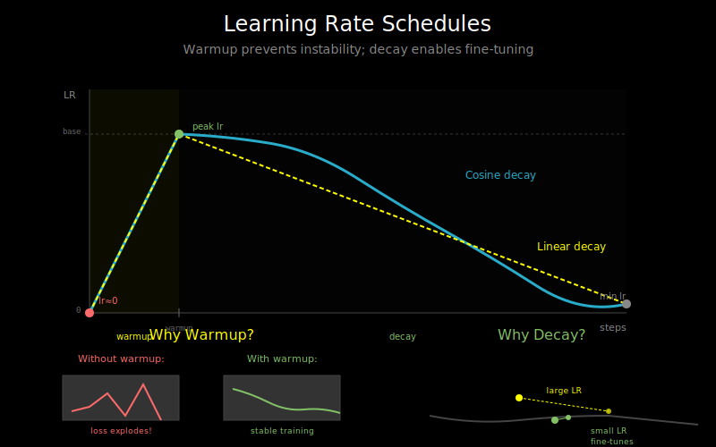

# Learning Rate Schedules: Warmup and Decay Strategies



## Why Schedule the Learning Rate?

A fixed learning rate often isn't optimal throughout training:

- **Early training**: Model is far from optimum, can take larger steps
- **Mid training**: Finding the right valley, moderate steps help
- **Late training**: Fine-tuning near optimum, small steps prevent overshooting

Additionally, transformers have a unique challenge: they're unstable at the start of training with high learning rates.

## The Warmup Problem

Transformers are notoriously sensitive to high learning rates early in training:

```
Without warmup:
Step 0: Random weights, huge gradients, large update
Step 1: Weights wildly changed, even larger gradients
Step 2: NaN (training explodes)
```

**Why?**
- Adam's variance estimate (v) starts at 0
- Early updates are divided by sqrt(very_small_number)
- This causes huge effective learning rates

**Solution**: Start with a tiny learning rate and gradually increase it.

## Linear Warmup

The simplest warmup strategy:

```python
def get_lr_with_warmup(step, warmup_steps, base_lr):
    if step < warmup_steps:
        # Linear increase from 0 to base_lr
        return base_lr * step / warmup_steps
    else:
        return base_lr
```

```
Learning rate over time:
    ^
    |         _______________
    |        /
    |       /
    |      /
    |     /
    |____/__________________ steps
         ^ warmup_steps
```

Typical warmup: 1-5% of total training steps, or 1000-10000 steps.

## Cosine Decay

After warmup, gradually decrease the learning rate following a cosine curve:

```python
import math

def cosine_schedule(step, warmup_steps, total_steps, base_lr, min_lr=0):
    if step < warmup_steps:
        return base_lr * step / warmup_steps

    # Cosine decay from base_lr to min_lr
    progress = (step - warmup_steps) / (total_steps - warmup_steps)
    return min_lr + 0.5 * (base_lr - min_lr) * (1 + math.cos(math.pi * progress))
```

```
Learning rate over time:
    ^
    |     /‾‾‾‾‾‾‾‾\
    |    /          ‾‾‾‾\
    |   /                ‾‾‾‾\
    |  /                      ‾‾‾‾
    |_/______________________________ steps
      warmup        cosine decay
```

**Why cosine?**
- Smooth decay (no sudden jumps)
- Slower decay at start (more time at high LR)
- Faster decay at end (fine-tuning behavior)
- Empirically works well for transformers

## Linear Decay

A simpler alternative to cosine:

```python
def linear_decay(step, warmup_steps, total_steps, base_lr, min_lr=0):
    if step < warmup_steps:
        return base_lr * step / warmup_steps

    progress = (step - warmup_steps) / (total_steps - warmup_steps)
    return base_lr - (base_lr - min_lr) * progress
```

Linear decay is easier to reason about but often slightly underperforms cosine.

## Warmup + Constant + Decay

Some training runs use a three-phase schedule:

```
    ^
    |      _________________
    |     /                 \
    |    /                   \
    |   /                     \
    |__/                       \_____ steps
      warmup   constant    decay
```

This gives the model more time at the peak learning rate.

## Inverse Square Root Decay

Popular for training from scratch (used in original Transformer paper):

```python
def inverse_sqrt_schedule(step, warmup_steps, base_lr):
    if step < warmup_steps:
        return base_lr * step / warmup_steps
    return base_lr * math.sqrt(warmup_steps / step)
```

The decay is gentler than cosine early on, more aggressive later.

## Practical Configurations

**GPT-3 style pretraining**:
```python
# 375M token warmup, cosine decay to 10% of peak
warmup_tokens = 375_000_000
total_tokens = 300_000_000_000
base_lr = 6e-4
min_lr = 6e-5  # 10% of base

scheduler = get_cosine_schedule_with_warmup(
    optimizer,
    num_warmup_steps=warmup_tokens // batch_size,
    num_training_steps=total_tokens // batch_size,
)
```

**BERT-style fine-tuning**:
```python
# Short warmup, linear decay
warmup_ratio = 0.1  # 10% of training
scheduler = get_linear_schedule_with_warmup(
    optimizer,
    num_warmup_steps=int(total_steps * warmup_ratio),
    num_training_steps=total_steps,
)
```

**Quick experiment**:
```python
# Just warmup, constant LR
warmup_steps = 1000
base_lr = 1e-4
```

## Using PyTorch Schedulers

```python
from torch.optim.lr_scheduler import (
    LinearLR,
    CosineAnnealingLR,
    SequentialLR,
)

# Warmup
warmup_scheduler = LinearLR(
    optimizer,
    start_factor=0.01,
    end_factor=1.0,
    total_iters=warmup_steps
)

# Cosine decay
decay_scheduler = CosineAnnealingLR(
    optimizer,
    T_max=total_steps - warmup_steps,
    eta_min=min_lr
)

# Combine them
scheduler = SequentialLR(
    optimizer,
    schedulers=[warmup_scheduler, decay_scheduler],
    milestones=[warmup_steps]
)

# In training loop:
for step, batch in enumerate(dataloader):
    loss = model(batch)
    loss.backward()
    optimizer.step()
    scheduler.step()  # Update LR after each step
    optimizer.zero_grad()
```

## HuggingFace Transformers Schedulers

```python
from transformers import get_scheduler

scheduler = get_scheduler(
    name="cosine",  # or "linear", "constant_with_warmup", etc.
    optimizer=optimizer,
    num_warmup_steps=1000,
    num_training_steps=100000,
)
```

Available schedules:
- `"linear"`: Linear warmup + linear decay
- `"cosine"`: Linear warmup + cosine decay
- `"cosine_with_restarts"`: Cosine with periodic restarts
- `"polynomial"`: Polynomial decay
- `"constant"`: No decay
- `"constant_with_warmup"`: Warmup then constant

## Monitoring Learning Rate

Always log the learning rate during training:

```python
current_lr = scheduler.get_last_lr()[0]
print(f"Step {step}: lr = {current_lr:.2e}, loss = {loss:.4f}")
```

If using wandb:
```python
wandb.log({
    "learning_rate": current_lr,
    "loss": loss,
    "step": step
})
```

## Common Mistakes

**Mistake 1**: Forgetting to call `scheduler.step()`
```python
# Wrong: LR never changes
for batch in dataloader:
    train_step(batch)

# Right: Update LR each step
for batch in dataloader:
    train_step(batch)
    scheduler.step()
```

**Mistake 2**: Calling step() at wrong time
```python
# Wrong: For most schedulers
scheduler.step()  # Before optimizer.step()
optimizer.step()

# Right: After optimizer.step()
optimizer.step()
scheduler.step()
```

**Mistake 3**: Wrong total_steps
```python
# Wrong: Using epochs instead of steps
scheduler = get_scheduler(num_training_steps=num_epochs)

# Right: Convert epochs to steps
total_steps = num_epochs * len(dataloader)
scheduler = get_scheduler(num_training_steps=total_steps)
```

## Choosing Schedule Parameters

**Warmup steps**:
- Minimum: 100-1000 steps
- Rule of thumb: 1-5% of total steps
- More warmup for larger models or larger learning rates

**Peak learning rate**:
- Start with 1e-4, adjust based on loss curves
- If loss explodes: reduce LR or increase warmup
- If loss decreases too slowly: increase LR

**Minimum learning rate**:
- Usually 0 or 10% of peak
- Non-zero min_lr can help late-stage learning

## What's Next

You now have the tools to train transformers: loss functions, gradient understanding, optimizers, and learning rate schedules. Time to put it all together in the labs!

For additional reading and code references, see `05_references.md`.
