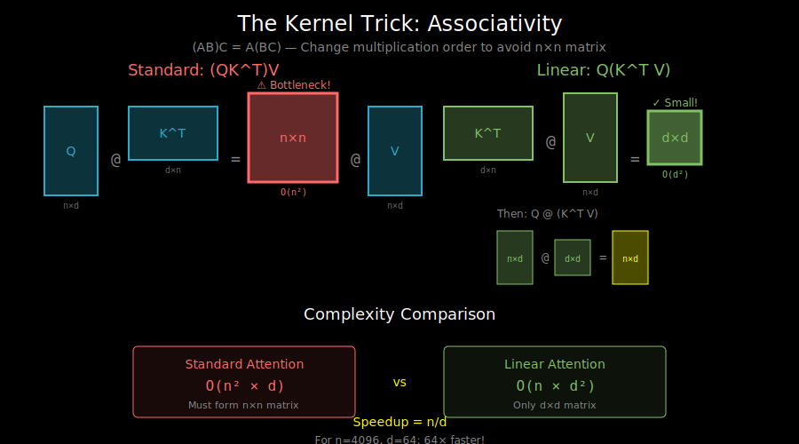

# The Kernel Trick: Math Behind Linearization



## The Core Insight: Associativity

The key to linear attention is a simple algebraic fact: **matrix multiplication is associative**.

```
(AB)C = A(BC)
```

But why does this matter for attention?

## Standard Attention: The Problematic Order

Recall the attention formula (ignoring scaling and softmax for now):

```
Output = (QK^T) V
```

The standard computation order:
1. Compute `QK^T` → shape (n, n) ← **This is the bottleneck!**
2. Multiply by `V` → shape (n, d)

```
       Q          K^T           V
    (n × d)    (d × n)      (n × d)
       \          /            |
        \        /             |
         \      /              |
          (n × n)  ← O(n²)     |
              \               /
               \             /
                \           /
                 (n × d)  ← Output
```

## The Linear Attention Trick: Change the Order

What if we compute `K^T V` first?

```
Output = Q (K^T V)
```

New computation order:
1. Compute `K^T V` → shape (d, d) ← **Only O(d²), independent of n!**
2. Multiply by `Q` → shape (n, d)

```
       K^T         V           Q
    (d × n)    (n × d)     (n × d)
       \          /            |
        \        /             |
         \      /              |
          (d × d)  ← O(d²)     |
              \               /
               \             /
                \           /
                 (n × d)  ← Output
```

**Complexity comparison**:
- Standard: O(n²d)
- Reordered: O(nd²)

Since typically d << n (e.g., d=64, n=4096), this is a massive improvement!

## The Catch: Softmax Breaks Associativity

The real attention formula includes softmax:

```
Output = softmax(QK^T / √d) V
```

Softmax operates **row-wise** on the (n, n) attention matrix. We can't simply reorder because:

```
softmax(QK^T) V ≠ Q · something
```

Softmax is not linear—it involves exp() and division by row sums.

## The Solution: Kernel Feature Maps

Here's where the kernel trick comes in. Instead of:
```
similarity(q, k) = exp(q · k / √d)  # Part of softmax attention
```

We use a **feature map** φ that satisfies:
```
similarity(q, k) = φ(q)^T φ(k)
```

This is called a **kernel function**. The key property: the similarity can be written as a dot product of transformed features.

## Deriving Linear Attention

With a feature map φ, we can rewrite attention:

**Step 1**: Replace softmax similarity with kernel similarity
```
Standard:  Attention[i,j] = exp(q_i · k_j) / Σ_l exp(q_i · k_l)
Kernel:    Attention[i,j] = φ(q_i)^T φ(k_j) / Σ_l φ(q_i)^T φ(k_l)
```

**Step 2**: Factor out φ(q_i)
```
Attention[i,j] = φ(q_i)^T φ(k_j) / φ(q_i)^T (Σ_l φ(k_l))
```

**Step 3**: Compute the output
```
Output[i] = Σ_j Attention[i,j] · v_j

         = Σ_j [φ(q_i)^T φ(k_j) / φ(q_i)^T (Σ_l φ(k_l))] · v_j

         = [φ(q_i)^T (Σ_j φ(k_j) v_j^T)] / [φ(q_i)^T (Σ_l φ(k_l))]
```

**Step 4**: Precompute the sums (this is the magic!)
```
Let KV = Σ_j φ(k_j) v_j^T    # Shape: (d_φ, d_v) - independent of n!
Let Z  = Σ_l φ(k_l)          # Shape: (d_φ,) - independent of n!

Output[i] = (φ(q_i)^T KV) / (φ(q_i)^T Z)
```

## The Final Linear Attention Formula

```python
def linear_attention(Q, K, V, feature_map):
    """
    Q: (n, d)
    K: (n, d)
    V: (n, d_v)
    feature_map: function φ that maps (n, d) → (n, d_φ)
    """
    # Apply feature maps
    Q_prime = feature_map(Q)  # (n, d_φ)
    K_prime = feature_map(K)  # (n, d_φ)

    # Compute KV and Z (both independent of n!)
    KV = K_prime.T @ V        # (d_φ, d_v) - O(n * d_φ * d_v)
    Z = K_prime.sum(dim=0)    # (d_φ,) - O(n * d_φ)

    # Compute output for all queries at once
    numerator = Q_prime @ KV  # (n, d_v) - O(n * d_φ * d_v)
    denominator = Q_prime @ Z # (n,) - O(n * d_φ)

    output = numerator / denominator.unsqueeze(-1)

    return output
```

**Total complexity**: O(n × d_φ × d_v) — **linear in n!**

## Visual Comparison

```
Standard Attention:                Linear Attention:

Q ──┐                             Q' ──┐
    ├─→ QK^T ─→ softmax ─┐            │
K ──┘         (n × n)    │        K' ──┼─→ K'^T V ─→ (d × d)
                         ├─→ Out      │         ↓
V ────────────────────────┘       V ──┘    Q' @ (K'^T V)
                                                ↓
                                              Out
```

## Why This Works: Intuition

Standard attention asks: "For each query, how similar is it to each key?"
- This requires n² comparisons

Linear attention asks: "What's the aggregate representation of all key-value pairs?"
- Compute this once: `Σ φ(k) ⊗ v`
- Each query just retrieves from this aggregate

Think of it like:
- **Standard**: Ask each person individually → O(n) per query → O(n²) total
- **Linear**: Build a summary, let everyone query it → O(1) per query → O(n) total

## The Trade-off

Linear attention is faster but **less expressive**:

1. **No explicit attention matrix**: We never compute which token attends to which
2. **Lower rank**: The implicit attention matrix has rank at most d_φ
3. **Different inductive bias**: May not capture same patterns as softmax attention

This is why the choice of feature map φ matters greatly—covered in the next doc.

## What's Next

The feature map φ is crucial for linear attention quality. Different choices lead to different properties and trade-offs. See `03_feature_maps.md`.
