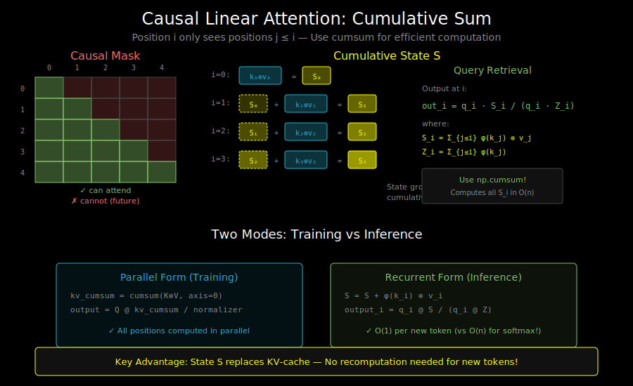

# Causal Linear Attention: Making It Work for Autoregressive Models



## The Causality Constraint

In autoregressive language models, position i can only attend to positions j ≤ i:

```
Standard causal attention:

        Keys/Values
      0   1   2   3   4
    ┌───┬───┬───┬───┬───┐
  0 │ ✓ │   │   │   │   │
Q   ├───┼───┼───┼───┼───┤
u 1 │ ✓ │ ✓ │   │   │   │
e   ├───┼───┼───┼───┼───┤
r 2 │ ✓ │ ✓ │ ✓ │   │   │
i   ├───┼───┼───┼───┼───┤
e 3 │ ✓ │ ✓ │ ✓ │ ✓ │   │
s   ├───┼───┼───┼───┼───┤
  4 │ ✓ │ ✓ │ ✓ │ ✓ │ ✓ │
    └───┴───┴───┴───┴───┘

✓ = can attend    (blank) = cannot attend (future)
```

## The Problem with Naive Linear Attention

Our linear attention formula aggregates **all** key-value pairs:

```python
KV = K_prime.T @ V        # Sums over ALL positions
Z = K_prime.sum(dim=0)    # Sums over ALL positions

output = (Q_prime @ KV) / (Q_prime @ Z)  # Uses global aggregate
```

This violates causality—position 0's output depends on position 4's key/value!

## The Solution: Cumulative Sums

Instead of a single global aggregate, we need a **running aggregate** at each position.

```
For position i:
    KV_i = Σ_{j=0}^{i} φ(k_j) ⊗ v_j    # Only past key-values
    Z_i  = Σ_{j=0}^{i} φ(k_j)           # Only past keys

    output_i = (φ(q_i)^T KV_i) / (φ(q_i)^T Z_i)
```

This is a **cumulative sum** (cumsum)!

## The Cumsum Formulation

```python
def causal_linear_attention(Q, K, V, feature_map):
    """
    Q, K, V: (batch, seq_len, d)
    Returns: (batch, seq_len, d_v)
    """
    Q_prime = feature_map(Q)  # (batch, n, d_φ)
    K_prime = feature_map(K)  # (batch, n, d_φ)

    # Compute outer products: φ(k_i) ⊗ v_i for each position
    # Shape: (batch, n, d_φ, d_v)
    kv = torch.einsum('bnd,bnv->bndv', K_prime, V)

    # Cumulative sum along sequence dimension
    # kv_cumsum[i] = Σ_{j≤i} φ(k_j) ⊗ v_j
    kv_cumsum = torch.cumsum(kv, dim=1)  # (batch, n, d_φ, d_v)

    # Similarly for normalizer
    k_cumsum = torch.cumsum(K_prime, dim=1)  # (batch, n, d_φ)

    # Compute output: φ(q_i)^T @ kv_cumsum[i]
    numerator = torch.einsum('bnd,bndv->bnv', Q_prime, kv_cumsum)
    denominator = torch.einsum('bnd,bnd->bn', Q_prime, k_cumsum)

    output = numerator / (denominator.unsqueeze(-1) + 1e-6)

    return output
```

## Complexity Analysis

**Time complexity**:
- Outer products: O(n × d_φ × d_v)
- Cumulative sums: O(n × d_φ × d_v)
- Final einsum: O(n × d_φ × d_v)

**Total: O(n × d_φ × d_v)** — still linear in n!

**Memory complexity**: O(n × d_φ × d_v) for storing kv_cumsum

## The Recurrent View

The cumsum formulation reveals that causal linear attention is actually an **RNN**!

```python
def causal_linear_attention_recurrent(Q, K, V, feature_map):
    """
    Explicit recurrent formulation
    """
    Q_prime = feature_map(Q)
    K_prime = feature_map(K)

    batch, seq_len, d_phi = Q_prime.shape
    d_v = V.shape[-1]

    # Hidden state: the running KV aggregate
    S = torch.zeros(batch, d_phi, d_v)  # "Memory" state
    Z = torch.zeros(batch, d_phi)       # Normalizer state

    outputs = []
    for i in range(seq_len):
        # Update state with current key-value
        S = S + torch.einsum('bd,bv->bdv', K_prime[:, i], V[:, i])
        Z = Z + K_prime[:, i]

        # Query the state
        numerator = torch.einsum('bd,bdv->bv', Q_prime[:, i], S)
        denominator = torch.einsum('bd,bd->b', Q_prime[:, i], Z)

        output_i = numerator / (denominator.unsqueeze(-1) + 1e-6)
        outputs.append(output_i)

    return torch.stack(outputs, dim=1)
```

## RNN vs Parallel: Two Modes

**Training (Parallel)**:
```
Use cumsum: all positions computed simultaneously
         → Good for GPU parallelization
         → Efficient batch processing
```

**Inference (Recurrent)**:
```
Use RNN: one position at a time, update state
       → O(1) computation per token
       → Perfect for autoregressive generation
```

This duality is a key advantage over standard attention:
- Standard attention: O(n) per new token during generation
- Linear attention: O(1) per new token (just update state and query)

## Visual: State Accumulation

```
Token 0: S = k₀⊗v₀           output₀ = q₀·S / q₀·z₀
              │
              ↓
Token 1: S = k₀⊗v₀ + k₁⊗v₁   output₁ = q₁·S / q₁·z₁
              │
              ↓
Token 2: S = k₀⊗v₀ + k₁⊗v₁ + k₂⊗v₂   output₂ = q₂·S / q₂·z₂
              │
              ↓
             ...

The state S accumulates key-value information over time.
Each query retrieves from this accumulated memory.
```

## The Forgetting Problem

Standard linear attention **never forgets**—all past key-values contribute equally.

```
At position 1000:
S = k₀⊗v₀ + k₁⊗v₁ + ... + k₉₉₉⊗v₉₉₉

Token 0 has equal weight as token 999!
```

This is problematic because:
1. **Recency matters**: Recent context is usually more relevant
2. **Memory saturation**: State gets "crowded" with information
3. **Limited expressiveness**: Can't model position-dependent relevance

Solutions (covered in Chapter 6):
- **Gating**: Learnable forgetting (GLA, DeltaNet)
- **Decay**: Exponential decay of old information
- **Chunking**: Reset state at chunk boundaries

## Numerical Stability

The denominator can become very small or very large:

```python
# Unstable
output = numerator / denominator

# Stable
output = numerator / (denominator + eps)

# Even more stable: log-space computation
log_num = log(numerator)
log_den = log(denominator)
output = exp(log_num - log_den)
```

## Implementation Tips

**1. Use einsum for clarity**:
```python
# Clear what dimensions are being contracted
torch.einsum('bnd,bnv->bndv', K_prime, V)
```

**2. Mind the memory**:
```python
# kv tensor is (batch, seq, d_phi, d_v)
# For d_phi=64, d_v=64, seq=4096, batch=32:
# That's 32 × 4096 × 64 × 64 × 4 bytes = 2.1 GB!

# Consider chunking for long sequences
```

**3. Use in-place cumsum if memory-tight**:
```python
kv_cumsum = kv.cumsum_(dim=1)  # In-place
```

## Comparison: Standard vs Linear Causal Attention

| Aspect | Standard Causal | Linear Causal |
|--------|-----------------|---------------|
| Training | O(n²d) | O(nd²) |
| Generation (per token) | O(nd) | O(d²) |
| KV Cache | O(nd) | O(d²) |
| Expressiveness | Full attention matrix | Low-rank approximation |
| Memory | O(n²) or O(n) with Flash | O(nd²) |

## What's Next

You now understand the core of linear attention! Time to implement it in the labs:

1. **Lab 01**: Benchmark standard attention to see the O(n²) wall
2. **Lab 02**: Implement the kernel trick (non-causal first)
3. **Lab 03**: Try different feature maps
4. **Lab 04**: Build causal linear attention with cumsum

See `05_references.md` for papers and code references.
