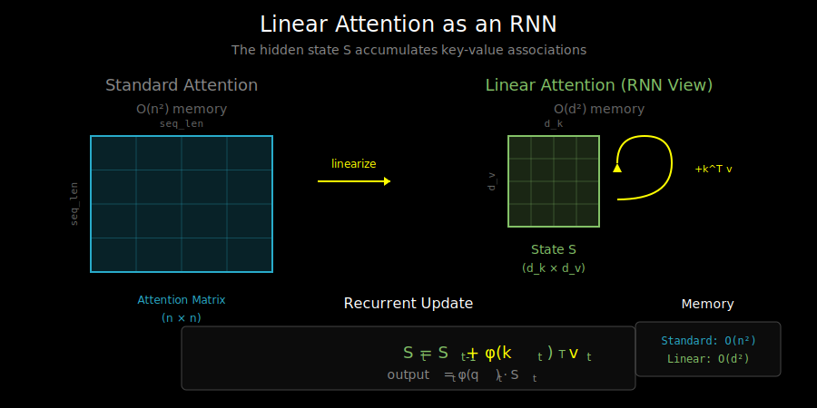

# Linear Attention as an RNN: The Recurrent Interpretation

## Recap: Linear Attention

In Chapter 5, we learned that linear attention removes the softmax, replacing it with a feature map:

```
Standard:  Attention(Q, K, V) = softmax(QK^T) V
Linear:    LinearAttn(Q, K, V) = φ(Q)(φ(K)^T V)
```

The key insight was associativity: instead of computing the n×n attention matrix, we compute K^T V first (a d×d matrix), then multiply by Q.

But there's an even deeper insight: **linear attention can be computed as an RNN**.

## The Hidden State Emerges

Let's look at linear attention for a single query position i:

```
output_i = φ(q_i) @ (Σ_{j≤i} φ(k_j)^T v_j)
                    └─────────────────────┘
                         This is cumulative!
```

For causal (autoregressive) attention, position i only attends to positions 1 through i. That sum can be computed incrementally:

```
S_i = S_{i-1} + φ(k_i)^T v_i
output_i = φ(q_i) @ S_i
```

**S_i is a hidden state!** It accumulates information from all previous tokens.

## The RNN View

This gives us an RNN formulation:

```
┌─────────────────────────────────────────────┐
│           Linear Attention as RNN            │
├─────────────────────────────────────────────┤
│                                              │
│  Input: (k_i, v_i, q_i) at each timestep    │
│                                              │
│  Hidden state update:                        │
│      S_i = S_{i-1} + φ(k_i)^T @ v_i         │
│           └─────┘   └──────────────┘        │
│           previous    outer product          │
│           state       (rank-1 update)        │
│                                              │
│  Output:                                     │
│      o_i = φ(q_i) @ S_i                     │
│                                              │
└─────────────────────────────────────────────┘
```

Compare to a standard RNN:
```
RNN:              h_t = f(h_{t-1}, x_t)
Linear Attention: S_t = S_{t-1} + φ(k_t)^T v_t
```

The "recurrence" is just addition - no nonlinearity, no gating (yet).

## Why This Matters

### 1. O(1) Inference Per Token

For autoregressive generation (like in LLMs):

| Method | Per-token cost | Memory for past |
|--------|---------------|-----------------|
| Standard attention | O(n × d) | O(n × d) KV-cache |
| Linear attention | O(d²) | O(d²) state matrix |

With linear attention, generating token 1000 costs the same as generating token 10!



### 2. Constant Memory

The hidden state S has shape (d_k, d_v) - independent of sequence length:

```python
# Standard attention: KV-cache grows with sequence
kv_cache_memory = seq_len * num_layers * 2 * d_model  # Grows!

# Linear attention: state is fixed size
state_memory = num_layers * d_k * d_v  # Constant!
```

For d_k = d_v = 64 and 32 layers:
- KV-cache at 4096 tokens: ~17 MB (grows linearly)
- Linear attention state: ~0.5 MB (constant)

### 3. The Trade-off: Expressiveness

The RNN view reveals linear attention's limitation: **information is compressed into a fixed-size state**.

Standard attention can retrieve any previous token's exact value. Linear attention must compress all history into S, potentially losing information.

## Implementation: Parallel vs Recurrent

The same computation can be done two ways:

### Parallel Form (for training)

```python
def linear_attention_parallel(Q, K, V, feature_map):
    """
    Q, K, V: (batch, seq_len, d)
    Returns: (batch, seq_len, d)
    """
    Q = feature_map(Q)  # (batch, seq_len, d_k)
    K = feature_map(K)  # (batch, seq_len, d_k)

    # Cumulative sum of K^T @ V
    KV = torch.einsum('bnd,bnv->bndv', K, V)  # (batch, seq_len, d_k, d_v)
    S = torch.cumsum(KV, dim=1)  # Cumulative sum along seq dimension

    # Query the accumulated state
    output = torch.einsum('bnd,bndv->bnv', Q, S)

    return output
```

### Recurrent Form (for inference)

```python
def linear_attention_recurrent(Q, K, V, feature_map, state=None):
    """
    Single-step inference.
    Q, K, V: (batch, 1, d) - single token
    state: (batch, d_k, d_v) - accumulated state
    """
    Q = feature_map(Q)  # (batch, 1, d_k)
    K = feature_map(K)  # (batch, 1, d_k)

    # Initialize state if needed
    if state is None:
        state = torch.zeros(Q.shape[0], Q.shape[-1], V.shape[-1])

    # Update state: S = S + k^T @ v
    state = state + torch.einsum('bnd,bnv->bdv', K, V)

    # Query: output = q @ S
    output = torch.einsum('bnd,bdv->bnv', Q, state)

    return output, state
```

## Visualizing the State Matrix

The state S is a d_k × d_v matrix. What does it represent?

```
S = Σ φ(k_i)^T @ v_i

  = [φ(k_1)]^T [v_1] + [φ(k_2)]^T [v_2] + ...
    └──────┘   └───┘
     d_k×1     1×d_v

  = sum of rank-1 outer products
```

Each position contributes a rank-1 "memory" to the state:
- φ(k) determines *how* this value is stored (the "address")
- v is *what* is stored (the "content")
- φ(q) determines *how* to retrieve (the "query")

```
                    State Matrix S
                  ┌─────────────────┐
                  │  accumulated    │
    φ(q) ──────>  │  key-value     │ ──────> output
    (query)       │  associations   │         (retrieved)
                  └─────────────────┘
                        ↑
                  φ(k)^T @ v
                  (new memory)
```

## The Memory Capacity Problem

A d_k × d_v matrix can store at most rank = min(d_k, d_v) independent patterns perfectly.

With d_k = d_v = 64, we can store ~64 independent key-value pairs without interference.

For sequences with hundreds or thousands of tokens, **information must be compressed or overwritten**.

This is both a limitation and a feature:
- **Limitation**: Can't perfectly recall arbitrary distant tokens
- **Feature**: Forces the model to learn compressed representations

## Comparison: Linear Attention vs Standard RNNs

| Aspect | Linear Attention | Standard RNN (LSTM/GRU) |
|--------|-----------------|------------------------|
| State shape | (d_k, d_v) matrix | (d_hidden) vector |
| State update | Additive (S + kv^T) | Gated, nonlinear |
| Memory capacity | ~min(d_k, d_v) patterns | Fixed by architecture |
| Gradient flow | Direct through addition | Through gates (vanishing gradient risk) |
| Parallelizable | Yes (cumsum) | No (sequential) |

## What's Next

The pure additive update S = S + k^T v has no forgetting mechanism. Information accumulates forever, which can cause issues:

1. State magnitude grows unboundedly
2. Old information is never forgotten
3. Limited capacity causes interference

In `04_gated_linear_attention.md`, we'll see how **gating mechanisms** solve these problems by adding data-dependent forgetting.

But first, we need to understand how to train these models efficiently. The recurrent form is O(n) but sequential, while we want parallel training. See `02_chunkwise_parallel.md` for the solution.
