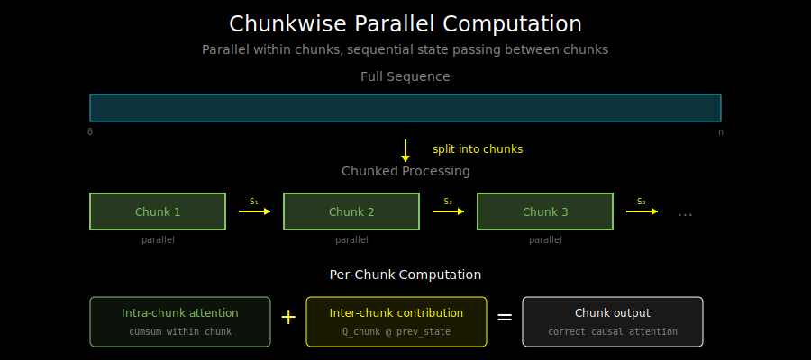

# Chunkwise Parallel: Best of Both Worlds

## The Training vs Inference Dilemma

Linear attention gives us two computation modes:

| Mode | Complexity | Parallelism | Use Case |
|------|-----------|-------------|----------|
| **Parallel** | O(n²d) time, O(n²) memory | Fully parallel | - |
| **Recurrent** | O(nd²) time, O(d²) memory | Sequential | Inference |

Wait - the parallel form still has O(n²) memory? Yes! The cumulative sum approach:

```python
KV = torch.einsum('bnd,bnv->bndv', K, V)  # (batch, n, d_k, d_v)
S = torch.cumsum(KV, dim=1)  # Still O(n × d_k × d_v) memory
```

For training with long sequences, this blows up memory. And the recurrent form is O(nd²) but **sequential** - we can't parallelize across the sequence.

## The Solution: Chunking

**Key insight**: We can split the sequence into chunks, process each chunk in parallel (parallel mode), and propagate state between chunks (recurrent mode).

```
Sequence:   [───────────────────────────────────────────]
                              ↓
Chunks:     [──chunk 1──] [──chunk 2──] [──chunk 3──] [──chunk 4──]
                 ↓             ↓             ↓             ↓
            parallel      parallel      parallel      parallel
            within        within        within        within
                 └──state──→└──state──→└──state──→
                    propagation between chunks
```

Within each chunk: parallel attention (GPU-friendly)
Between chunks: state passing (sequential, but only O(n/C) steps)



## The Math

Let's formalize. For causal linear attention at position i:

```
output_i = φ(q_i) @ S_i
where S_i = Σ_{j≤i} φ(k_j)^T v_j
```

Now split positions into chunks of size C:
- Chunk 0: positions [0, C)
- Chunk 1: positions [C, 2C)
- Chunk c: positions [cC, (c+1)C)

### Within-Chunk Computation

For position i in chunk c, we need:

```
S_i = (Σ_{j<cC} φ(k_j)^T v_j) + (Σ_{cC≤j≤i} φ(k_j)^T v_j)
      └─────────────────────┘   └─────────────────────────┘
         "inter-chunk" state     "intra-chunk" contribution
            (from previous)         (within this chunk)
```

Let S_c^{start} = Σ_{j<cC} φ(k_j)^T v_j (state at chunk start).

Then for positions in chunk c:
```
output_i = φ(q_i) @ S_c^{start} + φ(q_i) @ (Σ_{cC≤j≤i} φ(k_j)^T v_j)
           └─────────────────────┘   └──────────────────────────────┘
           inter-chunk term          intra-chunk term (parallel)
```

### The Algorithm

```
┌─────────────────────────────────────────────────────────────────┐
│                   Chunkwise Linear Attention                     │
├─────────────────────────────────────────────────────────────────┤
│                                                                  │
│  Input: Q, K, V of shape (batch, seq_len, d)                    │
│  Chunk size: C                                                   │
│                                                                  │
│  1. Split into chunks of size C                                 │
│     Q_chunks, K_chunks, V_chunks: (batch, num_chunks, C, d)     │
│                                                                  │
│  2. For each chunk c (can be parallelized within chunk):        │
│                                                                  │
│     a. Intra-chunk: standard causal linear attention            │
│        - Compute cumsum within chunk                            │
│        - O(C² × d) per chunk, parallelizable                    │
│                                                                  │
│     b. Inter-chunk: add contribution from previous state        │
│        - output += Q_chunk @ S_c^{start}                        │
│                                                                  │
│     c. Update state for next chunk:                             │
│        - S_{c+1}^{start} = S_c^{start} + Σ (K_chunk^T @ V_chunk)│
│                                                                  │
│  3. Concatenate chunk outputs                                   │
│                                                                  │
└─────────────────────────────────────────────────────────────────┘
```

## Complexity Analysis

For sequence length n and chunk size C:

| Component | Time | Memory |
|-----------|------|--------|
| Intra-chunk attention | O(n/C × C² × d) = O(nCd) | O(C² + d²) |
| Inter-chunk matmul | O(n/C × C × d²) = O(nd²) | O(d²) |
| State propagation | O(n/C × d²) | O(d²) |
| **Total** | O(nCd + nd²) | O(C² + d²) |

**The sweet spot**: Choose C ≈ √(d) for balance.

For d = 64, C = 8:
- Memory: O(64 + 4096) ≈ O(d²) - constant in sequence length!
- Time: O(n × 8 × 64 + n × 4096) = O(nd²) - linear in sequence length!

## Implementation

```python
def chunkwise_linear_attention(Q, K, V, feature_map, chunk_size=64):
    """
    Chunkwise parallel linear attention.

    Q, K, V: (batch, seq_len, d)
    Returns: (batch, seq_len, d)
    """
    batch, seq_len, d = Q.shape
    num_chunks = (seq_len + chunk_size - 1) // chunk_size

    # Apply feature map
    Q = feature_map(Q)
    K = feature_map(K)

    # Pad to multiple of chunk_size
    pad_len = num_chunks * chunk_size - seq_len
    if pad_len > 0:
        Q = F.pad(Q, (0, 0, 0, pad_len))
        K = F.pad(K, (0, 0, 0, pad_len))
        V = F.pad(V, (0, 0, 0, pad_len))

    # Reshape into chunks: (batch, num_chunks, chunk_size, d)
    Q = Q.view(batch, num_chunks, chunk_size, -1)
    K = K.view(batch, num_chunks, chunk_size, -1)
    V = V.view(batch, num_chunks, chunk_size, -1)

    outputs = []
    state = torch.zeros(batch, Q.shape[-1], V.shape[-1], device=Q.device)

    for c in range(num_chunks):
        Q_c, K_c, V_c = Q[:, c], K[:, c], V[:, c]

        # Intra-chunk: causal linear attention within chunk
        # KV: (batch, chunk_size, d_k, d_v)
        KV_c = torch.einsum('bcd,bcv->bcdv', K_c, V_c)
        # Cumulative sum for causal attention
        S_intra = torch.cumsum(KV_c, dim=1)  # (batch, chunk_size, d_k, d_v)
        intra_out = torch.einsum('bcd,bcdv->bcv', Q_c, S_intra)

        # Inter-chunk: contribution from previous chunks
        inter_out = torch.einsum('bcd,bdv->bcv', Q_c, state)

        # Combined output
        chunk_out = intra_out + inter_out
        outputs.append(chunk_out)

        # Update state for next chunk
        state = state + KV_c.sum(dim=1)  # Sum over positions in chunk

    # Concatenate and remove padding
    output = torch.cat(outputs, dim=1)
    output = output[:, :seq_len, :]

    return output
```

## Why Chunking Matters for GPUs

GPUs excel at parallel computation but have limited memory bandwidth. Chunking exploits this:

```
GPU Memory Hierarchy:
┌───────────────────────────────────────────┐
│              DRAM (HBM)                   │ ← Large, slow
│          ~80 GB, ~2 TB/s                  │
├───────────────────────────────────────────┤
│           L2 Cache                        │ ← Medium
│          ~40 MB, ~4 TB/s                  │
├───────────────────────────────────────────┤
│      SRAM (Shared Memory)                 │ ← Small, fast
│      ~128 KB/SM, ~19 TB/s                 │
└───────────────────────────────────────────┘
```

**Without chunking**: Full attention matrix in HBM - slow memory access dominates

**With chunking**:
- Chunk fits in SRAM
- Intra-chunk computation at SRAM speeds
- Only state transfer goes through HBM

## Choosing Chunk Size

Trade-offs:

| Chunk Size | Pros | Cons |
|------------|------|------|
| **Small (8-16)** | Low memory | More state transfers |
| **Medium (64-128)** | Balanced | Good default |
| **Large (256+)** | Fewer transfers | Memory pressure |

Optimal chunk size depends on:
- Hardware (SRAM size)
- Head dimension d
- Sequence length n

Rule of thumb: **C = 64** works well for most cases.

## Bidirectional Extension

For encoder models (non-causal), we need both forward and backward attention.

```python
def bidirectional_chunkwise(Q, K, V, chunk_size):
    # Forward pass (causal)
    out_forward, states_forward = forward_chunks(Q, K, V, chunk_size)

    # Backward pass (reverse causal)
    Q_rev = torch.flip(Q, [1])
    K_rev = torch.flip(K, [1])
    V_rev = torch.flip(V, [1])
    out_backward, _ = forward_chunks(Q_rev, K_rev, V_rev, chunk_size)
    out_backward = torch.flip(out_backward, [1])

    # Combine (e.g., sum or concat)
    return out_forward + out_backward
```

## What's Next

Chunkwise computation is the foundation for Flash Linear Attention, which adds:
1. Fused kernels (no materialization of intermediate tensors)
2. Memory-efficient backward pass
3. Hardware-aware block sizes

See `03_flash_linear_attention.md` for the complete algorithm.
