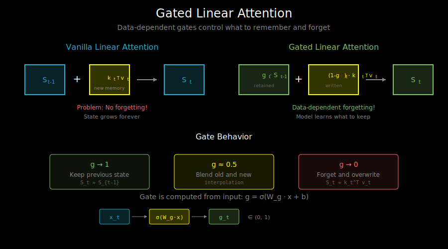

# Gated Linear Attention: GLA, DeltaNet, and the Kimi Line

## The Problem with Vanilla Linear Attention

Recall the RNN view of linear attention:

```
S_t = S_{t-1} + φ(k_t)^T v_t
```

This additive update has two critical issues:

### Issue 1: No Forgetting

Every key-value pair is added to the state **forever**. The model can never:
- "Forget" outdated information
- Prioritize recent context over ancient history
- Handle conflicting or redundant information

### Issue 2: Unbounded State Growth

The state magnitude grows without bound:
```
||S_t|| ≈ √t × ||φ(k)^T v||  (grows with √t)
```

This causes numerical instability and makes normalization critical.

## The Gating Solution

LSTMs solved similar problems with **gates** - learnable functions that control information flow. The same idea applies to linear attention.

### General Form: Gated Linear Attention

```
S_t = G_t ⊙ S_{t-1} + φ(k_t)^T v_t
      └──────────┘   └────────────┘
      gated forget    new memory
```

Where G_t ∈ (0, 1)^{d×d} is a **forget gate** that determines how much of the previous state to retain.

Different choices of G_t lead to different architectures.



## Architecture 1: Scalar Gating (RetNet-style)

The simplest gating: a single scalar γ for all dimensions.

```
S_t = γ · S_{t-1} + φ(k_t)^T v_t
```

Where γ ∈ (0, 1) is a learned or fixed decay factor.

**Pros**: Simple, stable, easy to implement
**Cons**: Same decay for all information, not data-dependent

### RetNet's Multi-Scale Decay

RetNet uses different γ per head, creating a "multi-scale" memory:

```python
# Different heads have different decay rates
gammas = [0.9, 0.95, 0.99, 0.995, ...]  # Geometric progression

# Head with γ=0.9: fast forgetting, captures local patterns
# Head with γ=0.995: slow forgetting, captures long-range patterns
```

## Architecture 2: Data-Dependent Gating (GLA)

Gated Linear Attention (GLA) uses **data-dependent** gates:

```
G_t = σ(W_g · x_t + b_g)  # Gate computed from input
S_t = G_t ⊙ S_{t-1} + φ(k_t)^T v_t ⊙ (1 - G_t)
```

The gate decides **per-element** what to forget and what to write.

### GLA Architecture

```
┌─────────────────────────────────────────────────────────────────┐
│                    Gated Linear Attention (GLA)                  │
├─────────────────────────────────────────────────────────────────┤
│                                                                  │
│  Input x_t ────┬──────────────┬──────────────┬──────────────┐   │
│                ↓              ↓              ↓              ↓   │
│            W_q(x)         W_k(x)         W_v(x)         W_g(x)  │
│                ↓              ↓              ↓              ↓   │
│              q_t            k_t            v_t      g_t=σ(...)  │
│                              │              │              │    │
│                              └──────┬───────┘              │    │
│                                     ↓                      │    │
│                              k_t^T @ v_t                   │    │
│                                     │                      │    │
│     ┌───────────────────────────────┼──────────────────────┘    │
│     │                               │                           │
│     │    S_{t-1} ──→ [g_t ⊙ S + (1-g_t) ⊙ kv] ──→ S_t         │
│     │                               │                           │
│     └───────────────────────────────┘                           │
│                                     ↓                           │
│               q_t ──→ [q_t @ S_t] ──→ o_t                      │
│                                                                  │
└─────────────────────────────────────────────────────────────────┘
```

### GLA Implementation

```python
class GatedLinearAttention(nn.Module):
    def __init__(self, d_model, num_heads):
        super().__init__()
        self.d_head = d_model // num_heads
        self.num_heads = num_heads

        self.W_q = nn.Linear(d_model, d_model)
        self.W_k = nn.Linear(d_model, d_model)
        self.W_v = nn.Linear(d_model, d_model)
        self.W_g = nn.Linear(d_model, d_model)  # Gate projection
        self.W_o = nn.Linear(d_model, d_model)

    def forward(self, x, state=None):
        batch, seq_len, _ = x.shape

        q = self.W_q(x).view(batch, seq_len, self.num_heads, self.d_head)
        k = self.W_k(x).view(batch, seq_len, self.num_heads, self.d_head)
        v = self.W_v(x).view(batch, seq_len, self.num_heads, self.d_head)

        # Data-dependent gate
        g = torch.sigmoid(self.W_g(x))
        g = g.view(batch, seq_len, self.num_heads, self.d_head)

        # Apply feature map (e.g., identity, elu+1, swish)
        q = F.silu(q)  # swish activation
        k = F.silu(k)

        if state is None:
            state = torch.zeros(batch, self.num_heads, self.d_head, self.d_head)

        outputs = []
        for t in range(seq_len):
            # Gated state update
            kv = torch.einsum('bhd,bhv->bhdv', k[:, t], v[:, t])
            state = g[:, t, :, :, None] * state + (1 - g[:, t, :, :, None]) * kv

            # Query output
            out = torch.einsum('bhd,bhdv->bhv', q[:, t], state)
            outputs.append(out)

        output = torch.stack(outputs, dim=1)
        output = output.view(batch, seq_len, -1)
        return self.W_o(output), state
```

## Architecture 3: DeltaNet (Delta Rule)

DeltaNet uses the **delta rule** from Hopfield networks:

```
S_t = S_{t-1} + φ(k_t)^T (v_t - S_{t-1}^T φ(k_t))
                          └──────────────────────┘
                             error correction
```

This is equivalent to:
```
S_t = S_{t-1} - φ(k_t)^T (φ(k_t)^T S_{t-1}) + φ(k_t)^T v_t
      └───────────────────────────────────┘   └───────────┘
            remove old value at this key      write new value
```

### The Intuition

DeltaNet implements **associative memory update**:
1. **Query** the current state with key k: `retrieved = S^T @ φ(k)`
2. **Compute error**: `error = v - retrieved`
3. **Update**: Add correction term to reduce error

This is like a content-addressable memory that **overwrites** instead of **accumulates**.

### DeltaNet vs GLA

| Aspect | GLA | DeltaNet |
|--------|-----|----------|
| Forgetting | Explicit gate | Implicit via delta rule |
| Update | Interpolation | Error correction |
| Capacity | Gate-limited | Key-collision limited |
| Training | Straightforward | Requires careful init |

## The Kimi/Moonshot Line of Work

Moonshot AI (creators of Kimi) have developed several important variants:

### 1. GLA (Yang et al., 2023)

Original Gated Linear Attention with:
- Data-dependent gating
- Hardware-efficient training
- Strong language modeling results

### 2. DeltaNet (Yang et al., 2024)

Delta rule formulation with:
- Better memory utilization
- Competitive with transformers on many tasks

### 3. HGRN2 (Qin et al., 2024)

Hierarchical Gated Recurrent Network:
- Multi-scale state representations
- Combines GLA ideas with hierarchical structure

## Training Efficiency: Flash GLA

The gating mechanism complicates efficient training because gate values are position-dependent. However, we can still use chunkwise computation:

```
Within chunk: parallel attention with position-dependent gates
Between chunks: gated state propagation
```

The `fla` library provides fused kernels:

```python
from fla.ops.gla import fused_chunk_gla

output, final_state = fused_chunk_gla(
    q=queries,
    k=keys,
    v=values,
    g=gates,  # (batch, seq_len, num_heads, d_head)
    initial_state=None,
    output_final_state=True
)
```

## Comparison: Different Linear Attention Variants

| Model | Gating | State Update | Key Innovation |
|-------|--------|--------------|----------------|
| Linear Attention | None | S + k^T v | O(n) complexity |
| RetNet | Scalar γ | γS + k^T v | Multi-scale decay |
| GLA | Data-dep g | gS + (1-g)k^T v | Learned forgetting |
| DeltaNet | Implicit | S + k^T(v - S^T k) | Error correction |
| RWKV | Channel-wise | Complex | RNN-like efficiency |

## Practical Considerations

### Initialization

Gated models are sensitive to initialization:
```python
# Gate bias toward "remember" (high g)
nn.init.constant_(W_g.bias, 2.0)  # sigmoid(2) ≈ 0.88

# Small key/value init for stable start
nn.init.normal_(W_k.weight, std=0.02)
nn.init.normal_(W_v.weight, std=0.02)
```

### Normalization

State magnitude can still grow with gating. Common fixes:
- Group normalization on queries/keys
- State normalization: `S = S / ||S||`
- Per-head LayerNorm on output

### Chunk Size for Training

Gated models often need larger chunks than vanilla linear attention:
```python
# Vanilla linear attention
chunk_size = 64

# GLA/DeltaNet (more complex state dynamics)
chunk_size = 128  # or 256
```

## What's Next

We've seen that gated linear attention is fundamentally an RNN. But there's another perspective: **state-space models (SSMs)**.

In `05_state_space_connection.md`, we'll explore how linear attention, GLA, and models like Mamba are all connected through state-space theory.
