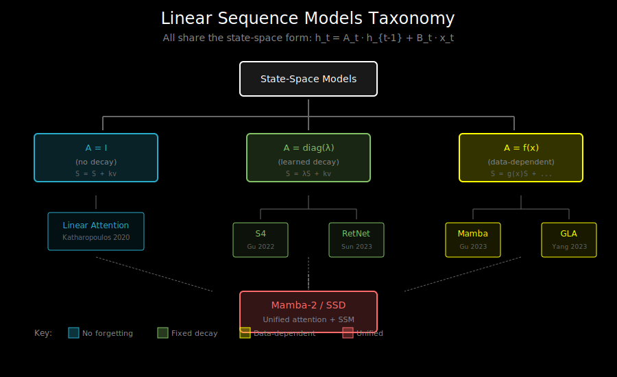

# State-Space Connection: Linear Attention, Mamba, and S4

## A Unified View

Linear attention, Mamba, S4, and other efficient sequence models are more similar than they appear. They all share a common mathematical structure: **linear state-space models (SSMs)**.

Understanding this connection helps you:
1. See the design space of efficient sequence models
2. Understand why certain design choices matter
3. Transfer intuitions between different architectures



## State-Space Models: The Framework

A linear state-space model has the form:

```
State evolution:   h_t = A h_{t-1} + B x_t
Output:            y_t = C h_t + D x_t
```

Where:
- h_t ∈ ℝ^N is the hidden state
- x_t ∈ ℝ is the input (or ℝ^d for multi-dimensional)
- y_t ∈ ℝ is the output
- A, B, C, D are learnable parameters

This is **linear** in the state (hence "linear state-space").

## Linear Attention as an SSM

Recall linear attention's RNN form:

```
S_t = S_{t-1} + φ(k_t)^T v_t
o_t = φ(q_t) @ S_t
```

Rewriting with state-space notation:
- State h_t = vec(S_t) ∈ ℝ^{d_k × d_v} (flattened state matrix)
- A = I (identity - no decay)
- B depends on k_t, v_t: B x_t = vec(φ(k_t)^T v_t)
- C depends on q_t: C h_t = φ(q_t) @ unvec(h_t)

**Key observation**: In linear attention, A = I (identity), meaning no forgetting.

## S4: Structured State-Space Model

S4 (Gu et al., 2022) uses a specific structure for A:

```
A = diag(λ_1, λ_2, ..., λ_N)   (diagonal, complex)
```

Each λ_i controls decay of that state dimension:
- |λ_i| < 1: decaying memory
- |λ_i| close to 1: long-term memory
- arg(λ_i): oscillation frequency

### The HiPPO Connection

S4 initializes A using **HiPPO** (High-order Polynomial Projection Operators):

```
A is initialized to optimally compress history into state
```

This gives S4 strong inductive bias for long-range dependencies.

### S4 Equations

```
h_t = A h_{t-1} + B x_t    (diagonal A → elementwise)
y_t = Real(C h_t)          (real output from complex state)
```

Where:
- h_t ∈ ℂ^N (complex state)
- A ∈ ℂ^{N×N} is diagonal
- B ∈ ℂ^{N×1}, C ∈ ℂ^{1×N}

## Mamba: Selective State-Space

Mamba (Gu & Dao, 2023) introduces **input-dependent** parameters:

```
h_t = A_t h_{t-1} + B_t x_t
y_t = C_t h_t
```

Where A_t, B_t, C_t depend on the input x_t. This is the key innovation:
- **Data-dependent decay**: Model can choose what to remember/forget
- **Content-based gating**: Similar idea to attention

### Mamba's Selective Mechanism

```python
# Mamba's selection mechanism
def selective_scan(x, delta, A, B, C, D):
    """
    x: input (batch, seq_len, d)
    delta: time step (batch, seq_len, d) - input dependent!
    A: state matrix (d, state_size)
    B: input matrix (batch, seq_len, state_size)
    C: output matrix (batch, seq_len, state_size)
    """
    # Discretize A using delta (input-dependent!)
    deltaA = torch.exp(delta.unsqueeze(-1) * A)  # (batch, seq, d, state)
    deltaB = delta.unsqueeze(-1) * B.unsqueeze(2)  # (batch, seq, d, state)

    # Selective scan
    h = torch.zeros(batch, d, state_size)
    outputs = []
    for t in range(seq_len):
        h = deltaA[:, t] * h + deltaB[:, t] * x[:, t, :, None]
        y = (h * C[:, t].unsqueeze(1)).sum(-1)
        outputs.append(y)

    return torch.stack(outputs, dim=1)
```

## The Unifying Diagram

```
┌─────────────────────────────────────────────────────────────────┐
│                 Linear Sequence Models Taxonomy                  │
├─────────────────────────────────────────────────────────────────┤
│                                                                  │
│                    State-Space Models                            │
│                    h_t = A_t h_{t-1} + B_t x_t                  │
│                           │                                      │
│           ┌───────────────┼───────────────┐                     │
│           │               │               │                     │
│           ▼               ▼               ▼                     │
│       A = I           A = diag        A = f(x)                  │
│       (no decay)      (learned)       (selective)               │
│           │               │               │                     │
│           ▼               ▼               ▼                     │
│    ┌──────────┐    ┌──────────┐    ┌──────────┐                │
│    │  Linear  │    │   S4     │    │  Mamba   │                │
│    │ Attention│    │   DSS    │    │  Mamba-2 │                │
│    └──────────┘    │   S5     │    └──────────┘                │
│         │          └──────────┘          │                      │
│         │                                │                      │
│         └────────────┬───────────────────┘                      │
│                      │                                          │
│                      ▼                                          │
│              ┌──────────────┐                                   │
│              │     GLA      │  (Linear attn + selective gate)  │
│              │   DeltaNet   │                                   │
│              │    RWKV      │                                   │
│              └──────────────┘                                   │
│                                                                  │
└─────────────────────────────────────────────────────────────────┘
```

## Mamba-2: The Explicit Connection

Mamba-2 (Dao & Gu, 2024) explicitly connects SSMs and attention:

**Key insight**: Mamba-2's selective SSM is equivalent to a form of linear attention with:
- Structured state expansion
- Data-dependent decay

```
Mamba-2 ≈ Linear Attention with structured, selective gating
```

This enables:
1. Using attention-style efficient training (chunked parallel)
2. Better hardware utilization through tensor cores
3. Theoretical unification of the two approaches

## Comparison Table

| Model | State Size | A Matrix | B, C | Parallel Training |
|-------|-----------|----------|------|-------------------|
| Linear Attn | d² | Identity | Data-dep | Cumsum |
| RetNet | d² | Scalar decay | Data-dep | Chunked |
| S4 | N × d | Diagonal (fixed) | Learned | Convolution |
| Mamba | N × d | Diagonal (selective) | Selective | Selective scan |
| Mamba-2 | d² | Structured selective | Selective | Chunked (SSD) |
| GLA | d² | Data-dep diag | Data-dep | Chunked |

## Computational Patterns

Different perspectives enable different efficient algorithms:

### 1. RNN View (Recurrent)
```
For t = 1 to n:
    h_t = A h_{t-1} + B x_t
    y_t = C h_t
```
- O(n × state_size) time
- Sequential
- Best for: inference, streaming

### 2. Convolution View
For time-invariant SSMs (fixed A, B, C), the output is a convolution:
```
y = K * x  where K is the "SSM kernel"
K_t = C A^t B
```
- O(n log n) time via FFT
- Fully parallel
- Best for: training S4-style models

### 3. Chunked Parallel View
```
For chunk c:
    Process chunk in parallel
    Propagate state to next chunk
```
- O(n × chunk_size) time
- Parallelism within chunks
- Best for: training Mamba, GLA

## Why This Matters for Practitioners

### Choosing an Architecture

| Need | Best Choice |
|------|-------------|
| Very long sequences (10K+) | Mamba, S4 |
| Strong local patterns | GLA, Linear Attention |
| Hardware efficiency | Mamba-2, GLA |
| Simplicity | Linear Attention, RetNet |
| Proven at scale | Mamba, Transformers |

### When SSMs Beat Attention

SSMs excel when:
1. Sequences are very long (memory scales with state, not sequence)
2. Streaming inference is needed (constant memory)
3. Training memory is limited

### When Attention Wins

Transformers still win when:
1. In-context learning is critical (attention excels at retrieval)
2. Sequence lengths are moderate (< 4K)
3. You need maximum expressiveness

## The Future: Hybrid Architectures

State-of-the-art models increasingly combine both:

```
Layer 1: Attention (for retrieval/in-context)
Layer 2: SSM (for efficiency)
Layer 3: Attention
Layer 4: SSM
...
```

Examples:
- **Jamba** (AI21): Transformer + Mamba hybrid
- **Griffin** (Google): Local attention + recurrence
- **StripedHyena**: Alternating layers

## What's Next

You now understand the theoretical foundations:
1. Linear attention as an RNN
2. Efficient training via chunking
3. Flash Linear Attention algorithm
4. Gated variants (GLA, DeltaNet)
5. Connection to SSMs (Mamba, S4)

For implementation references and further reading, see `06_references.md`.

In the labs, you'll implement:
- Lab 01: Linear attention in RNN form
- Lab 02: Chunkwise parallel training
- Lab 03: Flash Linear Attention
- Lab 04: GLA with gating
- Lab 05: DeltaNet variant
