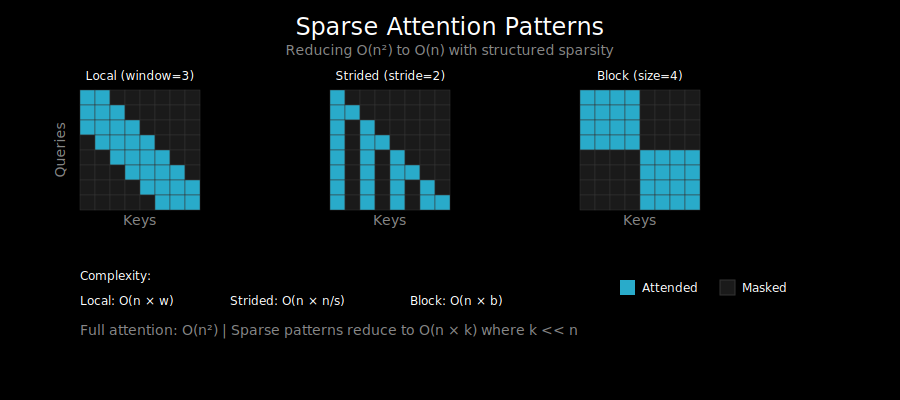

# Sparse Attention: A Taxonomy of Patterns



## The Dense Attention Problem

Standard attention computes relationships between every pair of tokens:

```
Attention(Q, K, V) = softmax(QK^T / √d_k) V
```

For a sequence of n tokens, this creates an n × n attention matrix. The problems:
- **Memory**: O(n²) to store the attention weights
- **Compute**: O(n²d) for the matrix multiplications
- **Scaling**: 4096 tokens → 16M weights per head per layer

When processing long documents, code files, or conversations, this becomes prohibitive.

## The Core Idea: Attend to Less

Instead of attending to all positions, we can restrict attention to a subset:

```
Dense attention:           Sparse attention:
[1 1 1 1 1 1 1 1]         [1 1 1 0 0 0 0 0]
[1 1 1 1 1 1 1 1]         [1 1 1 1 0 0 0 0]
[1 1 1 1 1 1 1 1]         [0 1 1 1 1 0 0 0]
[1 1 1 1 1 1 1 1]   →     [0 0 1 1 1 1 0 0]
[1 1 1 1 1 1 1 1]         [0 0 0 1 1 1 1 0]
[1 1 1 1 1 1 1 1]         [0 0 0 0 1 1 1 1]
[1 1 1 1 1 1 1 1]         [0 0 0 0 0 1 1 1]
[1 1 1 1 1 1 1 1]         [0 0 0 0 0 0 1 1]
```

The 0s indicate positions we don't attend to (masked with -∞ before softmax).

## Pattern Taxonomy

### 1. Local (Sliding Window) Attention

Each token attends to its w nearest neighbors:

```
Window size = 3:

Position 4 attends to: [2, 3, 4, 5, 6]
                           ↑
                       center

Pattern (w=2 each side):
[1 1 1 0 0 0 0 0]
[1 1 1 1 0 0 0 0]
[1 1 1 1 1 0 0 0]
[0 1 1 1 1 1 0 0]
[0 0 1 1 1 1 1 0]
[0 0 0 1 1 1 1 1]
[0 0 0 0 1 1 1 1]
[0 0 0 0 0 1 1 1]
```

**Complexity**: O(n × w) instead of O(n²)

**Intuition**: Most relevant context is nearby. In language, local grammar and semantics dominate.

**Used by**: Mistral, Longformer (combined with global)

### 2. Strided (Dilated) Attention

Attend to every k-th position:

```
Stride = 2:

Position 6 attends to: [0, 2, 4, 6]

Pattern (stride=2):
[1 0 1 0 1 0 1 0]
[0 1 0 1 0 1 0 1]
[1 0 1 0 1 0 1 0]
[0 1 0 1 0 1 0 1]
[1 0 1 0 1 0 1 0]
[0 1 0 1 0 1 0 1]
[1 0 1 0 1 0 1 0]
[0 1 0 1 0 1 0 1]
```

**Complexity**: O(n × n/k)

**Intuition**: Captures longer-range dependencies at reduced cost.

**Used by**: Sparse Transformer (OpenAI), BigBird

### 3. Block (Chunked) Attention

Divide sequence into blocks, attend within blocks:

```
Block size = 4:

[1 1 1 1|0 0 0 0]
[1 1 1 1|0 0 0 0]
[1 1 1 1|0 0 0 0]
[1 1 1 1|0 0 0 0]
--------+--------
[0 0 0 0|1 1 1 1]
[0 0 0 0|1 1 1 1]
[0 0 0 0|1 1 1 1]
[0 0 0 0|1 1 1 1]
```

**Complexity**: O(n × b) where b = block size

**Intuition**: Information stays within local neighborhoods.

**Used by**: Blockwise parallel attention, local attention baselines

### 4. Global Tokens

Designate certain positions as "global" that can attend to/be attended by all:

```
Positions 0 and 7 are global:

[1 1 1 1 1 1 1 1]  ← Global token attends to all
[1 1 1 0 0 0 0 1]
[1 1 1 1 0 0 0 1]
[1 0 1 1 1 0 0 1]
[1 0 0 1 1 1 0 1]
[1 0 0 0 1 1 1 1]
[1 0 0 0 0 1 1 1]
[1 1 1 1 1 1 1 1]  ← Global token attends to all
 ↑                 ↑
All attend to globals
```

**Intuition**: Special tokens (like [CLS]) aggregate global information.

**Used by**: Longformer, BigBird, LED

### 5. Random Attention

Each token attends to r random positions (in addition to local):

```
Random + Local (conceptual):

[1 1 0 0 1 0 1 0]  ← local + random samples
[1 1 1 1 0 0 0 1]
[0 1 1 1 0 1 0 0]
...
```

**Complexity**: O(n × (w + r))

**Intuition**: Random connections help information propagate across the sequence.

**Used by**: BigBird (combines local + global + random)

## Combining Patterns

Modern sparse attention models combine multiple patterns:

### Longformer Pattern
```
Local window + Global tokens (at specific positions)
```
- Sliding window for most tokens
- [CLS] and task-specific tokens are global
- Good for classification, QA

### BigBird Pattern
```
Local + Global + Random
```
- Proves this is theoretically as powerful as full attention
- Global tokens for aggregation
- Random for connectivity

### Sparse Transformer (OpenAI)
```
Interleaved: Local heads + Strided heads
```
- Some attention heads use local pattern
- Other heads use strided pattern
- Achieves O(n√n) complexity

## Implementation Considerations

### Masking Approach

The simplest implementation uses attention masks:

```python
def sparse_attention(Q, K, V, mask):
    """
    mask: (seq_len, seq_len) with 0s where attention is blocked
    """
    scores = Q @ K.T / sqrt(d_k)

    # Apply mask: -inf where mask is 0
    scores = scores.masked_fill(mask == 0, float('-inf'))

    weights = softmax(scores, dim=-1)
    return weights @ V
```

**Problem**: Still materializes the full n × n matrix!

### Efficient Implementations

For true sparse attention, we need specialized kernels:
- Only compute non-masked positions
- Use block-sparse matrix operations
- Memory-efficient storage for the mask pattern

Libraries like `triton` and `xformers` provide these:

```python
# Conceptual - actual APIs vary
from xformers.ops import memory_efficient_attention

# Specify sparsity pattern
attn_bias = BlockDiagonalMask.from_seqlens([block_size] * num_blocks)
output = memory_efficient_attention(Q, K, V, attn_bias=attn_bias)
```

## Trade-offs

| Pattern | Complexity | Long-range | Implementation |
|---------|-----------|------------|----------------|
| Dense | O(n²) | ✓ Full | Easy |
| Local | O(n×w) | ✗ Limited | Medium |
| Strided | O(n×n/k) | ~ Partial | Medium |
| Local+Global | O(n×w + n×g) | ✓ Via globals | Medium |
| BigBird | O(n×(w+r+g)) | ✓ Theoretically | Complex |

## When to Use Sparse Attention

**Good candidates**:
- Long documents (>2048 tokens)
- Tasks where local context dominates (summarization, local QA)
- Memory-constrained environments

**Poor candidates**:
- Short sequences (overhead not worth it)
- Tasks requiring dense global reasoning
- When Flash Attention fits in memory (often better choice)

## What's Next

The most popular sparse pattern in production models is **sliding window attention**. We'll dive deep into this in `02_sliding_window.md`, examining how Longformer and Mistral implement it.
