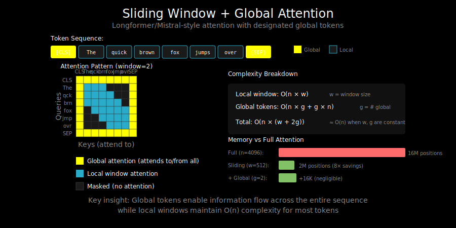

# Sliding Window Attention: Local Context + Global Tokens



## The Sliding Window Concept

Sliding window attention restricts each token to attend only within a fixed-size window:

```
Sequence: [The] [cat] [sat] [on] [the] [mat] [.] [It] [was] [tired]
                       ↑
            Processing "on" (position 3)

Window size w = 4 (2 each side):
Attends to: [cat] [sat] [on] [the] [mat]
            pos 1  pos 2  pos 3  pos 4  pos 5
```

Information flows through overlapping windows across layers:

```
Layer 1:  Token 8 sees tokens 6-10
Layer 2:  Token 8's context (via layer 1) covers tokens 4-12
Layer 3:  Token 8's context covers tokens 2-14
...
```

After L layers with window size w, a token can access approximately L × w positions.

## Why Sliding Window Works

Two key observations:

1. **Locality in language**: Most dependencies are local
   - Subject-verb agreement: usually within a few words
   - Pronoun resolution: referent typically nearby
   - Syntax: local grammatical structure

2. **Information propagation**: Deep networks spread information
   - Each layer expands the effective receptive field
   - By the final layer, information has mixed across the sequence

This is similar to how CNNs build global understanding from local filters.

## Mistral's Implementation

Mistral uses a pure sliding window approach:

```python
def sliding_window_mask(seq_len, window_size):
    """
    Create causal sliding window mask.
    Combines causal masking (can't see future) with window (can't see distant past).
    """
    # Start with causal mask
    mask = torch.tril(torch.ones(seq_len, seq_len))

    # Zero out positions outside the window
    for i in range(seq_len):
        start = max(0, i - window_size + 1)
        mask[i, :start] = 0

    return mask
```

**Example** (window_size=3):
```
Position 5 can see: positions 3, 4, 5 (not 0, 1, 2)

Mask:
[1 0 0 0 0 0 0 0]  pos 0: sees [0]
[1 1 0 0 0 0 0 0]  pos 1: sees [0,1]
[1 1 1 0 0 0 0 0]  pos 2: sees [0,1,2]
[0 1 1 1 0 0 0 0]  pos 3: sees [1,2,3]
[0 0 1 1 1 0 0 0]  pos 4: sees [2,3,4]
[0 0 0 1 1 1 0 0]  pos 5: sees [3,4,5]
[0 0 0 0 1 1 1 0]  pos 6: sees [4,5,6]
[0 0 0 0 0 1 1 1]  pos 7: sees [5,6,7]
```

### Rolling KV-Cache

For inference, Mistral uses a rolling buffer for the KV-cache:

```python
class RollingKVCache:
    def __init__(self, window_size, num_heads, head_dim):
        self.window_size = window_size
        # Fixed-size circular buffer
        self.k_cache = torch.zeros(window_size, num_heads, head_dim)
        self.v_cache = torch.zeros(window_size, num_heads, head_dim)
        self.position = 0

    def update(self, k, v):
        # Insert at current position (wraps around)
        idx = self.position % self.window_size
        self.k_cache[idx] = k
        self.v_cache[idx] = v
        self.position += 1

    def get_kv(self):
        # Return valid entries (handles startup when cache not full)
        valid_len = min(self.position, self.window_size)
        return self.k_cache[:valid_len], self.v_cache[:valid_len]
```

**Memory benefit**: KV-cache is O(window_size) instead of O(sequence_length).

For 32K context with window=4096: 8x memory reduction in KV-cache.

## Longformer: Sliding Window + Global Tokens

Longformer enhances sliding window with global tokens for long-range dependencies:

```
Sequence: [[CLS]] [The] [cat] [sat] ... [very] [tired] [.]
             ↑
          Global token: attends to ALL, ALL attend to it

Local tokens: sliding window attention only
```

### Global Token Patterns

```
Pattern (window=2, position 0 is global):

[1 1 1 1 1 1 1 1]  ← Global: attends to everyone
[1 1 1 0 0 0 0 0]    Local: window + global
[1 1 1 1 0 0 0 0]    Local: window + global
[1 0 1 1 1 0 0 0]    Local: window + global
[1 0 0 1 1 1 0 0]    Local: window + global
[1 0 0 0 1 1 1 0]    Local: window + global
[1 0 0 0 0 1 1 1]    Local: window + global
[1 0 0 0 0 0 1 1]    Local: window + global
 ↑
Everyone attends to global
```

### Why Global Tokens?

1. **Information aggregation**: Global tokens collect summary information
2. **Long-range shortcuts**: Any token can reach any other via the global
3. **Task-specific**: [CLS] for classification, question tokens for QA

### Implementation

```python
class LongformerAttention(nn.Module):
    def __init__(self, d_model, num_heads, window_size):
        super().__init__()
        self.window_size = window_size
        self.num_heads = num_heads

        # Separate projections for global vs local attention
        self.local_q = nn.Linear(d_model, d_model)
        self.local_k = nn.Linear(d_model, d_model)
        self.local_v = nn.Linear(d_model, d_model)

        # Global tokens use different projections
        self.global_q = nn.Linear(d_model, d_model)
        self.global_k = nn.Linear(d_model, d_model)
        self.global_v = nn.Linear(d_model, d_model)

    def forward(self, x, global_mask):
        """
        x: (batch, seq_len, d_model)
        global_mask: (batch, seq_len) - True for global tokens
        """
        # Compute local attention with sliding window
        local_out = self.local_attention(x)

        # Compute global attention for global tokens
        global_out = self.global_attention(x, global_mask)

        # Combine: use global output for global positions
        output = torch.where(
            global_mask.unsqueeze(-1),
            global_out,
            local_out
        )
        return output
```

## Complexity Analysis

### Dense Attention
- Time: O(n²d)
- Memory: O(n²)

### Sliding Window (Mistral)
- Time: O(n × w × d) where w = window size
- Memory: O(n × w) for attention, O(w) for KV-cache

### Sliding Window + Global (Longformer)
- Time: O(n × w × d + n × g × d) where g = number of global tokens
- Memory: O(n × w + n × g)

## Practical Window Sizes

| Model | Window Size | Layers | Effective Context |
|-------|-------------|--------|-------------------|
| Mistral 7B | 4096 | 32 | ~131K theoretical |
| Longformer | 512 | 12 | Task-dependent |
| LED (encoder) | 1024 | 6 | Document-length |

## Code: Complete Sliding Window Attention

```python
import torch
import torch.nn as nn
import torch.nn.functional as F
import math

def sliding_window_attention(Q, K, V, window_size):
    """
    Sliding window attention with causal masking.

    Args:
        Q, K, V: (batch, num_heads, seq_len, head_dim)
        window_size: int, number of positions to attend to

    Returns:
        output: (batch, num_heads, seq_len, head_dim)
    """
    batch, num_heads, seq_len, head_dim = Q.shape
    scale = 1.0 / math.sqrt(head_dim)

    # Create sliding window causal mask
    # Shape: (seq_len, seq_len)
    row_idx = torch.arange(seq_len).unsqueeze(1)  # (seq_len, 1)
    col_idx = torch.arange(seq_len).unsqueeze(0)  # (1, seq_len)

    # Causal: can only attend to positions <= current
    causal_mask = col_idx <= row_idx

    # Window: can only attend to positions within window
    window_mask = row_idx - col_idx < window_size

    # Combine masks
    mask = causal_mask & window_mask

    # Compute attention scores
    scores = torch.matmul(Q, K.transpose(-2, -1)) * scale

    # Apply mask
    scores = scores.masked_fill(~mask, float('-inf'))

    # Softmax and weighted sum
    attn_weights = F.softmax(scores, dim=-1)
    output = torch.matmul(attn_weights, V)

    return output


class SlidingWindowMultiHeadAttention(nn.Module):
    def __init__(self, d_model, num_heads, window_size):
        super().__init__()
        self.d_model = d_model
        self.num_heads = num_heads
        self.head_dim = d_model // num_heads
        self.window_size = window_size

        self.W_q = nn.Linear(d_model, d_model)
        self.W_k = nn.Linear(d_model, d_model)
        self.W_v = nn.Linear(d_model, d_model)
        self.W_o = nn.Linear(d_model, d_model)

    def forward(self, x):
        batch, seq_len, _ = x.shape

        # Project to Q, K, V
        Q = self.W_q(x).view(batch, seq_len, self.num_heads, self.head_dim).transpose(1, 2)
        K = self.W_k(x).view(batch, seq_len, self.num_heads, self.head_dim).transpose(1, 2)
        V = self.W_v(x).view(batch, seq_len, self.num_heads, self.head_dim).transpose(1, 2)

        # Apply sliding window attention
        attn_out = sliding_window_attention(Q, K, V, self.window_size)

        # Reshape and project output
        attn_out = attn_out.transpose(1, 2).contiguous().view(batch, seq_len, self.d_model)
        return self.W_o(attn_out)
```

## Limitations

1. **Fixed window**: All tokens use the same window size
   - Some tokens might need more context
   - No adaptivity to content

2. **Information bottleneck**: Multi-hop reasoning across windows is slow
   - Needs many layers for information to propagate
   - Global tokens help but add complexity

3. **Not always faster**: For sequences < 2× window size, overhead may dominate
   - Dense Flash Attention often faster for moderate lengths

## What's Next

Sliding window is one approach to efficiency. DeepSeek takes a different path: instead of restricting which positions to attend to, compress the Keys and Values into a latent space. See `03_deepseek_mla.md` for Multi-head Latent Attention.
