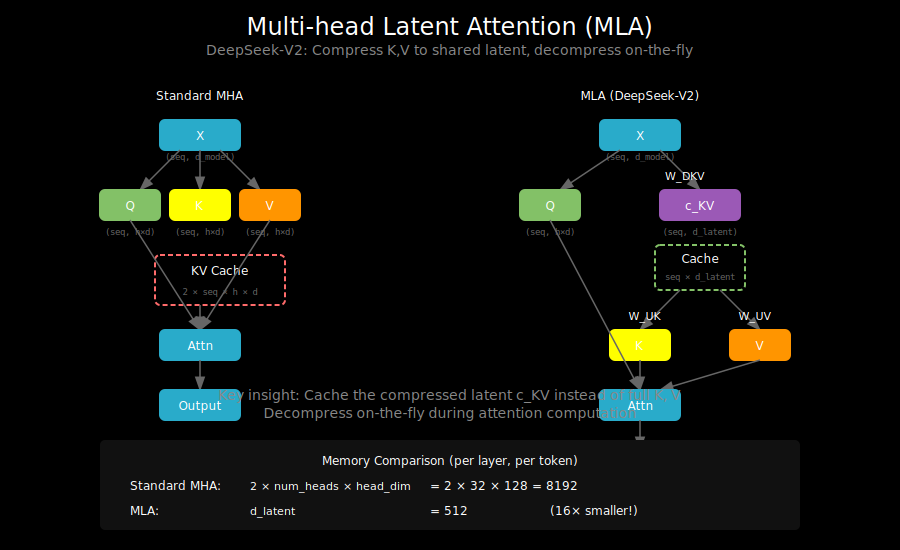

# DeepSeek MLA: Multi-head Latent Attention



## The KV-Cache Problem

In autoregressive generation, we cache K and V from previous tokens to avoid recomputation:

```
Standard MHA cache per layer:
- K cache: (batch, seq_len, num_heads, head_dim)
- V cache: (batch, seq_len, num_heads, head_dim)

Memory: 2 × batch × seq × heads × head_dim × bytes_per_param
```

For a 70B model with 64 heads, 128 head_dim, in fp16:
- Per token: 64 × 128 × 2 × 2 bytes = 32KB per layer
- For 100 layers: 3.2MB per token
- For 32K context: ~100GB just for KV-cache!

This is often the bottleneck for inference memory.

## DeepSeek's Insight: Latent Compression

DeepSeek MLA (Multi-head Latent Attention) compresses KV into a smaller latent space:

```
Standard MHA:
  K, V: each (seq_len, num_heads × head_dim)

MLA:
  c_KV: (seq_len, d_latent)  where d_latent << num_heads × head_dim
  K = W_UK @ c_KV  (decompress on the fly)
  V = W_UV @ c_KV  (decompress on the fly)
```

**Key idea**: Instead of caching full K and V, cache a compressed "latent" representation and decompress during attention.

## The MLA Architecture

### Standard Multi-Head Attention

```
Input X: (seq_len, d_model)
    ↓
┌───────────────────────────────────────┐
│  Q = X @ W_Q    (d_model → n_heads × d_k)  │
│  K = X @ W_K    (d_model → n_heads × d_k)  │
│  V = X @ W_V    (d_model → n_heads × d_v)  │
└───────────────────────────────────────┘
    ↓
Attention(Q, K, V)
```

### Multi-head Latent Attention

```
Input X: (seq_len, d_model)
    ↓
┌────────────────────────────────────────────┐
│  Q = X @ W_Q                               │
│                                            │
│  c_KV = X @ W_DKV   (compress to latent)   │
│       ↓                                    │
│  ┌──────────────────────────────────┐      │
│  │ Cache c_KV (small!)              │      │
│  └──────────────────────────────────┘      │
│       ↓                                    │
│  K = c_KV @ W_UK    (decompress K)         │
│  V = c_KV @ W_UV    (decompress V)         │
└────────────────────────────────────────────┘
    ↓
Attention(Q, K, V)
```

## The Math

### Compression Step

```
c_KV = X @ W_DKV

Where:
- X: (seq_len, d_model)
- W_DKV: (d_model, d_latent)
- c_KV: (seq_len, d_latent)

d_latent is much smaller than num_heads × head_dim
```

### Decompression Step

```
K_heads = c_KV @ W_UK

Where:
- c_KV: (seq_len, d_latent)
- W_UK: (d_latent, num_heads × head_dim)
- K_heads: (seq_len, num_heads × head_dim)

Same for V with W_UV
```

### Why This Works

The compression assumes that K and V have low-rank structure:
- The information in K and V is redundant across heads
- A smaller latent captures the essential information
- The model learns what to compress

This is similar to low-rank approximations like LoRA.

## Memory Savings

### Standard MHA Cache
```
K + V = 2 × seq_len × num_heads × head_dim
```

### MLA Cache
```
c_KV = seq_len × d_latent
```

**Compression ratio**: `(2 × num_heads × head_dim) / d_latent`

For DeepSeek-V2:
- d_model = 5120
- num_heads = 128 (with GQA, fewer KV heads)
- d_latent = 512

Compression: ~8x reduction in KV-cache memory!

## Implementation

```python
import torch
import torch.nn as nn
import math

class MultiHeadLatentAttention(nn.Module):
    def __init__(
        self,
        d_model: int,
        num_heads: int,
        d_latent: int,      # Compressed latent dimension
        head_dim: int = 64,
    ):
        super().__init__()
        self.num_heads = num_heads
        self.head_dim = head_dim
        self.d_latent = d_latent
        self.scale = 1.0 / math.sqrt(head_dim)

        # Query projection (standard)
        self.W_q = nn.Linear(d_model, num_heads * head_dim)

        # KV compression: project to latent space
        self.W_dkv = nn.Linear(d_model, d_latent)

        # KV decompression: project from latent to K and V
        self.W_uk = nn.Linear(d_latent, num_heads * head_dim)
        self.W_uv = nn.Linear(d_latent, num_heads * head_dim)

        # Output projection
        self.W_o = nn.Linear(num_heads * head_dim, d_model)

    def forward(self, x, kv_cache=None):
        """
        Args:
            x: (batch, seq_len, d_model)
            kv_cache: Optional cached c_KV from previous tokens

        Returns:
            output: (batch, seq_len, d_model)
            new_kv_cache: Updated c_KV cache
        """
        batch, seq_len, _ = x.shape

        # Compute queries (standard)
        Q = self.W_q(x)  # (batch, seq_len, num_heads * head_dim)

        # Compress KV to latent
        c_kv_new = self.W_dkv(x)  # (batch, seq_len, d_latent)

        # Handle KV cache
        if kv_cache is not None:
            c_kv = torch.cat([kv_cache, c_kv_new], dim=1)
        else:
            c_kv = c_kv_new

        # Decompress K and V from latent
        K = self.W_uk(c_kv)  # (batch, total_seq, num_heads * head_dim)
        V = self.W_uv(c_kv)  # (batch, total_seq, num_heads * head_dim)

        # Reshape for multi-head attention
        Q = Q.view(batch, seq_len, self.num_heads, self.head_dim).transpose(1, 2)
        K = K.view(batch, -1, self.num_heads, self.head_dim).transpose(1, 2)
        V = V.view(batch, -1, self.num_heads, self.head_dim).transpose(1, 2)

        # Standard attention
        attn_scores = torch.matmul(Q, K.transpose(-2, -1)) * self.scale

        # Causal mask
        total_seq = K.size(2)
        causal_mask = torch.triu(
            torch.ones(seq_len, total_seq, device=x.device),
            diagonal=total_seq - seq_len + 1
        ).bool()
        attn_scores = attn_scores.masked_fill(causal_mask, float('-inf'))

        attn_weights = torch.softmax(attn_scores, dim=-1)
        attn_output = torch.matmul(attn_weights, V)

        # Reshape and project output
        attn_output = attn_output.transpose(1, 2).contiguous()
        attn_output = attn_output.view(batch, seq_len, -1)
        output = self.W_o(attn_output)

        return output, c_kv
```

## DeepSeek-V2 Specific Details

DeepSeek-V2 adds several refinements:

### 1. Decoupled RoPE

RoPE (Rotary Position Embedding) is applied to queries and keys. With MLA, this is handled by:
- Keeping a small portion of Q/K dedicated to RoPE
- The compressed latent doesn't include positional information

```python
# Conceptual - DeepSeek decouples RoPE
Q_rope = Q[:, :, :rope_dim]       # For positional encoding
Q_content = Q[:, :, rope_dim:]    # For content matching

K_rope = K[:, :, :rope_dim]       # From separate small projection
K_content = decompress(c_kv)      # From compressed latent
```

### 2. Grouped-Query Attention (GQA) + MLA

MLA can be combined with GQA for additional efficiency:
- Multiple query heads share the same KV latent
- Further reduces cache size

### 3. Layer-Specific Compression

Different layers might use different latent dimensions:
- Earlier layers: smaller latent (less complex patterns)
- Later layers: larger latent (more nuanced attention)

## Trade-offs

### Advantages
- **Memory**: Dramatically reduced KV-cache
- **Throughput**: Less memory → larger batches → higher throughput
- **Quality**: Surprisingly small quality loss if d_latent chosen well

### Disadvantages
- **Compute**: Extra projections add FLOPs
- **Complexity**: More parameters and logic
- **Training**: Need to learn good compression

### When to Use MLA

| Scenario | Recommendation |
|----------|----------------|
| Long context (32K+) | ✓ MLA shines |
| High batch inference | ✓ Memory savings critical |
| Short sequences | ✗ Overhead not worth it |
| Training only (no inference) | ~ Marginal benefit |

## Comparison with Other Approaches

| Method | KV-Cache Size | Quality | Extra Compute |
|--------|---------------|---------|---------------|
| Standard MHA | 100% | Baseline | None |
| GQA (4 KV heads) | 6% | ~Baseline | None |
| MLA (8x compress) | 12% | ~Baseline | Projection |
| GQA + MLA | ~3% | Slight loss | Projection |

## What's Next

MLA is one approach to reducing the KV-cache through compression. We'll explore the theoretical foundations and different compression strategies in `04_kv_compression.md`.
