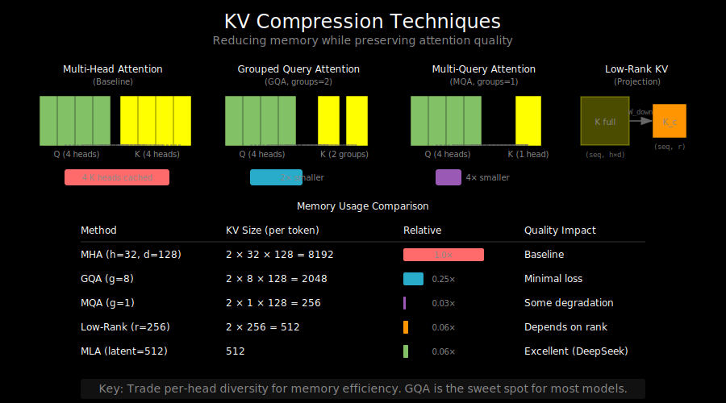

# KV Compression: Why and How



## The Memory Bottleneck

During autoregressive generation, we store Keys and Values for every past token:

```
Generate "The cat sat on the mat"

Step 1: "The"      → Cache KV for "The"
Step 2: "cat"      → Cache KV for "The", "cat"
Step 3: "sat"      → Cache KV for "The", "cat", "sat"
...
Step 1000: "word"  → Cache KV for ALL 1000 previous tokens
```

The KV-cache grows linearly with sequence length, and for large models, it dominates memory:

```
KV-cache memory = 2 × layers × seq_len × kv_heads × head_dim × dtype_bytes

Example (Llama-2 70B, fp16):
= 2 × 80 × 4096 × 8 × 128 × 2 bytes
= 13.4 GB just for KV-cache!
```

## Compression Strategies Overview

```
┌─────────────────────────────────────────────────────────────┐
│                    KV Compression Methods                   │
├─────────────────────────────────────────────────────────────┤
│                                                             │
│  1. Reduce KV Heads (GQA/MQA)                              │
│     ├── Multi-Query Attention: 1 KV head                   │
│     └── Grouped-Query Attention: few KV heads              │
│                                                             │
│  2. Reduce Head Dimension                                   │
│     └── Low-rank projections (MLA)                         │
│                                                             │
│  3. Reduce Sequence Length                                  │
│     ├── Token pruning/eviction                             │
│     ├── Sliding window (fixed cache)                       │
│     └── Summarization/compression tokens                   │
│                                                             │
│  4. Reduce Precision                                        │
│     ├── FP16 → INT8                                        │
│     └── INT8 → INT4 (KV-cache specific quantization)       │
│                                                             │
└─────────────────────────────────────────────────────────────┘
```

## Method 1: Grouped-Query Attention (GQA)

GQA reduces KV-heads while keeping query heads:

```
Multi-Head Attention (MHA):
  Heads:  Q1 Q2 Q3 Q4 Q5 Q6 Q7 Q8
          K1 K2 K3 K4 K5 K6 K7 K8
          V1 V2 V3 V4 V5 V6 V7 V8

Multi-Query Attention (MQA):
  Heads:  Q1 Q2 Q3 Q4 Q5 Q6 Q7 Q8  (8 query heads)
          K1 K1 K1 K1 K1 K1 K1 K1  (1 shared KV)
          V1 V1 V1 V1 V1 V1 V1 V1

Grouped-Query Attention (GQA, 2 groups):
  Heads:  Q1 Q2 Q3 Q4 | Q5 Q6 Q7 Q8
          K1 K1 K1 K1 | K2 K2 K2 K2  (2 KV heads)
          V1 V1 V1 V1 | V2 V2 V2 V2
```

### Implementation

```python
class GroupedQueryAttention(nn.Module):
    def __init__(self, d_model, num_q_heads, num_kv_heads, head_dim):
        super().__init__()
        self.num_q_heads = num_q_heads
        self.num_kv_heads = num_kv_heads
        self.head_dim = head_dim
        self.num_groups = num_q_heads // num_kv_heads

        self.W_q = nn.Linear(d_model, num_q_heads * head_dim)
        self.W_k = nn.Linear(d_model, num_kv_heads * head_dim)
        self.W_v = nn.Linear(d_model, num_kv_heads * head_dim)
        self.W_o = nn.Linear(num_q_heads * head_dim, d_model)

    def forward(self, x):
        B, S, _ = x.shape

        Q = self.W_q(x).view(B, S, self.num_q_heads, self.head_dim)
        K = self.W_k(x).view(B, S, self.num_kv_heads, self.head_dim)
        V = self.W_v(x).view(B, S, self.num_kv_heads, self.head_dim)

        # Expand KV to match Q heads
        # (B, S, num_kv_heads, head_dim) → (B, S, num_q_heads, head_dim)
        K = K.repeat_interleave(self.num_groups, dim=2)
        V = V.repeat_interleave(self.num_groups, dim=2)

        # Standard attention from here
        Q = Q.transpose(1, 2)  # (B, num_q_heads, S, head_dim)
        K = K.transpose(1, 2)
        V = V.transpose(1, 2)

        attn = torch.softmax(Q @ K.transpose(-2, -1) / math.sqrt(self.head_dim), dim=-1)
        out = attn @ V

        out = out.transpose(1, 2).reshape(B, S, -1)
        return self.W_o(out)
```

### Memory Savings

| Model | Q Heads | KV Heads | KV Reduction |
|-------|---------|----------|--------------|
| Llama-1 (MHA) | 32 | 32 | 1× |
| Llama-2 70B (GQA) | 64 | 8 | 8× |
| Mistral 7B (GQA) | 32 | 8 | 4× |
| Falcon 180B (MQA) | 128 | 1 | 128× |

## Method 2: Low-Rank KV Projection

Instead of reducing heads, compress the head dimension:

```
Standard:
  K: (seq_len, num_heads, head_dim) → full dimension

Low-rank:
  K_compressed: (seq_len, low_rank) → smaller
  K = K_compressed @ W_expand → reconstruct when needed
```

This is the core idea behind MLA (covered in detail in `03_deepseek_mla.md`).

### Matrix Factorization View

```
Original KV projection:
  K = X @ W_k    where W_k is (d_model, num_heads × head_dim)

Low-rank factorization:
  K = X @ W_down @ W_up
      └── compress ──┘ └── expand ──┘

  W_down: (d_model, d_latent)
  W_up: (d_latent, num_heads × head_dim)

  d_latent << num_heads × head_dim
```

The rank of the KV representation is bounded by d_latent.

## Method 3: Token-Level Compression

### Sliding Window Cache

Discard old KV entries beyond a window:

```python
class SlidingWindowCache:
    def __init__(self, window_size):
        self.window_size = window_size
        self.k_cache = []
        self.v_cache = []

    def update(self, k, v):
        self.k_cache.append(k)
        self.v_cache.append(v)

        # Keep only last window_size entries
        if len(self.k_cache) > self.window_size:
            self.k_cache.pop(0)
            self.v_cache.pop(0)
```

### Attention Sink

Research found that initial tokens are disproportionately attended to (attention sink). A hybrid approach keeps:
- First k tokens (sink tokens)
- Last w tokens (sliding window)

```
Sequence: [T0] [T1] [T2] ... [T100] [T101] ... [T999] [T1000]
                                          |
Cache:    [T0] [T1]  (sink)  +  [T990] ... [T1000]  (window)
          └── keep ──┘           └─────── keep ─────────┘
```

### Learned Compression Tokens

Some approaches learn to compress context:

```
Original: [T1] [T2] [T3] ... [T100]
             ↓ (learned compression)
Compressed: [C1] [C2] [C3]  (3 summary tokens)
```

Models like GIST and AutoCompressors explore this direction.

## Method 4: KV-Cache Quantization

Quantize cached values to lower precision:

```python
def quantize_kv_cache(k, v, bits=8):
    """
    Quantize KV cache to int8.
    """
    # Per-channel quantization
    k_scale = k.abs().max(dim=-1, keepdim=True).values / 127
    v_scale = v.abs().max(dim=-1, keepdim=True).values / 127

    k_int8 = (k / k_scale).round().clamp(-128, 127).to(torch.int8)
    v_int8 = (v / v_scale).round().clamp(-128, 127).to(torch.int8)

    return k_int8, v_int8, k_scale, v_scale


def dequantize_kv_cache(k_int8, v_int8, k_scale, v_scale):
    """
    Dequantize back to fp16/bf16 for attention.
    """
    k = k_int8.to(torch.float16) * k_scale
    v = v_int8.to(torch.float16) * v_scale
    return k, v
```

### Quantization Impact

| Precision | Memory | Quality Impact |
|-----------|--------|----------------|
| FP16 | 100% | Baseline |
| INT8 | 50% | Minimal (~0.1% perplexity) |
| INT4 | 25% | Noticeable (~1% perplexity) |
| INT2 | 12.5% | Significant |

KV-cache is more tolerant to quantization than weights because:
- It's only used in attention (not accumulated through layers)
- Errors are averaged across many tokens

## Combining Methods

Production models often combine multiple techniques:

```
DeepSeek-V2:
  GQA (8 KV heads) + MLA (low-rank) + Sliding window

  Compression: ~20-50× vs standard MHA

Llama-3:
  GQA (8 KV heads) + KV quantization (int8)

  Compression: ~16× vs standard MHA
```

## Memory Analysis

Let's compare approaches for a 70B-scale model:

**Baseline MHA**:
- 80 layers, 64 heads, 128 head_dim, fp16
- KV per token = 2 × 80 × 64 × 128 × 2 = 2.6MB

**With GQA (8 KV heads)**:
- KV per token = 2 × 80 × 8 × 128 × 2 = 328KB (8× reduction)

**With GQA + MLA (d_latent=512)**:
- KV per token = 80 × 512 × 2 = 82KB (32× reduction)

**With GQA + MLA + INT8**:
- KV per token = 80 × 512 × 1 = 41KB (64× reduction)

## Trade-offs Summary

| Method | Memory Savings | Quality Impact | Extra Compute |
|--------|----------------|----------------|---------------|
| GQA | 4-8× | Minimal | None |
| MLA | 4-8× | Minimal-Small | Projections |
| Sliding Window | Bounded | Context loss | None |
| KV Quantization | 2-4× | Minimal | Quant/Dequant |
| Combined | 20-100× | Small-Moderate | Varies |

## Implementation Considerations

1. **Prefill vs Decode**: Different strategies may be optimal
   - Prefill: process many tokens at once, compute-bound
   - Decode: process one token at a time, memory-bound

2. **Batch Size**: KV compression enables larger batches
   - More concurrent users with same memory

3. **Latency vs Throughput**: Some methods add latency but improve throughput
   - MLA: extra projections, but much larger batches

## What's Next

We've covered attention efficiency through sparsity and compression. But there's another dimension: making the feed-forward network sparse through **Mixture of Experts (MoE)**. See `05_mixture_of_experts.md`.
