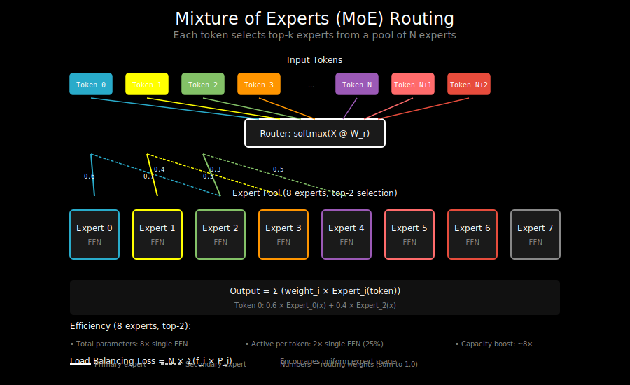

# Mixture of Experts: Sparse Feed-Forward Networks



## The FFN Bottleneck

In a transformer, the feed-forward network (FFN) is expensive:

```
Standard Transformer Block:
  Attention: ~25% of compute
  FFN: ~75% of compute

FFN structure:
  hidden = x @ W1        # (d_model → 4 × d_model)
  hidden = activation(hidden)
  output = hidden @ W2    # (4 × d_model → d_model)
```

The FFN has 8× more parameters than attention (for the same d_model).

**Question**: Does every token need the full FFN?

## The MoE Idea

Instead of one large FFN, use multiple "expert" FFNs and route each token to a subset:

```
Standard FFN:
  Every token → Same FFN → Output

Mixture of Experts:
  Token → Router → Select 2 experts → Weighted sum of outputs

  ┌─────────────┐
  │   Router    │
  │ (learned)   │
  └─────────────┘
         │ chooses top-k
         ▼
  ┌─────┬─────┬─────┬─────┐
  │ E1  │ E2  │ E3  │ E4  │  ← Multiple expert FFNs
  └─────┴─────┴─────┴─────┘
```

**Key insight**: Only k experts are active per token, so compute is O(k) not O(num_experts).

## Architecture

```python
class MoELayer(nn.Module):
    def __init__(
        self,
        d_model: int,
        num_experts: int,
        expert_dim: int,    # FFN hidden dim
        top_k: int = 2,     # Number of experts per token
    ):
        super().__init__()
        self.num_experts = num_experts
        self.top_k = top_k

        # Router: produces logits for each expert
        self.router = nn.Linear(d_model, num_experts)

        # Expert FFNs
        self.experts = nn.ModuleList([
            FFN(d_model, expert_dim) for _ in range(num_experts)
        ])

    def forward(self, x):
        """
        x: (batch, seq_len, d_model)
        """
        batch, seq_len, d_model = x.shape

        # Route tokens to experts
        router_logits = self.router(x)  # (batch, seq_len, num_experts)
        router_probs = F.softmax(router_logits, dim=-1)

        # Select top-k experts per token
        top_k_probs, top_k_indices = torch.topk(router_probs, self.top_k, dim=-1)

        # Normalize selected expert weights
        top_k_probs = top_k_probs / top_k_probs.sum(dim=-1, keepdim=True)

        # Compute expert outputs (simplified - actual implementation batches better)
        output = torch.zeros_like(x)
        for i in range(self.top_k):
            expert_idx = top_k_indices[:, :, i]  # (batch, seq_len)
            expert_prob = top_k_probs[:, :, i:i+1]  # (batch, seq_len, 1)

            for e in range(self.num_experts):
                mask = (expert_idx == e)  # Which tokens go to expert e
                if mask.any():
                    expert_input = x[mask]
                    expert_output = self.experts[e](expert_input)
                    output[mask] += expert_prob[mask] * expert_output

        return output
```

## The Router

The router decides which experts process each token:

```
Token embedding → Linear → Softmax → Top-k selection

Router logits: [0.1, 2.5, 0.3, 1.8, 0.2, 0.1, 0.4, 0.6]
                      ↑              ↑
                Expert 1 (0.71)  Expert 3 (0.29)  ← top-2 normalized
```

### Router Design Choices

**1. Top-k selection**
- top-1: Simple but less expressive
- top-2: Standard choice (Mixtral, Switch)
- top-k: More expressive but more compute

**2. Softmax temperature**
```python
router_probs = F.softmax(router_logits / temperature, dim=-1)
```
- Low temperature → sharper routing (more like top-1)
- High temperature → more uniform (less specialization)

**3. Noise injection (training)**
```python
# Add noise to encourage exploration
router_logits = router_logits + noise * torch.randn_like(router_logits)
```

## Load Balancing

A critical challenge: without intervention, routers tend to collapse to using few experts.

### The Problem

```
Iteration 1: Expert 1 used 80%, others 20%
Iteration 2: Expert 1 gets more gradient updates, improves
Iteration 3: Expert 1 used 90%, others 10%
...
Final: Expert 1 used 99%, others unused
```

This defeats the purpose of MoE!

### Solution: Auxiliary Loss

Add a loss that penalizes imbalanced routing:

```python
def load_balancing_loss(router_probs, top_k_indices, num_experts):
    """
    Encourage uniform expert usage.

    router_probs: (batch, seq_len, num_experts)
    top_k_indices: (batch, seq_len, top_k)
    """
    # Fraction of tokens routed to each expert
    # (average of routing probabilities)
    expert_usage = router_probs.mean(dim=[0, 1])  # (num_experts,)

    # Fraction of router probability assigned to each expert
    # (how much the router "wants" to use each expert)
    router_prob_per_expert = router_probs.sum(dim=[0, 1]) / router_probs.sum()

    # Loss: should both be uniform (1/num_experts)
    # We want usage * probability to be balanced
    loss = num_experts * (expert_usage * router_prob_per_expert).sum()

    return loss
```

The auxiliary loss is added to the main loss with a small coefficient (e.g., 0.01).

### Expert Capacity

Limit how many tokens each expert can process:

```python
def expert_capacity(num_tokens, num_experts, capacity_factor=1.25):
    """
    Maximum tokens per expert.
    """
    tokens_per_expert = num_tokens / num_experts
    return int(tokens_per_expert * capacity_factor)


# During routing, drop tokens that exceed capacity
capacity = expert_capacity(batch * seq_len, num_experts)
for expert_idx in range(num_experts):
    tokens_for_expert = (indices == expert_idx).sum()
    if tokens_for_expert > capacity:
        # Drop excess tokens (they get zero output)
        pass
```

## Efficient Implementation

The naive implementation loops over experts. Production implementations batch operations:

```python
def efficient_moe_forward(x, router, experts, top_k):
    """
    Efficient MoE using gather/scatter operations.
    """
    batch, seq_len, d_model = x.shape
    num_tokens = batch * seq_len
    num_experts = len(experts)

    # Flatten tokens
    x_flat = x.view(num_tokens, d_model)

    # Route
    router_logits = router(x_flat)  # (num_tokens, num_experts)
    router_probs = F.softmax(router_logits, dim=-1)
    top_k_probs, top_k_indices = torch.topk(router_probs, top_k, dim=-1)

    # Sort tokens by expert assignment for batched processing
    # This groups all tokens going to the same expert together
    flat_indices = top_k_indices.view(-1)  # (num_tokens * top_k,)
    sorted_indices = flat_indices.argsort()

    # Process each expert's batch of tokens
    # ... (complex indexing to gather/scatter efficiently)

    return output.view(batch, seq_len, d_model)
```

Libraries like `megablocks` provide optimized MoE kernels.

## Mixtral Architecture

Mixtral 8x7B is a popular MoE model:

```
Base: Mistral 7B architecture
Experts: 8 expert FFNs per layer
Active: top-2 experts per token
Total params: 46.7B
Active params: ~12.9B (per token)
```

**Key insight**: 8 experts with top-2 routing means:
- 8× more FFN parameters
- Only 2× the FFN compute per token
- Model quality approaches 8× larger dense model

## Expert Specialization

Research shows experts learn different specializations:

```
Expert 0: Syntax and grammar
Expert 1: Named entities and facts
Expert 2: Numbers and math
Expert 3: Code and technical content
Expert 4: Reasoning and logic
Expert 5: Common phrases and idioms
Expert 6: Rare words and specialized vocabulary
Expert 7: Punctuation and formatting
```

This emerges from training, not explicit design.

## MoE + Attention Variants

MoE can be combined with attention efficiency techniques:

### DeepSeek-V2 Architecture
```
Attention: MLA (compressed KV)
FFN: MoE (sparse experts)

Result: Efficient in both attention AND FFN
```

### Mixtral + Sliding Window
```
Attention: Sliding window (local)
FFN: MoE (sparse experts)

Result: Long context + efficient compute
```

## Trade-offs

### Advantages

1. **Capacity without compute**: More parameters, same FLOPs
2. **Specialization**: Experts learn different skills
3. **Scalability**: Easy to add more experts

### Challenges

1. **Communication**: In distributed training, experts may be on different devices
2. **Load balancing**: Requires careful tuning
3. **Memory**: All experts must fit in memory (even if inactive)
4. **Batch size sensitivity**: Small batches underutilize experts

## Code: Complete MoE Layer

```python
import torch
import torch.nn as nn
import torch.nn.functional as F

class ExpertFFN(nn.Module):
    def __init__(self, d_model, hidden_dim):
        super().__init__()
        self.w1 = nn.Linear(d_model, hidden_dim)
        self.w2 = nn.Linear(hidden_dim, d_model)

    def forward(self, x):
        return self.w2(F.silu(self.w1(x)))


class MoELayer(nn.Module):
    def __init__(
        self,
        d_model: int,
        num_experts: int = 8,
        top_k: int = 2,
        hidden_dim_multiplier: int = 4,
        aux_loss_coef: float = 0.01,
    ):
        super().__init__()
        self.d_model = d_model
        self.num_experts = num_experts
        self.top_k = top_k
        self.aux_loss_coef = aux_loss_coef

        hidden_dim = d_model * hidden_dim_multiplier

        # Router
        self.router = nn.Linear(d_model, num_experts, bias=False)

        # Experts
        self.experts = nn.ModuleList([
            ExpertFFN(d_model, hidden_dim) for _ in range(num_experts)
        ])

    def forward(self, x):
        batch, seq_len, d_model = x.shape
        x_flat = x.view(-1, d_model)  # (batch * seq_len, d_model)
        num_tokens = x_flat.shape[0]

        # Compute routing probabilities
        router_logits = self.router(x_flat)  # (num_tokens, num_experts)
        router_probs = F.softmax(router_logits, dim=-1)

        # Select top-k experts
        top_k_probs, top_k_indices = torch.topk(
            router_probs, self.top_k, dim=-1
        )

        # Normalize top-k probabilities
        top_k_probs = top_k_probs / top_k_probs.sum(dim=-1, keepdim=True)

        # Compute auxiliary load balancing loss
        aux_loss = self._compute_aux_loss(router_probs)

        # Compute expert outputs
        output = torch.zeros_like(x_flat)

        for k in range(self.top_k):
            expert_indices = top_k_indices[:, k]
            expert_weights = top_k_probs[:, k:k+1]

            for e in range(self.num_experts):
                mask = expert_indices == e
                if mask.any():
                    expert_input = x_flat[mask]
                    expert_output = self.experts[e](expert_input)
                    output[mask] += expert_weights[mask] * expert_output

        # Store aux_loss for training
        self.aux_loss = aux_loss

        return output.view(batch, seq_len, d_model)

    def _compute_aux_loss(self, router_probs):
        """Load balancing auxiliary loss."""
        # Average routing probability per expert
        avg_probs = router_probs.mean(dim=0)

        # Compute fraction of tokens assigned to each expert
        # (using hard assignment for counting)
        _, assignments = router_probs.max(dim=-1)
        expert_counts = torch.bincount(
            assignments, minlength=self.num_experts
        ).float()
        expert_frac = expert_counts / expert_counts.sum()

        # Auxiliary loss
        aux_loss = self.num_experts * (avg_probs * expert_frac).sum()

        return self.aux_loss_coef * aux_loss
```

## What's Next

You now understand the major approaches to sparse computation in transformers:
- **Sparse attention patterns** (local, global, strided)
- **KV compression** (GQA, MLA, quantization)
- **Sparse FFN** (MoE with routing)

See `06_references.md` for papers and implementations to dive deeper. The labs will have you implement these techniques hands-on.
