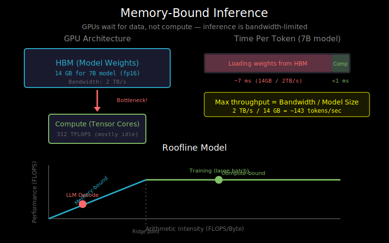

# Memory-Bound Inference: Why LLMs Are Slow



## The Surprising Truth About Inference

You might expect LLM inference to be limited by computation—all those matrix multiplications must be the bottleneck, right?

**Wrong.** Modern GPUs have enormous compute power (hundreds of TFLOPs), but they can't get data fast enough to use it. LLM inference is **memory-bound**, not compute-bound.

Understanding this is key to optimizing inference performance.

## The Memory Bandwidth Bottleneck

Consider an A100 GPU:
- **Compute**: 312 TFLOPS (fp16)
- **Memory bandwidth**: 2 TB/s (HBM2e)
- **Memory capacity**: 80 GB

The ratio of compute to bandwidth is ~156 FLOPS per byte. This means:
- For every byte loaded from memory, you need to perform 156 floating-point operations to keep the GPU busy
- If you don't have enough compute per byte, you're **memory-bound**

## Autoregressive Generation: The Worst Case

During text generation, we generate **one token at a time**:

```
Step 1: [prompt tokens] → generate token_1
Step 2: [prompt tokens, token_1] → generate token_2
Step 3: [prompt tokens, token_1, token_2] → generate token_3
...
```

At each step, we need to:
1. Load all model weights from memory
2. Perform a forward pass for just ONE new token
3. Get ONE new token's logits

**The problem**: We load billions of parameters just to produce a single token.

## The Arithmetic of Memory-Bound Inference

For a 7B parameter model in fp16:
- Model size: 7B × 2 bytes = **14 GB**
- To generate one token: load 14 GB of weights
- At 2 TB/s bandwidth: 14 GB / 2 TB/s = **7 ms per token**
- That's ~143 tokens/second (theoretical max!)

**Key insight**: The theoretical maximum throughput is:

```
Max tokens/sec = Memory Bandwidth / Model Size
```

No matter how fast your GPU's compute is, you can't beat this limit.

## The Roofline Model

The roofline model visualizes the compute vs memory tradeoff:

```
                    Compute Ceiling (312 TFLOPS)
                    ___________________________
                   /
Performance       /
(FLOPS)          /
                /
               /  ← Memory-bound region
              /
_____________/

        Arithmetic Intensity (FLOPS / Byte)
```

**Arithmetic Intensity** = Operations per byte loaded

- **Low intensity**: Memory-bound (waiting for data)
- **High intensity**: Compute-bound (limited by FLOPS)

LLM inference has low arithmetic intensity because:
- We process one token at a time
- We load entire weight matrices for minimal compute

## Comparing Training vs Inference

| Aspect | Training | Inference |
|--------|----------|-----------|
| Batch size | Large (thousands) | Small (1-few) |
| Sequence length | Fixed, known | Growing (autoregressive) |
| Arithmetic intensity | High | Very low |
| Bottleneck | Compute | Memory bandwidth |
| Optimization | Maximize FLOPS | Minimize memory access |

During training, large batches amortize weight loading across many examples. During inference, we often can't batch as much.

## Why Batching Helps (A Little)

If you process B sequences simultaneously:
- Load weights once
- Use them for B forward passes
- Arithmetic intensity increases by B

```
Single sequence:   14 GB weights → 1 token  (wasteful!)
Batch of 8:        14 GB weights → 8 tokens (better)
Batch of 64:       14 GB weights → 64 tokens (good)
```

But batching has limits:
- Memory for KV-cache grows with batch size
- Latency for the first token doesn't improve
- Real-world requests arrive asynchronously

## Visualizing the Bottleneck

```
Time →
┌─────────────────────────────────────────┐
│     Loading weights from HBM            │  ← Most time spent here
├─────┐                                   │
│Comp │  ← GPU compute                    │
└─────┴───────────────────────────────────┘

Ideal (compute-bound):
┌─────────────────────────────────────────┐
│ Load │     Compute                      │  ← Compute dominates
└──────┴──────────────────────────────────┘
```

The GPU spends most of its time waiting for data, not computing.

## Practical Implications

Understanding memory-boundedness leads to key optimization strategies:

1. **Reduce model size**: Smaller models = less to load
   - Quantization (int8, int4) → 2-4x reduction
   - Pruning, distillation

2. **Reduce memory access**:
   - KV-cache: Don't recompute, store and reuse
   - Kernel fusion: Fewer round-trips to memory

3. **Increase arithmetic intensity**:
   - Batching: More work per weight load
   - Speculative decoding: Generate multiple tokens per forward pass

4. **Use faster memory**:
   - GPU with higher bandwidth HBM
   - Keep hot data in SRAM (Flash Attention)

## What About Prefill vs Decode?

LLM inference has two phases:

**Prefill phase** (processing the prompt):
- Process all prompt tokens at once
- Can be made compute-bound with long prompts
- Like a mini training step

**Decode phase** (generating tokens):
- One token at a time
- Always memory-bound
- This is where optimization matters most

```
Prefill (parallel):  [t1, t2, t3, ..., tN] → process together
                           ↓
Decode (sequential):      [t_{N+1}] → [t_{N+2}] → [t_{N+3}] → ...
```

## What's Next

Now that you understand *why* inference is slow, let's look at the key technique for speeding it up: the KV-cache. See `02_kv_cache.md`.
