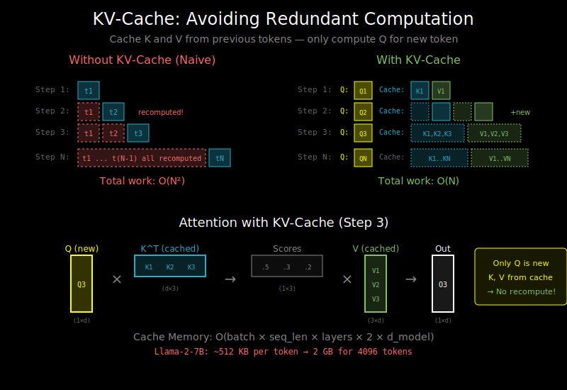

# KV-Cache: Caching for Autoregressive Generation



## The Problem: Redundant Computation

In autoregressive generation, we generate one token at a time:

```python
# Without KV-cache (naive approach)
for i in range(max_tokens):
    logits = model.forward(all_tokens[:i+1])  # Recompute EVERYTHING
    next_token = sample(logits[-1])
    all_tokens.append(next_token)
```

At step 100, we recompute attention for tokens 1-99, even though they haven't changed!

**The waste**:
- Step 1: Compute attention for 1 token
- Step 2: Compute attention for 2 tokens (1 redundant)
- Step 3: Compute attention for 3 tokens (2 redundant)
- ...
- Step N: Compute attention for N tokens (N-1 redundant)

Total redundant work: O(N²) for generating N tokens.

## The Solution: Cache K and V

In self-attention, we compute:
```
Q, K, V = project(input)
attention = softmax(QK^T / √d) @ V
```

**Key insight**: For already-generated tokens, K and V don't change!

When generating token i:
- Q for position i: Depends on token i (need to compute)
- K for positions 1..i-1: Same as before (can cache)
- V for positions 1..i-1: Same as before (can cache)

## How KV-Cache Works

```
Step 1: Input = [t1]
        K_cache = [K1], V_cache = [V1]
        Compute attention with Q1, K1, V1

Step 2: Input = [t2]  (only the NEW token)
        K_cache = [K1, K2], V_cache = [V1, V2]
        Compute attention with Q2, K_cache, V_cache

Step 3: Input = [t3]
        K_cache = [K1, K2, K3], V_cache = [V1, V2, V3]
        Compute attention with Q3, K_cache, V_cache
```

Now each step only processes ONE token, not all previous tokens.

## Implementation Pattern

```python
class AttentionWithKVCache:
    def forward(self, x, kv_cache=None):
        Q = self.W_Q(x)  # Only for new tokens
        K = self.W_K(x)
        V = self.W_V(x)

        if kv_cache is not None:
            # Append new K, V to cache
            K = torch.cat([kv_cache['K'], K], dim=1)
            V = torch.cat([kv_cache['V'], V], dim=1)

        # Attention: Q attends to all K, V (including cached)
        # Q shape: (batch, 1, d_model)  - just the new token
        # K, V shape: (batch, seq_len, d_model)  - all tokens so far
        attn_output = scaled_dot_product_attention(Q, K, V)

        # Update cache for next iteration
        new_cache = {'K': K, 'V': V}

        return attn_output, new_cache
```

## The Speedup

Without KV-cache:
- Step i computes attention for i tokens
- Total: 1 + 2 + 3 + ... + N = O(N²)

With KV-cache:
- Step i computes attention for 1 query against i keys
- Total: 1 + 1 + 1 + ... = O(N)

**N² → N**: That's a massive speedup for long sequences!

For generating 1000 tokens:
- Without cache: ~500,000 attention computations
- With cache: ~1,000 attention computations (500x faster!)

## Memory Cost Analysis

The cache stores K and V for all tokens across all layers and heads.

**Per-token memory**:
```
KV per layer = 2 × d_model × sizeof(dtype)
             = 2 × 4096 × 2 bytes (fp16)
             = 16 KB per layer per token

Total per token = 16 KB × num_layers
                = 16 KB × 32 = 512 KB (for a 7B model)
```

**For a batch of sequences**:
```
KV cache size = batch × seq_len × num_layers × 2 × d_model × sizeof(dtype)
```

**Example for Llama-2-7B** (32 layers, d_model=4096, fp16):
| Batch | Seq Length | KV Cache Size |
|-------|------------|---------------|
| 1 | 2048 | 1 GB |
| 1 | 4096 | 2 GB |
| 8 | 2048 | 8 GB |
| 8 | 4096 | 16 GB |

The KV-cache can easily consume most of your GPU memory!

## KV-Cache Memory Formula

```
Memory = B × L × N × 2 × H × D × sizeof(dtype)
```

Where:
- B = batch size
- L = sequence length
- N = number of layers
- H = number of heads
- D = head dimension
- 2 = for K and V
- sizeof(dtype) = 2 for fp16, 1 for int8

## Multi-Head Attention Cache

For multi-head attention, we cache per-head K and V:

```python
# Cache shape: (batch, num_heads, seq_len, head_dim)
kv_cache = {
    'K': torch.zeros(batch, num_heads, max_seq_len, head_dim),
    'V': torch.zeros(batch, num_heads, max_seq_len, head_dim)
}
```

This is why KV-cache memory scales with `num_heads × head_dim = d_model`.

## Grouped-Query Attention (GQA)

Modern models like Llama-2-70B use GQA to reduce KV-cache size:

```
Standard MHA:  32 heads → 32 K, 32 V
GQA (8 groups): 32 heads share 8 K, 8 V → 4x cache reduction
MQA (1 group):  32 heads share 1 K, 1 V → 32x cache reduction
```

The tradeoff: slight quality reduction for significant memory savings.

## Prefill vs Decode with KV-Cache

**Prefill phase** (processing prompt):
```python
# Process all prompt tokens at once
Q, K, V = project(prompt_tokens)  # Shape: (batch, prompt_len, d_model)
output = attention(Q, K, V)
kv_cache = {'K': K, 'V': V}  # Initialize cache with prompt
```

**Decode phase** (generating tokens):
```python
# Process one new token, attend to entire cache
Q, K_new, V_new = project(new_token)  # Shape: (batch, 1, d_model)
K = concat(kv_cache['K'], K_new)
V = concat(kv_cache['V'], V_new)
output = attention(Q, K, V)  # Q: (batch, 1, d), K,V: (batch, seq, d)
```

## Common Pitfalls

**1. Memory fragmentation**:
Pre-allocate cache to maximum sequence length to avoid dynamic allocation:
```python
# Good: Pre-allocate
kv_cache = torch.zeros(batch, max_seq_len, d_model)

# Bad: Dynamic concatenation
kv_cache = torch.cat([kv_cache, new_kv], dim=1)  # Causes fragmentation
```

**2. Forgetting to clear cache**:
Between requests, reset the cache:
```python
def reset_cache(self):
    self.cache_length = 0  # Don't reallocate, just reset pointer
```

**3. Position encoding mismatch**:
Ensure position IDs match the cache position, not input position:
```python
# Wrong: position = range(len(new_tokens))
# Right: position = range(cache_len, cache_len + len(new_tokens))
```

## KV-Cache Optimizations Preview

Advanced techniques we'll see in Chapter 9:

- **PagedAttention**: Virtual memory for KV-cache (vLLM)
- **Sliding window**: Limit cache to recent tokens (Mistral)
- **KV compression**: Quantize or compress cached values
- **Token eviction**: Drop less important cached tokens

## What's Next

KV-cache enables fast single-sequence generation. But how do we efficiently serve multiple users? See `03_batching_strategies.md`.
