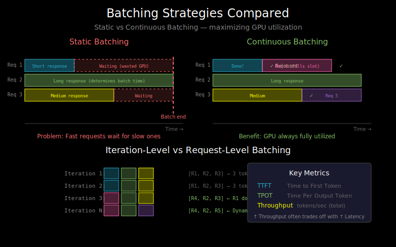

# Batching Strategies: Maximizing Throughput



## Why Batching Matters

Recall from `01_memory_bound_inference.md`: LLM inference is memory-bound. We load billions of parameters to generate one token.

**The fix**: Process multiple sequences together. Load weights once, use them B times.

```
Without batching:
  Load 14 GB → 1 token  → Load 14 GB → 1 token  → ...
  Utilization: ~1%

With batching (B=8):
  Load 14 GB → 8 tokens → Load 14 GB → 8 tokens → ...
  Utilization: ~8%
```

But batching for LLMs is tricky. Let's explore the strategies.

## Static Batching: The Naive Approach

**How it works**: Collect B requests, process them together until all finish.

```python
def static_batch_generation(requests, max_length):
    # Pad all inputs to same length
    padded_inputs = pad_sequences(requests)  # (B, max_input_len)

    # Generate until ALL sequences hit max_length or EOS
    for step in range(max_length):
        logits = model.forward(padded_inputs)
        next_tokens = sample(logits)
        padded_inputs = concat(padded_inputs, next_tokens)

    return padded_inputs
```

**The problem**: Sequences finish at different times!

```
Request 1: "Hi" → "Hello there!" (short response)
Request 2: "Write a story" → "Once upon a time..." (long response)

Static batching:
┌────────────────────────────────────────────┐
│ Req 1: Hi → Hello there! [PAD][PAD][PAD]..│
│ Req 2: Write → Once upon a time in a land │
└────────────────────────────────────────────┘
     ↑ Request 1 is done but GPU still processes padding
```

Request 1 finishes quickly but waits for Request 2. Wasted compute!

## Dynamic Batching: Adding and Removing Sequences

**How it works**: When a sequence finishes, remove it and add a new one.

```
Time →
Step 1: [Req1, Req2, Req3]
Step 2: [Req1, Req2, Req3]
Step 3: [Req2, Req3, Req4]  ← Req1 finished, Req4 added
Step 4: [Req2, Req4, Req5]  ← Req3 finished, Req5 added
```

**Better, but still has issues**:
- Need to manage variable-length KV-caches
- Padding still required within a batch
- Batch size changes over time

## Continuous Batching: The Modern Approach

**Key insight**: Don't batch at the request level, batch at the **iteration level**.

```
Traditional: Process request A until done, then request B
Continuous:  At each step, process whatever tokens are ready
```

**The algorithm**:
```python
def continuous_batching():
    active_sequences = []

    while True:
        # 1. Check for newly arrived requests
        while new_request_available() and len(active_sequences) < max_batch:
            active_sequences.append(new_request)

        # 2. One forward pass for ALL active sequences
        next_tokens = model.forward_one_step(active_sequences)

        # 3. Update sequences, remove finished ones
        for i, (seq, token) in enumerate(zip(active_sequences, next_tokens)):
            seq.append(token)
            if token == EOS or len(seq) >= max_len:
                yield seq  # Return completed sequence
                active_sequences.remove(seq)
```

**Why it's better**:
- No sequence waits for others
- GPU always processes a full batch (if requests available)
- Maximizes throughput

## Visualizing the Difference

**Static batching**:
```
Time →
Req 1: [████████░░░░░░░░]  finished, waiting
Req 2: [████████████████]  finished
                          ↑ batch released
```

**Continuous batching**:
```
Time →
Req 1: [████████]  released immediately
Req 2: [████████████████]
Req 3:         [████████████]  started when slot opened
                            ↑ Req 2 finished
```

## The Prefill-Decode Scheduling Problem

Real LLM serving has two phases:

**Prefill**: Process all prompt tokens (compute-heavy)
**Decode**: Generate tokens one by one (memory-heavy)

These have different characteristics:
| Phase | Tokens Processed | Bottleneck | Latency |
|-------|------------------|------------|---------|
| Prefill | Many (parallel) | Compute | Fixed |
| Decode | One at a time | Memory | Per-token |

**The scheduling challenge**:
- Prefill is a burst of compute
- Decode needs consistent memory bandwidth
- Mixing them can cause latency spikes

## Chunked Prefill

**Problem**: Long prompts block decode steps, causing latency spikes.

**Solution**: Process prefill in chunks, interleave with decode.

```
Without chunked prefill:
Time →
[PPPPPPPPPPPPPPPPPPP][D][D][D][D]
 ↑ Long prefill blocks everything

With chunked prefill:
Time →
[PPP][D][D][PPP][D][D][PPP][D][D]
 ↑ Interleaved, lower latency
```

This technique is used in vLLM and SGLang.

## Handling Variable Sequence Lengths

In a batch, sequences have different lengths. Solutions:

**1. Padding** (simple but wasteful):
```
Seq 1: [t1, t2, t3, PAD, PAD]
Seq 2: [t1, t2, t3, t4, t5]
Seq 3: [t1, t2, PAD, PAD, PAD]
```

**2. Packed sequences** (no padding, complex masking):
```
Packed: [t1, t2, t3, t1, t2, t3, t4, t5, t1, t2]
Mask:   [1,  1,  1,  2,  2,  2,  2,  2,  3,  3]
```

**3. Ragged batching** (specialized kernels):
- Keep sequences in separate tensors
- Use custom attention kernels that handle variable lengths
- This is what vLLM's PagedAttention enables

## Memory Considerations

Batching increases memory usage:

```
KV-cache memory = B × L × layers × 2 × d_model × dtype_size
```

Doubling batch size doubles KV-cache memory. You hit a wall:

```
GPU Memory Budget
├── Model weights: 14 GB (fixed)
├── KV-cache: grows with batch × seq_len
└── Activations: grows with batch
    └── Available memory limits max batch size
```

**The tradeoff**:
- Larger batch → Higher throughput
- Larger batch → More memory → Shorter max sequence length

## Metrics That Matter

**Throughput** (tokens/second):
```
Throughput = (total_tokens_generated) / (total_time)
```
Batching directly improves throughput.

**Latency** (time per request):
- **Time to First Token (TTFT)**: Time until first generated token
- **Time Per Output Token (TPOT)**: Average time between tokens
- **End-to-end latency**: Total time for the request

Batching can *increase* latency while improving throughput!

**The fundamental tradeoff**:
```
                    High throughput
                          ↑
                          │    ← Operating point
                          │   /
          Latency ←───────┼──/─────→ Low latency
                          │
                          ↓
                    Low throughput
```

## Practical Guidelines

1. **For interactive use** (chatbots):
   - Optimize for TTFT and TPOT
   - Smaller batches, prioritize latency

2. **For batch processing** (offline inference):
   - Optimize for throughput
   - Larger batches, tolerate latency

3. **For production serving**:
   - Use continuous batching (vLLM, TensorRT-LLM)
   - Set SLO-based admission control
   - Monitor queue depth

## What's Next

Batching improves throughput, but we're still limited by model size. Can we make the model smaller without losing quality? See `04_quantization_basics.md`.
