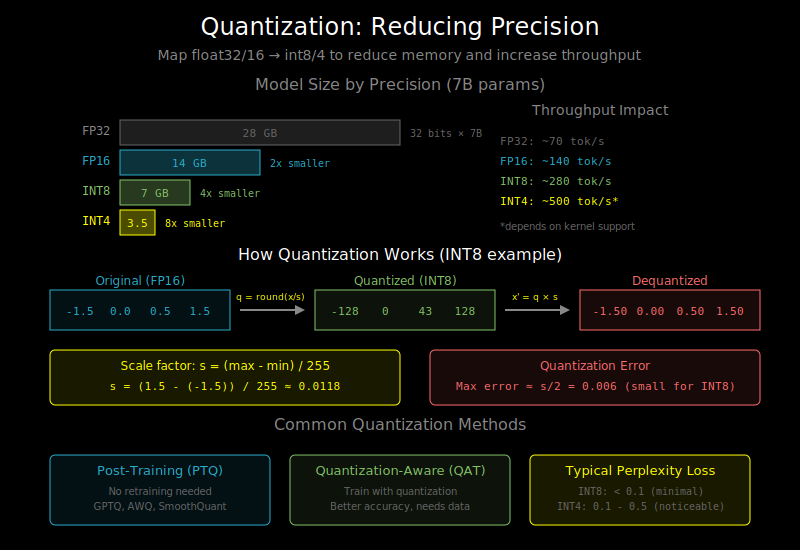

# Quantization Basics: Making Models Smaller



## The Size Problem

A 7B parameter model in fp16:
- Size: 7B × 2 bytes = **14 GB**
- Needs 2 TB/s bandwidth to achieve ~143 tokens/sec

What if we could use smaller datatypes?

| Datatype | Bits | 7B Model Size | Speedup Potential |
|----------|------|---------------|-------------------|
| fp32 | 32 | 28 GB | 1x (baseline) |
| fp16/bf16 | 16 | 14 GB | 2x |
| int8 | 8 | 7 GB | 4x |
| int4 | 4 | 3.5 GB | 8x |

**Quantization** reduces precision to make models smaller and faster.

## How Quantization Works

### The Basic Idea

Map floating-point values to integers:

```python
# Float values: [-1.5, 0.0, 0.5, 1.0, 1.5]
# Quantize to int8 (range: -128 to 127)

scale = (max_val - min_val) / 255  # = 3.0 / 255 ≈ 0.0118
zero_point = -min_val / scale      # = 1.5 / 0.0118 ≈ 127

# Quantize: q = round(x / scale + zero_point)
# [-1.5, 0.0, 0.5, 1.0, 1.5] → [0, 127, 170, 212, 255]

# Dequantize: x = (q - zero_point) * scale
# [0, 127, 170, 212, 255] → [-1.50, 0.00, 0.51, 1.00, 1.51]
```

The small errors (0.51 vs 0.50) are the quantization error.

## Symmetric vs Asymmetric Quantization

**Symmetric**: Zero maps to zero, range is [-max, +max]
```
scale = max(abs(min_val), abs(max_val)) / 127
quantized = round(x / scale)
dequantized = quantized * scale
```

**Asymmetric**: Uses zero_point, handles asymmetric distributions
```
scale = (max_val - min_val) / 255
zero_point = round(-min_val / scale)
quantized = round(x / scale + zero_point)
dequantized = (quantized - zero_point) * scale
```

Symmetric is simpler but wastes range for asymmetric data.

## Per-Tensor vs Per-Channel Quantization

**Per-tensor**: One scale for entire tensor
```
W shape: (4096, 4096)
scales: 1 value
```
Simple but high error if value ranges vary.

**Per-channel**: One scale per output channel
```
W shape: (4096, 4096)
scales: 4096 values (one per row/column)
```
Better accuracy, slight overhead.

**Per-group**: One scale per group of values
```
W shape: (4096, 4096)
group_size: 128
scales: 4096 × 32 = 131072 values
```
Best accuracy for aggressive quantization (int4).

## Common Quantization Schemes

### INT8 Quantization

The most common and well-supported:
- 2x memory reduction from fp16
- Good hardware support (INT8 tensor cores)
- Minimal accuracy loss for most models

```python
# W8A8: Weights and activations both int8
output = int8_matmul(quant(activation), quant(weights))
output = dequant(output)
```

### INT4 Quantization

More aggressive, requires careful handling:
- 4x memory reduction from fp16
- Higher accuracy loss
- Often uses per-group quantization

```python
# W4A16: 4-bit weights, 16-bit activations
# Weights are stored packed (2 values per byte)
# Dequantized on-the-fly during computation
output = matmul(activation, dequant(weights_int4))
```

### FP8 Quantization

A newer format with hardware support:
- E4M3: 4 exponent bits, 3 mantissa bits (for weights)
- E5M2: 5 exponent bits, 2 mantissa bits (for gradients)
- Better dynamic range than INT8
- Native support on H100 GPUs

## Post-Training Quantization (PTQ)

Quantize a trained model without retraining:

```python
def quantize_model_ptq(model, calibration_data):
    # 1. Run calibration data through model
    # 2. Collect activation statistics (min, max, distribution)
    # 3. Determine optimal scales and zero points
    # 4. Quantize weights

    for layer in model.layers:
        # Collect statistics
        activations = layer(calibration_data)
        scale, zero_point = compute_quantization_params(activations)

        # Quantize weights
        layer.weight = quantize(layer.weight, scale, zero_point)

    return quantized_model
```

**Pros**: Fast, no training required
**Cons**: Can lose accuracy, especially for aggressive quantization

## Quantization-Aware Training (QAT)

Train with quantization in mind:

```python
def qat_forward(x, weight):
    # Fake quantization: quantize and immediately dequantize
    # This simulates quantization error during training
    weight_q = fake_quantize(weight)  # Quantize → Dequantize

    # Forward pass uses "fake quantized" values
    return matmul(x, weight_q)

# Backward pass uses straight-through estimator (STE)
# Gradients flow through as if no quantization happened
```

**Pros**: Better accuracy than PTQ
**Cons**: Requires training (expensive), access to training data

## Key Quantization Methods

### GPTQ (Post-Training)

- Layer-by-layer weight quantization
- Uses Hessian information to minimize error
- Popular for int4 quantization

### AWQ (Activation-Aware Weight Quantization)

- Identifies important weights based on activation magnitude
- Keeps important weights at higher precision
- Better accuracy than naive quantization

### SmoothQuant

- Migrates quantization difficulty from activations to weights
- Smooths activation outliers
- Enables W8A8 quantization

```
Before: Activations have outliers, weights are smooth
After smoothing: Both are smooth, easier to quantize
```

## Practical Considerations

### Memory Savings vs Speed

Quantization helps in different ways:

**Memory**: Directly proportional to bit reduction
- int8 → 2x less memory than fp16
- int4 → 4x less memory than fp16

**Speed**: Depends on hardware support
- INT8 with tensor cores: Real speedup
- INT4 with dequant overhead: May not be faster
- Sometimes just smaller, not faster

### Accuracy Impact

Typical accuracy loss (perplexity increase on LLMs):

| Method | Typical Perplexity Increase |
|--------|---------------------------|
| FP16 → INT8 (PTQ) | < 0.1 |
| FP16 → INT8 (QAT) | < 0.05 |
| FP16 → INT4 (GPTQ) | 0.1 - 0.5 |
| FP16 → INT4 (AWQ) | 0.05 - 0.2 |

Rule of thumb: Start with int8, go to int4 if you need more compression.

### What to Quantize

**Always quantize**: Linear layer weights (vast majority of parameters)

**Usually quantize**: Attention QKV projections, FFN layers

**Be careful with**: Layer normalization, embeddings

**Don't quantize**: Small layers, final output layers

## Quick Code Example

```python
# Using bitsandbytes for int8 quantization
import bitsandbytes as bnb

# Replace linear layers with int8 versions
model.transformer.h[0].attn.c_attn = bnb.nn.Linear8bitLt(
    model.transformer.h[0].attn.c_attn.in_features,
    model.transformer.h[0].attn.c_attn.out_features,
    bias=False,
    has_fp16_weights=False
)

# Or use transformers integration
from transformers import AutoModelForCausalLM

model = AutoModelForCausalLM.from_pretrained(
    "meta-llama/Llama-2-7b-hf",
    load_in_8bit=True,  # INT8 quantization
    device_map="auto"
)
```

## What's Next

You now understand the key optimizations for LLM inference:
1. Memory-boundedness explains *why* inference is slow
2. KV-cache eliminates redundant computation
3. Batching improves throughput
4. Quantization reduces model size

Time to implement these concepts! Head to the labs to build KV-cache and quantized inference from scratch. For deeper reading, see `05_references.md`.
