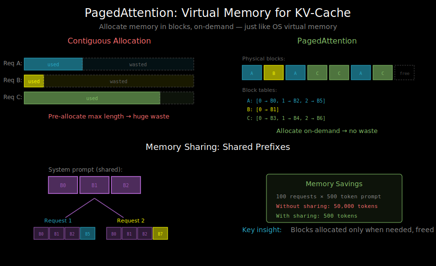

# PagedAttention: Virtual Memory for KV-Cache



## The Memory Fragmentation Problem

In Chapter 8, we learned that KV-cache is essential for efficient autoregressive generation. But there's a hidden problem: **memory fragmentation**.

Consider serving multiple requests simultaneously:

```
Request A: "Tell me a story" → generates 500 tokens
Request B: "What is 2+2?"   → generates 10 tokens
Request C: "Explain quantum computing in detail" → generates 2000 tokens
```

With naive KV-cache allocation:
- We must pre-allocate memory for the **maximum possible length**
- Request B wastes 1990 tokens worth of memory
- Memory can't be shared between requests

```
Memory Layout (naive):
┌─────────────────────────────────────────────────────────┐
│ Request A: [used: 500][ wasted: 1500                   ]│
├─────────────────────────────────────────────────────────┤
│ Request B: [10][       wasted: 1990                    ]│
├─────────────────────────────────────────────────────────┤
│ Request C: [used: 2000                                 ]│
└─────────────────────────────────────────────────────────┘
        ↑
    Huge waste!
```

**Real impact**: For a 13B model with 2048 max tokens, each request reserves ~1GB even if it only uses 10 tokens.

## The Virtual Memory Analogy

PagedAttention borrows the key insight from operating systems: **virtual memory with paging**.

In an OS:
- Programs see contiguous virtual addresses
- Physical memory is divided into fixed-size pages
- Pages are allocated on-demand, not upfront
- A page table maps virtual → physical addresses

PagedAttention applies this to KV-cache:
- Each request sees a contiguous KV-cache
- Physical GPU memory is divided into fixed-size blocks
- Blocks are allocated as tokens are generated
- A block table maps logical → physical blocks

## How PagedAttention Works

### Step 1: Divide Memory into Blocks

Instead of contiguous allocation, divide GPU memory into fixed-size blocks:

```
Physical Memory:
┌────┬────┬────┬────┬────┬────┬────┬────┬────┬────┐
│ B0 │ B1 │ B2 │ B3 │ B4 │ B5 │ B6 │ B7 │ B8 │ B9 │
└────┴────┴────┴────┴────┴────┴────┴────┴────┴────┘
```

Each block holds KV vectors for a fixed number of tokens (e.g., 16 tokens per block).

### Step 2: Maintain Block Tables

Each request has a block table mapping logical blocks to physical blocks:

```
Request A block table: [0 → B2, 1 → B5, 2 → B7]
Request B block table: [0 → B1]
Request C block table: [0 → B0, 1 → B3, 2 → B4, 3 → B8]
```

### Step 3: Allocate On-Demand

As requests generate tokens:

```python
def generate_token(request):
    # Check if current block is full
    if request.current_block_is_full():
        # Allocate new physical block
        new_block = allocate_free_block()
        request.block_table.append(new_block)

    # Compute attention using block table
    output = paged_attention(
        query=request.current_query,
        block_table=request.block_table,
        kv_cache=global_kv_cache
    )
    return output
```

### Step 4: Free and Reuse Blocks

When a request completes:
```python
def complete_request(request):
    for block in request.block_table:
        free_block(block)  # Return to free pool
```

Blocks are immediately available for new requests.

## Memory Layout Comparison

**Before (Contiguous)**:
```
Request A: [████████░░░░░░░░░░░░] 40% used
Request B: [██░░░░░░░░░░░░░░░░░░] 10% used
           ↑ Memory reserved upfront, mostly wasted
```

**After (Paged)**:
```
Physical:  [A][B][A][C][C][A][C][C][B][free][free]...
           ↑ Only allocate what's actually used
```

## The Paged Attention Kernel

The key challenge: attention computation must handle non-contiguous memory.

Standard attention:
```python
# Assumes contiguous K, V
output = softmax(Q @ K.T / sqrt(d)) @ V
```

Paged attention:
```python
def paged_attention(query, block_table, kv_cache, block_size):
    """
    query: (1, num_heads, head_dim) - current token's query
    block_table: list of physical block indices
    kv_cache: (num_blocks, block_size, num_heads, head_dim) for K and V
    """
    output = zeros(num_heads, head_dim)

    for logical_idx, physical_block in enumerate(block_table):
        # Fetch K, V from this physical block
        k_block = kv_cache.k[physical_block]  # (block_size, num_heads, head_dim)
        v_block = kv_cache.v[physical_block]

        # Compute partial attention for this block
        scores = query @ k_block.T / sqrt(head_dim)
        weights = softmax(scores)
        output += weights @ v_block

    return output
```

In practice, this is implemented as a custom CUDA kernel for efficiency.

## Memory Sharing: The Bonus

PagedAttention enables memory sharing between requests:

### Prefix Sharing

Multiple requests with the same system prompt can share prefix blocks:

```
System prompt: "You are a helpful assistant..."
                        ↓
            Shared blocks: [B0, B1, B2]
                    ↙         ↘
Request A: [B0, B1, B2, B5, B6]    Request B: [B0, B1, B2, B7]
           ↑ shared ↑               ↑ shared ↑
```

Memory savings: If 100 requests share a 500-token system prompt, you store it once, not 100 times.

### Copy-on-Write (CoW)

For beam search or parallel sampling:
- Multiple beams can share common prefix blocks
- Blocks are only copied when they would diverge

```
Beam search step 1: All beams share blocks [B0, B1]

Beam search step 2:
  Beam 1 extends → allocate B2
  Beam 2 extends → allocate B3
  Beams still share [B0, B1]
```

## Memory Efficiency Analysis

Let's quantify the improvement:

**Setup**: 7B model, 8 heads, 128 head_dim, 2048 max_len, 100 concurrent requests

**Contiguous allocation**:
```
Per request: 2048 tokens × 32 layers × 2 (K,V) × 8 heads × 128 dim × 2 bytes
           = 2048 × 32 × 2 × 8 × 128 × 2 = 268 MB

Total for 100 requests: 26.8 GB
```

**PagedAttention** (average 500 tokens per request):
```
Actual usage: 500 tokens × 32 layers × 2 × 8 × 128 × 2 = 65 MB per request
Total: 6.5 GB

With prefix sharing (100-token shared prompt):
Shared: 100 tokens saved per request = 13 MB × 99 = 1.3 GB saved
Total: ~5.2 GB
```

**Result**: ~5x memory reduction in this example.

## Implementation Considerations

### Block Size Selection

Block size affects:
- **Smaller blocks**: Less internal fragmentation, more metadata overhead
- **Larger blocks**: More internal fragmentation, less metadata overhead

Typical choice: 16 tokens per block (good balance)

### Kernel Efficiency

The paged attention kernel must:
- Handle arbitrary block table lengths
- Coalesce memory accesses within blocks
- Maintain numerical stability across blocks

vLLM's kernel uses techniques like:
- Splitting work across thread blocks
- Using shared memory for partial results
- Online softmax across blocks

### Scheduling Integration

The scheduler must:
- Track free blocks
- Handle preemption (swap blocks to CPU)
- Prioritize requests based on available memory

## What's Next

Now you understand the memory management innovation. In `02_vllm_architecture.md`, we'll see how vLLM builds a complete serving system around PagedAttention.
