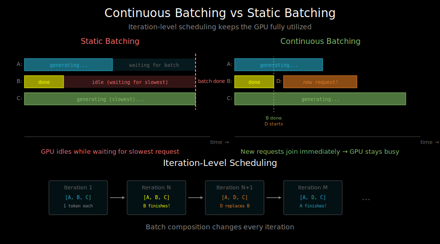

# vLLM Architecture: How High-Throughput Serving Works



## What is vLLM?

vLLM is an open-source library for fast LLM inference and serving. It's designed for **throughput** - serving many requests efficiently rather than minimizing latency for a single request.

Key innovations:
- PagedAttention (covered in `01_paged_attention.md`)
- Continuous batching
- Optimized CUDA kernels
- Tensor parallelism for large models

## Architecture Overview

```
                        ┌─────────────────────────────┐
                        │      API Server (HTTP)       │
                        │   OpenAI-compatible API     │
                        └─────────────┬───────────────┘
                                      │
                        ┌─────────────▼───────────────┐
                        │         Scheduler           │
                        │  - Request queue            │
                        │  - Memory management        │
                        │  - Batch formation          │
                        └─────────────┬───────────────┘
                                      │
                        ┌─────────────▼───────────────┐
                        │       Model Executor        │
                        │  - Forward pass             │
                        │  - KV cache management      │
                        │  - Sampling                 │
                        └─────────────┬───────────────┘
                                      │
              ┌───────────────────────┼───────────────────────┐
              │                       │                       │
    ┌─────────▼─────────┐   ┌────────▼────────┐   ┌─────────▼─────────┐
    │     Worker 0      │   │    Worker 1     │   │     Worker N      │
    │   (GPU 0)         │   │   (GPU 1)       │   │    (GPU N)        │
    │   Model shard     │   │   Model shard   │   │    Model shard    │
    └───────────────────┘   └─────────────────┘   └───────────────────┘
```

## The Scheduler: Continuous Batching

### Why Continuous Batching?

Traditional static batching:
```
Batch 1: [Req A: 100 tokens, Req B: 50 tokens, Req C: 200 tokens]
Wait for ALL requests to complete before processing next batch.

Timeline:
Req B: ████ done, waiting...
Req A: ████████ done, waiting...
Req C: ████████████████ done
       └── All must wait for slowest request
```

Continuous batching (iteration-level):
```
At each iteration, add/remove requests from the batch.

Step 1: [A, B, C] → generate 1 token each
Step 2: [A, B, C] → B finishes, replaced with D
Step 3: [A, D, C] → A finishes, replaced with E
...

Timeline:
Req B: ████ → new request starts immediately
Req A: ████████ → new request starts immediately
Req D: ----████████ → started when B finished
```

**Result**: GPU stays fully utilized, no waiting.

### Scheduler States

vLLM's scheduler manages requests through states:

```python
class SchedulerState:
    WAITING = "waiting"      # In queue, not yet scheduled
    RUNNING = "running"      # Actively generating tokens
    SWAPPED = "swapped"      # KV cache moved to CPU (preempted)
    FINISHED = "finished"    # Generation complete
```

### Scheduling Algorithm

```python
def schedule_step():
    # 1. Try to swap in previously preempted requests
    swapped_in = swap_in_requests(available_memory)

    # 2. Add new requests from waiting queue
    new_requests = []
    for req in waiting_queue:
        if can_allocate_blocks(req):
            new_requests.append(req)
            allocate_initial_blocks(req)
        else:
            break  # No more memory

    # 3. If memory pressure, preempt running requests
    if memory_pressure():
        victims = select_preemption_victims()
        for victim in victims:
            swap_out_to_cpu(victim)

    # 4. Form batch from running requests
    batch = running_requests + swapped_in + new_requests
    return batch
```

### Preemption Strategies

When GPU memory is exhausted, vLLM can preempt requests:

**Recomputation**: Discard KV cache, recompute when resumed
- Pro: No CPU memory needed
- Con: Wasted computation

**Swapping**: Move KV cache to CPU memory
- Pro: No recomputation
- Con: Requires CPU memory, swap overhead

## The Model Executor

The executor handles the actual model inference:

```python
class ModelExecutor:
    def __init__(self, model_config, parallel_config):
        self.model = load_model(model_config)
        self.kv_cache = initialize_kv_cache()
        self.block_manager = BlockManager()

    def execute_model(self, batch):
        # Prepare inputs
        input_ids = batch.get_input_ids()
        positions = batch.get_positions()
        block_tables = batch.get_block_tables()

        # Run model forward pass
        hidden_states = self.model.forward(
            input_ids=input_ids,
            positions=positions,
            kv_cache=self.kv_cache,
            block_tables=block_tables
        )

        # Sample next tokens
        next_tokens = self.sampler.sample(hidden_states, batch)

        # Update KV cache
        self.update_kv_cache(batch, next_tokens)

        return next_tokens
```

## Tensor Parallelism

For large models that don't fit on a single GPU, vLLM uses tensor parallelism:

```
Model Layer (Attention + FFN)
            │
    ┌───────┴───────┐
    │   Split by    │
    │    columns    │
    ▼               ▼
┌───────┐       ┌───────┐
│ GPU 0 │       │ GPU 1 │
│ W[:,:d/2]     │ W[:,d/2:]
└───┬───┘       └───┬───┘
    │               │
    └───────┬───────┘
            │
      All-Reduce (sum)
            │
            ▼
       Output
```

For a 70B model on 4 GPUs:
- Each GPU holds ~17.5B parameters
- Attention heads split across GPUs
- FFN columns split across GPUs
- All-reduce synchronizes after each layer

## Optimized Kernels

vLLM includes custom CUDA kernels for:

### Paged Attention Kernel
```cpp
// Simplified pseudocode
__global__ void paged_attention_kernel(
    Query q,           // Current query
    KVCache kv_cache,  // Global KV cache
    BlockTable block_table,
    Output output
) {
    // Each thread block handles one attention head
    int head_idx = blockIdx.x;
    int num_blocks = block_table.size();

    float max_score = -INFINITY;
    float sum_exp = 0.0f;
    float output_accum[HEAD_DIM] = {0};

    // Iterate over KV blocks
    for (int block_idx = 0; block_idx < num_blocks; block_idx++) {
        int physical_block = block_table[block_idx];

        // Load K, V from this block
        float* k = kv_cache.k[physical_block][head_idx];
        float* v = kv_cache.v[physical_block][head_idx];

        // Compute attention scores for this block
        // Uses online softmax for numerical stability
        compute_block_attention(q, k, v, &max_score, &sum_exp, output_accum);
    }

    // Normalize output
    for (int i = 0; i < HEAD_DIM; i++) {
        output[head_idx][i] = output_accum[i] / sum_exp;
    }
}
```

### Other Optimizations
- **Fused rotary embeddings**: RoPE computed in attention kernel
- **Fused add + RMSNorm**: Reduces memory bandwidth
- **Quantized attention**: INT8/FP8 compute when available

## API Server

vLLM provides an OpenAI-compatible HTTP API:

```python
# Server startup
from vllm import LLM, SamplingParams
from vllm.entrypoints.openai.api_server import run_server

llm = LLM(model="meta-llama/Llama-2-7b-hf")
run_server(llm, host="0.0.0.0", port=8000)
```

```bash
# Client request (OpenAI-compatible)
curl http://localhost:8000/v1/completions \
  -H "Content-Type: application/json" \
  -d '{
    "model": "meta-llama/Llama-2-7b-hf",
    "prompt": "The meaning of life is",
    "max_tokens": 100
  }'
```

## Memory Management Deep Dive

### Block Allocation

```python
class BlockManager:
    def __init__(self, num_blocks, block_size):
        self.free_blocks = list(range(num_blocks))
        self.block_tables = {}  # request_id -> [block_ids]

    def allocate(self, request_id, num_blocks_needed):
        if len(self.free_blocks) < num_blocks_needed:
            return None  # Not enough memory

        allocated = []
        for _ in range(num_blocks_needed):
            block_id = self.free_blocks.pop()
            allocated.append(block_id)

        self.block_tables[request_id] = allocated
        return allocated

    def free(self, request_id):
        blocks = self.block_tables.pop(request_id)
        self.free_blocks.extend(blocks)
```

### GPU Memory Budget

vLLM calculates memory budget:

```python
def calculate_memory_budget():
    total_gpu_memory = get_gpu_memory()

    # Model weights (fixed)
    model_memory = calculate_model_size(model_config)

    # Activation memory (per batch)
    activation_memory = estimate_activation_memory(max_batch_size)

    # KV cache budget (what's left)
    kv_cache_memory = total_gpu_memory - model_memory - activation_memory

    # Number of blocks
    block_size_bytes = (
        block_size *          # tokens per block
        num_layers *          # layers
        2 *                   # K and V
        num_heads *           # heads
        head_dim *            # dimension
        dtype_size            # bytes per element
    )
    num_blocks = kv_cache_memory // block_size_bytes

    return num_blocks
```

## Performance Characteristics

### Throughput vs Latency

vLLM optimizes for throughput, not latency:

```
Throughput-focused (vLLM):
- Batch many requests together
- Higher per-request latency
- More tokens/second total

Latency-focused (single request):
- Process one request at a time
- Lower per-request latency
- Fewer tokens/second total
```

### When to Use vLLM

Good for:
- Serving many concurrent users
- Batch processing
- Applications where throughput matters more than latency

Not ideal for:
- Ultra-low latency requirements (< 50ms first token)
- Single-user applications
- Edge deployment (see llama.cpp instead)

## What's Next

vLLM is great for GPU-based serving. But what if you want to run on CPU or edge devices? See `03_llama_cpp.md` for efficient CPU inference.
