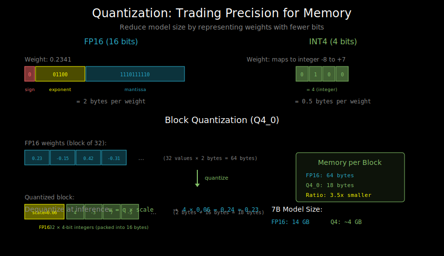

# llama.cpp: CPU Inference and Quantization



## What is llama.cpp?

llama.cpp is a C/C++ implementation of LLaMA inference optimized for:
- **CPU inference**: Run models without a GPU
- **Aggressive quantization**: 2-8 bit weights for small memory footprint
- **Portability**: Runs on laptops, phones, Raspberry Pi, etc.

It's the go-to solution for local/edge deployment of LLMs.

## Why CPU Inference Matters

GPUs are fast but:
- Not everyone has one
- Data privacy (can't send to cloud)
- Edge deployment (phones, embedded devices)
- Cost (GPUs are expensive)

llama.cpp makes a 7B model run on a MacBook with 16GB RAM.

## The GGUF Format

llama.cpp uses the GGUF (GPT-Generated Unified Format) file format:

```
GGUF File Structure:
┌─────────────────────────────────────┐
│ Header                              │
│  - Magic number                     │
│  - Version                          │
│  - Tensor count                     │
│  - Metadata count                   │
├─────────────────────────────────────┤
│ Metadata (key-value pairs)          │
│  - Model architecture               │
│  - Tokenizer info                   │
│  - Quantization type                │
│  - Training hyperparameters         │
├─────────────────────────────────────┤
│ Tensor Info                         │
│  - Name, shape, type for each       │
├─────────────────────────────────────┤
│ Tensor Data                         │
│  - Quantized weights                │
│  - Embedding tables                 │
│  - All model parameters             │
└─────────────────────────────────────┘
```

Benefits of GGUF:
- Self-contained (model + tokenizer + metadata)
- Memory-mappable (stream from disk)
- Supports multiple quantization types in one file

## Quantization Deep Dive

### Why Quantize?

Original model precision: FP16 (16 bits per weight)

```
7B model in FP16: 7 billion × 2 bytes = 14 GB

7B model in Q4_0: 7 billion × 0.5 bytes = 3.5 GB
                  + overhead ≈ 4 GB
```

Quantization trades precision for memory, enabling models to fit on consumer hardware.

### Quantization Types

llama.cpp supports many quantization formats:

| Type | Bits | Block Size | Quality | Speed | Use Case |
|------|------|------------|---------|-------|----------|
| F16 | 16 | - | Best | Slow | Baseline |
| Q8_0 | 8 | 32 | Excellent | Fast | Quality-focused |
| Q6_K | 6 | 256 | Very Good | Fast | Good balance |
| Q5_K_M | 5.5 | 256 | Good | Fast | Popular choice |
| Q4_K_M | 4.5 | 256 | Good | Fastest | Memory-limited |
| Q4_0 | 4 | 32 | Decent | Fastest | Maximum compression |
| Q3_K_M | 3.5 | 256 | OK | Fast | Extreme compression |
| Q2_K | 2.6 | 256 | Degraded | Fast | Edge devices |

### How Block Quantization Works

Instead of quantizing each weight independently, llama.cpp uses block quantization:

```
FP16 weights: [0.23, -0.15, 0.42, -0.31, ...]  (32 values)

Block quantization (Q4_0):
1. Find scale: scale = max(abs(block)) / 7  # 7 = max int4 value
2. Quantize: q = round(w / scale)           # Map to -8...7
3. Store: [scale (fp16), q0, q1, q2, ..., q31 (packed int4)]

Memory: 2 bytes (scale) + 16 bytes (32 × 4 bits) = 18 bytes for 32 weights
        = 0.5625 bytes per weight
```

### K-Quants: Smarter Quantization

The `K` variants (Q4_K, Q5_K, etc.) use importance-weighted quantization:

```
Standard Q4: All weights get 4 bits

Q4_K_M (mixed precision):
- Important layers (attention) get ~4.5 bits
- Less important layers (FFN) get ~4 bits
- Average: 4.5 bits, better quality than uniform 4.5 bits
```

This is based on the observation that some layers are more sensitive to quantization.

## CPU Optimization Techniques

### SIMD Instructions

llama.cpp uses SIMD (Single Instruction, Multiple Data) for fast computation:

```c
// Scalar (slow)
for (int i = 0; i < n; i++) {
    output[i] = a[i] * b[i];
}

// SIMD with AVX2 (8 floats at once)
for (int i = 0; i < n; i += 8) {
    __m256 va = _mm256_load_ps(&a[i]);
    __m256 vb = _mm256_load_ps(&b[i]);
    __m256 vo = _mm256_mul_ps(va, vb);
    _mm256_store_ps(&output[i], vo);
}

// SIMD with AVX-512 (16 floats at once)
for (int i = 0; i < n; i += 16) {
    __m512 va = _mm512_load_ps(&a[i]);
    __m512 vb = _mm512_load_ps(&b[i]);
    __m512 vo = _mm512_mul_ps(va, vb);
    _mm512_store_ps(&output[i], vo);
}
```

llama.cpp auto-detects and uses the best available instructions:
- ARM NEON (Apple Silicon, mobile)
- AVX/AVX2 (most x86 CPUs)
- AVX-512 (server CPUs)

### Memory Mapping

Instead of loading the entire model into RAM:

```c
// Traditional loading
void* model = malloc(model_size);
fread(model, 1, model_size, file);  // Slow, uses RAM

// Memory mapping
void* model = mmap(NULL, model_size, PROT_READ, MAP_PRIVATE, fd, 0);
// Model stays on disk, OS loads pages on-demand
```

Benefits:
- Fast startup (no full load)
- Efficient memory usage (unused parts stay on disk)
- OS handles caching

### Quantized Matrix Multiplication

The core operation: multiply quantized weights by FP32 activations.

```c
// Q4_0 block matmul (simplified)
void mul_q4_0(const block_q4_0* weights, const float* x, float* output) {
    for each block in weights:
        float scale = block.scale;  // FP16 scale factor

        // Dequantize and multiply
        for (int i = 0; i < 32; i++) {
            int8_t q = get_int4(block.qs, i);  // Extract 4-bit value
            float w = q * scale;               // Dequantize
            output[i] += w * x[i];             // Multiply-accumulate
        }
}
```

Optimized versions fuse dequantization into SIMD operations.

## Metal and CUDA Backends

llama.cpp also supports GPU acceleration:

### Metal (Apple Silicon)

```bash
# Build with Metal support
cmake -B build -DLLAMA_METAL=ON
cmake --build build

# Run with Metal
./build/bin/main -m model.gguf -ngl 99  # Offload all layers to GPU
```

Metal kernels handle:
- Matrix multiplication on Apple GPU
- KV cache on unified memory
- Mixed CPU/GPU execution

### CUDA (NVIDIA GPUs)

```bash
# Build with CUDA support
cmake -B build -DLLAMA_CUDA=ON
cmake --build build

# Run with CUDA
./build/bin/main -m model.gguf -ngl 35  # Offload 35 layers to GPU
```

Partial offloading: Put some layers on GPU, rest on CPU.

## Using llama.cpp

### Converting Models

```bash
# From HuggingFace format to GGUF
python convert_hf_to_gguf.py \
    --model meta-llama/Llama-2-7b-hf \
    --outtype f16 \
    --outfile llama-2-7b-f16.gguf

# Quantize to Q4_K_M
./build/bin/quantize \
    llama-2-7b-f16.gguf \
    llama-2-7b-q4_k_m.gguf \
    Q4_K_M
```

### Running Inference

```bash
# Interactive chat
./build/bin/main \
    -m llama-2-7b-q4_k_m.gguf \
    -n 512 \                    # Max tokens to generate
    -t 8 \                      # Number of threads
    --temp 0.7 \                # Temperature
    -i                          # Interactive mode

# Batch processing
./build/bin/main \
    -m llama-2-7b-q4_k_m.gguf \
    -p "The meaning of life is" \
    -n 100
```

### Server Mode

```bash
# Start OpenAI-compatible server
./build/bin/server \
    -m llama-2-7b-q4_k_m.gguf \
    --host 0.0.0.0 \
    --port 8080

# Client request
curl http://localhost:8080/v1/completions \
    -H "Content-Type: application/json" \
    -d '{"prompt": "Hello, world!", "n_predict": 50}'
```

## Performance Characteristics

### Memory vs Quality Tradeoff

```
7B model performance (rough):

Quant   | Size  | Perplexity | Tokens/sec (M2) | Quality
--------|-------|------------|-----------------|----------
F16     | 14 GB | 5.9        | 10              | Baseline
Q8_0    | 7 GB  | 5.9        | 25              | ≈ F16
Q5_K_M  | 5 GB  | 6.0        | 35              | Excellent
Q4_K_M  | 4 GB  | 6.1        | 40              | Good
Q3_K_M  | 3 GB  | 6.5        | 45              | Acceptable
Q2_K    | 2.5GB | 7.5        | 50              | Degraded
```

### Speed Factors

1. **CPU type**: Apple M2 > Intel i9 > older CPUs
2. **Memory bandwidth**: Faster RAM = faster inference
3. **Quantization**: Lower bits = faster (less data to move)
4. **Thread count**: More threads help, diminishing returns after ~8

## What's Next

llama.cpp is great for local deployment. But what about structured output and complex generation patterns? See `04_sglang.md` for structured generation capabilities.
