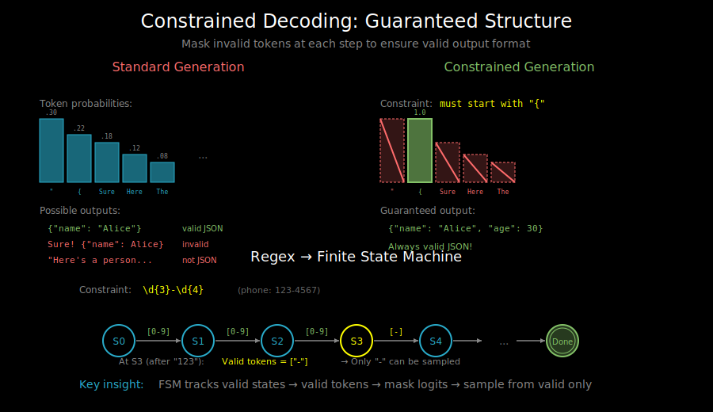

# SGLang: Structured Generation and RadixAttention



## What is SGLang?

SGLang (Structured Generation Language) is a framework designed for:
- **Structured output**: Generate valid JSON, code, or constrained text
- **Complex prompting patterns**: Multi-turn, branching, tool use
- **RadixAttention**: Efficient KV cache reuse for shared prefixes

It's particularly powerful for applications that need reliable structured output from LLMs.

## The Structured Generation Problem

LLMs generate text token-by-token. Getting valid structured output is hard:

```python
# What we want
response = llm.generate("Give me a person as JSON")
# Expected: {"name": "Alice", "age": 30}
# Actual: Sometimes you get: "Sure! Here's a person: {"name": "Alice"..."

# Or worse
# {"name": Alice, age: 30}  # Invalid JSON (missing quotes)
```

The model doesn't "know" it needs to produce valid JSON - it just predicts likely tokens.

## Constrained Decoding

SGLang enforces structure during generation:

```python
from sglang import gen, select

# Define a schema
@sglang.function
def generate_person(s):
    s += "Generate a person:\n"
    s += "{\n"
    s += '  "name": "' + gen("name", max_tokens=20, stop='"') + '",\n'
    s += '  "age": ' + gen("age", regex=r'\d{1,3}') + ',\n'
    s += '  "city": "' + select("city", ["NYC", "LA", "Chicago"]) + '"\n'
    s += "}"

# This ALWAYS produces valid JSON
result = generate_person()
# {"name": "Alice Smith", "age": 30, "city": "NYC"}
```

### How Constrained Decoding Works

At each token generation step:

```
Standard generation:
Vocabulary: [the, a, {, }, 0, 1, Alice, ...]
Logits:     [2.1, 1.8, 0.5, 0.2, 1.2, 1.1, 3.2, ...]
Sample from all tokens

Constrained generation (expecting digit for age):
Valid tokens: [0, 1, 2, 3, 4, 5, 6, 7, 8, 9]
Logits:       [1.2, 1.1, 0.9, 0.8, 0.7, 0.6, 0.5, 0.4, 0.3, 0.2]
              ↑ Only these are considered
Sample from valid tokens only
```

Implementation:

```python
def constrained_sample(logits, valid_token_ids):
    # Mask invalid tokens with -infinity
    mask = torch.full_like(logits, float('-inf'))
    mask[valid_token_ids] = 0
    masked_logits = logits + mask

    # Sample from valid tokens only
    probs = softmax(masked_logits)
    return sample(probs)
```

## Regex-Based Constraints

SGLang supports regex patterns for generation:

```python
# Generate a valid email
email = gen("email", regex=r'[a-z]+@[a-z]+\.(com|org|edu)')

# Generate a date
date = gen("date", regex=r'\d{4}-\d{2}-\d{2}')

# Generate a phone number
phone = gen("phone", regex=r'\(\d{3}\) \d{3}-\d{4}')
```

### Regex to FSM Compilation

Regex constraints are compiled to finite state machines:

```
Regex: \d{3}-\d{4}

FSM:
  State 0: Accept [0-9] → State 1
  State 1: Accept [0-9] → State 2
  State 2: Accept [0-9] → State 3
  State 3: Accept [-]   → State 4
  State 4: Accept [0-9] → State 5
  State 5: Accept [0-9] → State 6
  State 6: Accept [0-9] → State 7
  State 7: Accept [0-9] → Accept State
```

At each step, the FSM determines valid next characters → valid tokens.

## JSON Schema Constraints

For complex structures, use JSON Schema:

```python
from sglang import gen_json

schema = {
    "type": "object",
    "properties": {
        "name": {"type": "string"},
        "age": {"type": "integer", "minimum": 0, "maximum": 150},
        "hobbies": {
            "type": "array",
            "items": {"type": "string"}
        }
    },
    "required": ["name", "age"]
}

result = gen_json("person", schema=schema)
# Guaranteed to match schema
```

## RadixAttention: KV Cache Optimization

### The Problem with Shared Prefixes

Many applications have repeated prefixes:

```
Request 1: "System: You are a helpful assistant. User: What is 2+2?"
Request 2: "System: You are a helpful assistant. User: What is the capital of France?"
Request 3: "System: You are a helpful assistant. User: Write a poem about cats."
           ^^^^^^^^^^^^^^^^^^^^^^^^^^^^^^^^^^^^^^^^
           Same system prompt = same KV cache
```

Standard serving: Compute KV cache for each request independently.

RadixAttention: Share and reuse common prefix KV cache.

### Radix Tree Structure

SGLang organizes KV cache using a radix tree:

```
Root
 └── "System: You are a helpful assistant. User: "
      ├── "What is 2+2?" → KV_1
      ├── "What is the capital" → KV_2
      │    └── " of France?" → KV_2a
      │    └── " of Japan?" → KV_2b
      └── "Write a poem about cats." → KV_3
```

### How RadixAttention Works

```python
class RadixCache:
    def __init__(self):
        self.root = RadixNode()

    def insert(self, tokens, kv_cache):
        """Insert KV cache with token prefix as key"""
        node = self.root
        for token in tokens:
            if token not in node.children:
                node.children[token] = RadixNode()
            node = node.children[token]
        node.kv_cache = kv_cache

    def match_prefix(self, tokens):
        """Find longest matching prefix"""
        node = self.root
        matched_length = 0

        for i, token in enumerate(tokens):
            if token in node.children:
                node = node.children[token]
                matched_length = i + 1
            else:
                break

        return node.kv_cache, matched_length
```

### Request Processing with RadixAttention

```python
def process_request(tokens):
    # 1. Find cached prefix
    cached_kv, prefix_len = radix_cache.match_prefix(tokens)

    if cached_kv is not None:
        # 2a. Reuse cached prefix
        kv_cache = cached_kv.copy()
        tokens_to_process = tokens[prefix_len:]
        start_position = prefix_len
    else:
        # 2b. Process from scratch
        kv_cache = new_kv_cache()
        tokens_to_process = tokens
        start_position = 0

    # 3. Process remaining tokens
    for i, token in enumerate(tokens_to_process):
        output = model.forward(
            token,
            position=start_position + i,
            kv_cache=kv_cache
        )

    # 4. Cache for future reuse
    radix_cache.insert(tokens, kv_cache)

    return output
```

### Memory Savings

```
Scenario: 100 requests with 1000-token shared system prompt

Without RadixAttention:
  KV cache: 100 × 1000 tokens × cache_size = 100× overhead

With RadixAttention:
  Shared prefix: 1 × 1000 tokens × cache_size
  Unique parts: 100 × avg_unique_len × cache_size

Savings: ~100× for the shared prefix portion
```

## Complex Generation Patterns

### Branching and Selection

```python
@sglang.function
def analyze_sentiment(s, text):
    s += f"Text: {text}\n"
    s += "Sentiment: " + select("sentiment", ["positive", "negative", "neutral"])

    # Branch based on selection
    if s["sentiment"] == "negative":
        s += "\nReason: " + gen("reason", max_tokens=50)

    return s
```

### Multi-Turn Conversations

```python
@sglang.function
def chat(s, messages):
    for msg in messages:
        if msg["role"] == "user":
            s += f"User: {msg['content']}\n"
        else:
            s += f"Assistant: {msg['content']}\n"

    s += "Assistant: " + gen("response", max_tokens=200)
    return s
```

### Tool Use

```python
@sglang.function
def tool_use(s, query):
    s += f"Query: {query}\n"
    s += "Action: " + select("action", ["search", "calculate", "answer"])

    if s["action"] == "search":
        s += "\nSearch query: " + gen("search_query", stop="\n")
    elif s["action"] == "calculate":
        s += "\nExpression: " + gen("expression", regex=r'[\d\+\-\*/\(\)\s]+')

    return s
```

## Speculative Decoding in SGLang

SGLang supports speculative decoding for faster generation:

```
Standard autoregressive:
  Draft: ── Token 1 ── Token 2 ── Token 3 ── Token 4 ──
         [100ms]     [100ms]     [100ms]     [100ms]
  Total: 400ms for 4 tokens

Speculative decoding:
  Draft model (fast): ── T1, T2, T3, T4 ── (predict 4 at once)
                      [50ms]
  Verify (parallel):  ── Check all 4 ──
                      [100ms]
  Total: 150ms for 4 tokens (if all accepted)
```

```python
# Enable speculative decoding
sgl.set_default_backend(
    sgl.RuntimeEndpoint("http://localhost:30000"),
    speculative_model="TinyLlama/TinyLlama-1.1B"
)
```

## Using SGLang

### Installation and Setup

```bash
pip install sglang

# Start server
python -m sglang.launch_server \
    --model-path meta-llama/Llama-2-7b-hf \
    --port 30000
```

### Basic Usage

```python
import sglang as sgl

@sgl.function
def simple_qa(s, question):
    s += f"Question: {question}\n"
    s += "Answer: " + sgl.gen("answer", max_tokens=100)

# Run
result = simple_qa.run(question="What is the speed of light?")
print(result["answer"])
```

### JSON Generation

```python
@sgl.function
def extract_entities(s, text):
    s += f"Extract entities from: {text}\n"
    s += "Entities (JSON): "
    s += sgl.gen_json("entities", schema={
        "type": "array",
        "items": {
            "type": "object",
            "properties": {
                "name": {"type": "string"},
                "type": {"enum": ["person", "place", "organization"]}
            }
        }
    })

result = extract_entities.run(text="Apple CEO Tim Cook visited Paris")
# [{"name": "Apple", "type": "organization"},
#  {"name": "Tim Cook", "type": "person"},
#  {"name": "Paris", "type": "place"}]
```

## Performance Characteristics

### Constrained Decoding Overhead

- Regex constraints: ~5-10% overhead
- JSON schema: ~10-20% overhead
- Complex schemas: Up to 30% overhead

The overhead is offset by never needing to retry for invalid output.

### RadixAttention Speedup

```
Scenario: Chatbot with system prompt

Requests per second:
  Without RadixAttention: 50 req/s
  With RadixAttention: 200 req/s (4x improvement)

First token latency:
  Without: 200ms
  With: 50ms (system prompt cached)
```

## What's Next

You now understand three major inference frameworks. See `05_framework_comparison.md` for a comprehensive comparison to help you choose the right tool for your use case.
