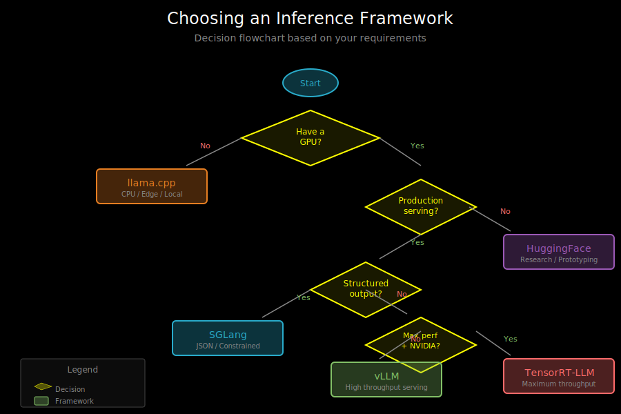

# Framework Comparison: When to Use What



## Quick Reference

| Framework | Best For | Hardware | Complexity | Throughput |
|-----------|----------|----------|------------|------------|
| HuggingFace Transformers | Prototyping, fine-tuning | GPU | Low | Low |
| vLLM | High-throughput serving | GPU | Medium | High |
| llama.cpp | Local/edge deployment | CPU/GPU | Low | Medium |
| SGLang | Structured output, complex prompts | GPU | Medium | High |
| TensorRT-LLM | Production, NVIDIA GPUs | NVIDIA GPU | High | Highest |

## Detailed Comparison

### HuggingFace Transformers

**What it is**: The standard library for working with pretrained models.

**Strengths**:
- Easiest to get started
- Huge model hub (200k+ models)
- Great for fine-tuning
- Best documentation

**Weaknesses**:
- Not optimized for serving
- No continuous batching
- Memory inefficient for inference

**Use when**:
- Experimenting with models
- Fine-tuning
- Research and prototyping
- Small-scale inference

```python
from transformers import pipeline

# Dead simple to start
generator = pipeline("text-generation", model="gpt2")
output = generator("Hello, world", max_length=50)
```

### vLLM

**What it is**: High-throughput serving engine with PagedAttention.

**Strengths**:
- Best throughput for GPU serving
- PagedAttention for memory efficiency
- Continuous batching
- OpenAI-compatible API
- Easy tensor parallelism

**Weaknesses**:
- GPU-only
- Higher latency than specialized solutions
- Less flexibility for custom generation

**Use when**:
- Serving many concurrent users
- Running a production API
- You have NVIDIA GPUs
- Throughput matters more than latency

```python
from vllm import LLM, SamplingParams

llm = LLM(model="meta-llama/Llama-2-7b-hf")
outputs = llm.generate(
    ["What is AI?", "Explain quantum computing"],
    SamplingParams(max_tokens=100)
)
```

### llama.cpp

**What it is**: CPU-optimized inference with aggressive quantization.

**Strengths**:
- Runs on any hardware
- Smallest memory footprint
- No GPU required
- Great for edge devices
- Fast on Apple Silicon

**Weaknesses**:
- Lower quality from quantization
- Slower than GPU solutions
- Limited model architecture support

**Use when**:
- Local deployment (laptops, phones)
- No GPU available
- Privacy requirements (no cloud)
- Edge/embedded systems
- Memory-constrained environments

```bash
./main -m llama-2-7b-q4.gguf -p "Hello" -n 50
```

### SGLang

**What it is**: Structured generation with RadixAttention.

**Strengths**:
- Guaranteed valid structured output
- KV cache sharing (RadixAttention)
- Complex generation patterns
- Great for multi-turn and branching

**Weaknesses**:
- Learning curve for DSL
- Constrained decoding overhead
- Smaller community than vLLM

**Use when**:
- Need valid JSON/structured output
- Complex prompting patterns
- Multi-turn conversations with caching
- Function calling / tool use

```python
@sgl.function
def extract_json(s, text):
    s += f"Extract data from: {text}\n"
    s += sgl.gen_json("data", schema=my_schema)
```

### TensorRT-LLM

**What it is**: NVIDIA's optimized inference library.

**Strengths**:
- Highest performance on NVIDIA GPUs
- Kernel fusion and optimization
- FP8 quantization (Hopper)
- In-flight batching

**Weaknesses**:
- NVIDIA-only
- Complex setup
- Build from source often required
- Less model coverage

**Use when**:
- Maximum performance required
- Production NVIDIA deployment
- You can invest in setup complexity

## Decision Flowchart

```
Start
  │
  ▼
Do you have a GPU?
  │
  ├─ No ─────────────────────────────────► llama.cpp
  │
  ▼ Yes
  │
Is this for production serving?
  │
  ├─ No (research/prototyping) ──────────► HuggingFace
  │
  ▼ Yes
  │
Do you need structured output?
  │
  ├─ Yes ────────────────────────────────► SGLang
  │
  ▼ No
  │
Maximum performance critical?
  │
  ├─ Yes + NVIDIA ───────────────────────► TensorRT-LLM
  │
  ▼ No
  │
└────────────────────────────────────────► vLLM
```

## Performance Benchmarks

### Throughput (tokens/second, 7B model)

| Framework | 1 User | 10 Users | 100 Users |
|-----------|--------|----------|-----------|
| HuggingFace | 30 | 35 | OOM |
| vLLM | 40 | 300 | 1500 |
| llama.cpp (CPU) | 15 | 15 | 15 |
| llama.cpp (Metal) | 50 | 50 | 50 |
| SGLang | 35 | 280 | 1400 |
| TensorRT-LLM | 50 | 400 | 2000 |

*Note: Numbers are approximate and vary by hardware.*

### Time to First Token (latency)

| Framework | Single Request | High Load |
|-----------|----------------|-----------|
| HuggingFace | 100ms | 500ms+ |
| vLLM | 80ms | 150ms |
| llama.cpp | 200ms | 200ms |
| SGLang | 50ms* | 100ms |
| TensorRT-LLM | 50ms | 80ms |

*SGLang is faster when prefix is cached.

### Memory Usage (7B model)

| Framework | Model | KV Cache (100 users) |
|-----------|-------|---------------------|
| HuggingFace FP16 | 14 GB | 10+ GB |
| vLLM FP16 | 14 GB | 2 GB (paged) |
| llama.cpp Q4 | 4 GB | 1 GB |
| SGLang FP16 | 14 GB | 1.5 GB (shared) |

## Common Deployment Patterns

### Pattern 1: Development to Production

```
Development:
  └── HuggingFace (easy experimentation)

Staging:
  └── vLLM (test production setup)

Production:
  └── vLLM or TensorRT-LLM (optimized serving)
```

### Pattern 2: Hybrid Local + Cloud

```
Cloud API (high-volume):
  └── vLLM on GPU instances

Local fallback (privacy/offline):
  └── llama.cpp on user devices
```

### Pattern 3: Structured Output Pipeline

```
Input validation:
  └── SGLang (guaranteed JSON schema)

Batch processing:
  └── vLLM (throughput)

Post-processing:
  └── Standard Python
```

## Mixing Frameworks

You can combine frameworks for different needs:

```python
# Use vLLM for batch generation
from vllm import LLM
batch_llm = LLM("model")

# Use SGLang for structured output
import sglang
sgl.set_default_backend(...)

# Choose based on request type
def process_request(request):
    if request.needs_structured_output:
        return sglang_generate(request)
    else:
        return vllm_batch_generate([request])
```

## Speculative Decoding Support

| Framework | Support | Notes |
|-----------|---------|-------|
| HuggingFace | Limited | Experimental |
| vLLM | Yes | Production ready |
| llama.cpp | Yes | Draft model required |
| SGLang | Yes | Integrated |
| TensorRT-LLM | Yes | Best performance |

## Quantization Support

| Framework | INT8 | INT4 | FP8 | GPTQ | AWQ |
|-----------|------|------|-----|------|-----|
| HuggingFace | Yes | Yes | No | Yes | Yes |
| vLLM | Yes | Yes | Yes* | Yes | Yes |
| llama.cpp | Yes | Yes | No | No | No |
| SGLang | Yes | Yes | Yes* | Yes | Yes |
| TensorRT-LLM | Yes | Yes | Yes | Yes | Yes |

*FP8 requires Hopper GPUs (H100).

## What's Next

You now have a comprehensive understanding of production inference frameworks. See `06_references.md` for papers, documentation, and additional resources to deepen your knowledge.
