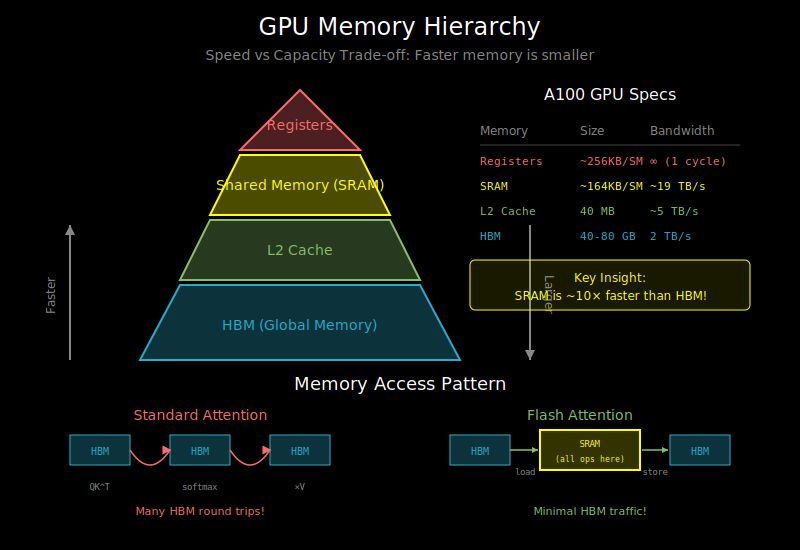

# GPU Memory Hierarchy: Why Memory Matters



## The Memory Bandwidth Bottleneck

Modern GPUs have enormous compute power. An NVIDIA A100 can perform ~312 TFLOPS of FP16 operations. But there's a catch: getting data to the compute units is the bottleneck.

```
A100 GPU:
- Compute: 312 TFLOPS (FP16)
- HBM Bandwidth: 2 TB/s
- SRAM Bandwidth: ~19 TB/s (per SM)

For attention:
- If we need to read/write N² attention weights to HBM
- And N is large (4096+ tokens)
- We spend more time moving data than computing!
```

**The insight**: Standard attention is memory-bound, not compute-bound.

## The GPU Memory Hierarchy

GPUs have a multi-level memory hierarchy, similar to CPUs but with different characteristics:

```
                    ┌─────────────────┐
                    │    Registers    │  ← Fastest (per-thread)
                    │   ~256 KB/SM    │     ~few cycles
                    └────────┬────────┘
                             │
                    ┌────────▼────────┐
                    │  Shared Memory  │  ← Fast (per-block)
                    │  (SRAM/L1)      │     ~20-40 cycles
                    │   ~128 KB/SM    │     ~19 TB/s
                    └────────┬────────┘
                             │
                    ┌────────▼────────┐
                    │    L2 Cache     │  ← Medium
                    │    ~40 MB       │     ~100 cycles
                    └────────┬────────┘
                             │
                    ┌────────▼────────┐
                    │    HBM (DRAM)   │  ← Slow (global)
                    │    40-80 GB     │     ~200-400 cycles
                    │    ~2 TB/s      │
                    └─────────────────┘
```

### Registers
- **Location**: Inside each streaming multiprocessor (SM)
- **Size**: Very small (~256 KB per SM)
- **Speed**: 1 cycle access
- **Scope**: Per-thread, private

### Shared Memory (SRAM)
- **Location**: On-chip, inside each SM
- **Size**: Small (~128 KB per SM on A100)
- **Speed**: ~20-40 cycles, ~19 TB/s bandwidth
- **Scope**: Shared within a thread block
- **Key insight**: ~10x faster than HBM!

### L2 Cache
- **Location**: On-chip, shared across all SMs
- **Size**: Medium (~40 MB on A100)
- **Speed**: ~100 cycles
- **Scope**: Global, automatic caching

### HBM (High Bandwidth Memory)
- **Location**: Off-chip DRAM
- **Size**: Large (40-80 GB)
- **Speed**: ~200-400 cycles, ~2 TB/s
- **Scope**: Global, persistent

## Why Standard Attention is Memory-Bound

Let's trace what happens in standard attention:

```python
# Standard attention (PyTorch)
scores = Q @ K.T           # Step 1: Compute scores
scores = scores / sqrt(d)  # Step 2: Scale
attn = softmax(scores)     # Step 3: Softmax
output = attn @ V          # Step 4: Weighted sum
```

**Memory traffic for seq_len=4096, d=64, batch=1, 1 head:**

| Operation | Read from HBM | Write to HBM |
|-----------|---------------|--------------|
| Q @ K.T | Q (256KB) + K (256KB) | scores (64MB) |
| Scale | scores (64MB) | scores (64MB) |
| Softmax | scores (64MB) | attn (64MB) |
| attn @ V | attn (64MB) + V (256KB) | output (256KB) |

**Total**: Read ~256 MB, Write ~192 MB from HBM

But the actual compute is tiny! The matrix multiplications are dominated by memory transfer time.

## The Arithmetic Intensity Problem

**Arithmetic intensity** = FLOPs / bytes transferred

For standard attention:
- FLOPs: ~2 × N² × d (for QK^T and attn @ V)
- Bytes: ~8 × N² (reading/writing attention matrix multiple times)
- Arithmetic intensity: ~d/4 ≈ 16 (for d=64)

To fully utilize A100:
- Need intensity of ~156 (312 TFLOPS / 2 TB/s)
- We're at ~16, meaning we're ~10x memory-bound!

```
Standard Attention Performance:

                    Compute-bound
                         ↓
Performance    ┌─────────────────────
               │              ╱
               │            ╱
               │          ╱
               │        ╱
               │      ╱
               │    ╱ ← We're here (memory-bound)
               │  ╱
               │╱
               └─────────────────────→
                    Arithmetic Intensity

Optimal: top-right corner
Actual: bottom-left (memory-bound)
```

## The Flash Attention Solution: Keep Data On-Chip

Flash Attention's key insight: **never materialize the full N×N attention matrix**.

Instead:
1. Load blocks of Q, K, V into SRAM
2. Compute partial attention in SRAM
3. Accumulate results
4. Only write final output to HBM

```
Standard Attention:
HBM ←→ [QK^T] ←→ HBM ←→ [softmax] ←→ HBM ←→ [×V] ←→ HBM
       └─────────────── Many round trips ───────────────┘

Flash Attention:
HBM → [Load Q,K,V blocks] → SRAM → [All ops] → SRAM → [Store output] → HBM
      └──────────────── Minimal round trips ────────────────┘
```

## Memory Bandwidth Numbers to Remember

| Memory Type | A100 | H100 | Consumer RTX 4090 |
|-------------|------|------|-------------------|
| HBM Capacity | 40/80 GB | 80 GB | 24 GB |
| HBM Bandwidth | 2.0 TB/s | 3.35 TB/s | 1.0 TB/s |
| SRAM per SM | 164 KB | 256 KB | 128 KB |
| SRAM Bandwidth | ~19 TB/s | ~33 TB/s | ~? TB/s |

Key ratio: SRAM is ~10-16x faster than HBM in bandwidth!

## Practical Implications

### When is Attention Memory-Bound?

Almost always for typical settings:
- Seq_len > 512: Definitely memory-bound
- Batch_size = 1: Severely memory-bound
- Inference: More memory-bound than training (smaller batch)

### Why Not Just Use L2 Cache?

- L2 cache is shared across all SMs
- Can't control what stays in cache
- For long sequences, attention matrix doesn't fit
- SRAM gives us explicit control

### Memory vs Compute Trade-off

Flash Attention actually does MORE compute:
- Recomputes attention in backward pass (no need to store)
- But saves massive amounts of memory traffic
- Net result: faster and uses less memory!

## What's Next

Understanding the memory hierarchy is the foundation. Now we need to learn how to:
1. **Tiling**: Break attention into blocks that fit in SRAM (see `02_tiling_and_blocking.md`)
2. **Online softmax**: Compute softmax without materializing full attention matrix (see `03_online_softmax.md`)
3. **The full algorithm**: Putting it all together (see `04_flash_attention_algorithm.md`)
