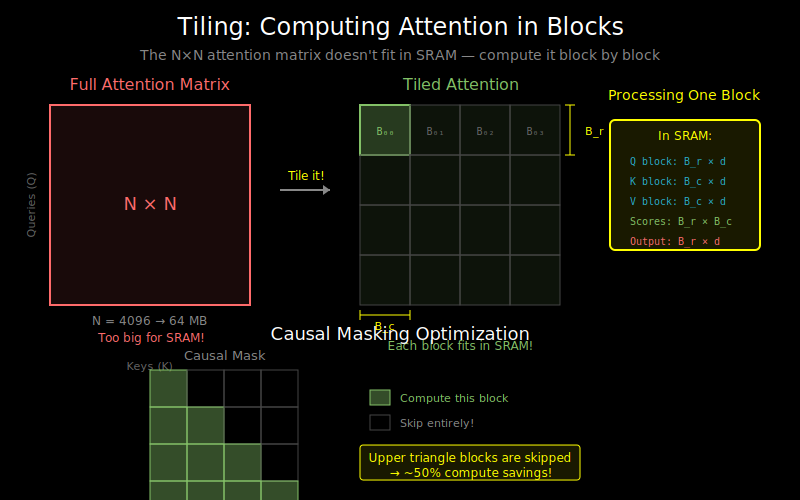

# Tiling and Blocking: Computing Attention in Pieces



## The Core Idea

The N×N attention matrix doesn't fit in SRAM for large N. Solution: compute it in blocks!

```
Full Attention Matrix (N×N):        Tiled Computation:
┌─────────────────────┐             ┌────┬────┬────┬────┐
│                     │             │ B1 │ B2 │ B3 │ B4 │
│                     │    →        ├────┼────┼────┼────┤
│   Too big for SRAM  │             │ B5 │ B6 │ B7 │ B8 │
│                     │             ├────┼────┼────┼────┤
│                     │             │... │    │    │... │
└─────────────────────┘             └────┴────┴────┴────┘

Each block fits in SRAM!
```

## Block Dimensions

For Flash Attention, we choose block sizes based on SRAM capacity:

```
Given:
- SRAM size: S bytes (e.g., 128 KB)
- Head dimension: d (e.g., 64)
- Element size: 2 bytes (FP16)

Need to fit in SRAM:
- Q block: B_r × d
- K block: B_c × d
- V block: B_c × d
- Output accumulator: B_r × d
- Attention block: B_r × B_c
- Statistics: B_r (max values, sum for softmax)

Memory: (B_r × d) + (2 × B_c × d) + (B_r × d) + (B_r × B_c) + B_r
      ≈ 2 × B_r × d + 2 × B_c × d + B_r × B_c

For S = 128KB, d = 64, FP16:
B_r = B_c = 128 is typical
```

## The Outer Loop Structure

Flash Attention uses a specific loop ordering:

```python
# Pseudocode for Flash Attention forward pass
def flash_attention_forward(Q, K, V):
    N = Q.shape[0]

    # Initialize output and statistics
    O = zeros(N, d)        # Output accumulator
    l = zeros(N)           # Softmax denominator (sum of exp)
    m = full(N, -inf)      # Running max for numerical stability

    # Outer loop: iterate over K, V blocks
    for j in range(0, N, B_c):
        K_j = K[j:j+B_c]   # Load K block
        V_j = V[j:j+B_c]   # Load V block

        # Inner loop: iterate over Q blocks
        for i in range(0, N, B_r):
            Q_i = Q[i:i+B_r]          # Load Q block
            O_i = O[i:i+B_r]          # Load output block
            l_i = l[i:i+B_r]          # Load denominator
            m_i = m[i:i+B_r]          # Load max

            # Compute attention for this block
            S_ij = Q_i @ K_j.T / sqrt(d)  # (B_r, B_c)

            # Update statistics and output
            # (This is where online softmax comes in)
            m_new, l_new, O_new = update_statistics(
                S_ij, V_j, O_i, l_i, m_i
            )

            # Store updated values
            O[i:i+B_r] = O_new
            l[i:i+B_r] = l_new
            m[i:i+B_r] = m_new

    # Final normalization
    O = O / l[:, None]
    return O
```

## Why This Loop Order?

The outer loop over K, V blocks is intentional:

**Loading K, V once, iterating Q:**
```
For each (K_j, V_j) block:
    For each Q_i block:
        Compute attention block
```

This order:
1. Loads each K, V block only once from HBM
2. The inner Q loop reuses K, V in SRAM
3. Minimizes total HBM traffic

## Memory Access Pattern

```
Iteration 1: K[0:128], V[0:128] in SRAM
    Q[0:128] → compute → update O[0:128]
    Q[128:256] → compute → update O[128:256]
    ...

Iteration 2: K[128:256], V[128:256] in SRAM
    Q[0:128] → compute → update O[0:128]
    Q[128:256] → compute → update O[128:256]
    ...
```

Each output block O[i] is updated multiple times, accumulating contributions from all K, V blocks.

## The Challenge: Softmax Across Blocks

Standard softmax needs all scores at once:

```python
# Standard softmax
scores = Q @ K.T  # Need FULL N×N matrix
attn = softmax(scores, dim=-1)  # Needs to see all scores in a row
```

When computing blockwise, row i's scores are split across blocks:
```
Row i scores: [S_i,0:128 | S_i,128:256 | S_i,256:384 | ...]
                  ↑            ↑             ↑
              Block 1      Block 2       Block 3

How to compute softmax without seeing all at once?
```

This is why we need **online softmax** (next document).

## Tiling for Different Sequence Lengths

Block sizes affect performance:

| Seq Length | Typical B_r, B_c | Blocks per row |
|------------|------------------|----------------|
| 512 | 64 | 8 |
| 2048 | 128 | 16 |
| 8192 | 128 | 64 |
| 32768 | 128 | 256 |

Larger blocks:
- Fewer HBM accesses
- Better SRAM utilization
- But must fit in SRAM!

## Causal Masking with Tiles

For decoder-only models, we need causal masking (can't attend to future):

```
Full causal mask:          Tiled causal:
┌─────────────────┐        ┌────┬────┬────┬────┐
│▓                │        │▓▓▓▓│    │    │    │
│▓▓               │        ├────┼────┼────┼────┤
│▓▓▓              │   →    │▓▓▓▓│▓▓▓▓│    │    │
│▓▓▓▓             │        ├────┼────┼────┼────┤
│▓▓▓▓▓            │        │▓▓▓▓│▓▓▓▓│▓▓▓▓│    │
│▓▓▓▓▓▓           │        ├────┼────┼────┼────┤
│▓▓▓▓▓▓▓          │        │▓▓▓▓│▓▓▓▓│▓▓▓▓│▓▓▓▓│
│▓▓▓▓▓▓▓▓         │        └────┴────┴────┴────┘
└─────────────────┘
                           ▓ = compute this block
                           (blank) = skip entirely
```

Key optimization: **skip upper-triangular blocks entirely!**
- For block (i, j) where i < j: all entries are masked
- Don't load K, V, don't compute
- Saves ~50% compute for causal attention

## Code Example: Block Loading

```python
def load_blocks_to_sram(Q, K, V, i, j, B_r, B_c):
    """
    Simulated block loading (in real CUDA, uses shared memory)
    """
    Q_block = Q[i*B_r : (i+1)*B_r, :]     # (B_r, d)
    K_block = K[j*B_c : (j+1)*B_c, :]     # (B_c, d)
    V_block = V[j*B_c : (j+1)*B_c, :]     # (B_c, d)

    return Q_block, K_block, V_block

def compute_block_attention(Q_block, K_block, V_block, d_k):
    """
    Compute attention for one block pair
    """
    # Scores for this block
    scores = Q_block @ K_block.T / math.sqrt(d_k)  # (B_r, B_c)

    # This is where online softmax would be applied
    # For now, assume standard softmax
    attn_weights = softmax(scores, dim=-1)

    # Partial output contribution
    output_contribution = attn_weights @ V_block  # (B_r, d)

    return output_contribution, attn_weights
```

## Memory Analysis

**Standard Attention:**
- Reads: Q (Nd) + K (Nd) + V (Nd) + attention matrix (N²)
- Writes: attention matrix (N²) + output (Nd)
- Total: O(N² + Nd)

**Tiled Flash Attention:**
- Q loaded once: Nd
- K, V loaded once per inner loop: Nd × (N/B_c) / (N/B_r) = Nd (amortized)
- Output written once: Nd
- Total: O(Nd) — no N² term!

The N² attention matrix never leaves SRAM!

## What's Next

Tiling gets us partway there, but we still need to handle softmax across blocks. The key insight is **online softmax** — computing softmax incrementally as we see more blocks. See `03_online_softmax.md`.
