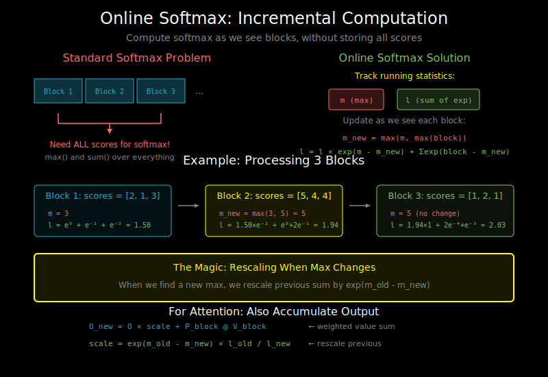

# Online Softmax: Incremental, Numerically Stable Computation



## The Problem

Standard softmax needs all values at once:

```python
def softmax(x):
    exp_x = exp(x)
    return exp_x / sum(exp_x)  # Need sum over ALL elements
```

In tiled attention, we see scores block-by-block:
```
Row i scores: [block 1] → [block 2] → [block 3] → ...

How to compute softmax without storing all N scores?
```

## Numerical Stability First

Before solving the incremental problem, let's review numerical stability.

**Naive softmax is dangerous:**
```python
x = [1000, 1001, 1002]
exp(x) = [overflow, overflow, overflow]  # exp(1000) ≈ 10^434
```

**Safe softmax subtracts the maximum:**
```python
def safe_softmax(x):
    m = max(x)                    # Find max
    exp_x = exp(x - m)            # Subtract max, now exp() is safe
    return exp_x / sum(exp_x)     # Result is the same!
```

Why does subtracting max work?
```
softmax(x)_i = exp(x_i) / Σ exp(x_j)
             = exp(x_i - m) / Σ exp(x_j - m)  # Multiply by exp(-m)/exp(-m)
```

The result is identical, but now the largest exp() is exp(0) = 1.

## The Online Softmax Algorithm

We can compute softmax incrementally by tracking two statistics:
1. **m**: The running maximum
2. **l**: The running sum of exp(x - m)

### Two-Pass Online Softmax

First, let's see the two-pass version:

```python
def online_softmax_two_pass(x_blocks):
    """
    x_blocks: list of score blocks, each shape (block_size,)
    """
    # Pass 1: Find global max
    m = -inf
    for block in x_blocks:
        m = max(m, max(block))

    # Pass 2: Compute sum and outputs
    l = 0
    for block in x_blocks:
        l += sum(exp(block - m))

    # Normalize
    outputs = []
    for block in x_blocks:
        outputs.append(exp(block - m) / l)

    return outputs
```

This still requires storing all blocks or multiple passes.

### One-Pass Online Softmax (The Key Insight!)

We can do it in ONE pass by updating statistics as we go:

```python
def online_softmax_one_pass(x_blocks):
    """
    Compute softmax in a single pass over blocks.
    Key insight: we can update the normalization as we see new maxes.
    """
    m = -inf    # Running max
    l = 0       # Running sum of exp(x - m)

    for block in x_blocks:
        # New max for this block
        m_block = max(block)

        # Update global max
        m_new = max(m, m_block)

        # Key: rescale previous sum when max changes!
        # Old sum was: l = Σ exp(x_prev - m)
        # New sum needs: Σ exp(x_prev - m_new) = l * exp(m - m_new)
        l = l * exp(m - m_new) + sum(exp(block - m_new))

        m = m_new

    # Now m is the global max, l is Σ exp(x - m)
    # Softmax = exp(x - m) / l
    return m, l
```

**The magic**: When we find a new maximum, we rescale our running sum!

```
Before: l = exp(x1 - m_old) + exp(x2 - m_old) + ...
After:  l = exp(x1 - m_new) + exp(x2 - m_new) + ...
         = l_old * exp(m_old - m_new) + exp(x_new - m_new)
```

## Online Softmax with Output Accumulation

For attention, we need to accumulate: output = softmax(scores) @ V

We can do this online too!

```python
def online_attention_one_pass(Q_row, K_blocks, V_blocks, d_k):
    """
    Compute attention output for one query row, incrementally.

    Q_row: (1, d)
    K_blocks, V_blocks: list of (B_c, d) blocks
    """
    d = Q_row.shape[-1]

    m = -inf          # Running max
    l = 0             # Running softmax denominator
    o = zeros(d)      # Running output accumulator

    for K_block, V_block in zip(K_blocks, V_blocks):
        # Compute scores for this block
        scores = Q_row @ K_block.T / sqrt(d_k)  # (1, B_c)

        # Block statistics
        m_block = max(scores)

        # Update running max
        m_new = max(m, m_block)

        # Compute attention weights for this block (with new max)
        p_block = exp(scores - m_new)  # (1, B_c)

        # Rescale previous accumulator and sum
        scale = exp(m - m_new)
        l_new = l * scale + sum(p_block)
        o_new = o * scale + p_block @ V_block  # (1, d)

        # Update running values
        m, l, o = m_new, l_new, o_new

    # Final normalization
    output = o / l

    return output
```

## Visualizing the Update

Let's trace through with 3 blocks:

```
Block 1: scores = [2, 1, 3]
         m = 3, l = exp(2-3) + exp(1-3) + exp(3-3) = 0.37 + 0.14 + 1.0 = 1.51
         o = 0.37*V1 + 0.14*V2 + 1.0*V3

Block 2: scores = [5, 4, 4]  (new max!)
         m_new = 5
         scale = exp(3 - 5) = 0.135
         l = 1.51 * 0.135 + exp(5-5) + exp(4-5) + exp(4-5)
           = 0.20 + 1.0 + 0.37 + 0.37 = 1.94
         o = o * 0.135 + 1.0*V4 + 0.37*V5 + 0.37*V6

Block 3: scores = [1, 2, 1]  (no new max)
         m_new = 5
         scale = exp(5 - 5) = 1.0  (no rescaling needed!)
         l = 1.94 * 1.0 + exp(1-5) + exp(2-5) + exp(1-5)
           = 1.94 + 0.018 + 0.050 + 0.018 = 2.03
         o = o * 1.0 + 0.018*V7 + 0.050*V8 + 0.018*V9

Final: output = o / l
```

## Why This Works

The key mathematical identity:

```
softmax(x)_i = exp(x_i - m) / Σ_j exp(x_j - m)

where m = max(x)
```

When we process blocks incrementally:
1. Track the running max m
2. When m changes, all previous exp() values need rescaling by exp(m_old - m_new)
3. The output accumulator also gets rescaled
4. Final division by l gives correct softmax-weighted output

## Numerical Properties

**Why is this numerically stable?**
- We always subtract the current maximum
- exp() arguments are always ≤ 0
- No overflow possible

**Underflow handling:**
- When m_new >> m_old, scale = exp(m_old - m_new) → 0
- This is correct! Old values become negligible
- FP16/BF16 handle this gracefully

## Implementation Notes

### Block-level vs Row-level

The algorithm above is per-row. In Flash Attention:
- Process B_r rows at once (for parallelism)
- Track m, l, o as vectors of shape (B_r,)
- All operations are vectorized

```python
# Vectorized version for B_r rows
m = full(B_r, -inf)           # (B_r,)
l = zeros(B_r)                 # (B_r,)
o = zeros(B_r, d)              # (B_r, d)

for K_block, V_block in blocks:
    scores = Q_block @ K_block.T  # (B_r, B_c)
    m_block = max(scores, dim=-1) # (B_r,)

    m_new = maximum(m, m_block)   # (B_r,)
    scale = exp(m - m_new)        # (B_r,)

    p_block = exp(scores - m_new[:, None])  # (B_r, B_c)
    l = l * scale + sum(p_block, dim=-1)    # (B_r,)
    o = o * scale[:, None] + p_block @ V_block  # (B_r, d)

    m = m_new
```

### Memory Footprint

Per row, we only store:
- m: 1 scalar
- l: 1 scalar
- o: d values

Total: O(d) per row, O(Nd) total — no O(N²)!

## Connection to Log-Sum-Exp

Online softmax is related to the log-sum-exp trick:

```python
log(Σ exp(x)) = m + log(Σ exp(x - m))
              = m + log(l)
```

Some implementations track log(l) instead of l for even better stability.

## What's Next

Now you understand all the building blocks:
1. GPU memory hierarchy → why we need to tile
2. Tiling → how to split attention into blocks
3. Online softmax → how to compute softmax incrementally

Time to put it all together in the full Flash Attention algorithm! See `04_flash_attention_algorithm.md`.
