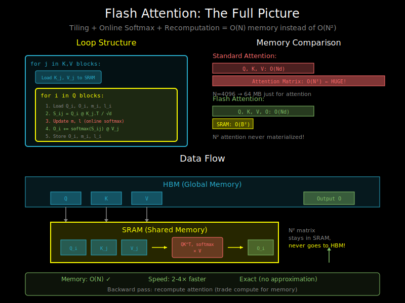

# The Flash Attention Algorithm: Putting It All Together



## Overview

Flash Attention combines three key ideas:
1. **Tiling**: Process attention in blocks that fit in SRAM
2. **Online softmax**: Compute softmax incrementally across blocks
3. **Recomputation**: Don't store attention matrix; recompute in backward pass

This document presents the complete algorithm.

## The Forward Pass Algorithm

### Inputs and Outputs

```
Inputs:
- Q: (N, d) - Query matrix
- K: (N, d) - Key matrix
- V: (N, d) - Value matrix

Outputs:
- O: (N, d) - Attention output
- L: (N,)   - Log-sum-exp values (for backward pass)
```

### Block Sizes

```
B_r = block size for Q (rows)
B_c = block size for K, V (columns)

Chosen to fit in SRAM:
- Q block: B_r × d
- K block: B_c × d
- V block: B_c × d
- Scores: B_r × B_c
- Output accumulator: B_r × d
```

### The Algorithm (Pseudocode)

```python
def flash_attention_forward(Q, K, V, B_r, B_c):
    """
    Flash Attention forward pass.

    Q, K, V: (N, d)
    Returns: O (N, d), L (N,)
    """
    N, d = Q.shape
    scale = 1.0 / sqrt(d)

    # Number of blocks
    T_r = ceil(N / B_r)  # Number of Q blocks
    T_c = ceil(N / B_c)  # Number of K, V blocks

    # Initialize output and statistics (in HBM)
    O = zeros(N, d)
    L = zeros(N)         # Will store log-sum-exp
    M = full(N, -inf)    # Running max

    # Outer loop: iterate over K, V blocks
    for j in range(T_c):
        # Load K_j, V_j to SRAM
        K_j = K[j * B_c : (j + 1) * B_c]  # (B_c, d)
        V_j = V[j * B_c : (j + 1) * B_c]  # (B_c, d)

        # Inner loop: iterate over Q blocks
        for i in range(T_r):
            # Load Q_i, O_i, L_i, M_i to SRAM
            Q_i = Q[i * B_r : (i + 1) * B_r]  # (B_r, d)
            O_i = O[i * B_r : (i + 1) * B_r]  # (B_r, d)
            l_i = L[i * B_r : (i + 1) * B_r]  # (B_r,)
            m_i = M[i * B_r : (i + 1) * B_r]  # (B_r,)

            # Compute attention scores for this block
            S_ij = scale * (Q_i @ K_j.T)      # (B_r, B_c)

            # Compute block-local max
            m_ij = max(S_ij, dim=-1)          # (B_r,)

            # Compute new max
            m_new = maximum(m_i, m_ij)        # (B_r,)

            # Compute exponentials with new max
            P_ij = exp(S_ij - m_new[:, None]) # (B_r, B_c)

            # Compute block sum
            l_ij = sum(P_ij, dim=-1)          # (B_r,)

            # Update running sum with rescaling
            l_new = exp(m_i - m_new) * l_i + l_ij  # (B_r,)

            # Update output with rescaling
            O_new = (exp(m_i - m_new) * l_i)[:, None] * O_i + P_ij @ V_j
            O_new = O_new / l_new[:, None]    # (B_r, d)

            # Write back to HBM
            O[i * B_r : (i + 1) * B_r] = O_new
            L[i * B_r : (i + 1) * B_r] = l_new
            M[i * B_r : (i + 1) * B_r] = m_new

    # Store log-sum-exp for backward pass
    L = M + log(L)  # (N,)

    return O, L
```

## Detailed Step-by-Step

Let's trace through for a small example:

```
N = 4, d = 2, B_r = B_c = 2

Q = [[1, 0],      K = [[1, 0],      V = [[1, 2],
     [0, 1],           [0, 1],           [3, 4],
     [1, 1],           [1, 1],           [5, 6],
     [0, 0]]           [0.5, 0.5]]       [7, 8]]

Initial: O = zeros(4, 2), M = [-inf, -inf, -inf, -inf], L = [0, 0, 0, 0]
```

### Iteration j=0 (K[0:2], V[0:2])

```
K_0 = [[1, 0], [0, 1]]
V_0 = [[1, 2], [3, 4]]

Inner i=0 (Q[0:2]):
  Q_0 = [[1, 0], [0, 1]]
  S_00 = Q_0 @ K_0.T = [[1, 0], [0, 1]]
  m_00 = [1, 1], P_00 = exp([[0, -1], [-1, 0]]) = [[1, 0.37], [0.37, 1]]
  l_00 = [1.37, 1.37]
  O_00 = P_00 @ V_0 / l_00 = ...

Inner i=1 (Q[2:4]):
  Q_1 = [[1, 1], [0, 0]]
  S_01 = Q_1 @ K_0.T = [[1, 1], [0, 0]]
  ...
```

### Iteration j=1 (K[2:4], V[2:4])

Each Q block is visited again, this time with the second K, V block.
The key is: we rescale previous O, L values when we find new maximums!

## Causal Masking

For decoder models, we need causal masking: position i can only attend to j ≤ i.

```python
# Add this inside the inner loop:
if causal:
    # Mask positions where query position < key position
    row_idx = i * B_r + arange(B_r)[:, None]  # (B_r, 1)
    col_idx = j * B_c + arange(B_c)[None, :]  # (1, B_c)
    mask = row_idx >= col_idx                  # (B_r, B_c)
    S_ij = where(mask, S_ij, -inf)

# Also: skip entire block if i < j (all masked)
if causal and (i + 1) * B_r <= j * B_c:
    continue  # Skip this block entirely
```

This optimization saves ~50% compute for causal attention!

## The Backward Pass

The backward pass needs to compute gradients dQ, dK, dV given dO.

**Key insight**: We DON'T need to store the N×N attention matrix!

Instead, we:
1. Recompute attention scores block-by-block (like forward)
2. Use saved L (log-sum-exp) to reconstruct softmax
3. Compute gradients using chain rule

```python
def flash_attention_backward(dO, Q, K, V, O, L, B_r, B_c):
    """
    Flash Attention backward pass.

    dO: (N, d) - gradient of loss w.r.t. output
    Q, K, V: (N, d) - inputs from forward
    O: (N, d) - output from forward
    L: (N,) - log-sum-exp from forward

    Returns: dQ, dK, dV
    """
    N, d = Q.shape
    scale = 1.0 / sqrt(d)

    dQ = zeros(N, d)
    dK = zeros(N, d)
    dV = zeros(N, d)

    # Loop structure similar to forward
    for j in range(T_c):
        K_j = K[j * B_c : (j + 1) * B_c]
        V_j = V[j * B_c : (j + 1) * B_c]
        dK_j = zeros(B_c, d)
        dV_j = zeros(B_c, d)

        for i in range(T_r):
            Q_i = Q[i * B_r : (i + 1) * B_r]
            O_i = O[i * B_r : (i + 1) * B_r]
            dO_i = dO[i * B_r : (i + 1) * B_r]
            l_i = L[i * B_r : (i + 1) * B_r]

            # Recompute attention scores
            S_ij = scale * (Q_i @ K_j.T)

            # Recompute attention weights using saved log-sum-exp
            P_ij = exp(S_ij - l_i[:, None])

            # Gradient computations
            dV_j += P_ij.T @ dO_i
            dP_ij = dO_i @ V_j.T

            # Softmax backward
            D_i = sum(dO_i * O_i, dim=-1)
            dS_ij = P_ij * (dP_ij - D_i[:, None])

            dQ[i * B_r : (i + 1) * B_r] += scale * (dS_ij @ K_j)
            dK_j += scale * (dS_ij.T @ Q_i)

        dK[j * B_c : (j + 1) * B_c] = dK_j
        dV[j * B_c : (j + 1) * B_c] = dV_j

    return dQ, dK, dV
```

## Memory Analysis

### Standard Attention Memory

```
Forward:
- Store Q, K, V: 3Nd
- Store attention matrix: N²
- Store output: Nd
Total: O(N² + Nd)

Backward:
- Need stored attention matrix: N²
```

### Flash Attention Memory

```
Forward:
- Q, K, V: 3Nd (already in HBM)
- Output: Nd
- Log-sum-exp: N
- SRAM usage: O(B_r × d + B_c × d + B_r × B_c) = O(B²) constant
Total: O(Nd) — no N² term!

Backward:
- Recompute attention: no storage needed
- Extra compute: ~2x (worth it for memory savings!)
```

## Computational Complexity

### FLOPs

Flash Attention does the same number of FLOPs as standard attention:
- Forward: O(N² × d)
- Backward: O(N² × d)

But it's faster due to:
- Reduced memory traffic
- Better cache utilization
- No materializing N² matrix

### I/O Complexity

Standard attention HBM I/O: O(N² + Nd)
Flash Attention HBM I/O: O(Nd)

For long sequences, this is a massive win:
- N = 4096, d = 64
- Standard: ~16M + 256K = ~17M
- Flash: ~256K

## Practical Implementation Notes

### Thread Block Mapping

In CUDA:
- Each thread block handles one or more Q blocks
- Threads within a block cooperate to load K, V to shared memory
- Multiple thread blocks run in parallel across SMs

### Memory Coalescing

Efficient memory access patterns:
- Load K, V in contiguous chunks
- Store O in contiguous chunks
- Use shared memory for Q block reuse

### Register Pressure

The algorithm keeps partial results in registers:
- O accumulator: B_r × d values
- m, l statistics: B_r values
- Score matrix: B_r × B_c values

For large d or B_r, may need to split further.

## Summary

Flash Attention achieves:
1. **O(N) memory** instead of O(N²)
2. **2-4x speedup** for long sequences
3. **Exact computation** (no approximation)

The key techniques:
1. Tiling to fit in SRAM
2. Online softmax for incremental computation
3. Recomputation instead of storage

What's next: See `05_flash_attention_v2_v3.md` for improvements and optimizations in later versions.
