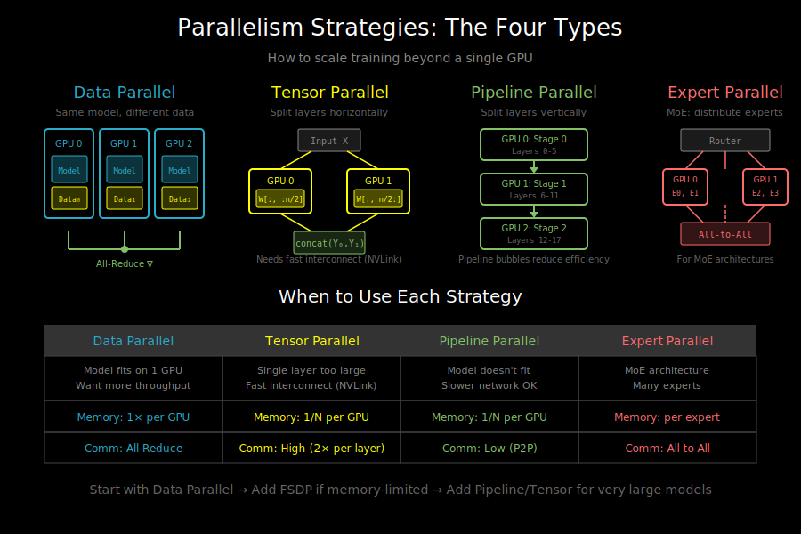

# Parallelism Strategies: How to Scale Beyond One GPU



## The Scaling Problem

Modern language models are too large for a single GPU. Consider:
- GPT-3: 175B parameters × 4 bytes (fp32) = 700GB just for weights
- A100 GPU: 80GB HBM
- Even with fp16: 350GB needed, still 4+ GPUs minimum

Beyond memory, training time is a concern:
- Training GPT-3 would take ~355 years on a single V100
- With 1024 GPUs using parallelism: ~34 days

We need strategies to split work across multiple devices.

## The Four Types of Parallelism

```
┌─────────────────────────────────────────────────────────────────┐
│                    Parallelism Strategies                       │
├─────────────────┬─────────────────┬─────────────────┬───────────┤
│ Data Parallel   │ Tensor Parallel │ Pipeline        │ Expert    │
│                 │                 │ Parallel        │ Parallel  │
├─────────────────┼─────────────────┼─────────────────┼───────────┤
│ Same model,     │ Split layers    │ Split layers    │ Split MoE │
│ different data  │ horizontally    │ vertically      │ experts   │
├─────────────────┼─────────────────┼─────────────────┼───────────┤
│ Batch splits    │ Tensor splits   │ Stage splits    │ Token     │
│ across GPUs     │ within layer    │ across layers   │ routing   │
└─────────────────┴─────────────────┴─────────────────┴───────────┘
```

## Data Parallelism (DP)

The simplest and most common strategy. Replicate the entire model on each GPU, but split the data.

```
                    Global Batch (8 samples)
                            │
            ┌───────────────┼───────────────┐
            ↓               ↓               ↓
         GPU 0           GPU 1           GPU 2
    ┌─────────────┐ ┌─────────────┐ ┌─────────────┐
    │   Model     │ │   Model     │ │   Model     │
    │  (copy 1)   │ │  (copy 2)   │  │  (copy 3)   │
    ├─────────────┤ ├─────────────┤ ├─────────────┤
    │ Samples 0-2 │ │ Samples 3-5 │ │ Samples 6-7 │
    └─────────────┘ └─────────────┘ └─────────────┘
            │               │               │
            │         Forward Pass          │
            ↓               ↓               ↓
       gradients₀      gradients₁      gradients₂
            │               │               │
            └───────────────┼───────────────┘
                            ↓
                       All-Reduce
                    (average gradients)
                            │
            ┌───────────────┼───────────────┐
            ↓               ↓               ↓
      update model₀  update model₁  update model₂
```

**Key characteristics**:
- Each GPU holds a complete model copy
- Effective batch size = per_gpu_batch × num_gpus
- Requires gradient synchronization (all-reduce)
- Scales well until communication becomes bottleneck

**When to use**: Model fits on one GPU, want to increase throughput.

## Tensor Parallelism (TP)

Split individual layers across GPUs. Each GPU computes part of each operation.

**Example: Splitting a Linear Layer**

```
Full operation: Y = XW where W is (4096, 4096)

Split column-wise across 2 GPUs:
┌──────────────────────────────────────────┐
│            X (batch, 4096)               │
│                    │                     │
│     ┌──────────────┴──────────────┐      │
│     ↓                             ↓      │
│   GPU 0                         GPU 1   │
│ W₀ (4096, 2048)            W₁ (4096, 2048)│
│     │                             │      │
│     ↓                             ↓      │
│ Y₀ (batch, 2048)           Y₁ (batch, 2048)│
│     │                             │      │
│     └──────────────┬──────────────┘      │
│                    ↓                     │
│         Y = concat(Y₀, Y₁)              │
│         shape: (batch, 4096)             │
└──────────────────────────────────────────┘
```

**For attention, we split heads**:
- GPU 0: heads 0-3
- GPU 1: heads 4-7
- Each GPU computes attention for its heads
- Results concatenated at the end

**Key characteristics**:
- Reduces memory per GPU (model weights split)
- Requires high-bandwidth interconnect (NVLink)
- More communication than data parallelism
- Usually combined with data parallelism

**When to use**: Single layer doesn't fit on one GPU.

## Pipeline Parallelism (PP)

Split the model vertically by layers. Each GPU handles a subset of layers.

```
Model: 24 transformer blocks across 4 GPUs

GPU 0         GPU 1         GPU 2         GPU 3
┌───────┐     ┌───────┐     ┌───────┐     ┌───────┐
│Embed  │     │Block  │     │Block  │     │Block  │
│Block 0│ ──► │ 6-11  │ ──► │12-17  │ ──► │18-23  │
│Block 1│     │       │     │       │     │LM Head│
│...    │     │       │     │       │     │       │
│Block 5│     │       │     │       │     │       │
└───────┘     └───────┘     └───────┘     └───────┘
 Stage 0       Stage 1       Stage 2       Stage 3
```

**The bubble problem**: Naive pipelining has low utilization.

```
Naive pipeline (batch of 1):

Time →
GPU 0: [Forward]────────────────────────────────────[Backward]
GPU 1:          [Forward]───────────────────[Backward]
GPU 2:                   [Forward]──[Backward]
GPU 3:                            [Fwd][Bwd]
       └───────── Idle (bubble) ──────────┘
```

**Solution: Micro-batching**

Split batch into micro-batches, pipeline them:

```
Micro-batch pipeline (GPipe style):

Time →
GPU 0: [F0][F1][F2][F3]────────────────────[B3][B2][B1][B0]
GPU 1:     [F0][F1][F2][F3]────────────[B3][B2][B1][B0]
GPU 2:         [F0][F1][F2][F3]────[B3][B2][B1][B0]
GPU 3:             [F0][F1][F2][F3][B3][B2][B1][B0]
                                   ↑
                           Smaller bubbles
```

**Key characteristics**:
- Memory efficient (each GPU only holds some layers)
- Pipeline bubbles reduce efficiency
- Activation memory can be large (need to save for backward)
- Less communication than tensor parallelism

**When to use**: Model layers exceed single GPU memory.

## Expert Parallelism (EP)

For Mixture-of-Experts (MoE) models, distribute experts across GPUs.

```
MoE layer with 8 experts across 4 GPUs:

                     Input tokens
                          │
                       Router
                          │
        ┌────────┬────────┼────────┬────────┐
        ↓        ↓        ↓        ↓
     GPU 0    GPU 1    GPU 2    GPU 3
   ┌───────┐┌───────┐┌───────┐┌───────┐
   │Expert ││Expert ││Expert ││Expert │
   │ 0, 1  ││ 2, 3  ││ 4, 5  ││ 6, 7  │
   └───────┘└───────┘└───────┘└───────┘
        │        │        │        │
        └────────┴────────┼────────┴────────┘
                          ↓
                    All-to-All
                   (gather results)
```

**Key characteristics**:
- Only relevant for MoE architectures
- All-to-all communication pattern
- Scales with number of experts
- Often combined with other parallelism types

## Combining Parallelism: 3D Parallelism

Real systems combine multiple strategies:

```
Example: Training a 175B model on 64 GPUs

                    Data Parallel (DP)
                    ─────────────────
                    8 replicas of the model

Within each replica:
                    Pipeline Parallel (PP)
                    ────────────────────
                    4 stages (groups of layers)

Within each stage:
                    Tensor Parallel (TP)
                    ─────────────────
                    2 GPUs per stage

Total: 8 (DP) × 4 (PP) × 2 (TP) = 64 GPUs
```

**Communication patterns**:
- TP: High-bandwidth within nodes (NVLink)
- PP: Medium bandwidth across stages
- DP: Lower frequency, can use slower interconnect

## Memory Analysis

Understanding where memory goes is crucial:

```
Memory per GPU breakdown:

┌─────────────────────────────────────┐
│          Model States               │
├─────────────────────────────────────┤
│ Parameters (P)      │ 4B or 2B     │
│ Gradients           │ 4B or 2B     │
│ Optimizer states    │ 8B-12B       │
│ (Adam: m, v, fp32)  │              │
├─────────────────────────────────────┤
│          Activations                │
├─────────────────────────────────────┤
│ Forward activations │ ~12-20B per  │
│ (for backward pass) │ transformer  │
│                     │ block        │
└─────────────────────────────────────┘

For a 7B model in fp32:
- Parameters: 7B × 4 = 28GB
- Gradients: 7B × 4 = 28GB
- Adam states: 7B × 8 = 56GB
- Total model states: ~112GB (doesn't fit on 80GB A100!)
```

## Choosing a Strategy

Decision tree:
```
Does the model fit on one GPU?
├── Yes → Use Data Parallelism (DDP)
│         Want even more speed? Add FSDP for memory
│
└── No → Does one layer fit?
         ├── Yes → Use Pipeline Parallelism + Data Parallelism
         │
         └── No → Need Tensor Parallelism
                  (probably also PP + DP for large scale)
```

**Rules of thumb**:
1. Start with DDP - simplest and scales well
2. Add FSDP/ZeRO if memory-constrained
3. Add PP if DDP+FSDP isn't enough
4. Add TP only if layers don't fit (requires fast interconnect)

## What's Next

Now that you understand the landscape, let's dive deep into each strategy:
- `02_ddp.md` - Distributed Data Parallel in detail
- `03_model_parallelism.md` - Tensor and Pipeline parallelism
- `04_zero_and_fsdp.md` - Memory-efficient data parallelism
- `05_mixed_precision.md` - fp16/bf16 training
