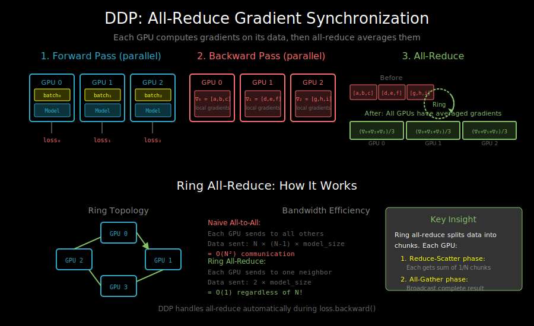

# Distributed Data Parallel: Gradient Synchronization



## What is DDP?

Distributed Data Parallel (DDP) is PyTorch's primary tool for multi-GPU training. It replicates your model on each GPU and synchronizes gradients after each backward pass.

```
                    Single GPU Training
                    ────────────────────
                    batch → forward → loss → backward → optimizer.step()

                    DDP Training (3 GPUs)
                    ─────────────────────
GPU 0: batch₀ → forward → loss₀ → backward → ┐
GPU 1: batch₁ → forward → loss₁ → backward → ├→ All-Reduce → optimizer.step()
GPU 2: batch₂ → forward → loss₂ → backward → ┘
                                              ↑
                                    Average all gradients
```

The key insight: **mathematically equivalent to single-GPU with larger batch**.

## Why DDP Works

Consider the gradient of loss over a batch:
```
∇L = (1/N) Σᵢ ∇Lᵢ    (average of per-sample gradients)
```

With DDP:
```
GPU 0: ∇L₀ = (1/n) Σᵢ∈GPU₀ ∇Lᵢ
GPU 1: ∇L₁ = (1/n) Σᵢ∈GPU₁ ∇Lᵢ
GPU 2: ∇L₂ = (1/n) Σᵢ∈GPU₂ ∇Lᵢ

Average: (∇L₀ + ∇L₁ + ∇L₂) / 3 = (1/N) Σᵢ ∇Lᵢ = ∇L
```

Same gradient, just computed in parallel!

## The All-Reduce Operation

All-reduce is the core communication primitive in DDP:

```
Before All-Reduce:
GPU 0: [g₀₀, g₀₁, g₀₂]
GPU 1: [g₁₀, g₁₁, g₁₂]
GPU 2: [g₂₀, g₂₁, g₂₂]

After All-Reduce (sum):
GPU 0: [g₀₀+g₁₀+g₂₀, g₀₁+g₁₁+g₂₁, g₀₂+g₁₂+g₂₂]
GPU 1: [g₀₀+g₁₀+g₂₀, g₀₁+g₁₁+g₂₁, g₀₂+g₁₂+g₂₂]
GPU 2: [g₀₀+g₁₀+g₂₀, g₀₁+g₁₁+g₂₁, g₀₂+g₁₂+g₂₂]

All GPUs have the same result!
```

**Implementation**: Ring All-Reduce

```
Ring topology (4 GPUs):

    GPU 0 ──────► GPU 1
      ▲            │
      │            ▼
    GPU 3 ◄────── GPU 2

Phase 1: Reduce-Scatter
- Each GPU sends chunk to next, receives from prev
- After N-1 steps, each GPU has sum of one chunk

Phase 2: All-Gather
- Each GPU broadcasts its complete chunk
- After N-1 steps, all GPUs have all sums
```

**Bandwidth analysis**:
- Total data: N × model_size
- Ring all-reduce: 2 × model_size (independent of N!)
- This is why DDP scales well

## Basic DDP Usage

```python
import torch
import torch.distributed as dist
from torch.nn.parallel import DistributedDataParallel as DDP

def setup(rank, world_size):
    """Initialize distributed process group."""
    dist.init_process_group(
        backend="nccl",  # Use NCCL for GPU communication
        init_method="env://",  # Use environment variables
        world_size=world_size,
        rank=rank
    )
    torch.cuda.set_device(rank)

def train(rank, world_size):
    setup(rank, world_size)

    # Create model and move to GPU
    model = TransformerModel().to(rank)

    # Wrap with DDP
    model = DDP(model, device_ids=[rank])

    optimizer = torch.optim.AdamW(model.parameters(), lr=1e-4)

    # Training loop (mostly unchanged!)
    for batch in dataloader:
        optimizer.zero_grad()
        loss = model(batch)
        loss.backward()  # Gradients synchronized automatically
        optimizer.step()

    dist.destroy_process_group()

# Launch with: torchrun --nproc_per_node=4 train.py
```

## Key DDP Concepts

### 1. Process Group

A process group is a set of processes that can communicate:

```python
# Default group (all GPUs)
dist.init_process_group(backend="nccl")

# Custom groups for hierarchical communication
group_a = dist.new_group([0, 1])  # GPUs 0, 1
group_b = dist.new_group([2, 3])  # GPUs 2, 3
```

### 2. Backends

```
┌──────────┬──────────────┬─────────────────────────────┐
│ Backend  │ Best for     │ Notes                       │
├──────────┼──────────────┼─────────────────────────────┤
│ NCCL     │ GPU ↔ GPU    │ Fastest for NVIDIA GPUs     │
│ Gloo     │ CPU, fallback│ Works everywhere            │
│ MPI      │ HPC clusters │ Requires MPI installation   │
└──────────┴──────────────┴─────────────────────────────┘
```

### 3. World Size and Rank

```
World size = total number of processes
Rank = unique ID for each process (0 to world_size-1)

Example: 2 nodes × 4 GPUs = 8 processes
Node 0: ranks 0, 1, 2, 3
Node 1: ranks 4, 5, 6, 7
```

## The DistributedSampler

Critical for DDP: each GPU must see different data!

```python
from torch.utils.data import DataLoader, DistributedSampler

# Without DistributedSampler: all GPUs see same data (wrong!)
# With DistributedSampler: each GPU sees unique subset

sampler = DistributedSampler(
    dataset,
    num_replicas=world_size,  # Total number of GPUs
    rank=rank,                 # This GPU's rank
    shuffle=True
)

dataloader = DataLoader(
    dataset,
    batch_size=per_gpu_batch_size,  # Per GPU, not total!
    sampler=sampler,
    num_workers=4,
    pin_memory=True
)

# Important: reshuffle each epoch
for epoch in range(num_epochs):
    sampler.set_epoch(epoch)  # Different shuffle per epoch
    for batch in dataloader:
        ...
```

**Why set_epoch matters**:
```
Without set_epoch:
Epoch 1: GPU 0 sees [0,1,2], GPU 1 sees [3,4,5]
Epoch 2: GPU 0 sees [0,1,2], GPU 1 sees [3,4,5]  # Same!

With set_epoch:
Epoch 1: GPU 0 sees [0,1,2], GPU 1 sees [3,4,5]
Epoch 2: GPU 0 sees [2,4,1], GPU 1 sees [0,5,3]  # Shuffled!
```

## Gradient Bucketing

DDP doesn't wait for all gradients before communicating. It uses **bucketing**:

```
Model parameters: [p₁, p₂, p₃, p₄, p₅, p₆, p₇, p₈]

Bucket 1: [p₁, p₂]     ← Start all-reduce when full
Bucket 2: [p₃, p₄, p₅] ← Start all-reduce when full
Bucket 3: [p₆, p₇, p₈] ← Start all-reduce when full

Timeline:
backward:  ←──────────────────────────────────────────
           p₈ → p₇ → p₆ → p₅ → p₄ → p₃ → p₂ → p₁
                      │         │              │
all-reduce:        [bucket 3] [bucket 2]   [bucket 1]
                                                    ↓
                                        Communication overlaps
                                        with backward pass!
```

**Why backward order?**
- PyTorch computes gradients in reverse order
- Later parameters (output layers) finish first
- DDP starts communicating immediately

```python
# Control bucket size
model = DDP(model, device_ids=[rank], bucket_cap_mb=25)  # Default: 25MB
```

## Synchronization Points

DDP automatically synchronizes at these points:

1. **Gradient all-reduce** (during backward)
2. **Model initialization** (broadcast from rank 0)

What's NOT synchronized:
- Forward pass (each GPU independent)
- Optimizer state (each GPU maintains own copy)
- Anything in `with torch.no_grad():`

## Common Pitfalls

### 1. Unused Parameters

```python
# If some parameters don't get gradients, DDP hangs!

class BrokenModel(nn.Module):
    def __init__(self):
        self.layer1 = nn.Linear(10, 10)
        self.layer2 = nn.Linear(10, 10)  # Never used!

    def forward(self, x):
        return self.layer1(x)  # layer2 has no gradient

# Fix: find_unused_parameters=True (slower)
model = DDP(model, device_ids=[rank], find_unused_parameters=True)

# Better fix: remove unused parameters
```

### 2. Operations Before DDP Wrapper

```python
# Wrong: modifying model after DDP wrap
model = DDP(model, device_ids=[rank])
model.module.some_param = ...  # Other GPUs don't see this!

# Right: modify before wrapping
model.some_param = ...
model = DDP(model, device_ids=[rank])
```

### 3. Different Model Behavior

```python
# Dropout behaves differently with different random seeds

# Ensure same behavior
torch.manual_seed(seed)
torch.cuda.manual_seed(seed)
# Or sync random states explicitly
```

### 4. Logging and Checkpointing

```python
# Only rank 0 should log/save
if rank == 0:
    print(f"Loss: {loss.item()}")
    torch.save(model.module.state_dict(), "checkpoint.pt")
    # Note: model.module, not model (to get unwrapped model)
```

## Performance Tips

### 1. Use gradient_as_bucket_view

```python
# Reduce memory copy overhead
model = DDP(model, device_ids=[rank], gradient_as_bucket_view=True)
```

### 2. Overlap Computation and Communication

```python
# DDP does this automatically with bucketing
# But ensure your model has enough parameters per bucket
```

### 3. Optimal Batch Size

```
Effective batch size = per_gpu_batch × num_gpus

Guidelines:
- Start with batch size that fits in memory
- Scale learning rate with effective batch size (linear scaling rule)
- May need warmup when using large effective batches
```

### 4. Gradient Accumulation

```python
# Simulate larger batches without more GPUs
accumulation_steps = 4

for i, batch in enumerate(dataloader):
    loss = model(batch) / accumulation_steps
    loss.backward()

    if (i + 1) % accumulation_steps == 0:
        optimizer.step()
        optimizer.zero_grad()
```

## Complete Training Script Structure

```python
import os
import torch
import torch.distributed as dist
from torch.nn.parallel import DistributedDataParallel as DDP
from torch.utils.data import DataLoader, DistributedSampler

def setup():
    dist.init_process_group(backend="nccl")
    rank = dist.get_rank()
    world_size = dist.get_world_size()
    torch.cuda.set_device(rank)
    return rank, world_size

def cleanup():
    dist.destroy_process_group()

def main():
    rank, world_size = setup()

    # Model
    model = MyModel().to(rank)
    model = DDP(model, device_ids=[rank])

    # Data
    sampler = DistributedSampler(dataset, num_replicas=world_size, rank=rank)
    dataloader = DataLoader(dataset, batch_size=32, sampler=sampler)

    # Training
    optimizer = torch.optim.AdamW(model.parameters(), lr=1e-4)

    for epoch in range(num_epochs):
        sampler.set_epoch(epoch)
        model.train()

        for batch in dataloader:
            batch = batch.to(rank)
            optimizer.zero_grad()
            loss = model(batch).loss
            loss.backward()
            optimizer.step()

        # Checkpoint (rank 0 only)
        if rank == 0:
            torch.save(model.module.state_dict(), f"epoch_{epoch}.pt")

    cleanup()

if __name__ == "__main__":
    main()
```

Launch with:
```bash
# Single node, 4 GPUs
torchrun --nproc_per_node=4 train.py

# Multi-node (2 nodes, 4 GPUs each)
# On node 0:
torchrun --nproc_per_node=4 --nnodes=2 --node_rank=0 \
         --master_addr=node0_ip --master_port=29500 train.py

# On node 1:
torchrun --nproc_per_node=4 --nnodes=2 --node_rank=1 \
         --master_addr=node0_ip --master_port=29500 train.py
```

## What's Next

DDP requires each GPU to hold the entire model. When models get too large, we need more sophisticated approaches:
- `03_model_parallelism.md` - Split the model across GPUs
- `04_zero_and_fsdp.md` - Memory-efficient data parallelism
