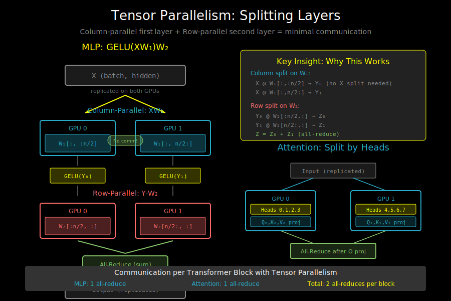

# Model Parallelism: Tensor and Pipeline



## When Data Parallelism Isn't Enough

DDP requires each GPU to hold a complete model copy. For large models:

```
GPT-3 (175B parameters):
- fp32 weights: 175B × 4 bytes = 700 GB
- fp16 weights: 175B × 2 bytes = 350 GB
- A100 HBM: 80 GB

Even with fp16: 350 GB ÷ 80 GB = 5+ GPUs minimum just for weights
(And we haven't counted gradients, optimizer states, activations!)
```

**Solution**: Split the model itself across GPUs.

## Two Types of Model Parallelism

```
Model with 4 transformer blocks:

┌─────────────┐
│ Embedding   │
├─────────────┤
│  Block 1    │
├─────────────┤
│  Block 2    │
├─────────────┤
│  Block 3    │
├─────────────┤
│  Block 4    │
├─────────────┤
│  LM Head    │
└─────────────┘

Tensor Parallelism:          Pipeline Parallelism:
Split WITHIN layers          Split ACROSS layers

┌──────┬──────┐              ┌─────────────┐ GPU 0
│GPU 0 │GPU 1 │              │ Embedding   │
├──────┼──────┤              │ Block 1     │
│      │      │              │ Block 2     │
│      │      │              ├─────────────┤ GPU 1
│ Each layer  │              │ Block 3     │
│ split in    │              │ Block 4     │
│ half        │              │ LM Head     │
└──────┴──────┘              └─────────────┘
```

## Tensor Parallelism (TP)

Split individual operations across GPUs. Most commonly applied to:
- Linear layers (MLP)
- Attention heads

### Splitting Linear Layers

A linear layer: Y = XW + b

**Column-wise split** (split output features):
```
W shape: (d_in, d_out)
Split into: W₁ (d_in, d_out/2), W₂ (d_in, d_out/2)

GPU 0: Y₁ = X @ W₁    # (batch, d_out/2)
GPU 1: Y₂ = X @ W₂    # (batch, d_out/2)

Result: Y = concat(Y₁, Y₂)  # (batch, d_out)

Note: X must be on both GPUs (replicated)
      Y is split across GPUs
```

**Row-wise split** (split input features):
```
W shape: (d_in, d_out)
Split into: W₁ (d_in/2, d_out), W₂ (d_in/2, d_out)

X must also be split: X₁ (batch, d_in/2), X₂ (batch, d_in/2)

GPU 0: Y₁ = X₁ @ W₁    # (batch, d_out)
GPU 1: Y₂ = X₂ @ W₂    # (batch, d_out)

Result: Y = Y₁ + Y₂    # All-reduce to sum

Note: Input is split, output is replicated (after all-reduce)
```

### MLP Tensor Parallelism

Transformer MLP: `Y = GELU(X @ W₁) @ W₂`

```
Clever split to minimize communication:

            X (replicated)
            │
    ┌───────┴───────┐
    ↓               ↓
  X @ W₁ᵃ        X @ W₁ᵇ       ← Column split (no comm needed)
    │               │
  GELU            GELU
    │               │
  Y₁ @ W₂ᵃ       Y₂ @ W₂ᵇ      ← Row split (input already split!)
    │               │
    └───────┬───────┘
            ↓
       All-Reduce              ← Only ONE communication!
            ↓
         Output
```

**Key insight**: Column split on first layer, row split on second layer = only 1 all-reduce per MLP.

### Attention Tensor Parallelism

Split attention heads across GPUs:

```
8-head attention on 2 GPUs:

GPU 0: heads 0, 1, 2, 3
GPU 1: heads 4, 5, 6, 7

              Input X (replicated)
                    │
         ┌──────────┴──────────┐
         ↓                     ↓
     Q₀,K₀,V₀              Q₁,K₁,V₁       (heads 0-3)   (heads 4-7)
         │                     │
    Attention₀            Attention₁
         │                     │
         └──────────┬──────────┘
                    ↓
              All-Reduce                   (after output projection)
                    ↓
                 Output
```

### Communication Pattern

```
Full transformer block with TP=2:

Input ──────────────────────────────────────────────────────► Output
  │                                                              ▲
  ├─► LayerNorm (replicated) ─► Attention ─► All-Reduce ─► Add ─┤
  │                               │   │                         │
  │                          GPU 0   GPU 1                      │
  │                                                             │
  └─► LayerNorm (replicated) ─► MLP ──────► All-Reduce ─► Add ──┘
                                 │   │
                            GPU 0   GPU 1

Total: 2 all-reduces per transformer block
```

### When to Use Tensor Parallelism

**Pros**:
- Reduces memory per GPU (weights split)
- No pipeline bubbles
- Works well for large individual layers

**Cons**:
- Requires high-bandwidth interconnect (NVLink)
- 2 all-reduces per layer = lots of communication
- Usually limited to 8 GPUs (within a node)

**Rule of thumb**: Use TP within a node (NVLink), PP across nodes.

## Pipeline Parallelism (PP)

Split model vertically by layers. Each GPU handles a "stage."

### Basic Pipeline

```
24-layer model on 4 GPUs:

Stage 0 (GPU 0): Embedding + Layers 0-5
Stage 1 (GPU 1): Layers 6-11
Stage 2 (GPU 2): Layers 12-17
Stage 3 (GPU 3): Layers 18-23 + LM Head

Forward pass:
Input → Stage 0 → Stage 1 → Stage 2 → Stage 3 → Loss
                ↓         ↓         ↓
          (send activations between stages)
```

### The Pipeline Bubble Problem

Naive pipelining has terrible GPU utilization:

```
Naive pipeline (1 micro-batch):

Time →
GPU 0: [  Forward  ]                            [  Backward  ]
GPU 1:              [  Forward  ]      [  Backward  ]
GPU 2:                          [ Fwd ][  Backward  ]
GPU 3:                               [F][B]

      ├──────────── Idle time ────────────┤

Utilization: ~25% (only 1 GPU active at a time!)
```

### Solution: Micro-batching

Split batch into micro-batches, pipeline them:

```
GPipe schedule (4 micro-batches):

Time →
GPU 0: [F0][F1][F2][F3]                        [B3][B2][B1][B0]
GPU 1:     [F0][F1][F2][F3]                [B3][B2][B1][B0]
GPU 2:         [F0][F1][F2][F3]        [B3][B2][B1][B0]
GPU 3:             [F0][F1][F2][F3][B3][B2][B1][B0]

       ├──── bubble ────┤  ├── bubble ──┤

Bubble ratio: (p - 1) / m
- p = number of stages
- m = number of micro-batches

With p=4, m=4: bubble = 3/4 = 75%... still bad!
With p=4, m=32: bubble = 3/32 ≈ 9.4%... much better!
```

### Interleaved Pipelines (1F1B)

More sophisticated scheduling reduces memory:

```
1F1B Schedule (1 Forward, 1 Backward):

Time →
GPU 0: [F0][F1][F2][F3][B0][F4][B1][F5][B2][F6][B3][B4][B5][B6]
GPU 1:     [F0][F1][F2][B0][F3][B1][F4][B2][F5][B3][F6][B4][B5][B6]
GPU 2:         [F0][F1][B0][F2][B1][F3][B2][F4][B3][F5][B4][F6][B5][B6]
GPU 3:             [F0][B0][F1][B1][F2][B2][F3][B3][F4][B4][F5][B5][F6][B6]

Advantage: Start backward early, clear activation memory sooner
Peak activation memory: O(p) instead of O(m)
```

### Activation Checkpointing with PP

Pipeline parallelism stores activations for backward pass. This can be huge!

```
Without checkpointing:
- Store activations for all micro-batches
- Memory: O(m × layers_per_stage × batch × seq × hidden)

With checkpointing:
- Only store layer inputs, recompute during backward
- Memory: O(m × stages × batch × seq × hidden)
- Cost: ~33% more compute
```

### Communication in Pipeline Parallelism

```
Between stages (point-to-point):
- Send: hidden states (batch, seq_len, hidden_dim)
- Typical: 1-10 GB/s sufficient (can use slower interconnect)

This is why PP works across nodes:
- TP needs 100+ GB/s (NVLink)
- PP needs ~10 GB/s (network)
```

## Combining TP and PP

Real systems use both:

```
Example: 32 GPUs organized as:
- 4 PP stages
- 8 TP degree within each stage (one node per stage)

               PP stage 0        PP stage 1        PP stage 2        PP stage 3
             ┌──────────────┐  ┌──────────────┐  ┌──────────────┐  ┌──────────────┐
Node 0:      │ 8 GPUs (TP)  │→ │ 8 GPUs (TP)  │→ │ 8 GPUs (TP)  │→ │ 8 GPUs (TP)  │
             │ Layers 0-5   │  │ Layers 6-11  │  │ Layers 12-17 │  │ Layers 18-23 │
             └──────────────┘  └──────────────┘  └──────────────┘  └──────────────┘
                    │                 │                 │                 │
             NVLink (fast)      NVLink (fast)     NVLink (fast)     NVLink (fast)
             within node       within node       within node       within node
                                      │
                              Network (slower)
                              between nodes
```

## Implementation: Basic Tensor Parallelism

```python
import torch
import torch.distributed as dist

class ColumnParallelLinear(torch.nn.Module):
    """Linear layer split column-wise across GPUs."""

    def __init__(self, in_features, out_features, world_size, rank):
        super().__init__()
        self.rank = rank
        self.world_size = world_size

        # Each GPU gets out_features // world_size columns
        self.out_features_per_rank = out_features // world_size

        self.weight = torch.nn.Parameter(
            torch.randn(in_features, self.out_features_per_rank)
        )
        self.bias = torch.nn.Parameter(
            torch.zeros(self.out_features_per_rank)
        )

    def forward(self, x):
        # x is replicated on all GPUs
        # output is split across GPUs
        return torch.nn.functional.linear(x, self.weight.t(), self.bias)


class RowParallelLinear(torch.nn.Module):
    """Linear layer split row-wise across GPUs."""

    def __init__(self, in_features, out_features, world_size, rank):
        super().__init__()
        self.rank = rank
        self.world_size = world_size

        # Each GPU gets in_features // world_size rows
        self.in_features_per_rank = in_features // world_size

        self.weight = torch.nn.Parameter(
            torch.randn(self.in_features_per_rank, out_features)
        )
        self.bias = torch.nn.Parameter(
            torch.zeros(out_features)
        ) if rank == 0 else None  # Only rank 0 has bias

    def forward(self, x):
        # x is split across GPUs (each GPU has its portion)
        out = torch.nn.functional.linear(x, self.weight.t())

        # All-reduce to get final output
        dist.all_reduce(out, op=dist.ReduceOp.SUM)

        if self.bias is not None:
            out = out + self.bias

        return out
```

## Implementation: Basic Pipeline Stage

```python
class PipelineStage(torch.nn.Module):
    """A stage in the pipeline (subset of layers)."""

    def __init__(self, layers, stage_id, num_stages):
        super().__init__()
        self.layers = torch.nn.ModuleList(layers)
        self.stage_id = stage_id
        self.num_stages = num_stages

    def forward(self, x):
        for layer in self.layers:
            x = layer(x)
        return x


def pipeline_forward(stages, micro_batches, rank):
    """Simple pipeline forward pass."""
    outputs = []

    for micro_batch in micro_batches:
        if rank == 0:
            # First stage: process input
            x = micro_batch
        else:
            # Receive from previous stage
            x = torch.zeros_like(...)  # appropriate shape
            dist.recv(x, src=rank - 1)

        # Process through this stage
        out = stages[rank](x)

        if rank == len(stages) - 1:
            # Last stage: save output
            outputs.append(out)
        else:
            # Send to next stage
            dist.send(out, dst=rank + 1)

    return outputs
```

## Choosing Parallelism Strategy

```
Decision matrix:

                    TP              PP              DP
───────────────────────────────────────────────────────────
Memory efficiency   Medium          High            Low
Communication       High            Low             Medium
Utilization         High            Medium (bubble) High
Implementation      Complex         Medium          Simple
Interconnect req.   NVLink          Any             Any
Scales to           8 GPUs          Many GPUs       Many GPUs
───────────────────────────────────────────────────────────

Common configurations:

Small model (fits on 1 GPU):
  → DP only

Medium model (fits on 1 node):
  → DP + optional TP within node

Large model (doesn't fit on 1 node):
  → TP within nodes + PP across nodes + DP for replicas
```

## What's Next

Model parallelism helps with large layers (TP) and large models (PP), but both still replicate optimizer states. For the most memory-efficient approach, see:
- `04_zero_and_fsdp.md` - Shard everything, including optimizer states
