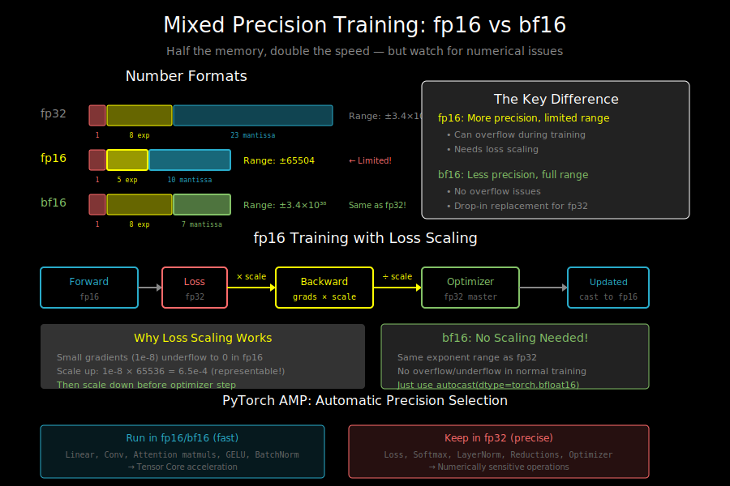

# Mixed Precision Training: fp16, bf16, and Loss Scaling



## Why Mixed Precision?

Single precision (fp32) uses 32 bits per number. Half precision (fp16/bf16) uses 16 bits:

```
Memory savings:
- 7B model in fp32: 28 GB
- 7B model in fp16: 14 GB
- 50% memory reduction!

Speed improvement:
- Tensor cores optimized for fp16/bf16
- 2-8× faster matrix multiplications
- Higher memory bandwidth efficiency
```

## Number Formats Compared

```
┌─────────┬─────────┬──────────────┬───────────────────────────────┐
│ Format  │ Bits    │ Range        │ Precision                     │
├─────────┼─────────┼──────────────┼───────────────────────────────┤
│ fp32    │ 32      │ ±3.4×10³⁸    │ ~7 decimal digits             │
│ fp16    │ 16      │ ±65504       │ ~3.3 decimal digits           │
│ bf16    │ 16      │ ±3.4×10³⁸    │ ~2.4 decimal digits           │
│ fp8     │ 8       │ varies       │ ~2 decimal digits             │
└─────────┴─────────┴──────────────┴───────────────────────────────┘

Bit layout:
fp32:  [1 sign][8 exponent][23 mantissa]
fp16:  [1 sign][5 exponent][10 mantissa]
bf16:  [1 sign][8 exponent][7 mantissa]
```

## fp16 vs bf16: The Key Difference

```
fp16: More precision, limited range
- 5-bit exponent → range ±65504
- 10-bit mantissa → ~3.3 digits precision
- Problem: gradients can overflow/underflow!

bf16: Less precision, full range
- 8-bit exponent → same range as fp32
- 7-bit mantissa → ~2.4 digits precision
- Advantage: no overflow issues, drop-in replacement for fp32

         fp16                          bf16
    ┌───────────────┐            ┌───────────────┐
    │ Good for:     │            │ Good for:     │
    │ - Inference   │            │ - Training    │
    │ - Stable ops  │            │ - Any scale   │
    │ - Consumer HW │            │ - A100, H100  │
    ├───────────────┤            ├───────────────┤
    │ Needs:        │            │ Needs:        │
    │ - Loss scaling│            │ - Nothing     │
    │ - Careful ops │            │   special!    │
    └───────────────┘            └───────────────┘
```

**When to use which**:
- **bf16**: Default choice for modern GPUs (A100, H100, TPUs)
- **fp16**: Older GPUs (V100), inference, when bf16 unavailable

## The fp16 Problem: Underflow and Overflow

fp16's limited range causes issues during training:

```
Gradient underflow:
- Small gradients (e.g., 1e-8) → 0 in fp16
- Min positive fp16: ~6×10⁻⁸
- Gradient below this becomes 0!
- Result: training stalls

Loss overflow:
- Large loss values (e.g., 100000) → inf in fp16
- Max fp16: ~65504
- Result: NaN propagation
```

**Example**:
```python
# In fp32
grad = 1e-8
grad * 1e5 = 1e-3  # Fine

# In fp16
grad = 0  # Underflowed to zero!
grad * 1e5 = 0  # Information lost
```

## Loss Scaling: The Solution for fp16

Scale up the loss before backward, scale down gradients after:

```
Standard fp32 training:
loss → backward → gradients → optimizer step

Mixed precision with loss scaling:
loss × scale → backward → gradients × (1/scale) → optimizer step
                                        ↑
                              Gradients are larger during backward,
                              avoiding underflow
```

**How it works**:
```python
scale = 65536  # Large number

# Forward (fp16)
loss = model(batch)

# Scale up before backward
scaled_loss = loss * scale
scaled_loss.backward()  # Gradients are 65536× larger

# Scale down gradients
for param in model.parameters():
    if param.grad is not None:
        param.grad /= scale

# Now optimizer can work with correctly-scaled gradients
optimizer.step()
```

## Dynamic Loss Scaling

Static scaling can still overflow. Dynamic scaling adjusts automatically:

```python
# Dynamic loss scaling algorithm:

scale = 65536
scale_growth_interval = 2000
scale_growth_factor = 2.0
scale_backoff_factor = 0.5
growth_tracker = 0

for step in training:
    optimizer.zero_grad()

    # Forward + scaled backward
    loss = model(batch)
    scaled_loss = loss * scale
    scaled_loss.backward()

    # Check for overflow
    if has_inf_or_nan(gradients):
        # Overflow! Reduce scale and skip step
        scale *= scale_backoff_factor
        growth_tracker = 0
        continue  # Skip this step

    # Unscale and step
    for p in model.parameters():
        p.grad /= scale
    optimizer.step()

    # Maybe increase scale
    growth_tracker += 1
    if growth_tracker >= scale_growth_interval:
        scale *= scale_growth_factor
        growth_tracker = 0
```

## PyTorch Automatic Mixed Precision (AMP)

PyTorch handles all this automatically:

```python
from torch.cuda.amp import autocast, GradScaler

# Initialize scaler for fp16 (not needed for bf16)
scaler = GradScaler()

for batch in dataloader:
    optimizer.zero_grad()

    # Automatic casting to fp16 in forward pass
    with autocast(dtype=torch.float16):
        loss = model(batch)

    # Scaled backward
    scaler.scale(loss).backward()

    # Unscale and step (handles overflow automatically)
    scaler.step(optimizer)

    # Update scale for next iteration
    scaler.update()

    optimizer.zero_grad()
```

### bf16 is Simpler

```python
# bf16 doesn't need GradScaler!
for batch in dataloader:
    optimizer.zero_grad()

    with autocast(dtype=torch.bfloat16):
        loss = model(batch)

    loss.backward()  # No scaling needed
    optimizer.step()
```

## What Operations Run in Which Precision?

AMP automatically chooses precision per operation:

```
┌────────────────────────────┬───────────────────────────────────┐
│ Operations in fp16/bf16    │ Operations kept in fp32           │
├────────────────────────────┼───────────────────────────────────┤
│ Linear layers (matmul)     │ Loss computation                  │
│ Convolutions               │ Softmax                           │
│ Attention (QK^T, AV)       │ Layer normalization               │
│ Batch normalization        │ Weight updates (optimizer)        │
│ Activation functions       │ Gradient accumulation             │
│ Element-wise ops           │ Reductions (sum, mean)            │
└────────────────────────────┴───────────────────────────────────┘

Why some ops stay fp32:
- Softmax: exp() can overflow with large values
- LayerNorm: variance calculation needs precision
- Loss: cross-entropy has log(), needs precision
- Optimizer: accumulating small updates needs precision
```

### Custom Precision Control

```python
# Force specific ops to fp32
with autocast(dtype=torch.float16):
    x = model.layer1(input)  # fp16

    # Force fp32 for sensitive operation
    with autocast(enabled=False):
        x = x.float()  # Convert to fp32
        x = sensitive_operation(x)
        x = x.half()  # Back to fp16

    output = model.layer2(x)  # fp16
```

## Mixed Precision with DDP and FSDP

### DDP + AMP

```python
from torch.cuda.amp import autocast, GradScaler
from torch.nn.parallel import DistributedDataParallel as DDP

model = MyModel().to(rank)
model = DDP(model, device_ids=[rank])
scaler = GradScaler()

for batch in dataloader:
    optimizer.zero_grad()

    with autocast(dtype=torch.float16):
        loss = model(batch)

    scaler.scale(loss).backward()
    scaler.step(optimizer)
    scaler.update()
```

### FSDP + Mixed Precision

```python
from torch.distributed.fsdp import FullyShardedDataParallel as FSDP
from torch.distributed.fsdp import MixedPrecision

# FSDP has built-in mixed precision support
mp_policy = MixedPrecision(
    param_dtype=torch.bfloat16,    # Store params in bf16
    reduce_dtype=torch.bfloat16,   # Gradient reductions in bf16
    buffer_dtype=torch.bfloat16,   # Buffers in bf16
)

model = FSDP(
    model,
    mixed_precision=mp_policy,
    device_id=torch.cuda.current_device(),
)

# Training loop (no GradScaler needed for bf16)
for batch in dataloader:
    loss = model(batch)
    loss.backward()
    optimizer.step()
    optimizer.zero_grad()
```

## fp32 Master Weights

Even with fp16/bf16 compute, keep optimizer state in fp32:

```
Training with fp32 master weights:

┌─────────────────────────────────────────────────────────────────┐
│                      Optimizer State (fp32)                     │
│  - Master weights: fp32 copy of parameters                      │
│  - Adam m: fp32 momentum                                        │
│  - Adam v: fp32 variance                                        │
└─────────────────────────────────────────────────────────────────┘
                              │
                              │ Cast to fp16/bf16
                              ↓
┌─────────────────────────────────────────────────────────────────┐
│                     Forward/Backward (fp16)                     │
│  - Compute in fp16/bf16 for speed                               │
│  - Gradients computed in fp16/bf16                              │
└─────────────────────────────────────────────────────────────────┘
                              │
                              │ Cast gradients to fp32
                              ↓
┌─────────────────────────────────────────────────────────────────┐
│                     Optimizer Step (fp32)                       │
│  - Update fp32 master weights                                   │
│  - Accumulate small gradient updates precisely                  │
└─────────────────────────────────────────────────────────────────┘
                              │
                              │ Cast back to fp16/bf16
                              ↓
┌─────────────────────────────────────────────────────────────────┐
│                     Model Parameters (fp16)                     │
│  - Used for next forward pass                                   │
└─────────────────────────────────────────────────────────────────┘
```

**Why fp32 master weights matter**:
```
Without fp32 master: Small updates lost
weight = 1000.0 (fp16)
grad = 0.0001 (fp16)
lr = 0.0001
update = 0.00000001 → rounds to 0 in fp16!
new_weight = 1000.0 (unchanged!)

With fp32 master: Small updates accumulate
master_weight = 1000.0 (fp32)
update = 0.00000001 (fp32) → preserved!
new_master = 999.99999999
weight = fp16(999.99999999) = 1000.0

After 100 steps:
master = 999.999999 → eventually changes to 999.99902 in fp16
```

## Common Issues and Solutions

### Issue 1: NaN/Inf in Training

```python
# Symptoms: Loss becomes NaN or inf

# Solution 1: Check for overflow
with autocast(dtype=torch.float16):
    loss = model(batch)

if torch.isnan(loss) or torch.isinf(loss):
    print("Loss overflow! Current scale:", scaler.get_scale())

# Solution 2: Use bf16 instead of fp16
with autocast(dtype=torch.bfloat16):  # No overflow issues
    loss = model(batch)
```

### Issue 2: Training Instability

```python
# Symptoms: Loss spikes, poor convergence

# Solution: Keep problematic layers in fp32
class StableModel(nn.Module):
    def __init__(self):
        self.unstable_layer = nn.Linear(...)  # Keep in fp32

    def forward(self, x):
        with autocast(enabled=False):  # Force fp32
            x = self.unstable_layer(x.float())
        return x
```

### Issue 3: Gradient Scaler Not Growing

```python
# Symptoms: Scaler scale stays low or keeps decreasing

# Debug: Check for inf gradients
for name, param in model.named_parameters():
    if param.grad is not None:
        if torch.isnan(param.grad).any() or torch.isinf(param.grad).any():
            print(f"Bad gradient in {name}")

# Solution: Adjust scaler parameters
scaler = GradScaler(
    init_scale=2**16,           # Starting scale
    growth_factor=2.0,          # How much to increase
    backoff_factor=0.5,         # How much to decrease on overflow
    growth_interval=1000,       # Steps between growth attempts
)
```

## Performance Tips

### 1. Use TensorFloat-32 (TF32) on Ampere+ GPUs

```python
# TF32: fp32 range, fp16 throughput, automatic on A100+
torch.backends.cuda.matmul.allow_tf32 = True
torch.backends.cudnn.allow_tf32 = True

# Now fp32 matmuls use TF32 precision but fp32 range
# Best of both worlds for many workloads
```

### 2. Profile to Find Bottlenecks

```python
# Check if you're actually getting speedup
with torch.profiler.profile(
    activities=[torch.profiler.ProfilerActivity.CUDA],
    record_shapes=True,
) as prof:
    with autocast(dtype=torch.float16):
        output = model(input)

print(prof.key_averages().table(sort_by="cuda_time_total"))
```

### 3. Batch Size Matters

```
Mixed precision allows larger batches:
- fp32: batch_size=16 (OOM at 32)
- fp16: batch_size=32 (or even 64)

Larger batches → better GPU utilization → faster training
```

## Summary: When to Use What

```
┌─────────────────┬────────────────────────────────────────────────┐
│ Scenario        │ Recommendation                                 │
├─────────────────┼────────────────────────────────────────────────┤
│ A100/H100 GPU   │ bf16 (no loss scaling needed)                  │
│ V100 GPU        │ fp16 + loss scaling                            │
│ TPU             │ bf16 (native support)                          │
│ Consumer GPU    │ fp16 + loss scaling                            │
│ Inference       │ fp16 or int8 quantization                      │
│ Very large      │ bf16 + FSDP mixed precision                    │
│ model           │                                                │
└─────────────────┴────────────────────────────────────────────────┘
```

## What's Next

Now you understand the core distributed training techniques:
- Data parallelism (DDP)
- Model parallelism (TP, PP)
- Memory-efficient parallelism (FSDP, ZeRO)
- Mixed precision (fp16, bf16)

See `06_references.md` for further reading and the labs to practice these concepts hands-on.
