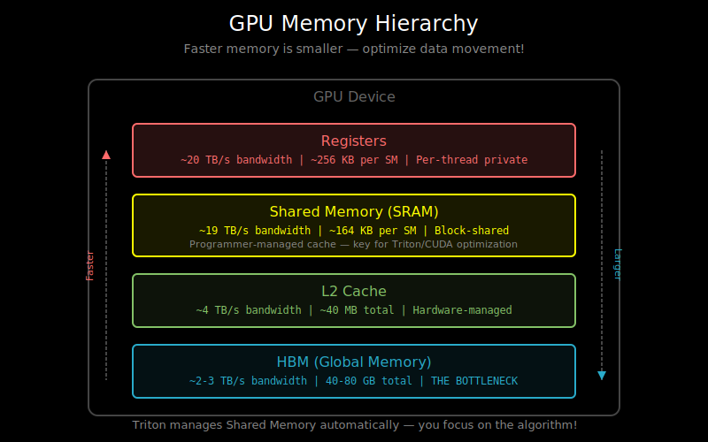

# Triton Basics: Python-like GPU Kernel Programming

## Why Write Custom Kernels?

Deep learning frameworks like PyTorch provide high-level operations (matrix multiply, softmax, etc.), but sometimes you need:

1. **Fused operations**: Combine multiple ops to reduce memory traffic
2. **Custom algorithms**: Implement something not in the framework
3. **Performance tuning**: Squeeze out every bit of performance for your specific use case

The traditional path: write CUDA in C++. The problem: steep learning curve, verbose code, hard to debug.

**Triton** offers a middle ground: write GPU kernels in Python with block-level programming.

## The GPU Programming Model

Before diving into Triton, understand the basics:



```
GPU Architecture:
┌─────────────────────────────────────────────────────────┐
│                    GPU Device                            │
│  ┌─────────┐ ┌─────────┐ ┌─────────┐ ┌─────────┐       │
│  │   SM    │ │   SM    │ │   SM    │ │   SM    │ ...   │
│  │(Cores)  │ │(Cores)  │ │(Cores)  │ │(Cores)  │       │
│  │ SRAM    │ │ SRAM    │ │ SRAM    │ │ SRAM    │       │
│  └─────────┘ └─────────┘ └─────────┘ └─────────┘       │
│                          ↕                               │
│              ┌─────────────────────┐                    │
│              │    HBM (Global)     │                    │
│              │   High Bandwidth    │                    │
│              │   Memory            │                    │
│              └─────────────────────┘                    │
└─────────────────────────────────────────────────────────┘
```

- **SM (Streaming Multiprocessor)**: Independent processing unit with many cores
- **SRAM**: Fast on-chip memory (~20 TB/s), small (~192KB per SM)
- **HBM**: Slower global memory (~2 TB/s), large (up to 80GB)

## CUDA vs Triton: The Abstraction Level

**CUDA** (thread-level):
```cuda
// Each thread handles one element
__global__ void add(float* a, float* b, float* c, int n) {
    int idx = blockIdx.x * blockDim.x + threadIdx.x;
    if (idx < n) {
        c[idx] = a[idx] + b[idx];
    }
}
```

**Triton** (block-level):
```python
@triton.jit
def add_kernel(a_ptr, b_ptr, c_ptr, n, BLOCK_SIZE: tl.constexpr):
    # Each program instance handles BLOCK_SIZE elements
    pid = tl.program_id(0)
    offsets = pid * BLOCK_SIZE + tl.arange(0, BLOCK_SIZE)
    mask = offsets < n

    # Load blocks of data
    a = tl.load(a_ptr + offsets, mask=mask)
    b = tl.load(b_ptr + offsets, mask=mask)

    # Compute and store
    tl.store(c_ptr + offsets, a + b, mask=mask)
```

The key difference: Triton operates on **blocks** of elements, not individual threads.

## Core Triton Concepts

### 1. Program IDs and Blocks

```python
@triton.jit
def kernel(x_ptr, BLOCK_SIZE: tl.constexpr):
    # Which block is this program instance processing?
    pid = tl.program_id(axis=0)

    # Generate indices for this block
    # If pid=0, BLOCK_SIZE=64: offsets = [0, 1, 2, ..., 63]
    # If pid=1, BLOCK_SIZE=64: offsets = [64, 65, 66, ..., 127]
    offsets = pid * BLOCK_SIZE + tl.arange(0, BLOCK_SIZE)
```

Launching the kernel:
```python
# Launch with enough program instances to cover all data
grid = (triton.cdiv(n, BLOCK_SIZE),)  # ceil(n / BLOCK_SIZE)
kernel[grid](x_ptr, BLOCK_SIZE=64)
```

### 2. Memory Operations

```python
# Load from global memory
data = tl.load(ptr + offsets, mask=mask, other=0.0)

# Store to global memory
tl.store(ptr + offsets, data, mask=mask)
```

The `mask` parameter handles boundary conditions:
```python
# If n=100, BLOCK_SIZE=64, pid=1:
# offsets = [64, 65, ..., 127]
# mask = [True]*36 + [False]*28  (only first 36 are valid)
mask = offsets < n
```

### 3. Constexpr Parameters

```python
def kernel(x_ptr, n, BLOCK_SIZE: tl.constexpr):
    #             ^^^^^^^^^^^^^^^^^^^^^^^^^^^
    # This must be known at compile time
```

`constexpr` values are baked into the compiled kernel, enabling optimizations.

## A Complete Example: Vector Add

```python
import torch
import triton
import triton.language as tl

@triton.jit
def add_kernel(
    x_ptr, y_ptr, output_ptr,
    n_elements,
    BLOCK_SIZE: tl.constexpr,
):
    """Add two vectors element-wise."""
    # Which block of elements does this program instance process?
    pid = tl.program_id(axis=0)

    # Compute the starting offset for this block
    block_start = pid * BLOCK_SIZE

    # Generate offsets for this block
    offsets = block_start + tl.arange(0, BLOCK_SIZE)

    # Create a mask for boundary handling
    mask = offsets < n_elements

    # Load data from global memory
    x = tl.load(x_ptr + offsets, mask=mask)
    y = tl.load(y_ptr + offsets, mask=mask)

    # Perform computation
    output = x + y

    # Store result to global memory
    tl.store(output_ptr + offsets, output, mask=mask)


def add(x: torch.Tensor, y: torch.Tensor) -> torch.Tensor:
    """Python wrapper for the Triton kernel."""
    output = torch.empty_like(x)
    n_elements = x.numel()

    # Determine grid size
    BLOCK_SIZE = 1024
    grid = (triton.cdiv(n_elements, BLOCK_SIZE),)

    # Launch kernel
    add_kernel[grid](
        x, y, output,
        n_elements,
        BLOCK_SIZE=BLOCK_SIZE,
    )
    return output


# Usage
x = torch.randn(10000, device='cuda')
y = torch.randn(10000, device='cuda')
z = add(x, y)

# Verify correctness
assert torch.allclose(z, x + y)
```

## 2D Blocks: Matrix Operations

For matrix operations, we often use 2D blocking:

```python
@triton.jit
def matmul_kernel(
    a_ptr, b_ptr, c_ptr,
    M, N, K,
    stride_am, stride_ak,
    stride_bk, stride_bn,
    stride_cm, stride_cn,
    BLOCK_M: tl.constexpr, BLOCK_N: tl.constexpr, BLOCK_K: tl.constexpr,
):
    """Matrix multiply: C = A @ B"""
    # Which output block does this program compute?
    pid_m = tl.program_id(0)
    pid_n = tl.program_id(1)

    # Compute starting positions
    offs_m = pid_m * BLOCK_M + tl.arange(0, BLOCK_M)
    offs_n = pid_n * BLOCK_N + tl.arange(0, BLOCK_N)
    offs_k = tl.arange(0, BLOCK_K)

    # Initialize accumulator
    acc = tl.zeros((BLOCK_M, BLOCK_N), dtype=tl.float32)

    # Iterate over K dimension
    for k_start in range(0, K, BLOCK_K):
        # Load A block: (BLOCK_M, BLOCK_K)
        a_ptrs = a_ptr + offs_m[:, None] * stride_am + (k_start + offs_k[None, :]) * stride_ak
        a = tl.load(a_ptrs, mask=(offs_m[:, None] < M) & ((k_start + offs_k[None, :]) < K))

        # Load B block: (BLOCK_K, BLOCK_N)
        b_ptrs = b_ptr + (k_start + offs_k[:, None]) * stride_bk + offs_n[None, :] * stride_bn
        b = tl.load(b_ptrs, mask=((k_start + offs_k[:, None]) < K) & (offs_n[None, :] < N))

        # Accumulate
        acc += tl.dot(a, b)

    # Store result
    c_ptrs = c_ptr + offs_m[:, None] * stride_cm + offs_n[None, :] * stride_cn
    tl.store(c_ptrs, acc, mask=(offs_m[:, None] < M) & (offs_n[None, :] < N))
```

Key patterns:
- `[:, None]` and `[None, :]` for broadcasting to 2D
- `tl.dot()` for block matrix multiply (uses tensor cores if available)
- Strided memory access patterns

## Triton's Compilation Pipeline

```
Python code with @triton.jit
          ↓
    Triton IR (MLIR)
          ↓
    Optimizations:
    - Memory coalescing
    - Loop unrolling
    - Register allocation
          ↓
    LLVM IR
          ↓
    PTX (NVIDIA) or AMDGCN (AMD)
          ↓
    Binary (cubin)
```

Triton handles:
- Thread block scheduling
- Shared memory allocation and synchronization
- Memory coalescing
- Many low-level optimizations

You focus on the algorithm.

## Autotuning

Triton supports automatic tuning of kernel parameters:

```python
@triton.autotune(
    configs=[
        triton.Config({'BLOCK_M': 128, 'BLOCK_N': 128, 'BLOCK_K': 32}),
        triton.Config({'BLOCK_M': 128, 'BLOCK_N': 64, 'BLOCK_K': 32}),
        triton.Config({'BLOCK_M': 64, 'BLOCK_N': 128, 'BLOCK_K': 32}),
        triton.Config({'BLOCK_M': 64, 'BLOCK_N': 64, 'BLOCK_K': 64}),
    ],
    key=['M', 'N', 'K'],  # Re-tune when these change
)
@triton.jit
def matmul_kernel(...):
    ...
```

Triton will benchmark each configuration and use the fastest one.

## Common Pitfalls

### 1. Forgetting Masks
```python
# Wrong: crashes if n is not divisible by BLOCK_SIZE
data = tl.load(ptr + offsets)

# Correct: handle boundaries
mask = offsets < n
data = tl.load(ptr + offsets, mask=mask, other=0.0)
```

### 2. Non-constexpr Block Sizes
```python
# Wrong: BLOCK_SIZE must be known at compile time
def kernel(ptr, BLOCK_SIZE):  # Missing tl.constexpr!
    ...

# Correct
def kernel(ptr, BLOCK_SIZE: tl.constexpr):
    ...
```

### 3. Data Type Mismatches
```python
# Accumulator should often be float32 even with float16 inputs
acc = tl.zeros((BLOCK_M, BLOCK_N), dtype=tl.float32)  # Not tl.float16
```

## Performance Tips

1. **Choose appropriate block sizes**: Powers of 2, typically 32-256
2. **Maximize data reuse**: Load data once, use multiple times
3. **Use tl.dot()**: Leverages tensor cores for matrix operations
4. **Minimize global memory access**: HBM is the bottleneck
5. **Profile with `triton.testing.perf_report`**: Measure, don't guess

## What's Next

You now understand the basics of Triton. The next document, `02_kernel_fusion.md`, explains why fusing operations matters and how to design fused kernels for transformers.
