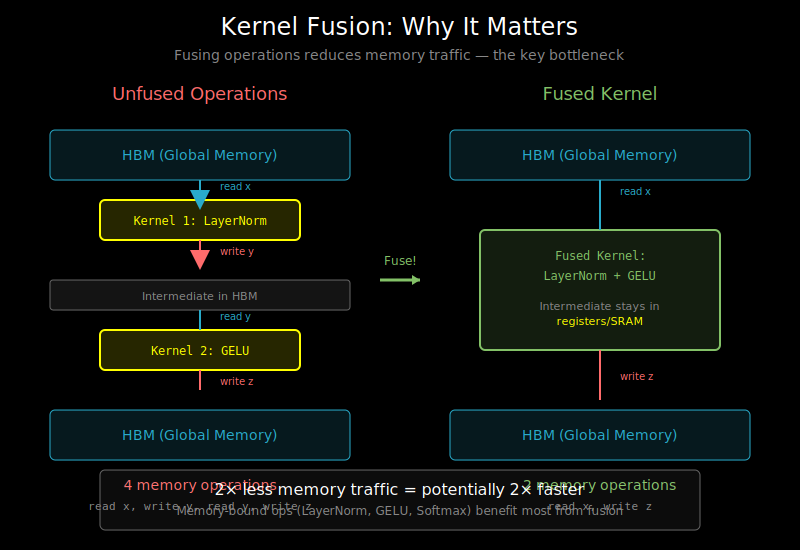

# Kernel Fusion: Combining Operations to Reduce Memory Traffic



## The Memory Bandwidth Bottleneck

Modern GPUs have enormous compute power but limited memory bandwidth:

| GPU | Compute (FP16) | Memory Bandwidth | Ratio |
|-----|----------------|------------------|-------|
| A100 | 312 TFLOPS | 2 TB/s | 156:1 |
| H100 | 1000 TFLOPS | 3.35 TB/s | 298:1 |

This means: GPUs can compute ~150-300 operations per byte loaded from memory. For many operations, **memory is the bottleneck, not compute**.

## Why Separate Kernels Are Slow

Consider computing `y = relu(layer_norm(x))`:

```python
# Naive implementation: 3 separate kernels
def forward_naive(x):
    # Kernel 1: Layer norm
    mean = x.mean(dim=-1, keepdim=True)     # Read x, write mean
    var = ((x - mean) ** 2).mean(dim=-1, keepdim=True)  # Read x, mean, write var
    x_norm = (x - mean) / torch.sqrt(var + eps)  # Read x, mean, var, write x_norm

    # Kernel 2: Scale and shift (part of layer norm)
    y = x_norm * weight + bias  # Read x_norm, weight, bias, write y

    # Kernel 3: ReLU
    y = torch.relu(y)  # Read y, write y

    return y
```

Memory traffic analysis for `x` of shape `(batch, seq_len, hidden)`:
- Multiple reads of the same data
- Multiple writes of intermediate results
- Each kernel launch has overhead

## The Fusion Solution

**Fused kernel**: Load data once, do all computation, write once.

```
Naive: Load x → Compute mean → Store mean → Load x, mean → ...
Fused: Load x → Compute mean → Compute var → Normalize → Scale → ReLU → Store y
```

Memory traffic comparison:
- **Naive**: ~6 reads + ~4 writes = 10 memory operations
- **Fused**: 1 read + 1 write = 2 memory operations

**5x less memory traffic** → potentially 5x faster for memory-bound ops.

## What to Fuse?

### Good Candidates for Fusion

1. **Element-wise operations** (same memory access pattern):
   ```python
   # Fuse: GELU, dropout, add
   y = dropout(gelu(x)) + residual
   ```

2. **Reductions followed by element-wise** (data reuse):
   ```python
   # Fuse: layer norm = mean + var + normalize
   y = (x - mean) / sqrt(var + eps) * weight + bias
   ```

3. **Softmax + operations**:
   ```python
   # Fuse: softmax + dropout
   y = dropout(softmax(x))
   ```

### Bad Candidates for Fusion

1. **Large matrix multiplies**: Already compute-bound, fusion doesn't help
   ```python
   # Don't fuse: matmul is compute-bound
   y = x @ W  # Leave this to cuBLAS/cuDNN
   ```

2. **Operations with different access patterns**:
   ```python
   # Hard to fuse: matmul (2D tiling) + softmax (row-wise)
   ```

## Fusion Pattern: LayerNorm + GELU

Let's design a fused kernel for a common transformer pattern:

```python
# Target: y = gelu(layer_norm(x))
```

### Step 1: Understand the Access Pattern

```
x: (batch * seq_len, hidden_dim)
weight, bias: (hidden_dim,)
output: (batch * seq_len, hidden_dim)

Each row is normalized independently
→ Each program processes one or more rows
```

### Step 2: Design the Kernel

```python
@triton.jit
def fused_layer_norm_gelu_kernel(
    x_ptr, weight_ptr, bias_ptr, output_ptr,
    n_rows, n_cols, eps,
    stride_x_row,
    BLOCK_SIZE: tl.constexpr,
):
    """Fused LayerNorm + GELU activation."""
    # One program per row
    row_idx = tl.program_id(0)

    # Pointer to this row
    row_start = x_ptr + row_idx * stride_x_row
    col_offsets = tl.arange(0, BLOCK_SIZE)
    mask = col_offsets < n_cols

    # Load the entire row
    x = tl.load(row_start + col_offsets, mask=mask, other=0.0)

    # === LayerNorm ===
    # Compute mean
    mean = tl.sum(x, axis=0) / n_cols

    # Compute variance
    x_centered = x - mean
    var = tl.sum(x_centered * x_centered, axis=0) / n_cols

    # Normalize
    x_norm = x_centered / tl.sqrt(var + eps)

    # Scale and shift
    weight = tl.load(weight_ptr + col_offsets, mask=mask)
    bias = tl.load(bias_ptr + col_offsets, mask=mask)
    x_ln = x_norm * weight + bias

    # === GELU ===
    # GELU(x) ≈ 0.5 * x * (1 + tanh(sqrt(2/π) * (x + 0.044715 * x^3)))
    cdf = 0.5 * (1.0 + tl.libdevice.tanh(
        0.7978845608 * (x_ln + 0.044715 * x_ln * x_ln * x_ln)
    ))
    y = x_ln * cdf

    # Store result (single write!)
    output_start = output_ptr + row_idx * stride_x_row
    tl.store(output_start + col_offsets, y, mask=mask)
```

### Step 3: The Wrapper Function

```python
def fused_layer_norm_gelu(x, weight, bias, eps=1e-5):
    """Fused LayerNorm + GELU."""
    assert x.is_contiguous()
    shape = x.shape
    x = x.view(-1, shape[-1])  # Flatten to 2D

    n_rows, n_cols = x.shape
    output = torch.empty_like(x)

    # Choose BLOCK_SIZE (must be >= n_cols, power of 2)
    BLOCK_SIZE = triton.next_power_of_2(n_cols)

    # One program per row
    grid = (n_rows,)

    fused_layer_norm_gelu_kernel[grid](
        x, weight, bias, output,
        n_rows, n_cols, eps,
        x.stride(0),
        BLOCK_SIZE=BLOCK_SIZE,
    )

    return output.view(shape)
```

## Fusion Pattern: Attention Score Computation

Fuse: `scores = softmax(QK^T / sqrt(d_k) + mask)`

```python
@triton.jit
def fused_attention_scores_kernel(
    Q_ptr, K_ptr, mask_ptr, output_ptr,
    seq_len, d_k, scale,
    stride_q_seq, stride_k_seq,
    BLOCK_M: tl.constexpr, BLOCK_N: tl.constexpr,
):
    """Compute attention scores with fused scaling, masking, and softmax."""
    # Process BLOCK_M query positions
    pid_m = tl.program_id(0)
    offs_m = pid_m * BLOCK_M + tl.arange(0, BLOCK_M)

    # Initialize max and sum for online softmax
    m_i = tl.zeros((BLOCK_M,), dtype=tl.float32) - float('inf')
    l_i = tl.zeros((BLOCK_M,), dtype=tl.float32)
    acc = tl.zeros((BLOCK_M, BLOCK_N), dtype=tl.float32)

    # Iterate over key blocks
    for k_start in range(0, seq_len, BLOCK_N):
        offs_n = k_start + tl.arange(0, BLOCK_N)

        # Load Q block: (BLOCK_M, d_k)
        q_ptrs = Q_ptr + offs_m[:, None] * stride_q_seq + tl.arange(0, d_k)[None, :]
        q = tl.load(q_ptrs, mask=offs_m[:, None] < seq_len)

        # Load K block: (BLOCK_N, d_k)
        k_ptrs = K_ptr + offs_n[:, None] * stride_k_seq + tl.arange(0, d_k)[None, :]
        k = tl.load(k_ptrs, mask=offs_n[:, None] < seq_len)

        # Compute scores: QK^T / sqrt(d_k)
        scores = tl.dot(q, tl.trans(k)) * scale  # (BLOCK_M, BLOCK_N)

        # Apply mask (e.g., causal mask)
        mask = tl.load(mask_ptr + offs_m[:, None] * seq_len + offs_n[None, :])
        scores = scores + mask  # mask contains 0 or -inf

        # Online softmax update
        m_ij = tl.max(scores, axis=1)  # New max per row
        m_new = tl.maximum(m_i, m_ij)

        # Rescale old values and add new
        alpha = tl.exp(m_i - m_new)
        beta = tl.exp(m_ij - m_new)

        l_i = alpha * l_i + beta * tl.sum(tl.exp(scores - m_ij[:, None]), axis=1)
        m_i = m_new

    # Final normalization would happen here...
```

This pattern shows the key insight behind Flash Attention: fuse softmax computation with attention.

## Performance Analysis

### Roofline Model

```
                    ┌─────────────────────────────┐
                    │                             │
   Compute          │      Compute-bound          │
   (FLOPS)          │        region               │
                    │                  ╱          │
                    │                ╱            │
                    │              ╱ ← Peak compute
                    │            ╱               │
                    │          ╱                 │
                    │        ╱                   │
                    │      ╱ Memory-bound        │
                    │    ╱     region            │
                    │  ╱                         │
                    │╱                           │
                    └─────────────────────────────┘
                         Arithmetic Intensity
                        (FLOPS / Bytes loaded)
```

- **Low arithmetic intensity** (left): Memory-bound → fuse to reduce traffic
- **High arithmetic intensity** (right): Compute-bound → fusion doesn't help much

### Calculating Arithmetic Intensity

```python
# LayerNorm: ~10 ops per element, load 1 element, write 1 element
# AI = 10 / (2 * 4) = 1.25 FLOPS/byte (very low → memory bound)

# Matrix multiply: 2*M*N*K ops, load M*K + K*N elements
# For square matrices: AI = 2*N^3 / (2*N^2) = N FLOPS/byte
# N=1024 → AI = 1024 (very high → compute bound)
```

**Rule of thumb**: If AI < 100, consider fusion. If AI > 100, let cuBLAS handle it.

## Fusion in Practice: PyTorch Integration

```python
class FusedLayerNormGELU(torch.autograd.Function):
    @staticmethod
    def forward(ctx, x, weight, bias, eps):
        output = fused_layer_norm_gelu(x, weight, bias, eps)
        ctx.save_for_backward(x, weight, bias, output)
        ctx.eps = eps
        return output

    @staticmethod
    def backward(ctx, grad_output):
        # Need to implement fused backward kernel too!
        x, weight, bias, output = ctx.saved_tensors
        # ... backward kernel ...
        return grad_x, grad_weight, grad_bias, None


class FusedLayerNormGELUModule(torch.nn.Module):
    def __init__(self, hidden_size, eps=1e-5):
        super().__init__()
        self.weight = nn.Parameter(torch.ones(hidden_size))
        self.bias = nn.Parameter(torch.zeros(hidden_size))
        self.eps = eps

    def forward(self, x):
        return FusedLayerNormGELU.apply(x, self.weight, self.bias, self.eps)
```

## Common Fusion Patterns in Transformers

| Pattern | Operations | Speedup |
|---------|------------|---------|
| Attention scores | QK^T / √d + mask + softmax | 2-3x |
| LayerNorm | mean + var + normalize + scale | 2-4x |
| GELU/SwiGLU | activation + gating | 1.5-2x |
| Bias + Dropout + Add | bias + dropout + residual | 2-3x |
| RMSNorm | rms + normalize + scale | 2-4x |

## What's Next

You now understand why and what to fuse. The next document, `03_xla_compilation.md`, covers how XLA automatically fuses operations through graph compilation.
