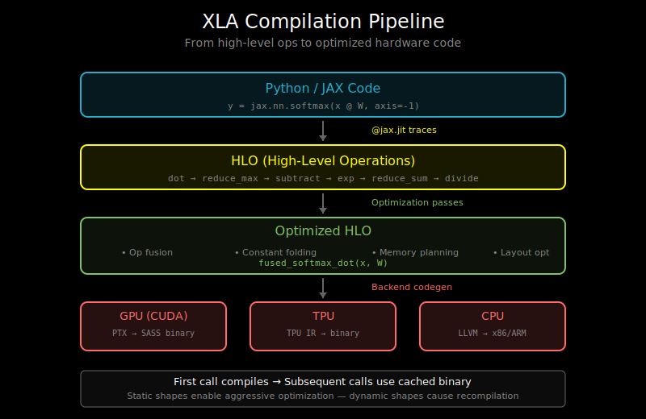

# XLA Compilation: How XLA Optimizes



## What is XLA?

**XLA (Accelerated Linear Algebra)** is a compiler for machine learning that takes high-level operations and compiles them into optimized code for various hardware backends (GPU, TPU, CPU).

```
High-level ops (matmul, softmax, etc.)
              ↓
         XLA Graph
              ↓
    XLA Optimizations:
    - Operation fusion
    - Memory planning
    - Layout optimization
              ↓
     HLO (High Level Ops)
              ↓
     Backend-specific code
     (CUDA, TPU, CPU)
```

XLA powers JAX and is available in TensorFlow. PyTorch has its own compiler (torch.compile with Inductor), but understanding XLA helps you understand compilation concepts generally.

## Eager vs Compiled Execution

### Eager Execution (PyTorch default)

```python
def forward(x, W1, W2):
    h = x @ W1        # Kernel 1: matmul
    h = F.relu(h)     # Kernel 2: ReLU
    h = h @ W2        # Kernel 3: matmul
    return h

# Each operation runs immediately
# No cross-operation optimization
```

Each operation:
1. Launches a kernel
2. Writes result to global memory
3. Next operation reads from global memory

### Compiled Execution (XLA/torch.compile)

```python
@jax.jit  # or torch.compile
def forward(x, W1, W2):
    h = x @ W1
    h = jax.nn.relu(h)
    h = h @ W2
    return h

# Operations are traced into a graph
# Graph is optimized and compiled
```

The compiler can:
1. See all operations at once
2. Fuse compatible operations
3. Optimize memory layout
4. Eliminate intermediate allocations

## XLA Compilation Pipeline

### Stage 1: Tracing

XLA traces your function to build a computation graph:

```python
import jax
import jax.numpy as jnp

def my_function(x):
    y = x * 2
    z = y + 1
    return z * z

# Trace the computation
traced = jax.make_jaxpr(my_function)(jnp.ones(10))
print(traced)

# Output (HLO-like representation):
# { lambda ; a:f32[10]. let
#     b:f32[10] = mul a 2.0
#     c:f32[10] = add b 1.0
#     d:f32[10] = mul c c
#   in (d,) }
```

### Stage 2: High-Level Optimizations

**Algebraic simplification**:
```
Before: x * 1 + 0
After:  x
```

**Constant folding**:
```
Before: 2 * 3 * x
After:  6 * x
```

**Common subexpression elimination**:
```
Before: (a + b) * c + (a + b) * d
After:  t = a + b; t * c + t * d
```

### Stage 3: Operation Fusion

XLA automatically identifies fusible operations:

```python
def attention_scores(Q, K, scale):
    scores = jnp.einsum('...qd,...kd->...qk', Q, K)
    scores = scores * scale
    scores = jax.nn.softmax(scores, axis=-1)
    return scores

# XLA will fuse: scale multiplication + softmax
# Into a single kernel
```

Fusion decisions based on:
- Memory access patterns
- Data dependencies
- Hardware capabilities

### Stage 4: Memory Planning

XLA determines:
- Which tensors can share memory (buffer aliasing)
- Optimal memory layout (row-major, column-major, tiled)
- When to deallocate intermediate buffers

```
Before optimization:
  Buffer A: [allocated] ──────────────────> [freed]
  Buffer B:        [allocated] ────────────> [freed]
  Buffer C:               [allocated] ─────> [freed]

After optimization (buffer aliasing):
  Buffer A: [allocated] ──> [reused as C] ──> [freed]
  Buffer B:        [allocated] ────────────> [freed]
```

### Stage 5: Backend Code Generation

XLA generates optimized code for the target hardware:

```
┌─────────────────────────────────────────────────────────┐
│                    Optimized HLO                        │
└─────────────────────────────────────────────────────────┘
              ↓               ↓               ↓
       ┌──────────┐    ┌──────────┐    ┌──────────┐
       │  CUDA    │    │   TPU    │    │   CPU    │
       │ Backend  │    │ Backend  │    │ Backend  │
       └──────────┘    └──────────┘    └──────────┘
              ↓               ↓               ↓
         PTX/SASS        TPU IR        LLVM IR
```

## Understanding HLO (High-Level Operations)

HLO is XLA's intermediate representation:

```
// Simple HLO example
HloModule MyModule

ENTRY main {
  p0 = f32[128,64] parameter(0)
  p1 = f32[64,256] parameter(1)
  dot = f32[128,256] dot(p0, p1), lhs_contracting_dims={1}, rhs_contracting_dims={0}
  ROOT relu = f32[128,256] maximum(dot, broadcast(constant(0)))
}
```

Key HLO operations:
- `dot`: Matrix multiplication
- `reduce`: Sum, mean, max, etc.
- `broadcast`: Expand dimensions
- `transpose`: Reorder dimensions
- `fusion`: Group of fused operations

## XLA Fusion Types

### 1. Loop Fusion

Element-wise operations become a single loop:

```
Before (2 kernels):
for i in range(n): y[i] = x[i] * 2
for i in range(n): z[i] = y[i] + 1

After (1 fused kernel):
for i in range(n): z[i] = x[i] * 2 + 1
```

### 2. Input Fusion

Fuse operations that feed into a reduction:

```
Before:
y = x * scale        # Element-wise
z = sum(y, axis=-1)  # Reduction

After (fused):
# Scale during reduction, no intermediate y
z = sum(x * scale, axis=-1)
```

### 3. Output Fusion

Fuse operations after a "root" operation:

```
Before:
y = matmul(A, B)  # Root operation
z = relu(y)       # Post-processing
w = z + bias      # More post-processing

After (fused epilogue):
# Matmul with fused ReLU and bias add
w = matmul_relu_bias(A, B, bias)
```

## Visualizing XLA Compilation

JAX provides tools to inspect compilation:

```python
import jax
from jax import make_jaxpr

def my_fn(x, y):
    return jax.nn.softmax(x @ y, axis=-1)

# See the traced computation
print(make_jaxpr(my_fn)(jnp.ones((4, 8)), jnp.ones((8, 16))))

# Get compiled HLO
compiled = jax.jit(my_fn).lower(jnp.ones((4, 8)), jnp.ones((8, 16)))
print(compiled.as_text())  # HLO text representation

# Get optimized HLO
print(compiled.compile().as_text())
```

## When XLA Helps Most

### Good for XLA

1. **Static shapes**: Known at compile time
   ```python
   @jax.jit
   def process_batch(x):  # Shape must be consistent
       return model(x)
   ```

2. **Repeated computations**: Compile once, run many times
   ```python
   for batch in dataloader:
       loss = train_step(batch)  # Same compiled function
   ```

3. **Fusible patterns**: Element-wise + reductions
   ```python
   def normalize(x):
       return (x - x.mean()) / x.std()  # All fusible
   ```

### Challenging for XLA

1. **Dynamic shapes**: Requires recompilation
   ```python
   # Different sequence lengths = different compilations
   for seq in variable_length_sequences:
       output = process(seq)  # Recompiles each time!
   ```

2. **Control flow**: Can limit optimization
   ```python
   def maybe_transform(x, flag):
       if flag:  # Python control flow
           return transform_a(x)
       return transform_b(x)
   ```

3. **Very small operations**: Compilation overhead not worth it

## XLA vs torch.compile

| Aspect | XLA (JAX/TF) | torch.compile (Inductor) |
|--------|--------------|--------------------------|
| Tracing | Functional, pure | Supports side effects |
| Dynamism | Static shapes preferred | Better dynamic support |
| Control flow | jax.lax.cond, scan | Python control flow works |
| Backend | TPU, GPU, CPU | Primarily GPU (Triton) |
| Maturity | Very mature | Newer, rapidly improving |

## Practical Tips

### 1. Help the Compiler with Static Shapes

```python
# Bad: Dynamic batch dimension
@jax.jit
def process(x):
    return model(x)

# Better: Pad to fixed size
@jax.jit
def process_fixed(x, mask):  # x always shape (max_batch, ...)
    return model(x, mask)
```

### 2. Use Appropriate Control Flow

```python
# Python if (traces both branches on first call)
def fn(x, flag):
    if flag:
        return x * 2
    return x * 3

# JAX control flow (compiles to conditional)
def fn_jax(x, flag):
    return jax.lax.cond(flag, lambda x: x * 2, lambda x: x * 3, x)
```

### 3. Profile Compilation Time

```python
import time

# First call includes compilation
start = time.time()
result = jitted_fn(x)
result.block_until_ready()
print(f"First call (with compile): {time.time() - start:.3f}s")

# Subsequent calls use cached compilation
start = time.time()
result = jitted_fn(x)
result.block_until_ready()
print(f"Second call (cached): {time.time() - start:.3f}s")
```

### 4. Cache Compilations

```python
# JAX caches by default, but can be explicit
jax.jit(fn, static_argnums=(1,))  # Recompile when arg 1 changes

# For PyTorch
torch.compile(model, mode="reduce-overhead")  # Minimize compilation
```

## What's Next

XLA provides automatic optimization. The next document, `04_jax_transformations.md`, explains JAX's functional transformations (jit, vmap, pmap) that build on this foundation.
