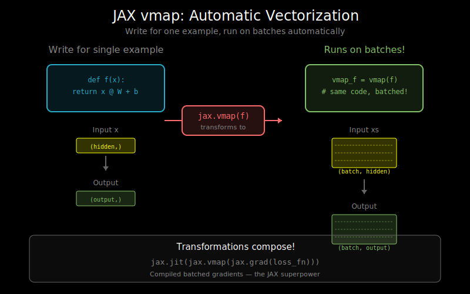

# JAX Transformations: jit, vmap, pmap Explained



## What Makes JAX Different?

JAX is built around **function transformations**: higher-order functions that take a function and return a transformed version.

```python
import jax
import jax.numpy as jnp

def f(x):
    return x ** 2 + 2 * x + 1

# Transform the function
f_grad = jax.grad(f)      # Gradient of f
f_jit = jax.jit(f)        # JIT-compiled f
f_vmap = jax.vmap(f)      # Batched f
```

This composability is JAX's superpower: `jax.jit(jax.vmap(jax.grad(f)))` works!

## The Functional Programming Model

JAX functions must be **pure**: same inputs → same outputs, no side effects.

```python
# Good: Pure function
def pure_fn(x, params):
    return x @ params['W'] + params['b']

# Bad: Impure (modifies external state)
global_counter = 0
def impure_fn(x):
    global global_counter
    global_counter += 1  # Side effect!
    return x * global_counter
```

Why pure? Transformations like `grad` and `vmap` need to trace the computation graph. Side effects break tracing.

## jit: Just-In-Time Compilation

`jax.jit` compiles a function using XLA for faster execution.

### Basic Usage

```python
def slow_fn(x):
    for _ in range(100):
        x = x @ x.T @ x
    return x

# Without JIT: each operation is a separate kernel launch
result = slow_fn(jnp.ones((100, 100)))

# With JIT: compiled into optimized fused operations
fast_fn = jax.jit(slow_fn)
result = fast_fn(jnp.ones((100, 100)))
```

### How jit Works

```
1. First call: Trace function with abstract inputs
               ↓
2. Build computation graph (jaxpr)
               ↓
3. Compile with XLA
               ↓
4. Cache compiled code
               ↓
5. Execute compiled code

Subsequent calls: Skip to step 5 (use cache)
```

### Static Arguments

Some arguments can't be traced (they affect graph structure):

```python
@jax.jit
def bad_fn(x, n):
    result = x
    for _ in range(n):  # Python loop depends on n!
        result = result * 2
    return result

# This will work but recompile for each n
bad_fn(x, 5)
bad_fn(x, 10)  # Recompiles!

# Better: mark n as static
@functools.partial(jax.jit, static_argnums=(1,))
def good_fn(x, n):
    result = x
    for _ in range(n):
        result = result * 2
    return result
```

### Donation: Reusing Input Buffers

```python
# Without donation: output needs new memory
def fn(x):
    return x * 2

# With donation: reuse input buffer for output
@functools.partial(jax.jit, donate_argnums=(0,))
def fn_donate(x):
    return x * 2  # x's memory reused for output

# Useful for in-place-style updates
result = fn_donate(x)  # x is now invalid!
```

## vmap: Automatic Vectorization

`jax.vmap` transforms a function that operates on single examples to operate on batches.

### The Magic of vmap

```python
def single_example_fn(x):
    """Process one example: x has shape (features,)"""
    return jnp.sum(x ** 2)

# Manual batching: tedious, error-prone
def manual_batch_fn(xs):
    return jnp.array([single_example_fn(x) for x in xs])

# vmap: automatic!
batch_fn = jax.vmap(single_example_fn)

# Works on batch dimension automatically
xs = jnp.ones((32, 128))  # 32 examples, 128 features each
result = batch_fn(xs)     # Shape: (32,)
```

### Specifying Batch Dimensions

```python
# Default: batch over first dimension (axis 0)
jax.vmap(fn)(xs)  # xs: (batch, ...)

# Batch over different axis
jax.vmap(fn, in_axes=1)(xs)  # xs: (features, batch)

# Different axes for different inputs
def dot(x, y):
    return jnp.dot(x, y)

# x batched over axis 0, y not batched
batched_dot = jax.vmap(dot, in_axes=(0, None))
# x: (batch, d), y: (d,) → result: (batch,)

# Both batched, different axes
batched_dot = jax.vmap(dot, in_axes=(0, 1))
# x: (batch, d), y: (d, batch) → result: (batch,)
```

### Nested vmap

```python
# Per-example, per-head attention
def single_head_attention(q, k, v):
    """Single query attending to keys/values."""
    scores = q @ k.T / jnp.sqrt(k.shape[-1])
    weights = jax.nn.softmax(scores)
    return weights @ v

# Add batch dimension
batched_attention = jax.vmap(single_head_attention)
# q: (batch, seq, d), k: (batch, seq, d), v: (batch, seq, d)

# Add head dimension
multi_head_attention = jax.vmap(batched_attention, in_axes=(2, 2, 2), out_axes=2)
# q: (batch, seq, heads, d_head), etc.
```

### vmap vs Manual Batching

```python
# Manual: works but doesn't optimize across batch
def manual_layer_norm(xs, gamma, beta, eps=1e-5):
    results = []
    for x in xs:
        mean = jnp.mean(x)
        var = jnp.var(x)
        results.append((x - mean) / jnp.sqrt(var + eps) * gamma + beta)
    return jnp.stack(results)

# vmap: single fused operation across batch
@jax.jit
@jax.vmap
def vmapped_layer_norm(x, gamma, beta, eps=1e-5):
    mean = jnp.mean(x)
    var = jnp.var(x)
    return (x - mean) / jnp.sqrt(var + eps) * gamma + beta
```

## pmap: Data Parallelism Across Devices

`jax.pmap` runs the same function on multiple devices in parallel.

### Basic Usage

```python
# Check available devices
print(jax.devices())  # [gpu:0, gpu:1, gpu:2, gpu:3]

# Function to run on each device
def fn(x):
    return x ** 2

# pmap across devices
parallel_fn = jax.pmap(fn)

# Input shape: (num_devices, ...) = (4, 1024)
xs = jnp.ones((4, 1024))
result = parallel_fn(xs)  # Runs on 4 GPUs simultaneously
```

### Data Parallel Training

```python
def loss_fn(params, x, y):
    pred = model_apply(params, x)
    return jnp.mean((pred - y) ** 2)

def train_step(params, x, y):
    loss, grads = jax.value_and_grad(loss_fn)(params, x, y)
    # Average gradients across devices
    grads = jax.lax.pmean(grads, axis_name='devices')
    # Update parameters (same update on all devices)
    params = jax.tree.map(lambda p, g: p - 0.01 * g, params, grads)
    return params, loss

# Parallelize across devices
parallel_train_step = jax.pmap(train_step, axis_name='devices')

# Training loop
for epoch in range(num_epochs):
    for batch in data_loader:
        # batch shape: (num_devices, batch_per_device, ...)
        params, loss = parallel_train_step(params, batch_x, batch_y)
```

### Collective Operations

```python
# Inside pmap, use collective ops to communicate
@jax.pmap
def parallel_fn(x, axis_name='i'):
    local_sum = jnp.sum(x)
    # Sum across all devices
    global_sum = jax.lax.psum(local_sum, axis_name='i')
    # Mean across all devices
    global_mean = jax.lax.pmean(local_sum, axis_name='i')
    return global_sum, global_mean
```

## grad: Automatic Differentiation

JAX provides flexible automatic differentiation:

```python
def f(x):
    return x ** 3 + 2 * x ** 2 + x

# First derivative
df = jax.grad(f)
print(df(2.0))  # 3*4 + 4*2 + 1 = 21

# Second derivative
d2f = jax.grad(jax.grad(f))
print(d2f(2.0))  # 6*2 + 4 = 16

# Gradient with respect to multiple arguments
def loss(params, x, y):
    return jnp.mean((params['w'] * x + params['b'] - y) ** 2)

grad_fn = jax.grad(loss)  # Gradient w.r.t. first arg (params)
grads = grad_fn(params, x, y)  # Returns dict with same structure as params
```

### value_and_grad

```python
# Often you need both the value and gradient
def train_step(params, x, y):
    def loss_fn(p):
        return compute_loss(p, x, y)

    loss, grads = jax.value_and_grad(loss_fn)(params)
    return loss, grads
```

## Composing Transformations

The real power: transformations compose naturally.

```python
def per_example_loss(params, x, y):
    """Loss for a single example."""
    pred = model(params, x)
    return (pred - y) ** 2

# Compose: batch → gradient → compile
@jax.jit
def train_step(params, xs, ys):
    # vmap: per-example → batched
    # grad: adds gradient computation
    # jit: compiles everything

    def batch_loss(p):
        losses = jax.vmap(per_example_loss, in_axes=(None, 0, 0))(p, xs, ys)
        return jnp.mean(losses)

    loss, grads = jax.value_and_grad(batch_loss)(params)
    return loss, grads
```

## Practical Example: Attention in JAX

```python
import jax
import jax.numpy as jnp

def attention_head(q, k, v, scale):
    """Single attention head for single example."""
    # q: (seq_q, d_k), k: (seq_k, d_k), v: (seq_k, d_v)
    scores = jnp.einsum('qd,kd->qk', q, k) * scale
    weights = jax.nn.softmax(scores, axis=-1)
    return jnp.einsum('qk,kv->qv', weights, v)

# Add head dimension
multi_head = jax.vmap(attention_head, in_axes=(2, 2, 2, None), out_axes=2)
# q: (seq_q, d_k, heads) → output: (seq_q, d_v, heads)

# Add batch dimension
batched_multi_head = jax.vmap(multi_head, in_axes=(0, 0, 0, None))
# q: (batch, seq_q, d_k, heads) → output: (batch, seq_q, d_v, heads)

# Compile for speed
fast_attention = jax.jit(batched_multi_head)

# Usage
batch, seq_q, seq_k, d_k, d_v, heads = 32, 128, 128, 64, 64, 8
q = jnp.ones((batch, seq_q, d_k, heads))
k = jnp.ones((batch, seq_k, d_k, heads))
v = jnp.ones((batch, seq_k, d_v, heads))
scale = 1.0 / jnp.sqrt(d_k)

output = fast_attention(q, k, v, scale)
print(output.shape)  # (32, 128, 64, 8)
```

## Common Patterns

### Pattern 1: Differentiable Sampling (Gumbel-Softmax)

```python
def gumbel_softmax(logits, key, temperature=1.0):
    gumbel_noise = -jnp.log(-jnp.log(jax.random.uniform(key, logits.shape)))
    return jax.nn.softmax((logits + gumbel_noise) / temperature)

# Works with grad because softmax is differentiable
grad_fn = jax.grad(lambda l: gumbel_softmax(l, key).sum())
```

### Pattern 2: Scan for Sequences

```python
def rnn_step(carry, x):
    h = carry
    h_new = jax.nn.tanh(h @ W_hh + x @ W_xh + b)
    return h_new, h_new  # (new_carry, output)

# Process sequence efficiently
def rnn(xs, h0):
    final_h, all_h = jax.lax.scan(rnn_step, h0, xs)
    return all_h

# Better than Python loop: compiles to efficient code
```

### Pattern 3: Conditional Computation

```python
def f(x, use_relu):
    h = x @ W
    # JAX control flow (not Python if)
    h = jax.lax.cond(use_relu, jax.nn.relu, jax.nn.gelu, h)
    return h

# Compiles to efficient conditional
jitted_f = jax.jit(f)
```

## Debugging JAX Code

```python
# Print intermediate values (breaks JIT)
def debug_fn(x):
    y = x ** 2
    jax.debug.print("y = {}", y)  # Works inside JIT
    return y + 1

# Check shapes without running
def check_shapes(x):
    y = x @ W
    jax.debug.print("y.shape = {}", y.shape)
    return y
```

## What's Next

You now understand JAX's transformation model. The next document, `05_tpu_architecture.md`, explains how TPUs work and how to write efficient TPU code.
