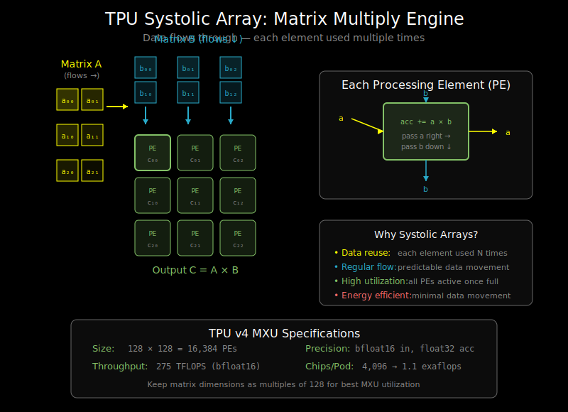

# TPU Architecture: How TPUs Work



## What is a TPU?

**TPU (Tensor Processing Unit)** is Google's custom ASIC designed specifically for machine learning workloads. Unlike general-purpose GPUs, TPUs are optimized for a narrower set of operations: matrix multiplies and convolutions.

```
GPU: General-purpose parallel processor
     - Thousands of small cores
     - Flexible but less efficient for ML

TPU: Application-specific ML accelerator
     - Large matrix multiply units
     - Less flexible but highly efficient for ML
```

## TPU Architecture Overview

```
┌─────────────────────────────────────────────────────────────────┐
│                         TPU v4 Chip                              │
│  ┌─────────────────────────────────────────────────────────┐    │
│  │                    TensorCore                             │    │
│  │  ┌────────────────┐  ┌────────────────┐                  │    │
│  │  │    MXU         │  │    MXU         │  Matrix units    │    │
│  │  │  (128×128)     │  │  (128×128)     │                  │    │
│  │  └────────────────┘  └────────────────┘                  │    │
│  │  ┌────────────────────────────────────────────────────┐  │    │
│  │  │              Vector Unit (VPU)                      │  │    │
│  │  │        Element-wise ops, reductions                 │  │    │
│  │  └────────────────────────────────────────────────────┘  │    │
│  │  ┌────────────────────────────────────────────────────┐  │    │
│  │  │              Scalar Unit                            │  │    │
│  │  │        Control flow, addressing                     │  │    │
│  │  └────────────────────────────────────────────────────┘  │    │
│  └─────────────────────────────────────────────────────────┘    │
│                              ↕                                   │
│  ┌─────────────────────────────────────────────────────────┐    │
│  │                    HBM (32GB)                            │    │
│  │              High Bandwidth Memory                        │    │
│  └─────────────────────────────────────────────────────────┘    │
└─────────────────────────────────────────────────────────────────┘
```

## The Matrix Multiply Unit (MXU)

The MXU is the heart of the TPU: a **systolic array** for matrix multiplication.

### Systolic Array Concept

```
         Input Matrix A (flows right →)
              a00  a01  a02  a03
              ↓    ↓    ↓    ↓
    b00 → ┌────┬────┬────┬────┐
    b10 → │ PE │ PE │ PE │ PE │ → c00 c01 c02 c03
    b20 → ├────┼────┼────┼────┤
    b30 → │ PE │ PE │ PE │ PE │ → c10 c11 c12 c13
          ├────┼────┼────┼────┤
    ↓     │ PE │ PE │ PE │ PE │ → c20 c21 c22 c23
   Input  ├────┼────┼────┼────┤
   Matrix │ PE │ PE │ PE │ PE │ → c30 c31 c32 c33
   B      └────┴────┴────┴────┘
   (flows down ↓)                Output Matrix C
```

**PE (Processing Element)**: Each cell performs:
1. Multiply incoming A value with incoming B value
2. Add to accumulated result
3. Pass A value right, B value down

### Why Systolic Arrays?

1. **Data reuse**: Each weight is loaded once, used across entire row/column
2. **Regular data flow**: No complex memory access patterns
3. **High utilization**: Once pipeline is full, every PE is active every cycle
4. **Energy efficiency**: Minimize data movement

### MXU Specifications (TPU v4)

- **Size**: 128×128 processing elements
- **Throughput**: 128×128 = 16,384 multiply-adds per cycle
- **Precision**: bfloat16 inputs, float32 accumulation
- **Per chip**: 2 MXUs → 275 TFLOPS peak

## Memory Hierarchy

```
┌─────────────────────────────────────────────┐
│              Registers                       │
│         (Fastest, smallest)                  │
│              ~KB scale                       │
└─────────────────┬───────────────────────────┘
                  ↓
┌─────────────────────────────────────────────┐
│            Vector Memory (VMEM)              │
│         SRAM for vector operations           │
│              ~16 MB                          │
└─────────────────┬───────────────────────────┘
                  ↓
┌─────────────────────────────────────────────┐
│               HBM                            │
│         High Bandwidth Memory                │
│              32 GB (v4)                      │
│           ~1.2 TB/s bandwidth                │
└─────────────────────────────────────────────┘
```

**Key insight**: Keep operands in VMEM as much as possible. HBM access is the bottleneck.

## TPU vs GPU: Key Differences

| Aspect | GPU (NVIDIA) | TPU (Google) |
|--------|--------------|--------------|
| Core design | Many small CUDA cores | Few large MXUs |
| Programming | CUDA, Triton, flexible | XLA, less flexible |
| Memory | HBM + L2 + L1 + Shared | HBM + VMEM |
| Precision | FP32, FP16, INT8, FP8 | BF16, FP32, INT8 |
| Interconnect | NVLink (within node) | ICI (inter-chip) |
| Best for | Diverse workloads | Large-scale training |

## bfloat16: The TPU's Preferred Format

```
FP32:    1 sign + 8 exponent + 23 mantissa = 32 bits
FP16:    1 sign + 5 exponent + 10 mantissa = 16 bits
BF16:    1 sign + 8 exponent +  7 mantissa = 16 bits
             ↑
         Same as FP32!
```

**Why bfloat16?**
- Same exponent range as FP32 → same dynamic range
- Less mantissa precision, but OK for ML
- Easy conversion: truncate FP32 mantissa
- 2x memory savings, 2x throughput

## TPU Pods: Scaling Up

TPUs are designed for massive scale:

```
TPU v4 Pod:
┌─────────────────────────────────────────────────────────────┐
│                        TPU Pod                               │
│                                                              │
│  ┌────┐  ┌────┐  ┌────┐  ┌────┐        4096 chips          │
│  │TPU │──│TPU │──│TPU │──│TPU │──...   per pod              │
│  └────┘  └────┘  └────┘  └────┘                             │
│     │       │       │       │                                │
│  ┌────┐  ┌────┐  ┌────┐  ┌────┐                             │
│  │TPU │──│TPU │──│TPU │──│TPU │──...   1.1 exaflops        │
│  └────┘  └────┘  └────┘  └────┘        peak compute         │
│     │       │       │       │                                │
│    ...     ...     ...     ...                               │
│                                                              │
│  ICI (Inter-Chip Interconnect): High-speed mesh network     │
└─────────────────────────────────────────────────────────────┘
```

**ICI (Inter-Chip Interconnect)**:
- Direct chip-to-chip connections
- 3D torus topology
- Much faster than going through host CPUs

## Writing Efficient TPU Code

### 1. Maximize MXU Utilization

```python
# Good: Large matrix multiplies keep MXU busy
def good_matmul(x, W):
    # x: (batch, seq, hidden) = (256, 512, 1024)
    # W: (hidden, hidden) = (1024, 1024)
    return jnp.dot(x, W)  # Large, efficient

# Bad: Small matrices can't fill MXU
def bad_matmul(x, W):
    # x: (batch, seq, hidden) = (1, 8, 64)
    # W: (hidden, hidden) = (64, 64)
    return jnp.dot(x, W)  # MXU mostly idle
```

**Rule of thumb**: Matrix dimensions should be multiples of 128 for optimal MXU utilization.

### 2. Use Appropriate Data Types

```python
# Good: bfloat16 for activations
x = x.astype(jnp.bfloat16)
y = jnp.dot(x, W)  # BF16 matmul, 2x faster

# Accumulation happens in FP32 automatically
# Final result can be cast back to BF16
```

### 3. Minimize Host-Device Transfers

```python
# Bad: Frequent transfers
for batch in batches:
    batch = jax.device_put(batch)  # Transfer each time
    result = model(batch)
    result = jax.device_get(result)  # Transfer back

# Good: Batch transfers, keep data on device
all_batches = jax.device_put(all_batches)  # Transfer once
results = jax.vmap(model)(all_batches)      # Process all
final = jax.device_get(results)             # Transfer once
```

### 4. Pad to Efficient Dimensions

```python
def pad_to_multiple(x, multiple=128):
    """Pad tensor dimensions to multiples of 128 for TPU efficiency."""
    pad_sizes = []
    for dim in x.shape:
        remainder = dim % multiple
        pad_sizes.append((0, (multiple - remainder) % multiple))
    return jnp.pad(x, pad_sizes)

# Before: (batch=100, hidden=500) - inefficient
x = jnp.ones((100, 500))

# After: (batch=128, hidden=512) - efficient
x_padded = pad_to_multiple(x, 128)
```

## TPU-Specific Considerations

### Static Shapes Required

TPUs compile the entire computation graph. Dynamic shapes require recompilation:

```python
# Bad: Different sequence lengths cause recompilation
for seq in variable_length_sequences:
    process(seq)  # Recompiles each time!

# Good: Pad to maximum length, use mask
max_len = 512
for seq in sequences:
    padded = pad_to_length(seq, max_len)
    mask = create_mask(len(seq), max_len)
    process(padded, mask)  # Same compiled program
```

### Memory Layout Matters

```python
# TPU prefers certain memory layouts
# XLA handles this automatically, but be aware:

# Good: Contiguous in memory
x = jnp.ones((batch, seq, hidden))  # Standard layout

# Potentially slow: Non-contiguous access
x_transposed = x.transpose(2, 0, 1)  # May need copy
```

### Collective Operations

For multi-TPU training, use JAX's collective ops:

```python
@functools.partial(jax.pmap, axis_name='devices')
def train_step(params, batch):
    loss, grads = jax.value_and_grad(loss_fn)(params, batch)

    # All-reduce gradients across TPUs
    grads = jax.lax.pmean(grads, axis_name='devices')

    # Update (same on all devices)
    params = update_params(params, grads)
    return params, loss
```

## TPU Profiling

Use TensorBoard profiler for TPU:

```python
import jax.profiler

# Start profiling
jax.profiler.start_trace("/tmp/tensorboard")

# Run your code
for step in range(100):
    loss = train_step(params, batch)

# Stop profiling
jax.profiler.stop_trace()

# View in TensorBoard
# tensorboard --logdir=/tmp/tensorboard
```

Key metrics to watch:
- **MXU utilization**: Target >50%, ideally >80%
- **Memory bandwidth utilization**: Is HBM the bottleneck?
- **Infeed stall**: Are you waiting for data?

## Cloud TPU Setup

```python
# Connect to TPU in Google Cloud
import jax

# JAX automatically detects TPU
print(jax.devices())  # [TpuDevice(id=0), TpuDevice(id=1), ...]

# For TPU Pods, JAX handles distribution
# Just use pmap/pjit for multi-chip parallelism
```

## Comparison: When to Use TPU vs GPU

| Use Case | Better Hardware | Why |
|----------|-----------------|-----|
| Large-scale training | TPU | Pod scaling, ICI interconnect |
| Inference serving | GPU | More flexible batch sizes |
| Research/prototyping | GPU | Easier debugging, more tools |
| Training >1B params | TPU | Cost-effective at scale |
| Mixed workloads | GPU | More versatile |
| Production at Google | TPU | Native integration |

## What's Next

You now understand TPU architecture. The final document, `06_profiling.md`, covers how to find and fix performance bottlenecks on both GPUs and TPUs.
