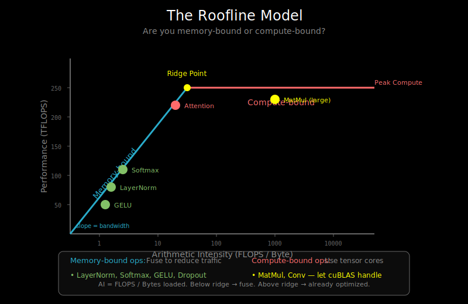

# Profiling: Finding and Fixing Bottlenecks

## Why Profile?

Performance intuition is often wrong. Profile before optimizing:

```
Common assumptions that may be wrong:
- "Matrix multiply is the bottleneck" → Often memory-bound ops are
- "This kernel is fast because it's simple" → Launch overhead matters
- "GPU utilization is 100%" → Compute vs memory utilization differs
```

## The Performance Analysis Workflow

```
1. Measure baseline
        ↓
2. Profile to find bottleneck
        ↓
3. Identify root cause
        ↓
4. Apply targeted fix
        ↓
5. Measure improvement
        ↓
   Repeat until fast enough
```

## GPU Profiling Tools

### PyTorch Profiler

The easiest starting point for PyTorch users:

```python
import torch
from torch.profiler import profile, ProfilerActivity, tensorboard_trace_handler

# Basic profiling
with profile(
    activities=[ProfilerActivity.CPU, ProfilerActivity.CUDA],
    record_shapes=True,
    profile_memory=True,
    with_stack=True
) as prof:
    for step in range(10):
        output = model(input)
        loss = criterion(output, target)
        loss.backward()

# Print summary
print(prof.key_averages().table(sort_by="cuda_time_total", row_limit=20))

# Export for TensorBoard
# tensorboard --logdir=./log
with profile(
    activities=[ProfilerActivity.CPU, ProfilerActivity.CUDA],
    on_trace_ready=tensorboard_trace_handler('./log'),
    record_shapes=True,
) as prof:
    for step in range(10):
        train_step()
        prof.step()
```

**Key metrics to examine**:
- `cuda_time_total`: Total GPU time for operation
- `self_cuda_time`: GPU time excluding child calls
- `cpu_time`: CPU time (launch overhead, data prep)
- `cuda_memory_usage`: Memory allocated

### NVIDIA Nsight Systems

For deeper GPU analysis:

```bash
# Profile a Python script
nsys profile --trace=cuda,nvtx -o profile_output python train.py

# View in Nsight Systems GUI
nsys-ui profile_output.nsys-rep
```

What to look for:
- **Kernel launch patterns**: Are you launching many small kernels?
- **Memory transfers**: Are there unexpected CPU↔GPU copies?
- **Idle gaps**: Is the GPU waiting for CPU?
- **Kernel overlap**: Are compute and memory ops overlapping?

### NVIDIA Nsight Compute

For kernel-level analysis:

```bash
# Profile specific kernels
ncu --set full -o kernel_profile python train.py

# View detailed kernel metrics
ncu-ui kernel_profile.ncu-rep
```

Key metrics:
- **SM occupancy**: What fraction of SMs are active?
- **Memory throughput**: Are you bandwidth-limited?
- **Compute throughput**: Are you compute-limited?
- **Roofline position**: Where is your kernel on the roofline?

## JAX Profiling

### JAX Built-in Profiling

```python
import jax
import jax.profiler

# Profile to TensorBoard
jax.profiler.start_trace("/tmp/tensorboard")

for step in range(100):
    loss = train_step(params, batch)
    if step == 50:
        # Get profile midway through training
        jax.profiler.save_device_memory_profile("/tmp/memory.prof")

jax.profiler.stop_trace()
```

### Timing with JAX

```python
import jax
import time

def benchmark_fn(fn, args, num_warmup=5, num_runs=100):
    """Benchmark a JAX function properly."""
    # Warmup (includes compilation)
    for _ in range(num_warmup):
        result = fn(*args)
        result.block_until_ready()  # Wait for GPU!

    # Timed runs
    start = time.perf_counter()
    for _ in range(num_runs):
        result = fn(*args)
        result.block_until_ready()
    end = time.perf_counter()

    return (end - start) / num_runs

# Usage
jitted_fn = jax.jit(my_function)
avg_time = benchmark_fn(jitted_fn, (x, y))
print(f"Average time: {avg_time * 1000:.2f} ms")
```

**Important**: Always call `block_until_ready()` for accurate timing! JAX operations are asynchronous.

## Common Bottlenecks and Fixes

### Bottleneck 1: CPU-GPU Data Transfer

**Symptom**: Large gaps between GPU kernels, high CPU time.

```python
# Bad: Transfer each batch individually
for batch in dataloader:
    batch = batch.to('cuda')  # Transfer
    output = model(batch)      # Compute (GPU waits)

# Better: Use pinned memory and async transfer
dataloader = DataLoader(dataset, pin_memory=True, num_workers=4)
for batch in dataloader:
    batch = batch.to('cuda', non_blocking=True)
    output = model(batch)
```

### Bottleneck 2: Many Small Kernels

**Symptom**: Low GPU utilization, many short kernels.

```python
# Bad: Many small operations
def forward(x):
    x = x + bias1      # Kernel 1
    x = F.relu(x)      # Kernel 2
    x = x * scale      # Kernel 3
    x = x + bias2      # Kernel 4
    return x

# Better: Fuse operations
@torch.compile  # or use custom Triton kernel
def forward_fused(x):
    x = x + bias1
    x = F.relu(x)
    x = x * scale
    x = x + bias2
    return x
```

### Bottleneck 3: Memory Bandwidth

**Symptom**: Low compute utilization, high memory bandwidth utilization.

```python
# Check: Are you memory-bound?
# Memory-bound ops: element-wise, normalization, softmax
# Compute-bound ops: matrix multiply, convolution

# Fix: Fuse memory-bound operations
# Example: Fused LayerNorm + GELU (see 02_kernel_fusion.md)
```

### Bottleneck 4: Synchronization

**Symptom**: GPU idle while waiting for CPU.

```python
# Bad: Synchronization after every op
for step in range(1000):
    output = model(input)
    print(output.mean().item())  # .item() syncs!

# Better: Batch logging, use callbacks
losses = []
for step in range(1000):
    output = model(input)
    losses.append(output.mean())

# Sync only when needed
if step % 100 == 0:
    avg_loss = torch.stack(losses).mean().item()
    print(f"Step {step}, Loss: {avg_loss}")
    losses = []
```

### Bottleneck 5: Inefficient Memory Layout

**Symptom**: Non-coalesced memory access, poor cache utilization.

```python
# Check tensor contiguity
print(x.is_contiguous())

# Fix: Make contiguous if needed
x = x.contiguous()

# Or use views that maintain contiguity
x = x.transpose(0, 1).contiguous()  # May need explicit contiguous()
```

## The Roofline Model



The roofline model helps identify whether you're compute-bound or memory-bound:

```
                        ┌─────────────────────────────────┐
                        │                                 │
    FLOPS               │      Compute bound              │
    achieved            │        (slope = 0)              │
                        │                    ────────────▶│
                        │               ───▶              │
                        │          ───▶  ← Peak compute   │
                        │     ───▶                        │
                        │ ───▶                            │
                        │▶  Memory bound                  │
                        │   (slope = bandwidth)           │
                        └─────────────────────────────────┘
                             Arithmetic Intensity
                            (FLOPS / bytes loaded)

    Ridge point: Peak FLOPS / Peak bandwidth
    - Below ridge: memory bound
    - Above ridge: compute bound
```

**Calculating arithmetic intensity**:

```python
def estimate_arithmetic_intensity(op_name, shapes):
    """Estimate AI for common operations."""
    if op_name == "matmul":
        # C = A @ B, where A: (M, K), B: (K, N)
        M, K = shapes['A']
        K, N = shapes['B']
        flops = 2 * M * N * K
        bytes_loaded = (M * K + K * N + M * N) * 4  # float32
        return flops / bytes_loaded

    elif op_name == "layernorm":
        # ~10 ops per element, load+store
        batch, hidden = shapes['x']
        flops = 10 * batch * hidden
        bytes_loaded = 2 * batch * hidden * 4  # read + write
        return flops / bytes_loaded
```

## Profiling Checklist

Before optimizing, answer these questions:

### 1. What's the actual bottleneck?
- [ ] CPU preprocessing?
- [ ] Data loading/transfer?
- [ ] Specific kernel?
- [ ] Memory allocation?
- [ ] Synchronization?

### 2. Is the GPU actually busy?
- [ ] Check SM utilization
- [ ] Check memory bandwidth utilization
- [ ] Look for idle gaps in timeline

### 3. Is it compute or memory bound?
- [ ] Calculate arithmetic intensity
- [ ] Check roofline position
- [ ] Profile memory vs compute throughput

### 4. Are there easy wins?
- [ ] torch.compile / jax.jit applied?
- [ ] Data in pinned memory?
- [ ] Appropriate batch size?
- [ ] Mixed precision enabled?

## Practical Profiling Session

```python
import torch
from torch.profiler import profile, ProfilerActivity

def full_profiling_session(model, dataloader, device='cuda'):
    """Complete profiling workflow."""

    # 1. Warmup
    print("Warming up...")
    model.to(device)
    for i, (x, y) in enumerate(dataloader):
        if i >= 5:
            break
        x, y = x.to(device), y.to(device)
        _ = model(x)

    # 2. Profile with PyTorch profiler
    print("Profiling...")
    with profile(
        activities=[ProfilerActivity.CPU, ProfilerActivity.CUDA],
        record_shapes=True,
        profile_memory=True,
        with_stack=True,
    ) as prof:
        for i, (x, y) in enumerate(dataloader):
            if i >= 20:
                break
            x, y = x.to(device), y.to(device)
            with torch.no_grad():
                output = model(x)

    # 3. Analyze results
    print("\n=== Top operations by GPU time ===")
    print(prof.key_averages().table(
        sort_by="cuda_time_total",
        row_limit=15
    ))

    print("\n=== Top operations by memory ===")
    print(prof.key_averages().table(
        sort_by="self_cuda_memory_usage",
        row_limit=10
    ))

    # 4. Export for detailed analysis
    prof.export_chrome_trace("trace.json")
    print("\nExported trace to trace.json")
    print("View with: chrome://tracing")

    return prof
```

## Memory Profiling

Memory issues cause OOM errors and slow training. Profile memory separately:

```python
import torch

def profile_memory():
    """Profile GPU memory usage."""
    torch.cuda.reset_peak_memory_stats()

    # Your operations here
    x = torch.randn(1024, 1024, device='cuda')
    y = x @ x.T
    del x, y

    print(f"Current memory: {torch.cuda.memory_allocated() / 1e9:.2f} GB")
    print(f"Peak memory: {torch.cuda.max_memory_allocated() / 1e9:.2f} GB")
    print(f"Cached memory: {torch.cuda.memory_reserved() / 1e9:.2f} GB")

# Memory snapshot for detailed analysis
torch.cuda.memory._record_memory_history()
# ... your code ...
torch.cuda.memory._dump_snapshot("memory_snapshot.pickle")
```

## What's Next

You now have the tools to find and fix performance issues. Practice profiling on the labs in this chapter, and always measure before and after optimizations. The next document, `07_references.md`, provides resources for deeper learning.
